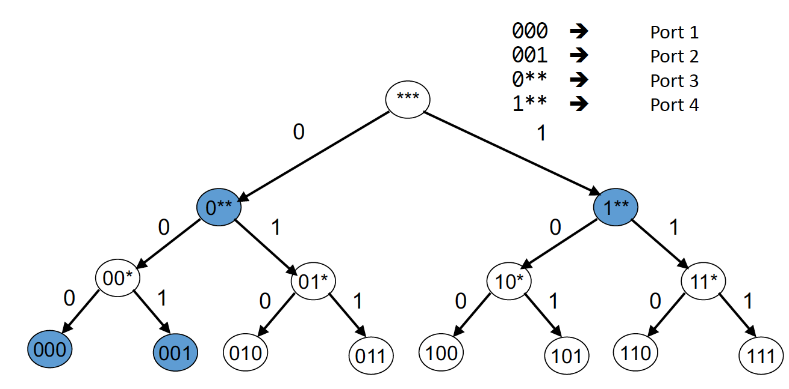

# Basic Internet Organization
The Internet is a network of machines connected to each other through a series of universal, open source protocols. This interconnected network allows for free flowing exchange of information and has evolved from a cloistered system used for research and communication to a global network which supports everything from commerce and social media to education and activism.

The Internet is essentially a network or subnetworks. End-of-systems and networks are connected to the network by switches and router instead of being directly connected to the network.

- This is done to reduce the number of edges between nodes in the network.
- The Internet ties all the switches together using an IP protocol. In this way, different hardwares and devices can communicate on the same network.

When nodes need to send information they may have to share switches / edges between switches. They can do this in three major ways:

1. Circuit switching: Switches are reserved for the entire transfer.\
Source sends a reservation request to the destination. Each intermediate switch checks it's resources to see if it can handle the request. If all the switches have enough resources, the resources will be reserved and the circuit will be established. Once the data transfer is done, the resources on the switch will be freed.
This works well for really large "one and done" data transfers because the circuit is reserved for the entirety of the connection. However, it doesn't work as well for "bursty" traffic (ie sending a few small messages over time) since bandwidth is reserved for the entirety of the connection.
- Pros:
	- Uninterrupted bandwidth (esp good for large/consistent/real-time transfers). AKA predictable performance.
	- Simple, fast switching.
- Cons:
	- Wasted bandwidth.
	- Connection may be rejected if a resource is used up.
	- Circuit set-up and teardown has a lot of overhead for short connections.
	- Many points of failure (if a switch fails, the circuit fails).
2. Packet switching: Each source sends it's message in packets with the destination encoded. Each packet is treated independently and forwarded to its destination. \
The switch needs to have a buffer to deal with transient overload (ie saving packets in transit). If the buffer overloads, packets are dropped.
- Pros:
	- Efficient use of bandwidth (no wasted bandwidth)
	- Robust against single switch failure (can re-rout around dead switch).
	- Lower latency (no overhead for setup and teardown)
- Cons:
	- Unpredictable performance (all packets are treated the same and packets can be dropped and network cannot guarantee bandwidth)
	- Requires buffer management and congestion control.
3. Hybrid connection

A switch internally can divide it's connections using "multiplexing":

1. Time multiplexing: chooses different connection at a specific time interval.
	Ex: time 1 connection 1
		time 2 connection 2
		time 3 FREE
		time 4 FREE
	(switch has 4 time intervals)
2. Frequency multiplexing: Sends each message at a specific frequency.
3. Statistical multiplexing: The communication channel is divided into an arbitrary number of variable bitrate digital channels or data streams. The link sharing is adapted to the instantaneous traffic demands of the data streams that are transferred over each channel.

__Network Metrics__

- Transmission Delay: How long does it take to push all bits from a packet into a link?
	- $transmission\_delay = packet\_size / transmission\_rate\_of\_link$
- Propagation Delay: How long does it take to move one bit from one end of a link to the other?
	- $propagation\_delay = link\_length / propogation\_time$
- Queuing Delay: How long does a packet spend in a buffer before it's processed?
	- Depends on arrival rate in the queue, type of arriving traffic (bursty or constant), and the probability the delay exceeds some threshold (after which the packet will be dropped)
	- $queue\_length = long\_term\_average\_arrival\_rate * waiting\_time$ (Little's Law)
- Processing Delay: Overall end to end delay.

### Protocol Layering
Communication between end users is handled in a stack like structure such that high level communication is build on tope of those in the lower layers. The OSI model is defined as a 7 layer system:

- L7: Application
- L6: Presentation (OSI)$^{* }$
- L5: Session (OSI)$^{* }$
- L4: Reliable or unreliable transport (Transport)
- L3: Best effort global packet delivery (Network)
- L2: Best effort local packet delivery (Data Link)
- L1: Physical transfer of bits (Physical)

$^{* }$L6 and L5 are often implemented as part of the application layer.

A layer is a part of a systems with well defined interfaces to other parts of the system (to other layers). This system allows a separation between high level application communication and lower level network communication. Any layer only needs to interact with the layers directly above and below (eg L3 only interacts with L4 and L2) and two layers are limited to interactions through specific interfaces. Communication between peer layers on different systems is defined by a protocol (ex: HTTP, TCP, IP, etc).

We divide machines in the network into three categories, hosts, routers, and switches.

- Hosts are designed to run applications and therefore impliment all seven layers in the OSI model.
- Routers are designed for communication between local networks and only impliment L1, L2, and L3.
- Switches are designed for communication within local area networks and only impliment L1 and L2.

```
Host 1					  Host 2
HTTP					  HTTP
TCP			 Router		  TCP
IP			 IP			  IP
Ethernet <-> Ethernet <-> Ethernet
```

Each layer has a very specific role and therefore has a specific set of common protocols which are designed to accomplish the goal.

- Application: Designed for app to app communication. Common protocols are SMTP, HTTP, DNS, NTP.
- Transport: Designed for communication between hosts (but on a lower level than the application layer). Common protocols are TCP and UDP.
- Network: Designed for communication between routers (between local area networks / domains). The only major protocol in use is IP.
- Data Link: Designed for communication between switches in a local area network. Common protocols are Ethernet, FODI, PPP.
- Physical: Designed for communication between physical systems. Common mediums are Optical, Copper, Radio, and PSTN.

A protocol is an agreement between parties (in the same layer) on how to communicate. It defines the syntax and semantics of communication.

```
[	 Payload	 | Header ]
```

Each protocol has a specific header format (the __syntax__) which gives instructions on how to process the payload. Each protocol also defines how communication is carried out (the __semantics__).

Layer encapsulation is the process by which data is sent through the OSI model.

1. Application wraps data in HTTP Layer

```
[HTTP Header | HTTP Payload]
```

2. Transport Layer wraps HTTP request in TCP Payload

```
[TCP Header | [HTTP Header | HTTP Payload]]
```

3. Network layer wraps TCP request in IP Payload

```
[IP Header | [TCP Header | [HTTP Header | HTTP Payload]]]
```

4. Data link layer wraps IP request in Ethernet payload.

```
[Ethernet Header | [IP Header | [TCP Header | [HTTP Header | HTTP Payload]]]]
```

This data is sent over the physical link to the next system in the network and reversed up the stack.

Layer encapsulation is done because it reduces complexity and increases flexibility and modularity. There is a certain level of abstraction where application programmers do not need to worry about the low level details of the which transport or data link protocol their system is using. Furthermore they don't need to change their code in response to updates to lower level protocols. However, layer encapsulation does have higher overhead since each layer needs to add or remove headers from the payload. Furthermore, since layers only interact with those above and below, there is some information lost that could be useful.

Note that IP is the only network protocol in use. This allows any machine or small network to join the larger Internet since anything that impliments IP can theoretically exchange packets, serves as a buffer between the application layer and the lower level networking technologies, and allows for simultaneous innovations in the layers above and below the network layer. However, this makes changing the IP protocol extremely difficult.

The end to end argument is a philosophy about network design. The main ideas of this philosophy are that:

-  Networks should be dumb, end systems should be smart.
- Functions that can be completely and correctly implemented only with the knowledge of application end host should not be pushed into the network.
	- This may be broken for performance / policy optimization.
- Fate sharing: Fail together or don't fail at all.

# The HTTP Protocol
The HTTP protocol is the most well known of the application layer protocols. It is the protocol that links defines the world wide web, the form of the internet most users interact with. In fact, the world wide web can be seen as  a distributed database of pages which is defined by and linked through the HTTP protocol.

Content on the web is formatted using HTML, a markup language used to define web pages. The location of rsources on the web is defined by the URL.

The URL (Uniform Record locator) is of the form:
```
protocol://hostname[:port]/directory-path/resources
```
where:

- protocol: http, tfp, https, smtp, rtsp,...
- hostname: DNS name or IP address.
- port: defaults to protocol's standard port.
- directory path: reflects file system.
- resource: identifies the desired resource.

This is essentially the same as using a hierarchical file system to locate a resource in a computer. A URL can also include server side processing and program execution. We use the URL to locate and define resources we want to interact with in the web - specifically to refer to a resource in an HTTP server.

An HTTP server is an end host that hosts resources that can be accessed through the HTTP protocol. An HTTP server is always on and well known (through DNS). Clients must initiate contact with the HTTP server to request resources. HTTP servers work through a request / response model - clients can query the server with four types of requests and expect a specific response (or an error response) from the server.

- GET < url >: gets some information from the server.
- POST < url, data >: send information (web forms).
- PUT < url, data >: updates a file in entity body in the path specified by the URL field.
- DELETE < url >: deletes file specified in the URL field.

HTTP Requests and responses have a specific format:

- HTTP Request
	```
		[method] [resource] [protocol version]
		<HEADER LINES >

		[Body (optional)]
	```

	- The first line is the request line.
	- The next few lines are the header lines
	- The blank line indicates the separation of the header and the body
	- The body is the data being sent (for a PUT or POST)
- HTTP Response

	```
		[protocol version] [status code] [status phase]
		< HEADER LINES >

		[data]
	```

	- The first line is the status line.
	- The next few lines are the header lines
	- The blank line indicates the separation of the header and the data
	- The body is the data being sent (for a GET)

HTTP is a stateless protocol.  A stateless protocol is a communications protocol in which no information is retained by either sender or receiver. This means that the client and server are agnostic of the state of one another - each request/response is treated independently and the server is not required to retain a state. In other words, the server doesn't need to remember the clients that were communicating with it and vice versa. Each request / response must have enough information to be handled on its own with remembering connection information.

Statelessness improves scalability on the server-side, but is problematic for applications that need a persistent state. For example, a web application that maintains log in information would want to keep a persistent state to not prompt the user with their log-in information every time they request a resource. These types of applications use __cookies__ to maintain state. A cookie represents a small state stored by the client.

If a web application needs to maintain state, the server will send a "cookie" as part of the response to a request from the client. The client stores this cookie and sends it with future requests to the server. Thus, the server can maintain and modify the client state. However, cookies are often abused by companies as sites store infomation about users and advertising companies use that information to track performance and viewing history.

The HTTP protocol has specific performance goals for the different players in the system. The user expects fast downloads and high availability, the content provider expects a cost effective infrastructure, and the network expects to avoid overhead. These goals can be realized through efficient connection management (pipelining) and smart memory management (caching and replication).

Pipelining is a techniques of sending requests to increase the efficiency of the HTTP protocol. Most webpages have multiple objects (HTML, JS, embedded images, etc) which can take a long time to download. The original solution was to retrieve one object at a time over a new TCP connection. However, one TCP connection requires $2 * RTT + transmission\_time$ for each object (1 RTT for setup, 1 RTT for request) which is inefficient for lots of back-to-back requests. We can be more efficient by pipelining, creating parallel connections, and creating persistent connections.

- Pipelining - sending N requests back to back without waiting for response. Then wait for N responses.
- Parallel Connections: Send multiple requests in parallel (concurrently)
- Persistent Connection: Maintain persistent TCP connections between client and server.

Trivially, these techniques are more efficient than sending requests one at a time.

- $one\ at\ a\ time = 2 * n * RTT$
- $concurrent\ = 2 * \frac{n}{m} * RTT$ for $m$ connections.
- $persistent\ = (n+1) * RTT$
- $pipelined\ = 2 * RTT$
- $pipelined\ persistent = 2 * RTT$ (first time), $= RTT$ later.

Caching is the process of saving recently accessed resources in an easy to access location. When a client requests a resource for the first time, it saves it in a cache for a specified amount of time. If it request that resource again (within that time bound), the client adds an `if_modified_since <datetime>` tag to the request. The server returns  `not_modified` if the resource hasn't been modified and the resource otherwise. The response will include an `expires` tag which says how long we can safely cache the resource, or a `no_cache` tag which will ignore the cache. This greatly increase the efficiency of retrieving repeated resources since we don't have to waste time downloading resources multiple times.

Content providers and ISPs also cache content in the network based on their use cases. Contnet providers cache content close to the servers to decrease server load. ISPs and enterprise cache content closer to the clients to reduce network traffic and latency.

Replication is the process of replicating popular content across many machines. This spreads the request load across many servers and is more likely to place content close the the client. This is especially helpful when content isn't cacheable.

# CDN and DNS
- Content Distribution Networks (CDN) essentially provide caching and replication as a service.
	- Multiple sites are hosted on one shared physical infrastructure.
- A CDN company will create a new domain name for each client.
	- The client content provider modifies content so that embedded URL references CDN domains.
	- Requests are then sent to the CDN infrastructure.
- Problem is to figure out how to balance load across replicas and pair clients with nearby servers to decrease latency and bandwidth.

### DNS
Unique servers are recognized through their IP address, a 32 bit number which acts as a unique identifier for routers to forward packets. However, it is not easy for end users to remember a random string of numbers - rather we want to be able to remember human readable hostnames (like google.com or cs.jhu.edu) and have the computer convert those to the router friendly IP address. This is the role of the Domain Name Service (DNS)

The DNS is designed to be:

- Uniqueness - no naming conflicts
- Scalable - many names and frequent updates
- Distributed / autonomous administration
	- Ability to update my own machine(s) name(s)
	- Don't need to track everyone's updates
- Highly available
- Fast lookup

The overall strategy of the DNS is to recursively partition hostnames into administrative regions and allow those administrative regions to bear the responsibility of handling the names within the region. For example, the `.edu` administrator is responsible for assigning all hostnames with a `.edu` suffix. That `.edu` administrator assigns `jhu.edu` to Johns Hopkins University - now Johns Hopkins University is responsible for maintaining the IP addresses of all websites with the suffix `.jhu.edu`. This system is implemented in a tree.

```
					   root                                       Root Servers
   /		/		/	 |		 \		\	  \		\
 .edu	 .com	 .gov	.mil   .org   .net	 .uk   .fr ...        Top Level Domain Servers
	\
	 jhu.edu                                                      Authoritative Servers
	  \
	   cs.jhu.edu                                                 ...

```

The top of this hierarchy is the root servers. The next level is the top level domain (TLD0 servers). All servers below are authoritative DNS servers which actually store name -> address mappings. An authoritative DNS server stores resource records for all DNS names in the domain that it has authority for. Each server needs to know other servers that are responsible for the other portions of the hierarchy. Specificaly, every server knows the root and the root knows all top level domains.

The DNS root is located in Virginia and there are 13 root servers (A-M) that are replicated via anycast. Anycast  is a routing system that finds the shortest paths to destination. If several locations are given the same address then the network will deliver the packet to the closest location with that address with no modification to the routing algorithm.

The DNS servers store resource records (RRs). These records come in four types:
- Type = A (Address): name = hostname, value = IP address
- Type = (NS) (Name Server): name = domain, value = name of DNS server for domain
- Type CNAME (Canonical Name): name: alias name, value: real (canonical name)
- Type = MX (Mail Exchange): name = domain in email address, value = name of mail server

Services can insert resource records into the DNS by providing the registrar withthe name and IP address of the authorative name servers. The registrar would insert the resource record in the proper TLDM server and you would store the record in your server. inserting Resource Records Into DNS

Apps use DNS by way of a local DNS server. The app sends a request to the local server who will send a request to the root server. This can happen in one of two ways:
- Recursive: Local DNS asks root to find entire domain and passes work to the root.
- Iterative: Local DNS asks root to find IP address for server to ask next.

DNS servers are required to maintain high availability. This is done through highly replicated DNS servers and specific protocols to account for failure. UDP is typically used for DNS queries and alternate servers are tried on timeout. All queries have the same identifier so we don't care which DNS server responds to our query. DNS also provides fast lookups by way of DNS caching. Specifically, DNS servers cache responses to queries and keep those records in the cache based on a TTL field. Some DNS servers also do __negative caching__ which means they remember queries that failed or took a long time.

One of the most powerful aspects of DNS is that it provides indirection. ddress can change underneath the DNS and the user will not need to change their behavior. Furthermore, a single hostname could map to multiple IP addresses (through a CDN) or multiple names could map to the same address. This creates a much more user friendly environment for end internet users.

# Wireless
Wireless networks deal with communication over wireless links. These networks rely on some base station which is usually connected to the wired network. A __relay__ is responsible for establishing wireless links between teh base station and the wireless hosts (ie transferring packets between the wired network and wireless hosts). The biggest challenge with wireless networks is the increased mobility.

Wireless links have characteristics that are not seen in other physical media. For example, the signal strength decreases the further away we get from the relay, the radio signals reflect off of objects and arrive at the destination at slightly different times, the connections may suffer from interference, the links are braodcast (and therefore anyone can hear them), we cannot receive while transmitting, and signals sent do not always end up at the receiver intact.
Each of these issues has specific properties that we must consider:
- Decreased signal strength.
	- Radio signal attenuates as it propagates through matter.
	- AKA path loss
	- $FSPL = (\frac{4 \pi d f}{c})^2$
		- $d$ distance, $\lambda = c/f$ wavelength, $f$ frequency, and $c$ speed of light.
- Multipath propagation
	- Radio signals reflect off objects and ground and arrive at destination at slightly different times.
- Interference from other sources.
	- SNR: Signal to noise ratio
	- BER: Bit error rate
	- Larger SNR makes it easier to extract signal from noise, but SNR may change with mobility. We must choose a physical layer that can meet the BER given the SNR.
	- To overcome bit errors
		- Sender could increase transmission power. This is bad for battery powered devices and creates interference for other senders.
		- Stronger error detection or recovery
		- Many TCP alternatives for wireless
- Broadcast medium: anyone in proximity can hear and interfere with signal
- Cannot receive while transmitting
	- Nearby transmissions could deafen the receiver
- Signals sent do not always end up at the receiver intact.

Like physical networks, wireless networks can come in multiple flavors. Here we care about infrastructure networks and ad-hoc networks which are akin to global coverage vs local area networks in wired systems.

- Infrastructure Mode: Base station connects mobile devices to wired network.
	- Ex: WIFI, cellular
	- For a single hop, the host connects to a base connection which connects to the larger internet.
	- For multiple hops the host may have to relay through several wireless routes to connect to larger internet.
- Ad Hoc mode: No base station, nodes can transmit only to other nodes within the link coverage.
	- Nodes organize themselves into a network and route among themselves.
	- Ex: Bluetooth
	- No base station, no connections to larger Internet.

# Video Streaming
Video streaming presents an interesting challenge as video is often too large to send in one GET request, users may also move forward / backwards, and users connection quality may change. Videos themselves are sequences of images/frames displayed at a constant rate. Each digital image is an array of pixels. Each pixels is represented by a bit. Videos must be compressed to store efficiently and the same video is often compressed to multiple quality levels (eg 480p, 720p, 1080p, 4k, etc)

We serve videos using __video streaming__. This presents video streaming presents challenges. A streaming session must absorb network delay variation, handle user interactions (skip forward, back, pause, etc), and handle packet loss, retransmission, etc.

THe HTTP Streaming process is as follows:
1. Video is stored at an HTTP server with a URL
2. Client sends a GET request for the URL
3. Server sends the video in a stream
4. Client first buffers for a while to minimize interruptions in the data stream.
5. Once the video buffers enough (eg passes a threshold) the video plays in the foreground.
6. More buffering occurs in the background.

The biggest issue with HTTP streaming is that not all clients have the same bitrate. Client can have different network connections and their network connections can change over time. So the client must dynamically adapt to the network conditions.

__Dynamic Adaptive Streaming over HTTP (DASH)__ is a HTTP streaming algorithm that keeps multiple resolutions of the same video. The data is stored in manifest on HTTP server. The client asks for the manifest file first to learn about which resolutions are available and requests the video in pieces and measures available bandwidth while they are downloaded.

Video Streaming is served by datacenters. A Datacenter consists of `ToR switches -> racks -> aggregation switches -> Core switches -> internet`. Larger datacenter may have more layers. An HTTP get request will be sent to the top level core switches, which will send the request down through the aggregation switches. The single request is decomposed into multiple components which are each handled by a specific switch / set of switches. The responses from the switches are recomposed and sent out to the client via the core switch.

# Transport Protocols
The transport layer is between the application and network layer. While the
network layer is used to send the communication to the right host, the
transport layer determines which packets are sent to which applications. This
is called multiplexing / demultiplexing and is difficult to implement on the network layer or below.

- Multiplexing (Mux): gather and combine data chunks at the source host
form different applications and deliver to the network layer.
- Demultiplexing. Delivering the correct data to corresponding sockets for
a multiplexed stream (sending multiplexed packets to the correct
application).

We use a separate transport layer because the IP provides a weak service
model (the model itself is called the best-effort). Just using the IP
protocol, packets can be corrupted, delayed, dropped, reordered, and
duplicated. IP also doesn't provide any guidance on how much traffic to send
and when. Dealing with all of these problems on the application side would be
tedious. The transport layer exists to provide:

- Communication between processes - eg mux and demux from / to
applications. This is implemented using ports
- Provide common end-to-end services for app layer. For example, reliable,
in-order data delivery and well paced data delivery. This is not the
primary purpose of the transport layer though.

TCP and UDP are the most common transport protocols. UDP is a minimalist transport protocol - it only provides mux/demux. TCP, on the other hand, provides reliable, in-order, byte stream abstraction with congestion
control. TCP and UDP use ports to handle mux and demux. A port is a 16 bit integer that distinguishes applications. Transport layer packets carries the source and destination port in its header which is used to route the packet to the correct application. The operating system stores a mapping between sockets (an OS I/O abstraction that treats network communication like writing to a file) and ports.

UDP is a lightweight communication between application. It avoids a lot of the overhead and delays of maintaining order and reliability (essentially by not enforcing either order or reliability). UDP basically contains the destination IP address and port and may have optional error checking on the packet contents. UDP packets may also contain the source port which is helpful for responses.

As mentioned above, the best-effort model of IP can have a lot of downsides.
Packets can be lost, corrupted, delayed, reordered, destroyed, or duplicated. The
Transport layers exist to provide reliable transport which overcomes the issues
in the best-effort model.

- Checksums (detect bit errors)
	- A checksum is a small piece of data which is used to validate data
	integrity (but not authenticity). A checksum function (like a hash)
	is performed on the checksum which should produce some expected
	result. If that result is not found we know the data is corrupted.
- Timers (detect loss)
- Acknowledgments (detect loss)
- Sequence numbers (detect duplicates)

### Reliable Transport Solutions
The stop and wait protocol is a correct, but extremely inefficient reliable transport protocol.

```
// @ Server
do {
	Server send packet(packet_num)
	reset timer
	if (receives ACK) {
		num++
	}
} while(have packets)

// @ Receiver
while (packets left to receive) {
	Receiver waits for packet
	if (packet is ok) {
		send ACK
	}
	else {
		send INACK
	}
}

```

If transmission time (TRANS) is significantly less than RTT, then
$throughput ~ \frac{DATA}{RTT}$ where $RTT = TRANS + time\_in\_network + time\_to\_ack$

- $time\_in\_network$ is the time the data spends traveling through the
network
- $time\_to\_ack$ is the time it takes for the acknowledgment to reach the
sender.
- $TRANS$ is the amount of time it takes the server to physically send
the transmission.

In a reliable transport protocols we can make three major design decisions
which we can use to improve on stop and wait:

- Which packets can the sender send?
	- Sliding window
- How does the receiver acknowledge packets?
	- Cumulative
	- Selective
- Which packets does the sender resend?
	- Go-back-N (GBN)
	- Selective repeat (SR)

__Sliding Window__

A window is a set of adjacent sequence numbers. The size
of the set is the window size. Here we let window size be n. The general idea is to send up to n packets at a time using pipelining. The sender can send packets in its window and the receiver can accept packets in its window.The window contains all packets that might still be in transit and "slides" on successful acknowledgment.

Then If window size is $n$:

- If A is the last ack'd packet of the sender without a gap, then the sender's window is $\{A+1, A+2, ..., A+n\}$.
- If B is the last received packet without ga (by the receiver) then the receiver's window is $\{B+1, B+2,...,B+n\}$.
- And $throughput = min(\frac{n * DATA}{RTT},\ link\_bandwidth)$.

This is higher throughput than Stop and Wait.

__Acknowledging Packets__

Part of the sliding window protocol is determining how the receiver should acknowledge packets. There are two major choices: cumulative ACK or selective ACK.

- Cumulative ACK
	- ACK carries the next in-order sequence number that
	the receiver expects.
- Selective ACK
	- ACK individually acknowledges correctly received packets. So the
	application can keep track of which packets remain to be sent.
	- Selective ACKs offer more precise information but require more
	complicated book keeping than cumulative ACK.

__Resending Packets__

- Go-Back-N (GBN)
	1. Sender transmits up to n unacknowledged packets.
	2. Receiver only accepts packets in order. The receiver discards out of
	order packets. Note that the receiver uses cumulative acknowledgment.
	3. Sender sets timer for the 1st outstanding ack.
		- outstanding ACK meaning the ACK we expect given the order we've sent
		the requests.
	4. If there is a timeout, retransmit the entire window (A+1,...,A+n).
- Selective Repeat (SR)
	1. Sender transmits up to n unacknowledged packets.
	2. If packet k is lost but k+1 is not
		- Receiver indicates packet k+1 is correctly received
		- Sender retransmits only packet k once the ACK times out.
	- This is more efficient than GBN wrt retransmissions, but require much
	more complex book keeping.

GBN is better when error rate is low - otherwise we waste a lot of bandwidth
repeating requests. SR is better when the error rate is high - otherwise it's too complex to be
feasible.

With the sliding window it's possible to fully utilize a link provided
the window size is large enough. The sender will have to buffer all unacknowledged packets in case they
require retransmission. Receiver may be able to accept out of order packets but only up to its
buffer limit.

### TCP
TCP is a transport layer protocol that delivers a reliable, in-order, byte-stream. TCP resends lost packets recursively, only hands consecutive chunks of data to applications, and assumes there's an incoming stream of data and attempts to deliver it to the application. TCP uses checkshums, sequence numbers, sliding windows, cumulative
acknowledgment (like GBN), and buffers out-of-sequence packets (like SR).

A TCP header contains the source port, destination port, sequence number,
acknowledgment, checksum, and advertised window. The checksum is computed of
pseudo-header and data. Note that the sequence numbers are really byte offsets.

{width=400px}

A TCP stream of bytes is provided using TCP segments. A TCP segment contains
a TCP header, We generally use the term TCP packet and segment interchangeably.
A segment contains a TCP header (as defined above) and some data. The segment
itself will be wrapped in an IP header when it's sent to the network layer.

__TCP Acknowledgment__
Sender sends packet of N bytes. The data starts at sequence number X so the
packet consists of bytes [X, X+1, .. , X+N-1]. Upon receiving the packet,
the receiver sends an ACK of X+N since that's the next expected byte
(cumulative acknowledgment).

__Packet Loss__

If the highest in-order byte received is Y such that Y+1 < X, ACK
acknowledges Y+1 even if this has been ACKed before. So if we have some
TCP data broken up into 100 byte chunks the sequence numbers will be:

```
100 200 300 400 500 600 700 800 900
```

If the 5th packet is lost or corrupted we will see

```
Request : seqNum 100   Response : seqNum 200
Request : seqNum 200   Response : seqNum 300
Request : seqNum 300   Response : seqNum 400
Request : seqNum 400   Response : seqNum 500
Request : seqNum 500   Response : seqNum 500
Request : seqNum 600   Response : seqNum 500
Request : seqNum 700   Response : seqNum 500
...
```

Note these requests are pipelined so we can't just wait for the ACK to
know which seqNum to request next. The seqNum 600, 700, ... requests
execute correctly. The lack of ACK progress means seqNum 500 hasn't been delivered.

TCP introduces "fast retransmit" which means the duplicate ACKs trigger
early retransmission. In this case retransmission is triggered upon
receiving k duplicate ACKs.

- TCP uses k = 3.
- This is much faster than waiting for timeout.

After we've detected a packet loss we have two options:

1. Request the missing packet and move the sliding window by the number
duplicate ACKs. This speeds up transmission but may be wrong.
2. Send missing packet and wait for ACK to move the sliding window. This
strategy slows down transmission because of a single dropped packet.

In TCP the sender also maintains a single retransmission timer (like GBN)
if the sender hasn't received an ACK by timeout he retransmits the first
packet in the window.

- If the timeout is too long the connection could have low throughput.
- If the timeout is too short we may retransmit packets that were just
delayed.

The timeout is set to be proportional to RTT. This is done by taking
a weighted average of RTT using exponential weighted average.

$$RTT_{est} = (1-\alpha) RTT_{est} + \alpha RTT_{sample}$$

$\alpha$ is a weighting constant. Usually we use $\alpha = 0.125$.
We don't use $RTT_{sample}$ from retransmission.
$$RTO = 2 \times RTT_{est}$$

__Jacobson/Karels algorithm__ is a method for determining RTO tries to better caputre variability
in RTT by directly measuring deviation.

$$dev_{sample} = | RTT_{sample} - RTT_{est} |$$
$$dev_{est} =  (1-\alpha)dev_{est} + \alpha dev_{sample}$$
$$RT) = RTT_{est} + dev_{est}$$

__Establishing a TCP Connection__

Establishing a TCP connection requires some overhead. We need to know the sequence number for the first byte
(Initial Sequence Number == ISN). We can't use ISN = 0 because the ISN could be used to define a unique
connection if ports are reused. The hosts exchange ISN when establishing the connection.

The hosts go through a three-way handshake to establish the connection.

- Host A sends SN (open synchronize sequence number) to host B.
- Host B returns and SYN acknowledgment (SYN ACK).
- Host A sends and ACK to acknowledge the SYN ACK.

SYN, ACK, etc are flags in the TCP header.

- SYN 's header contains A's port, B's port, A's ISN, and the SYN flag
- SYN ACK's header contains A's port, B's port, B's ISN (in the ACK field)
and the SYN | ACK flag.
- ACK's header contains A's port, B's port, A's ISN, B's ISN+1 (in the ACK
field), and the ACK flag.

If the SYN packet gets lost, no SYN-ACK is returned. In this case we want to
resend. TCP uses a timeout of 3 sec (sometimes 6 sec) for the initial timeout.

__Tearing Down a TCP Connection__

Tearing down a TCP connection also requires some overhead. The teardown can
happen one side at a time, simultaneously, or abruptly:

1. One at a time
	- Host A a FIN message to close the connection and receive remaining
	bytes.
	- Host B ACKs the byte to confirm.
	- This closed A's side of the connection, but not B's.
	- B needs to send a FIN which A needs to ACK for B's connection to close.
2. Simultaneously
	- Host A sends a FIN message to close the connection and receive
	remaining bytes.
	- B sends FIN along with their ACK of A's FIN.
	- A ACK's B's FIN.
3. Or the shutdown could happen abruptly
	- A sends a RST (reset) to B.
	- B doesn't need to ACK - which means the RST could be lost.
	- But if B sends anything to A the RST will be re-triggered.

Note when we say "receive remaining bytes" we main any data still in
flight from A to B (or vice versa).

__TCP Flow Control__

In TCP we need to maintain some control on the flow of data - otherwise
we could overflow the receiver buffer. Recall that in the sliding window model:

- Sender left edge - beginning of unacknowledged data
- Receiver right edge - beginning of undelivered data
- Right edge = left edge + constant.

The sender could request a byte that's outside the receiver's window (
outside his buffer). To alleviate this problem, the Receiver uses an
Advertised Window (RWND) to prevent the sender from overflowing its window.
Receiver indicates the value of RWND in ACKs. The sender ensures that the
total number of bytes in flight $\leq$ RWND. This way the sender ensures that
they don't request bytes that they receiver hasn't reached yet.

With this model the sender's window advances when new data is ACK'd and the
receiver's window advances as the receiving process consumes data. The receiver
advertises to the sender when the receiver window ends and the sender agrees
not to exceed this amount. Because of the advertised window, the sender can
send data no faster than
$$\frac{RWND}{RTT}\ bytes/sec$$

If RWND = 0 the sender keeps probing with one data bytes.

__TCP Congestion Control__

__Congestion__ is defined by multiple packets arriving at the router at the
same time. If the collision is small (ie 2 packets) the router can just
transmit one and buffer (or drop) the other. However, Internet traffic is bursty and
many packets can arrive close in time. This can cause packet delays and rops which are non-ideal.

The general solution to the congestion problem is to change the window
size in response to congestion. However, we must do this in an intelligent way
as we consider how to:

- Discover the available bandwidth
- Adjust to variations in bandwidth
- Start bandwidth between floors

The overall solution is to model the router as a single queue for a particular
input-output pair. To discover available bandwidth pick a sending rate to match
bottleneck bandwidth. To share bandwidth between flows -  we have two problems: how to
adjust total sending rate to match bandwidth and how to allocate
bandwidth between flows.

There are four major approaches to sharing bandwidth between flows:
1. Send without care. This leads to many packet drops.
2. Reservations - prearrange bandwidth allocations. This requires
registration
before sending packets and is not very well utilized.
3. Pricing - don't drop packets for higher bidders. This requires a
payment model.
4. Dynamic adjustment - hosts infer level of congestion and adjust or
the network reports congestion level to hosts which adjust (or a
combination of the two). This is simple to implement but suboptimal and messy.

Each TCP connection has a window which controls the number of packets in
flight. Thus, the sending rate is $\frac{window\_size}{RTT}$ and we can
vary the window size to control the sending rate. We incorporate the congestion
into the window using a congestion window (CWND) and the flow control window (RWND)
discussed above. Then the sender side window size is defined as $min(CWND, RWND)$.

TCP can detect congestion by:

- Detecting packet delays: but this is tricky and noisy
- Listening to routers: routers can tell hosts when they're congested
- Observing packet loss: TCP already has to detect this, but this is not always
due to congestion.
	- Not all packet losses are the same. Duplicate ACKs come from an
	isolated loss whereas timeouts are much more serious.

Congestion control centers around modulating the sending rate of the TCP connection. The
basic principle is to increase the sending rate upon receiving an ACK (or new data) and
decrease the rate when a loss is detected.

The connection starts out with a "slow start" - we assume a very small bandwidth and
ramp up quickly for efficiency.Initially CWND = 1 (sending rate is MSS / RTT) where MSS is the
maximum TCP segment size. For each ACK we Increase the CWND by one. Since the CWND increases, this effectively doubles CWND per RTT. Slow start gives an estimate of available bandwidth but at some point there will be loss. We introduce a slow start threshold (ssthresh) which is initialized to a large value. If CWND > ssthresh,
stop the Slow Start procedure.

When CWND > ssthresh we stop rapid growth and focus on maintenance.
We want to track variations in the available bandwidth, oscilating
around the current value. For this we use __Additive Increase Multiplicative Decrease (AIMD)__.
For each ACK, $CWND = CWND + 1 / CWND $ and for each loss, $ssthresh /= 2$ and do slow start from $CWND=1$

``
do {
	node detects throughput
	if (noPacketLoss) {
		if (CWND < ssthresh) {
			CWWND ++
		}
		else {
			CWND += 1/CWND
		}
	}
	else if (timeout)
		ssThresh = CWND / 2
		CWND = 1
	}
	else if (duplicate ACK) {
		dupACKcount ++
		if (dupAckCount == 3 ) {
			// fast retransmit
			ssthres = CWND / 2
			CWND /= 2
		}
	}
} while (connectionExists);
```

This method of __congestion avoidance__ is still too slow in recovering from an isolated loss.
We mitigate this by grant the sender temporary credit for each DupACK to kep packets in
flight. This is called fast recovery.
- If `dupACKCount == 3: ssthresh = CWND / 2; CWND = ssthresh + 3;`
- While in fast recovery, CWND++ for each additional dupAck
- Exit fast recovery after receiving new ACK.

{width=400px}

There are a few different flavors of TCP: TCP-Tahoe, TCP-Reno
TCP-newReno, and TCP-SACK. These all have different strategies
for dealing with CWND window changes but they can coexist
because they follow the same principle. Increase CWND on good news,
decrease CWND on bad news.

__TCP Throughput__

We can calculate TCP throughput as:

$$throughput = \sqrt{\frac{3}{2}}\frac{1}{RTT \sqrt{p}}$$

- Flows get throughput inversely proportional to RTT (low RTT -> high
throughput).
- TCP unfair in the face of heterogeneous RTTs (lower RTT leads to more
bandwidth).
- We can use that equation to calculate p, throughput, RTT depending
on our givens.

Once the rate past some threshold speed we can increase CWND faster.

{width=400px}

There are a few implications of this model of TCP throughput:

- TCP throughput swings between W/2 and W. Applications may prefer steady
rates.
	- Equation based congestion control - ignore TCP's increase / decrease
	rules and just follow the equation. Measure drop in percentage p and
	set rate accordingly.
	- Following the TCP equation ensures TCP comparability.
- TCP may confuse corruption with congestion
- Short flows cannot ramp up
	- Short flows never leave slow start  they never attain their fair share.
	- Too few packets to trigger dupACKs.
- Short flows share long delays
	- A flow deliberately overshoots capacity until it experiences a drop.
	This means that delays are large and they're large for everyone.
- Cheating
	- There are easy ways to cheat
	- Increasing CWNDs faster than 1 MSS per RTT
	- Using large initial CWND
	- Opening many connections
		- A can open 10 connections to B whereas D opens 1 connection to
		D.
		- Each connection gets about the same throughput so A get's 10
		times more throughput than D.
- Congestion control is intertwined with reliability.
	- CWND is adjusted based on ACKs and timeouts.
	- This makes it difficult to change between cumulative and selective ACK.
	- Sometimes we may want congestion control but not reliability (or vice
	versa).

# IP

The network layer performs addressing, forwarding, and routing. __Forwarding__ is the process of directing a
packet to the correct interface so that it progresses to its destination. It does this by reading the address from the packet header and searching the forwarding tables. __Routing__ is the process of setting up network-wide forwarding tables to enable end-to-end communication. This is done by using routing protocols

## IP Header

{width=400px}

The IP Packet contains an IP header and some payload. The payload is just
some data - which can be ignored. The header is an interface that the source and
destination systems can use to handle the packet. The interface needs to give
the systems information to parse the packet, carry packet to the destination,
deal with problems (like loops, corruption, and overflow), accommodate evolution,
and specify special handling

__Preventing Loops (TTL)__

It is possible to keep forwarding a packet around in a loop. This can
cause packets to cycle for a long time and (if left unckecked) would
consume all capacity. The TTL (time to live) field is an 8 bit field that is decrimented at each
step. Once the field is zero, a "time exceeded" message is sent to the sender.

__Detecting Corruption__

The __checksum__ is a 16 bit value computed over the packet header. Each router recalculates
the checksum - if it's not the expected value the packet is discarded.

__Implementing Fragmentation__

Every link has a Maximum Transmission Unit (MTU) which is the largest
number of bits it can carry as one unit. A router can split the packet
into multiple fragments if the packet size exceeds the link's MTU. However
this must be reassembled to recover the original packet.

__Special Handling__
There is a type of service flag that allows packets to be treated
differently based on needs (eg indicate priority or congestion). This is
also called the differential service code point. The header also contains optional
directives to the network. These aren't used that often, but can include
record route, strict source route, loose source routes, or timestamps.

The header also contains the information about which transport protocol (TCP,
UDP, etc) is used and where responses should be sent (source IP address).

## Fragmentation
As mentioned above, router can split larger packets into multiple fragments if the packet size exceeds the link's maximum transmission unit. However these packets must be reassembled to recover the original packet. This process is known as __fragmentation__ and is not a trivial problem to deal with.

Reassembly is done at the destination since fragments may take
different paths to traverse the network. and the reassembly algorithm
would impose a burden on the network. For reassembly to work, we need to
be able to identify fragments of the specific packet and identify if any
packets are lost. The fragmentation fields in the header are used to
identify which fragments belong together and which offset they are (ie which fragment)
in the packet.

The IP header contains specific flags for fragmentation
- Reserved: ignore
- DF: don't fragment
- MF: more fragments coming

All fragments of a packet will have the MF flag set except for the ending fragment (the last partition of the packet). All other fragments can be used to fill in holes - we can use the
fragment field for that. The fragment fields use byte offset instead of fragment numbers so we can further fragment at different routers.

## IPv6
IPv6 was developed due to address exhaustion - it allows for 128-bit addresses and is focused on simplifying the IP protocol. IPv6 Eliminated fragmentation, checksum, options, header length and added flow label The major philosophy with IPv6 was to leave dealing with errors up to the end users - fragmentation and checksum can be handled by transport layer.

Most modern systems support IPv4 and IPv6 since many systems still run the older version.

{width=400px}

# Routers
IP routers are the core building block of the Internet infrastructure. A router is used to forward packets through the network based on their destination IP address. Routers have different routing capacities based on their function. A router capacity is defined as $Cap_R = N \times R$. where $N$ is the number of external router ports and $R$ is the speed (or line rate) of a port. Router capacities range from 100 Gb/s to 10 Mbps depending on their use cases.

- Core routers are routers that serve the "core" of the internet infrastructure (ie are in the middle of a hub and have a lot of connections). Core routers have the largest router capacities ($O(100)\ Tbps$).
- Edge routers serve the edge of large hubs and have medium router capacities ($O(100)\ GBPS$).
- Home routers serve individual networks and have small router capacities ($O(10)\ Gbps$).

A router forwards packets through the network so they can progress towards their end destination. They do this by reading the address from the packet header and searching through a forwarding table. This is handled by the data plane of the router.

## Router Structure
A router is composed of a control pane and a data plane.

{width=400px}

The Data Plane contains:

- Input linecards process packets on their way in
- Output linecards process packets on their way out
- Input and output for the same port are on the same physical lineard.
- The interconnect / switching fabric transfers packets from the input to the output port.

### Input

Input Linecards are responsible for:

- Receives incoming packets from the physical layer (L1)
- Updates IP header (TTL, checksum, options, and fragments as necessary).
- Looks up the output port based on the destination IP address.
- Queues the packet at the switch fabric.

The biggest challenge when implementing an input linecard is speed. A core router should handle a speed of 40Gbps where each packet is ~100 bytes. Therefore the linecard needs to handle one packet every 20 nanoseconds.
The bottleneck is looking up the output port of the packet. There are $2^32 \to \ > 4 * 10^9$ possible IP addresses. Creating a standard lookup table would not be efficient.  Therefore, lookup tables use aggregated addresses through __longest prefix matching__.

Longest prefix matching is a technique used in IP routers to efficiently match destination IP addresses with ports. Specifically, we match specific prefixes to "ports" (different from the ports in the application context). Consider a four port router with the following IP bitstring.

```
11 00 00 00 : 11 00 00 11 -> Port 1
11 00 01 00 : 11 00 01 11 -> Port 2
11 00 10 00 : 11 00 11 11 -> Port 3
11 01 00 00 : 11 01 11 11  -> Port 4
```

Storing this data in a look up table is not efficient - searching the table is still an O(N) operation. We can use a tree structure to efficiently match on the longest prefix in the destination IP.

Based on the structure of the IP addresses we know that all IPs will start will the prefix `11 0*`. We can start parsing the binary tree from the fourth character in the bitstring (`ip[3]`). We then want to match on the "longest prefix that designates a port". Starting from `ip[3]`, a prefix of `1*` indicates port 4. A prefix of `0*` indicates port 3, a prefix of `001*` indicates port 2 and a prefix of `000*` indicates port 1. We can then set up the binary tree with marked nodes:

{width=400px}

As we parse the prefix starting from `ip[3]`, the destination port corresponds to the deepest marked node we reach in the binary search. Thus the destination matching algorithm is $O(logN)$. This process is usually implemented with specialized hardware.

### Output

Output Linecards are responsible for:

- Packet Classification: mapping packets to flows based on the contents of the packet header
	- IP Source / destination 32 bits
	- TCP source / destination 16 bits
	- Type of service (TOS) 8 bits
	- Type of protocol 8 bits
	- Fields are specified by a range
	- Scheduler - decides which queue to send packets from and when to send them.
- Buffer management: deciding when / which packets to drop
- Scheduling: deciding when and which packets to transmit.

The FIFO Router is the simplest implementation of the output linecards. This router has no packet classification, drop tail buffer management, and FIFO scheduling.

- Drop tail buffer management: When the buffer is full, drop the incoming packet.
- FIFO Scheduling: packets leave in the order they arrived.


There are many different scheduling policies that can be implimented by the output linecards.

- Priority Scheduler - queues are assigned a priority. Packets in higher priority queues are always served before those in lower priority queues.
- Round Robin Scheduler - packets are served from each queue in turn.
- Fair Queuing (FQ) - round robin for packets of different size (give equal weight to each flow).
- Weighted Fair Queuing (WFQ) -- serve proportional to weight.

Router scheduling policies are designed to improve congestion control. Routers classify packets into flows (TCP connections) each of which has it's own FIFO queue in the router. The router services flows "fairly". However, the "fairness" can be determined in a few different ways:
- Max-min fairness \
Given a set of bandwidth demands $r_i$ and total bandwidth $C$, max-min bandwidth allocations are: $a_i = min(f, r_i)$ where $f$ is the unique value such that $sum(a_c) = C$.

```
C = 10, r_1 = 8, r_2 = 6, r_3 = 2, N = 3

C / N = 3.33...
	r_1 = 2 -> r_1 can be completely served

remove r_2 from the set

C = 8, r_1 = 8, r_2 = 6, N = 2

C / N = 4
r_1, r_2 > C / N
so
a_1 = min(C / N, 8) = 4
a_2 = min(C / N, 6) = 4
a_3 = min(C / N, 2) = 2
```
Max-min fairness works such that if you don't get full demand of the router, no one gets more than you. This is essentially a round robin service if all packets are the same size.

- Fair Queuing\
Fair queueing works on the principle that the "fairest" way of serving packets would be to serve round-robin bit by bit. However, this is not practical. Fair queuing attempts to approximate this system. For each packet, compute the time at which the last bit of a packet would have left the router if flows are served bit-by-bit. Serve packets in the increasing order of their deadlines.

{width=400px}

Note that FQ does not eliminate congestion - it just manages it. It is robust against cheating, variations in RTT, delay, reordering, retransmission, etc. However, congestion and packet drops still can occur.

- Weighted Fair Queuing (WFQ) works similarly except it assigns different flows different shares (weights). WFQ is implemented across most modern routers.

Fair queuing is better than FIFO in that FQ provides

- Isolation: cheating flows don't benefit
- Bandwidth share does not depend on RTT
- Flows can pick any rate adjustment scheme they want

However, FQ is significantly more complex to implement that FIFO.

So far we've tried to optimize "fairness". However, that is not always the ideal goal. Routers may also control congestion using rate adjustment and by detecting congestion.

In the __Rate Control Protocol__, packets carry "rate field" and routers insert a "fair share" f variable in the packet headers. End hosts then set the sending rate (window size) to f.

__Explicit Congestion Notification (ECN)__ is a process by which routers inform hosts of congestion. Packets have a single bit in their headers which is set by congested routers. If the data packet has that bit set, then ACK has the ECN bit set. Routers can set that bit at different points in the processing phase. The semantics of congestion can work exactly as though the packet was dropped (in terms of TCP congestion control). ECN is useful because it can serve as an early indicator of congestion to avoid delays. ECN can also be used to charge people for congesting the network.

The switching fabric is a mini network used to transfer packets from the input to output. There are three major ways to switch:

- Switching via shared memory
- Switching via a bus
- Switching via an inter-connection network.

## Constructing Forwarding Tables - The Control Plane
A router routes packets by constructing forwarding tables - this is handled by the control plane of the router.
Each router has a __local routing state__ which is the forwarding table in the single router. By itself, this state cannot be evaluated - rather we need to evaluate local states in terms of the global state. The __global state__ refers to the collection of forwarding tables in each of the routers. A global state is valid if it produces forwarding decisions that always deliver packets to their destination. Therefore, the goal of routing protocols is to compute valid routing states. Specificaly, a global state is valid if and only if there are no dead ends apart from the destination and there are no loops in the network.

Checking the validity of a state is relatively easy. We simply pick some destination $d$ and $\forall \ v \in V$, mark the outgoing edge on the path towards destination $d$ as computed by $v$'s forwarding tables. We repeat this process until each vertex has been assigned an edge. Finaly, check to see if the resulting graph is a spanning tree.

[](src/comp-nets/routing1.png){width=400px}

[](src/comp-nets/routing2.png){width=400px}

[](src/comp-nets/routing3.png){width=400px}

[](src/comp-nets/routing4.png){width=400px}

[](src/comp-nets/routing5.png){width=400px}

Checking validity is a relatively easy task. However, routing algorithms don't just want to find a path to a destination but rather they want to find the least cost path to the destination. This is easily computed using Djikstra's algorithm. Djikstra's algorithm is a very common graph algorithm which attempts to find the shortest weighted path from a "source" to all other vertices in the graph. Djikstra's algorithm assumes there are no negative edge weights in the graph. Here we assume that link costs ($c(x,y)$) are known to all nodes in the graph.

```Python
def djikstra(src, graph):
	pQueue = PriorityQueue()
	visited = set()
	pQueue.push(src, None, 0)
	D = dict()
	P = dict()
	while not pQueue.isEmpty():
		curr, parent, dist = pQueue.pop()
		if curr not in visited:
			D[curr] = dist
			P[curr] = parent
			visited.add(curr)
			for v in curr.neighbors:
				if v not in visited:
					pQueue.push(v, curr, dist + c(curr, v))
	return  D, P
```

This algorithm can be written in many different ways. Here we use a priority queue to keep track of the paths and return a dictionary of shortest paths from the source to each destination as well as the parents of each node on the path.

## Routing Algorithms

### Link State Routing
The Internet uses "link-state routing" which means that every router knows its local link state (its edges and weights) and sends its local state to all other router (floods its local state to all other routers) in the network. Thus every router learns the total state of the network and can compute Djikstra's algorithm to determine the optimal routing.

__Flooding__ refers to the process of sending a message to the entire network. When a a router floods its link state, the next node forwards the info to all of its links except the one the information arrived from. Flooding is initiated on any topology or configuration change (if a link fails or recovers from a failure or if a link cost charges). Flooding also occurs periodically to refresh link state information.

Routers flood the network to ensure that all nodes converge to the updated topology. However, there is some convergence delay where routers may have inconsistent state data. This convergence delay can come from latencies in detecting failures, time to flood the link state information, and time to re-compute the forwarding tables. Convergence delays can cause looping packets, dropped packets, or packets arriving out of order.

There are two major link state routing protocols: open shortest path first, and intermediate system to intermediate system. Both essentially work by maintaining a topology map at each node and computing shortest paths using Djikstra's algorithm at each node.

Link State Routing Scalability:

- $O(NE)$ messages (N nodes, E links)
- $O(N^2)$ computation time
- $O(Network \ diameter)$ convergence delay
- $O(N)$ entries in forwarding table

### Distance Vector Routing
A distance vector protocol is the opposite of link state routing. A distance vector routing protocol has each node tell its neighbors about its global view. These algorithms rely on the Bellman-Ford equation: $d_x[y] = min_v(c(x, v] + d_v[y]))$ where $D_x[y]$ is the estimate of the least cost from x to y.
In this algorithm, node x knows the cost to each neighbor $v$ and maintains its neighbors distance vectors. Periodically, each node sends its distance vector estimates to its neighbors. When $x$ receives new distance vector estimates from its neighbor, it updates its own distance vector using the Bellman-Ford equation. Eventually, the estimate $D_x[y]$ should converge to the actual least cost $d_x[y]$.

This algorithm has some problems with routing loops - if z routes through y and y routes through x and y loses connectivity to x, y may decide to route through z. This causes a loop and could take a long time to resolve. This is called a count to infinity scenario. We prevent these scenarios using a heuristic. If z routes to x through y, z advertises to y that its cost to x is infinite. Thus, y will never route through z.

Distance vector routing scalability

- Fewer messages than link state routing
- $O(N)$ update time on arrival of new DV from neighbor
- $O(network \ diameter)$ convergence time
- $O(N)$ entries in forwarding table

## Autonomous Services (Domains)
An Autonomous Service (domain) is a region of the network under a single administrative control. Intra-domain routing is the process of routing within an AS. The primary focus is finding least cost paths and fast convergence. Inter-domain routing is routing between ASes. The key challenges here are scaling and administrative structures.

- Scaling: a router must be able to reach any destination given a packet's destination address.
- Administrative structure is important because ASes want freedom in picking routes, autonomy, and privacy. Link state algorithms have no privacy and limited autonomy. Distance vector have more autonomy and privacy but weren't designed for this use case. They're also more vulnerable to loops.

One of the benefits of Autnonomous services is that we can use them for more precise and robust IP addressing. The goal of IP addressing is to keep small forwarding tables at the routers with limited churm (change in routing tables). We can use aggregate addresses to assign unique domains a range of addresses with the same prefix which reduces the amount of churm at top level routers. The ability to aggregate addresses is crucial for both of these scaling and administrative structure.

Aggregation only works if groups of destinations are reached via the same path, groups are assigned contiguous addresses, groups are relatively stable, there are few enough groups to make forwarding easy.

Aggregation works by the principle that IP address structure and allocation are hierarchal. IP Addresses are 32 bit numbers. These bits are partitioned into a prefix and suffix component. The prefix is the network component and the suffix is the host component.

__Classless inter-domain routing (CIDR)__ is a flexible division between network and host addresses. This offers a better tradeoff between size of the routing table and efficient use of the IP address space. CIDR works as follows: If a domain has 50 computers, it should allocate 6 bits for the host address (2^5 < 50 < 2^6) and the remaining 26 bits as the prefix. We can then use an OR mask where the 26 prefix bits are 1 and the 6 suffix bits are 0 (subnet mask) to refer to the network hosts. \
An IP address can be written X.X.X.X / Y where Y is the number of bits of the prefix max.

This method of IP address assignment can be used to assign IP addresses hierarchically. Large blocks are given to regional Internet registries. These registries give blocks to large institutions (ISPs like Comcast, At&t, etc). These organizations give addresses to individuals and smaller institutions.
For example:

1. CIANN gives ARIN several /8s
2. ARIN gives AT&T one /8, 12.0x/8
3. AT&T gives JHU one /16, 12.34x/16
4. JHU gives JHUCS one /24, 12.34.56/24
5. JHUCS gives specific user an address, 12.34.56.78

Hierarchical address allocation only helps routing scalability if the allocation matches the topological hierarchy. Thus, if we add end hosts to a specific domain, the upstream routers don't need to change their routing tables. However, this doesn't work for all networks. "Multi-homed" networks are networks that are connected to more than one domain. This can be done for fault tolerance, load balancing, etc. Aggregating addresses is not always possible for multi homed networks.

### Border Gateway Protocol
As mentioned before, domains want freedom to pick their own routes based on policy. Additionally they want privacy and autonomy. The topology and policy of the Internet is, in many ways, shaped by the inter-domain business relationship. The __Border Gateway Protocol (BGP)__ is the inter-domain routing protocol that is implemented by domain border routers. The main idea of a BGP is that a domain advertises (exports) its best routes to one or more IP prefixes and each domain selects the best rout it hears advertised for a prefix.

This algorithm is very similar to the distance vector algorithm. The domains can advertise routes per-destination, don't have to share intra-domain network topology information globally, and the network will eventually converge on paths.
The major differences between BGP and distance vector are that:

- BGP picks the best route based on policy (as opposed to shortest distance.
- BGP uses path vector routing to avoid loops.
	- Path vector routing: advertise the entire path (as opposed to just a distance). So we can avoid loops by discarding paths with loops.
- For scalability, BGP may aggregate routes for different prefixes.

Because of policy, a domain may choose not to advertise a route to a destination. Therefore, reachability is not guaranteed even if a graph is physically connected. BGP Policies dictate how routes are selected (deciding which paths to use within the AS) and exported (deciding which paths to advertise via BGP). \
Typical selection policies consider monetary costs, performance, and minimize use of bandwidth.
Typical export policies follow the rules that customers export routes to everyone and peers and providers export routes to their customers.

__Valley-free routing__ is a way of annotating paths with respect to BGP policy. We number links as +1, 0, -1 for customer-to-provider, peer-to-peer, and provider-to-customer. In any path you should only see a sequence of +1s, followed by at most one 0, followed by a sequence of -1s.

{width=400px}

Border routers of a domain are the only routers that implement that BGP protocol standard. They specify what messages to exchange with other BGP "speakers" and how to process these messages.

- eBGP : BGP sessions between border routers in different domains.
- iBGP : BRP sessions between border routers and other routers within the same domain.
- IGP : "Interior Gateway Protocol", the intra-domain routing protocol.
- We use eBGP to learn routes to external destinations, iBGP to distribute externally learned routes throughout the domain, and IGP to compute the shortest path to egress from the domain.

BGP has some basic messages

- Open : establishes BGP session
- Notification : report unusual condition
- Update : inform neighbor of new routes or of old routes that are inactive
- Keep-alive : inform neighbor that a connection is still viable.

When an AS updates an internal path it has to announce the update to its neighbors. Updates can be announcements (of new routes or changes to existing routes) or withdrawal (of routes that no longer exist). This update had the format  `<IP Prefix : Route Attributes >`. The attributes describe properties of the route. Some attributes are local and others are propagated with eBGP route announcements.

- ASPATH (carried in route announcement) : Vector that lists all the domains a route advertisement has traveled.
- LOCAL PREF : local preference in choosing between different domain path. The higher the value, the more preferred.
- MED : multi exit discriminator is used when domains are interconnected via multiple links. This specifies how close a prefix is to the link it is announced on.
- IGP cost : each router selects the closest egress port based on the path cost in the intra-domain protocol (hot potato routing).

Attributes are used to help select routes. Specifically, the priority of attributes when selecting routes is: $LOCAL\_PREF > ASPATH > MED > "eBGGP > iBGP" > iBGP path > Router ID$

BGP has a few issues in practice.

- Reachability: because of policy, reachability is not guaranteed for the network.
- Security: a domain can claim to serve a prefix that they do not have a route to. A domain can also forward packets along a route different than what it advertised.
- Convergence: since all domains do not follow the same policies, BGP is not guaranteed to converge.
- Domains typically use hot potato routing - each router selects the closest egress port based on the path cost in the intra-domain protocol. This is not optimal but is good economically.
	- Policy is not always about performance - policy driven paths are not the shortest.
	- Domain path lengths can be misleading and are often inflated.

BGP outages are the biggest source of Internet problems. While the most popular paths are very stable, outages are very common. Furthermore, the BGP protocol is bloated and underspecified. There are a lot of attributes and leeway in how to set up and interpret attributes. This is necessary to allow autonomy and diversity in policies, but requires that configuration of BGP is ad-hoc and done manually.

# The Data Link Layer and Local Area Networks
The data link layer (L2) is present on all systems (hosts, routers, switches). It is used to transfer data between nodes on the same local area network. L2 provides four primary services:

- Framing : encapsulates network layer data
- Link access : defines when to transmit frames
- Reliable delivery : for mediums with high error rates
- Error detection and correction.

THe data link layer deals with two types of communication

- Point to point : dedicated pairwise communication
- Broadcast : shared wire or medium

Here we will focus on Ethernet, which was invented as a broadcast technology. Hosts share a channel and each packet is received by all attached hosts. It should be noted that modern Ethernet is switched such that there is point to point communication between switches and between a host and a switch.

Shared broadcast channels implement Multiple Access Algorithms to coordinate between nodes speaking over the network.

- Channel partitioning
- Taking turns
- Random access

Here we consider Random Access MAC protocols which are used to detect and recover from collisions.

__Carrier Sense Multiple Access (CSMA)__ is an algorithm that follows the "listen before transmit" model. If the channel is idle, transmit the entire frame. If the channel is busy, defer the transmisino. This is not foolproof - two nodes may not hear each other before sending their frames.

__CSMA / CD__ adds collision detection to standard CSMA. CSMA/CO detects collisions shortly after beggining to transmit a packet and aborts the colliding transmissions. Optimal collision detection requires that we restrict the minimum frame size and maximum distance because latency depends on the physical length of the link. If the link is too long, collision detection will happen too late to be useful. We call this a random protocol because if we detect a collision we wait for a random time before trying again. This adds entropy to the system decreasing the likelihood of repeated collisions.

The efficiency of CSMA/CD is defined by the long run fraction of time during which frames are being transmitted without collision. $d_prop$ is the maximum propagation time between two adapters and $d_trans$ is the time to transmit a max sized frame. Then:

$$eff = \frac{1}{1 + \frac{5 d_{prop}}{d_{trans}}}$$

- as $d_{prop} \to 0$, efficiency approaches 1.
- as $d_{trans} \to \infty$, efficiency approaches 1.

## Switched Ethernet
__Switched Ethernet__ is the modern form of Ethernet which uses point to point links between switches and between a host and switch. It does not need CSMA/CD and enables concurrent communication.

Ethernet frames encapsulate the IP packet. The header includes:

- Preamble: 7 bytes for clock synchronization and 1 byte to indicate the start of the frame
- Addresses: 6 bytes
- Types: 2 bytes, (higher level protocol - IP)
- Data payload: max 1500 bytes, min 46 bytes
- CRC: 4 bytes for error detection.

One of the biggest challenges on this low level is to distinguish between different forms of data. Whle
the physical layer puts bits on a link, the hosts connected on the same physical medium needs to be able to exchange frames. The __framing problem__ is figuring out where each frame begins and ends. The easiest approach is to count the number of bytes which can be included in the hearder. However, the count field may be corrupted which could cause desynchronization and requires some resynchronizing method.

We can solve this problem using __sentinel bits__. We delineate frames with a sentinel bit pattern (start = 01111110, end = 01111111). So a frame is of the form

```
01111110 <frame context> 01111111
```

Within the frame context, the sender always inserts a 0 after five consecutive 1s. The receiver always removes a 0 appearing after five 1s. So when the receiver sees five 1s:

- if the next bit is 0, remove it and begin counting again.
- if the next bit is 1 and the following bit is 0 this is the start of a new frame
- if the next bit is 1 and the following bit is 1 this is the end of the current frame.

The MAC (Medium Access Control) address is a numerical address associated with a network adapter. The MAC address is unique to the adapter and assigned hierarchically (similarly to IP addresses).


|           *MAC*                                		    |		     *IP*
|-----------------------------------------------------------|-----------------------------------------------
|                                                           |
|Hard coded when the adapter is built  					    |Configured or learned dynamically
|                                                           |
|Flat name space of 48 bits            					    |Hierarchical name space of 32 bits
|                                                           |
|Like a social security number         					    |Like a postal mailing address
|                                                           |
|Not portable - depends on where the host is attached       |Portable and can stay the same as the host moves
|                                                           |
|Used to get packet between interfaces on the same network  |Used to get a packet to destination IP


L2 routing is handled using MAC addresses instead of IP addresses. THerefore, Ethernet cannot use link state routing or distance vectors because MAC addresses cannot be aggregate like IP addresses. When a packet is sent from a host, the frame's destination MAC address is the MAC address of the "gateway" (the router in the LAN network). The frame is broadcast onto the broadcast link. Once the packet reaches the gateway (ie the destination MAC address matches that of the receiver) the receiver passes the frame into the network layer to be routed via the destination IP address.

Ethernet on its own doesn't have any loop avoidance. However, Perlman developed a spanning tree protocol which creates spanning trees out of arbitrary topologies. This does not require any configuration by operators or users but eliminates loops from LAN routing. The algorithm itself is extremely - simply select the smallest MAC address as the root and construct an MST (using Primm or Kruskal's algorithm). This algorithm reacts to failures by sending periodic root announcement messages and detecting failures through timeouts.

Switched Ethernet, sends some packets via flooding to bootstrap more efficient forwarding. When a packet arrives, the switch inspects the source MAC address and associate it with the incoming port. The mappings are stored in a switch table which is managed by the TTL field. If a packet arrives with an unfamiliar destination, the switch floods the packet to all other ports, and waits for the response to learn about the path to the destination. Switches flood by ignoring all ports not in the spanning tree and having the originating switch send packets to all ports. When a packet arrives on one incoming port, the switch send it to all ports other than the incoming port. Flooding is helpful for nodes to learn routes. If node A sees a packet from node B come in on a particular port, it knows what port to use to reach B. The general approach to finding a pat to a node is to flood the first packet to the node you're trying to reach. All switches learn where you are and when the destination responds and *some* switches learn where it is. Only some switches learn where the destination is because the packet back to you follows the shortest path and is not flooded.

The Ethernet network is plug and play which makes the network extremely adaptable and convenient. It requires zero configuration, is simple, and is cheap. However, it does not fully utilize network bandwidth, there is a delay in re-establishing the spanning tree, slow to react to host management, and hard to predict. Furthermo, an L2 host is created knowing only its MAC address. It must discover a lot of information before it can communicate with remote hosts. Specifically it must know the MAC addresses of the gateways in the LAN and the IP addresses of remote hosts (or MAC addresses of local hosts).

__Dynamic Host Configuration Protocol (DHCP)__ is used to discover a hosts' IP address, netmark, DNS name servers' IP addresses, IP addresses for first hop routers, and MAC addresses for local hosts and routers. There is at least one DHCP server that maintains information for the clients. When a client first connects to the network, it broadcasts a DHCP discovery message which the DHCP server responds to with an "offer" message. The client will then request specific information from the DHCP server. DHCP servers need not exist within the same broadcast domain - DHCP relay agents are used when the DHCP server is not on the same broadcast domain. DHCP uses soft state meaning that states are forgotten if not refreshed. Address allocations have a lease period and the server sets a timer for each allocation. THe client must request a refresh before the lease expires.

__Address Resolution Protocol (ARP)__ is a protocol used to map between IP and MAC addresses. Using the ARP protocol, every host maintains an ARP table and consults the table when sending a packet. The ARP table maps IP -> MAC address. If an IP address is not in the table, the sender can request the MAC address of the receiver.

# Software Defined Networking
As mentioned above, the data plane in a router is responsible for forwarding packets whereas the control plane is responsible for computing that forwarding state. The goals for the control plane are basic connectivity, finding paths compliant with inter domain policy, and network management. __Traffic engineering__ is the process of choosing routes to spread traffic across links to avoid persistent overloads. Overall network management has many goals which must be achieved by the control plane. And there are many different control plane mechanisms each of which is designed from scratch. The conglomeration of these systems is a mess. We want there to be some kind of open interface which allows us to interact with the control plane irrespective of the hardware.

A control plane abstraction must be consistent with low level hardware and software, based on the entire network topology, and work for all routers/switches in the network.

A forwarding abstraction expresses the forwarding intent independent of the implementation. OpenFlow is a current standardized interface for forwarding. Openflow switches accept external control messages and standardize flow entry format. This makes switches interchangeable.

We need a network state abstraction to make decisions based on the whole network. This abstraction should abstract away the distributed mechanisms of the network and provide a single global view. This creates a logically centralized view of the network where information can flow into and out of routers. A __Network Operating System__ is a centralized link state algorithm where switches send connectivity information to the controller. The controller computes the forwarding state, sends forwarding state to switches, and is replicated for resilience. This abstracts a log of complicated protocols into a simple graph algorithm.

The specification abstraction is an abstract view of the network which models only enough detail to specify the goals. It is not responsible for implementing the network behavior or physical network infrastructure. These abstractions allow us to create custom routing protocols, load balancing algorithms, and access control policies. Since the network state abstraction makes the network a simple graph we can verify whether our algorithms work and will work with other protocols.

A logically centralized control plane is composed of a distinct (remote) controller that interacts with local control agents. Each router contains a flow table and each entry of the flow table defines a match action rule. Entries of the flow table are compute and distributed by the controller.

In the OpenFlow abstraction, the flow is defined by the header fields. There are simple packet handling rules that control the forwarding.

- Patters: match values in packet header fields
- Actions: for matched packet are drop, forward, modify or send to controller
- Priority: disambiguate overlapping patterns
- Counters: counts the number of bytes and the number of packets

This match / action can unify different types of devices with a simple abstraction. Routers can match longest destination IP addresses, switches can match destination MAC addresses, etc. The controller can query the switch for features, configuration parameters, to modify the state, and to send a packet out of the specific switch port.
The switch can query to controller to transfer a packet to the controller, to notify the controller about  aflow table entry deleted at the switch, and to inform the controller of a change on a port.

# Security
A goal of network communication is to maintain security over the network. Specifically we want:

- Confidentiality : no one can read our communications
- Message Integrity : no one can modify our communications without detection
- Availability and Authentication : only we can access our data and communicate on our behalf.

These security goals are intended to be enforced through the layers in the OSI model. However, each layer and protocol presents unique challenges and vulnerabilities which can be exploited by attackers.

## TCP
Recall that TCP uses 3 way handshaking to initialize a connection. Client sends SYN to server who sends a SYN ACK back to the client who finally sends an ACK and the actual data. Also recall that packet sequence numbers are stored in the header. However, if A sends a RST (reset) to B, B does not ACK the RSt. Therefore, RST is not delivered reliably.

If an attacker knows port and sequence numbers they can disrupt any TCP connection. Essentially  the attacker blocks the RST connection causing the client to remove the connection and ignore all future communication with the server. An adversary could also take over an already established connection by figuring out the port and sequence numbers and send the client data that looks like it came from the server. This is called a packet injection attack. The root cause of these attacks is that the attacker can see packet contents and knows port/IP addresses and sequence numbers.

Secure Sockets Layer provides transport layer security for TCP based applications. It is used between web browsers and servers to provide security services. SSL provides server authentication, data encryption, and client authentication. SSL can handle data injection but not RST injection.

## IP
IP addresses are also a source of insecurity. The source address in the IP header should eb that of the sending host, but it cold really be from any host. An adversary could use a fake source address to launch a DOS attack or evade detection by spoofing. IP options can also be used to let the sender control their path and sidestep security monitoring. IP options are often processed in routers slow path so attackers can use them to overload routers. Firewalls often are configured to drop packets with options.

Attackers can also set ToS (type of service) priority for their traffic - if regular traffic does not set ToS, the network prefers the attack traffic. However, this doesn't really work today since ToS is redefined for differentiated services.

Packets can also be fragmented which allows evasion of network monitoring and enforcement since hte monitor must be able to remember previous fragments - that also costs state which is another means of attack.

The TTL flag can be used to detect spoofed packets - provides a hint that a packet may be spoofed. However, TTL is also distinctive to OS so an attacker can use the TTL field to infer a users' OS and infer vulnerabilities.

The network layer has security protocols which are transparent to end user sand help secure routing architectures. PISec is a network layer security that provides network layer authentication, confidentiality, and integrity. It uses two protocols:
- Authentication header protocol (AH)
- Encapsulation security payload protocol (ESP)

These are mandatory in IPv6 but not IPv4.

__Virtual Private Network (VPN)__ are networks that make separate IP sites look like a private IP network. They provide security via IPsec tunnels and simplify network operations. End to end VPNs solve the problem of connecting remote hosts to a firewalled network - they are commonly used for roaming  and provide benefit in the form of security and private addresses only.

## BGP
By its construction, BGP also has security issues. A domain can claim to serve a prefix that they don't actually have a route to and may forward packets along a different route than what is advertised. The security goals for BGP are to secure message exchange between neighbors and maintain validity of the routing information and forwarding path.

__Prefix hijacking__ is when a domain claims to serve a prefix that they do not. For affected domains, their data may be discarded, inspected, or sent to bogus destinations. And legitimate origin domains may not see the problem.
We can only diagnose prefix hijacking through many access points across the Internet.

## Physical and Link
There are also security problems at the lowest levels of the OSI model. Perhaps the easiest and most common attack is __packet sniffing__. Packet sniffing is when a receiver looks at (or sniffs) packets sent via broadcast technology. Another common attack is a __denial of service attack (DOS)__ overloads the network (DOS) with messages. An attacker can also introduce forged frames (or packets) into the network which is extremely powerful when combined with sniffing. Attackers can also listen to DHCP requests that new hosts broadcasts and respond with forged offers before the actual DHCP server. This allows them to insert themselves as the main in the middle as they take over a lot of core information.
