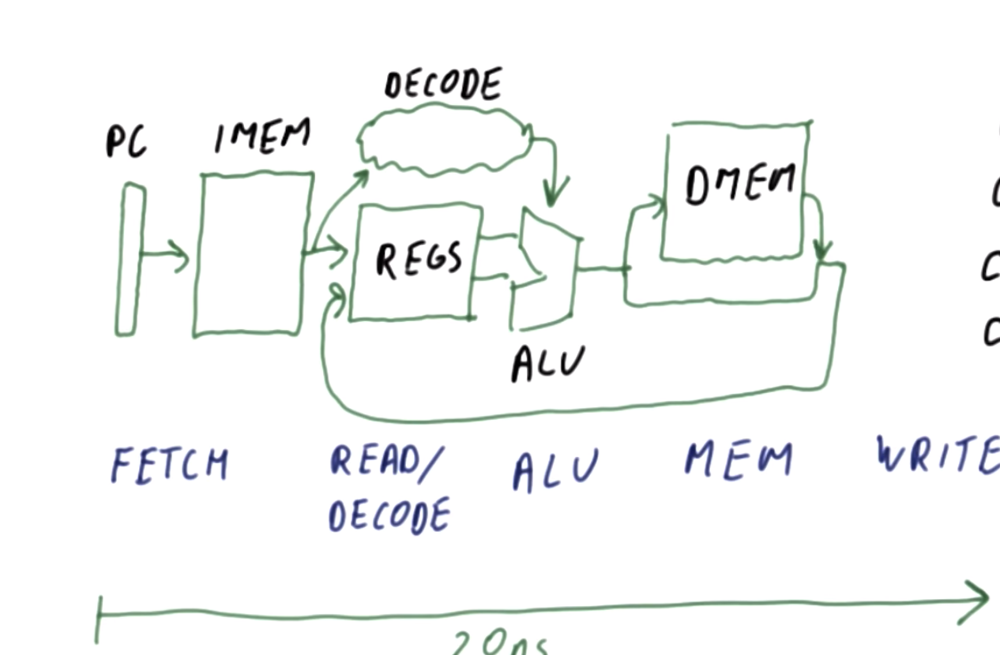
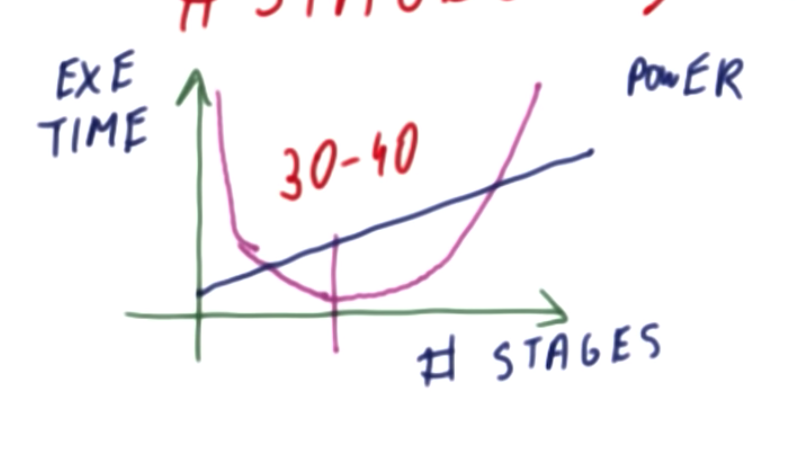
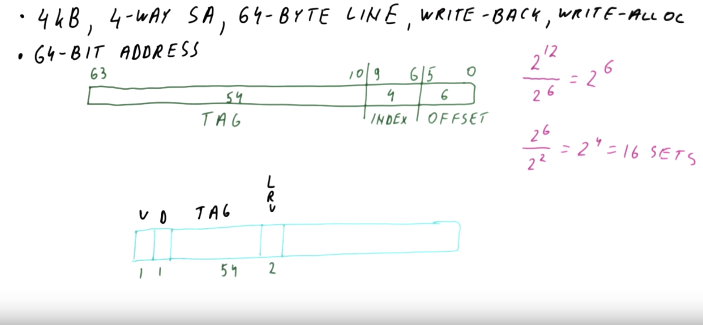
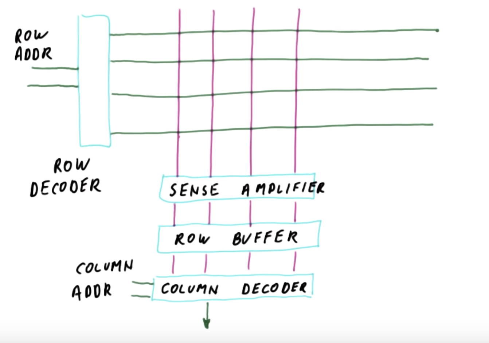
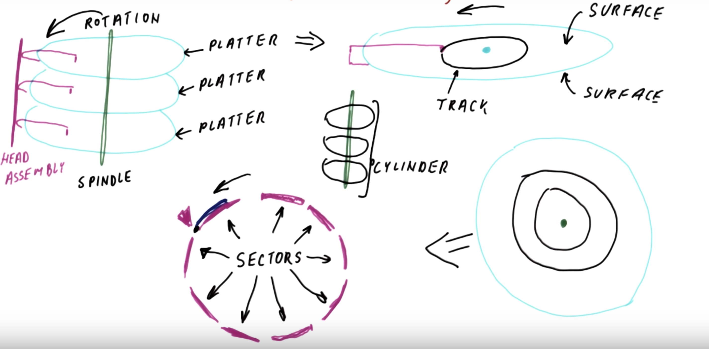

# High Performance Computer Architecture

Computer architecture is the idea that a computer should be built in the best way to fulfill its main purpose.
For example, a PC should be optimized for "regular" use whereas a supercomputer should be more optimized towards
faster processing and parallelism. We need good computer architecture to improve performance (which can be measured
in many different ways) and to improve the abilities of the computer.

Improvising performance
- Speed
- Battery life
- Weight / size
- Energy efficiency

Improving abilities
- 3D graphics
- Debugging support
- Security

We can design better computers by using advances in circuit design and microbfabrication technology and use them
to design better computers. Thus, computer architecture is very tied to current technology trends, and computer
architects need to keep an eye on the latest in computer technology to design architectures that are not obsolete.

## Measuring performance

### Moore's Law
__Moore's law__ states that every $1.5$ to $2$ years the number of transistors on a chip (processor) will double. This
roughly corresponds to
- the processor speed doubles every two years
- energy used per operation is halved every two years
- memory capacity is doubled every two years

However, Moore's law has some consequences. While processor speed and memory capacity double every two years
(roughly), __memory latency__ (the time to read / write to and from memory) increases at a much slower rate -
approximately 1.1x every two years. This problem is called the memory wall because while the processors have
been getting faster, they are limited by the memory wall and therefore the net speed does not increase as fast.
We solve this problem using caching layers between the processor and main memory which mitigate the problem.

### Performance metrics
When we talk about performance we usually talk about processor speed but even that is not completely accurate.
- Latency is how long it takes a task be be completed
- Throughput is the number of tasks that can be completed in a time period (usually in one second).

Throughput and latency naively have an inverse relationship
$$t = 1 / L$$
But that's not necessarily true since a task can be made up of an assembly line of sub tasks which can be
completed in parallel.

Ie if the latency of a task is four seconds but it is divided into 20 equivalent steps which are completed in
an assembly line then the throughput per second is 5.

We compare performance using __speedup__. The speedup $N$ of system $X$ vs system $Y$ is defined as

$$N = \frac{speed(X)}{speed(Y)}$$

This $speed$ function can be defined in terms of latency or throughput.
- For the latency case, $speed = c \times \frac{1}{throughput}$ so $N = \frac{latency(Y)}{latency(X)}$
- For the throughput case, $speed = c \times throughput$. So $N = \frac{throughput(X)}{throughput(Y)}$

Obviously $N > 1$ means better performance (better execution time or better throughput) whereas $N < 1$ means worse performance (worse execution time or worse throughput).

We can naively measure performance as $\frac{1}{execution \ time}$. However, this raises a lot of questions:
- What workload are you measuring on
- Does this necessarily apply to other users
- How do we get the workload data

### Benchmarks
We use __benchmarks__ to measure performance instead. Benchmarks are programs or input data that users /
companies have agreed upon for performance measurements. Usually we measure performance using a __benchmark suite__
as opposed to testing with a single benchmark program. A benchmark suite is a set of benchmark programs.

Benchmark types include
- Real applications\
  These are the most representative of performance measurements but they are the hardest to set
  up. These are good for products ready for development.
- Kernels\
  The most time consuming part of an application (eg loops). This way we don't have to set up a whole
  application but rather we set up a bunch of simpler programs. These are good to test prototypes.
- Synthetic benchmarks\
  Similar to kernels but they don't use real application code so they're easier to compile. These are good for
  design studies.
- Peak performance\
  The maximum number of instructions / second the machine can execute. These are good for marketing but not really
  useful otherwise.

Benchmark suites are decided by organizations and generally standardized
- TPC is used for databases, data mining, and other transaction processing
- EEMBC is used for embedded systems.
- SPEC is used to evaluate workstations and raw processors.

To evaluate performance on a benchmarking suite we cannot simply take the average speedup
since those are not compatible.

We can either take the mean of the execution times of each benchmark and use those to calculate the average speedup.
Or we use the geometric mean of the speedup which (for a vector of values $X$ where $|X|=N$) is defined as

$$g = \sqrt[N]{\pi_{i=0}^{N}{(X_i)}}$$

### Calculating performance
The __iron law of performance__ defines the processor or CPU time as:

$$t_{cpu} = instr * cpi * cct$$

Where $cpi$ is the number of cycles executed per instruction and $cct$ is the time it takes to execute one clock
cycle. Looking at CPU time this way allows us to break down and evaluate architectures and programs in different ways.
- The number of instructions in the program is defined by the algorithm, compiler, and instruction set of the processor.
- The cycles per instruction is defined by the instruction set and the processor design.
- The cycle clock time is defined by the processor design, circuit design, and transistor physics.

Note that processor speeds are usually defined in Ghz ($10^9$ cycles / second) so we need to find the inverse
to get the clock cycle time.

Cycles per instruction may differ by instruction type so we can generalize this a bit to say

$$t_{cpy} = \sum_{j}{(instr_j * cpi_j)} * clock-cycle-time$$

__Amdahl's law__ is used to define the speedup when we are speeding up a specific part of a program.

$$Speedup(P, N) = \frac{1}{1-P)+\frac{P}{N}}$$

Where $P$ is the proportion or fraction of the execution time affected by the speedup and $N$ is the speedup of that
enhanced portion (relative to it's unenhanced version). Amdahl's law shows that it is better to have a small speedup
on a large portion of the program than to have large speedup on a small portion. We can see that:

$$\lim_{n \to \infty}{Speedup(0.1, n)} = \frac{1}{0.9 + \frac{0.1}{\infty}} = 1.111$$

which is not particularly impressive. If you put significant effort into speeding up a small portion of the program
you will not have a big effect.

__Lahdma's law__ says that while Amdahl's law says to focus on the "common case", we should not sacrifice the
performance of the "special case". If you significantly reduce the performance of the special case, you will not
see a good speedup.

Amdahl's law also shows that we get diminishing returns if we keep speeding up the same part of the program. This
is because the execution time of the sped up part keeps decreasing. Additionally it is much more difficult to keep
speeding up the same part.

## Pipelining

__Pipelining__ is the idea of using an assembly line to process instructions in a processor to increase the
throughput of the system. While the latency of every individual task may be long, the throughput is much higher
than a naive "one task at a time" approach.

In the simplest program we have
1. A program counter (PC) which looks up the next instruction from memory (IMEM).
2. The instruction is decoded and (while that is happening) we read from the necessary registers.
3. The instruction and values in the registers are passed to the Arithmetic Logic Unit (ALU) to do the actual
   computation.
4. The result from the ALU could be simply stored back in the register or, if the instruction was something like
   a load or store, the result from the ALU is the address in data memory (DMEM) whose value is passed to the
   registers.

{width=400px}

These steps can be broken down into a pipeline:
1. Fetch the instruction
2. Read from registers and decode the instruction
3. Do the computation
4. Read from data memory
5. Write to registers

It is easy to see how this greatly improves the throughput of the processor. If the latency of one instruction
being completed is, for example, 20ns, and each of the five steps takes roughly the same amount of time we can see
that after the first instruction has left the pipeline, we will complete one instruction every 4ns as opposed to
every 20ns.

### Pipeline stalls

We may think that the CPI for each step in the pipeline would be 1, but that is not necessarily the case.
The initial instruction adds a bit of latency though that is negligible since the processor is handling billions of
instructions. A much more important concern are __pipelining stalls__, issues in one part of the pipeline which
delay everything behind (and including) that point. These stalls increase the CPI for the pipeline.

Processor pipelining stalls may not be due to an issue with the pipeline itself but rather the instruction order.
Consider the following instructions

```MIPS
LW  R1, 5     // (I1) loads the value 5 into R1
ADD R2, R1, 1 // (I2) adds 1 to R1 and stores it to R2
ADD R3, R2, 1 // (I3) adds 1 to the value in R2 stores it in R3
```

Which are placed in the pipeline as follows

F    |  R / D    |  ALU   |  DMEM   |  W
-----|-----------|--------|---------|-------
I3   | I2        | I1     |         |
I3   | I2        |        | I1      |
I3   | I2        |        |         | I1
I4   | I3        | I2     |         |


If I2 is allowed to pass into the ALU before I1 has reached the W stage, the result of I2 will be incorrect which
will in turn mess up the results of the rest of the program. We see that this causes a stall of 2 cycles (assuming
we can read and write in a single cycle).

Pipelines may also need to be __flushed__. If a `JUMP` instruction is fetched, the processor won't know
which instruction to fetch next since we won't compute the actual address to jump to until the `JUMP` has
reached the ALU. So the processor will attempt to predict which address in IMEM the PC should jump to based on a
__branch predictor__ algorithm. So it will pass the instructions to the pipeline from the predicted branch. If
that branch was correct the processor will continue with the pipeline as normal. But if it is wrong, the
instructions before the ALU stage must be flushed from the pipeline which causes a stall.

F    |  R / D    |  ALU   |  DMEM   |  W
-----|-----------|--------|---------|-------
JUMP | I2        | I1     |         |
B1_1 | JUMP      | I2     | I1      |
B1_2 | B1_1      | JUMP   | I2      | I1
B2_1 |           |        | JUMP    | I2

Branch and jump instructions cause __control dependencies__ that is any instructions who's execution is controlled
by the result of a branch or jump have a control dependence on that instruction

```MIPS
main:
    ADD R3, R2, R1
    BEQ R1, R3, label  // jump to label if R1 == R3
    ADD R2, R3, R4
    SUB R5, R6, R8

label:
    MUL R5, R6, R8
    // ...
```

All the instructions after the `BEQ` (and everything in the `label` subroutine) have a control dependence on
the `BEQ` instruction.

The impact on CPI due to control dependencies can be calculated as:

$$CPI = CPI_{orig} + p*s$$

where $p$ is the percentage of all the instructions that are incorrect branch instructions and $s$ is the
number of cycles lost to a branch misprediction. In our example above, $s=2$ since we lose 2 pipeline stages
(2 cycles) to a misprediction.

### Data dependencies
Pipeline stalls can also occur due to data dependencies. Consider the following program

```MIPS
ADD R1, R2, R3  // I1
SUB R7, R1, R8  // I2
MUL R1, R5, R6  // I3
```

There are three dependencies in this simple program:
1. I2 has a data dependency on I1 since we need to know the correct value of R1 to complete I2. This
   type of dependency is called a Read after Write (RAW), flow, or true dependence.
2. There is a dependency between I1 and I3 since I1 must be completed before I3 since we want the result of I3 to be
   the final value in R1. This is called a Write after Write (WAW) dependence.
3. There is a dependency between I2 and I3 since I2 needs to finish reading from R1 before I3 modifies it. This is
   called a Write after Read (WAR) dependence. This is also called an anti-dependence.

RAW dependencies are called true dependencies whereas WAR and WAW are called false dependencies.

Whether or not a dependency causes a stall depends on the pipeline architecture. In our example pipeline, the WAW
dependence doesn't matter since writes always happen sequentially. WAR dependencies are also non-consequential
for the same reason. However, RAW dependencies do cause a problem. A __hazard__ is when a dependence causes a
problem in the processing pipeline. In out pipeline, true dependencies are hazards if there are less than 3
instructions between the instructions.

To handle hazards we need to detect the hazard and either:
1. flush the dependent instructions
2. stall the dependent instructions
3. fix values read by the dependent instructions

We need to flush for control dependencies but data dependencies can be handled by stalls and __forwarding__.
Forwarding is the idea that if a value that causes a data dependency exists in the pipeline we can "forward" it
to the dependent instructions to prevent stalling.

```MIPS
ADD R1, R2, R3  // I1
SUB R4, R5, R1  // I2
```

once I1 has passed the ALU, the value in R1 can be forwarded to I2 when it reaches the ALU stage allowing I2 to
compute the correct value without a stall. This is not always an option if I2 needs the value in R1 before I2
has computed that value - in that case we have no choice but to stall. We can also use a combination of stalling
and forwarding to increase efficiency.

### Pipeline architecture
Increasing the number of stages in a pipeline has interesting effects. This increase can increase the chance and
penalty of hazards which increases the CPI. However, this can also decrease the work per stage which
decreases the clock cycle time (since each stage / cycle is doing less work). Based on the iron law of performance:

$$t_{cpu} = instructions * cycles-per-instruction * clock-cycle-time$$

We can see that increasing CPI and decreasing clock cycle time have contradictory effects on execution time so we
would think that the goal is to find the pipeline architecture that maximizes performance. However, we also must
consider power consumption. As the clock frequency increases, the processor uses more power - so increasing the
number of stages also increases the power consumption of the processor. So the actual goal is to find the pipeline
architecture that maximizes performance and minimizes power.

{width=400px}

## Branch prediction and predication

Branches and jumps are particularly expensive operations since they cause control hazards that waste many cycles.
Therefore we need to design mechanisms to mitigate the pipeline stalls caused by these operations.

A branch instruction is of the form

```MIPS
BEQ R1, R2, label
```

When the instruction is fetched, the pipeline does not even know it is a branch. So a naive implementation of a
pipeline would always predict that the branch is not taken and would have a 50% accuracy. So a branch predictor
algorithm must take in only the PC of the next instruction to fetch and decide
1. whether or not the instruction is a taken branch
2. if the branch is taken, what is the target PC.

The simplest branch predictor is to simply predict that the branch is never taken. In this case:
- If the next instruction is a branch you either spend 1 or 3 cycles.
- If the next instruction is not a branch you spend 1 cycle.

A naive "branch is not taken" predictor has an approximately 88% accuracy. However, we can use the equation
$CPI = CPI_{orig} + p*s$ to see that improving the branch prediction accuracy can generate huge speedups. Especially
for deeper pipelines with multiple instructions per cycle. We can also easily see that for deeper pipelines with
multiple instructions per cycle, branch misprediction wastes a lot of resources.

Since it seems like $PC_{next} = f(PC_{curr})$ it is almost impossible to actually make any predictions about
whether or not the instruction is branch let alone if we should take said branch. However, that is not the whole
story. A branch predictor also knows the history of how the branches have behaved in the past and can use that
history to make predictions.

### Branch prediction algorithms

#### Branch target buffer
The __branch target buffer__ (BTB) is the simplest branch predictor algorithm that uses history to make branch
predictions. It keeps a lookup table which maps $PC_{curr} \to PC_{next}$. At fetch, it will use that lookup table
to decide the next PC, carry that prediction through the pipeline, and update the lookup table in case of a
misprediction. BTB can only work if the table is small and the mapping function is easy to compute
since it needs to have a one cycle latency. The mapping function uses the 10 least significant bits of the
$PC_{curr}$ (that are different among different instructions) as the index for its entry in the table. This is very
easy to compute and allows instructions close to not override each other in the lookup table.

#### N-bit predictors
We do __direction prediction__, predicting whether or not to use the BTB, using a very similar method. We use the
least significant relevant bits to index into a __branch history table__ (BHT) which stores whether or not we
predict that the instruction at the PC is a taken branch (1) or not (0). If the instruction is a taken branch we
use the BTB to find the index of the next instruction. Otherwise we can simply iterate the PC by one. This table
acts as a filter for the BTB. If we see that an instruction is a taken branch, we update its entry in the BHT and
the BTB but if the instruction is not a taken branch we just set its value in the BHT to 0. This allows us to limit
the BTB to only correspond to taken branches.

This __one bit prediction__ model works well for situations where branches are (almost) always taken or not taken.
However, it is not good at branches which have an unextreme taken vs not taken ratio (ie if the branch is taken 60%
of the time). Observe that each "anomaly" (ie misprediction) results in 2 mispredictions (the initial misprediction
and the misprediction to "fix" the initial misprediction). The one bit predictor also does not work well on short
loops (particularly when they are nested within other loops).

These issues can be alleviated using a _two bit predictor_. A two bit predictor stores 2 bits in the BHT (so the
possible values are 00, 01, 10, and 11) where the most significant bit signifies whether or not the instruction is
a taken branch.

Value | Meaning
------|------------------
00    | strong not taken
01    | weak not taken
10    | weak taken
11    | weak not taken

When we are in a strong state, if we mispredict we change the less significant bit and move to the weak state. If
we are in the weak state, if we mispredict we move to the weak inverse state. If we predict correctly in the weak
state we move to the strong state. We can see that a single anomaly causes one misprediction (not two).

The values in the 2 bit BHT should start in one of the weak states since, generally taken branches are more common
than not taken and starting in a weak state has minimal mispredictions if we guess the initial state incorrectly.
However, starting in the weak state does have a worse worst case scenario if the branch alternates.

Increasing the number of bits in the counter is not usually worth the size cost. Increasing the number of bits in
the predictor (beyond 2) is most advantageous when anomalous events happen in streaks. But this is reasonably
uncommon so we don't usually want to do it.

#### History based predictors
We can see that N-bit predictors are not good at predicting alternating patters. A __history based predictor__ is a
predictor that attempts to learn these types of patterns. History based predictors look at the "history" of the
branch (whether or not the instruction was a taken branch the last time it saw the same sequence of N resolutions).

The BHT of a history based predictor stores a $(history, prediction_0, prediction_1, ..., )$ where each prediction
is a two bit counter. When the row of the BHT is called, the history is used to index into the tuple to choose the
prediction.

If the history (the last outcome) was "taken" (or 1), the $prediction_1$ will be used as in the two bit predictor.
We then update $predcition_1$ based on whether or not the branch was correctly predicted and update the history.
Note that this example history is 1 bit (taken vs not taken) but we can have higher bit histories, we just need to
increase the size of the BHT by 2 bits for every 1 bit increase in the history. For example, a 2 bit history BHT
will have a 2 bit history index and 4 prediction values.

```
       BHT                                           BTB or iterate by one (depending on onutput of BHT)
PC -> [ history | counter 00 | counter 01 | ... ] -> next PC

```

An N-bit history predictor can predict patterns where $length \leq N + 1$. However, each entry costs $history \
size * counter \ size * 2^{history \ size}$. Since we use 2 bit counters this can be generalized to:

$$cost_{single \ entry} = N + 2^{N + 1}$$

We can see that the total cost is equal to:

$$\Sigma cost = 2^{N} * (N+2^{N+1})$$

where M is the number of bits we are using from the PC to index into the PHC.

N-bit predictors also waste a lot of memory. An N-bit pattern can only have N possible unique histories
meaning it only needs N counters. However, the algorithm actually allocates $2^N$ counters for the pattern.

#### PShare and GShare predictors
We can use __shared counters__ to mitigate the waste of an N-bit history predictor. In the shared counters model,
the PC indexes into a __pattern history table__ (PHT) which stores the history for that PC. the output of the
PHT is combined with the PC in some way to attempt to create a relatively unique index. This index is used to
index into a BHT with only one counter (which should correspond to the PC / history combination). The BHT
value determines the prediction and the history and BHT counter are updated when the branch is resolved.

```
       PHT                             BHT            BTB or iterate by one depending on output from BHT
PC -> [ history ] - PC XOR history -> [ counter ] -> next PC
```

This is not a collision proof system, but if we have a relatively large BHT we can mitigate that issue and waste
much less space than the standard history predictor.

If we index using the M least significant bits of the PC and are using N bits of history we can see that we
need a PHT of $2^M * N$ bits and a BHT of $2^{max(M, N) + 1}$ bits (the output of the XOR will have the size
of the larger of the PC and history). So the total cost is:

$$\sigma cost = N*2^M + 2^{max(M, N) + 1}$$

which is much less than that of the standard history based predictor. This type of predictor is called a
__pshare predictor__ or a private history predictor. A pshare predictor will store a history for every
PC. A __gshare predictor__ is a predictor that uses a single N-bit global history which is XOR-ed with the PC
to index into the BHT. Both pshare and gshare use shared counters.

Pshare predictors are good when a branch's previous behavior is predictive of its future behavior (ie if the
resolution of a branch is only dependent on previous resolutions of the branch). This means pshare predictors
work well with loops, alternating behaviors, etc.

Gshare predictors are good when a branch's future behavior is dependent on that of other branches. For example,
branches with contradictory or linked conditions. Gshare generally needs a larger history than pshare because
it needs to combine more elements into the global history to get accurate predictions.

#### Tournament and hierarchal predictors
Since pshare and gshare predictors work better on different branch types, we want to incorporate both into
our branch predictor.

A __tournament predictor__ is a predictor that attempts to choose between pshare and gshare for each branch. The
way this works is by maintaining separate gshare and a pshare predictors as well as a __meta-predictor__ which is a
table indexed using the PC which maintains a 2 bit counter for each PC. This counter determines whether, for each
PC, we should trust the gshare or pshare predictor.

```
PC -> gshare -------> | select between    | ---> next pc
|---> pshare -------> | gshare and pshare |
----> meta-predictor -----^
```

The gshare and pshare predictors are "trained" by iterating their counters as usual and the meta predictor is
trained using which prediction was correct a standard 2 bit direction predictor. 00 corresponds to strongly gshare
and 11 corresponds to strongly pshare - so when gshare is right, decrement the counter and if the pshare is
right increment the counter. If they are both correct or incorrect the meta-prediction does not change.

Tournament predictors work quite well but that are resource intensive since we must maintain two large, complex
predictors. __Hierarchal predictors__ attempt to solve that challenge by maintaining one large, complex predictor
(which we call the good predictor) and one simple, low resource predictor (which we call the ok predictor). For
example we may keep one pshare predictor (good) and one 2 bit counter predictor (ok). We update the ok predictor
on every branch decision since that is very cheap but only update the good predictor when the ok predictor does
not predict the specific PC's branch resolution well. Thus we can limit the number of entries required for the
good predictor which allows us to create more complex, better predictors for harder-to-predict branches and
use a lower resource predictor for the majority of branches (which are simple). Both hierarchal predictors
and tournament predictors can have more than 2 predictors.

In a hierarchal predictor the complex predictors will maintain a "tag" array which is indexed using the PC. This
predictor indicates whether or not the PC should be predicted by the complex predictor. So if the ok predictor
consistently mispredicts a specific branch, it will be added to the complex predictor and tagged so that prediction
is used. If the hierarchal predictor has more than 2 predictors, each complex predictor will maintain its own
tag array and there will be a set hierarchy of which predictions are most valuable (more complex predictions should
be used if they exist).

#### Return address stack predictors
So far we've dealt with branches that have a binary target - either the PC is iterated by oen or it is a set
value defined by the instruction. However, function return instructions do not work that way because a function
can be called from any location and therefore the target is not predictable by the BTB. To deal with this issue
we maintain a __return address stack__ (RAS) which is a very small stack data structure that stores the
return address of the function. So when a function is called, the address that the function should return to
is pushed onto the stack and when the return statement is hit, the PC should be set to the address popped from
the stack.

The RAS is much smaller than the program's overall stack memory and it can get full. When the RAS gets full we
want to wrap around the stack (overriding previous entries). Wrapping around is a better approach than just not
pushing to the RAS because programmers generally compose functions of a lot of nested functions so wrapping around
will allow for correct prediction of more overall function (most of the small nested functions) returns even though
the parent function returns will be mispredicted.

We determine whether or not an instruction is a return in one of two ways. The first is to train a binary predictor
to determine whether or not an instruction is a return. This can be acomplished with a single bit predictor since
we only need to see the instruction once to know if it is a return or not. The second is through __predecoding__.
The processor maintains a cache of instructions and, during the fetch process, will decode some of the function
to determine whether the instruction is already in the cache or it needs to be fetched fully. So we can add logic
to also determine whether the instruction is a return, store that in the cache (in one bit) alongside the
instruction, and use that to determine whether or not to use the RAS. Predecoding is generally used to determine
if the instruction is a branch or return and can be used to determine the size of the instruction (and potentially
also fetch the next instruction if there is space in the cache).

### Predication
__Predication__ is another means of avoiding control hazards. Instead of making a prediction as to the next
PC (whether or not to take the branch), when we predicate we do both branches' work and throw away the incorrect
path. So when we predicate we always waste ~50\% of the instructions (assuming both paths have similar sizes). So
the cost of predication is always $0.5 * \Sigma ic_{branch}$ whereas the cost of branch misprediction is
`instructions per stage * stages before branch resolution`.

Obviously predication is not usually better than prediction. Loops, function calls, and large if / else
statements are better served by prediction since the cost of misprediction in these cases is usually less than
that of predication. However, small if / else statements may be better served by predication depending on the
number instructions in the branches and the branch predictor accuracy.

Predication is built off of a compiler concept called __if conversion__. Consider the following if statement:

```C
if (condition) {
    x = arr[i];
    y++;
} else {
    x = arr[j];
    y--;
}
```

The compiler would convert this code into something like

```C
x1 = arr[i];
x2 = arr[j];
y1 = y + 1;
y2 = y - 1;
x = (condition) ? x1 : x2;
y = (condition) ? y1 : y2;
```

The ternary operation (`x = (condition) ? x1 : x2 `) is handled using a __conditional move__ instruction. MIPS has
`MOVZ` and `MOVN` instructions defined as:

```MIPS
MOVZ Rd Rs Rt  // Rd = (Rt == 0) ? Rs : Rd;
MOVN Rd Rs Rt  // Rd = (Rt != 0) ? Rs : Rd;
````

So in the case above we could convert the C code into something like:

```MIPS
MOV R3, cond
MOV R1, x1
MOV R2, x2
MOVZ x, R1, R3
MOVN x, R2, R3

MOV R1, y1
MOV R2, y2
MOVZ y, R1, R3
MOVN y, R2, R3
```

x86 has a much larger set of conditional move oerators (`CMOVZ`, `CMOVNZ`, `CMOVGT`, etc).

If conversion requires a compiler with the correct support. It will remove conditional branches that are hard to
predict but comes at the cost of using more registers and requires that we use additional `movc` instructions
to select the correct result. We can alleviate these issues using __full predication__, the process of converting
every instruction in the ISA into a `movc` instruction. This requires extensive compiler support.

An example of full predication is the intel itanium processor. Each instruction has an extra 6 bits (the least
significant six bits) which contain the __qualifying predicate__. The qualifying predicate tells the processor
whether or not to store the result of the instruction in the destination register. In this processor, the
qualifying predicate is a pointer to a set of conditional registers (64 registers) which store the conditions.

In general we can use the following equation to figure out whether or not we should use branch prediction or
predication for a specific branch. We can solve this problem using the equations we have already used for
branch prediction.

$$cost_{branch\ prediction} = base + P(mispredict) * penalty$$

Note that $base$ and $penalty$ should be the same units, usually $cpb_{avg}$ and $penalty_{cycles}$ or $ipb_{avg}$
and $penalty_{instr}$. We can easily figure out the number of cycles or instructions for a predicated branch by
simply counting the number of instructions in the converted code and converting that to cycles if need be.
So $cost_{branch\ predication}$ is a constant and we can easily solve the linear equation:

$$c_{branch\ predication} < c_{branch\ prediction}$$

to determine which strategy to choose.

## Data Hazards
Branch prediction and predication are great at eliminating control hazards. However, data dependencies can cause
hazards which can stall the pipeline.

### Instruction level parallelism (ILP)
One obvious way of speeding up our execution is by parallelizing our execution pipeline. However, if we have
two instructions `I1` and `I2` where there is a RAW dependency from `I1 -> I2`, these instructions cannot
be executed in the same cycle. So we see than an ideal processor that can parallelize an infinite number of
instructions will have a CPI from 0 to 1 where the CPI is close to 0 when the instructions are independent and
the CPI is close to 1 if the instructions are dependent on each other.

We can see that if a pipeline has forwarding, if instructions `I1` and `I2` have a RAW dependency, `I2` must be
stalled by at least one cycle. Similarly, if `I1` and `I2` have a WAW dependency, `I2` must be stalled by at
least one cycle (before the write stage) so that the value in `I2` is the final value in the register. Recall
that RAW dependencies are also called __true__ dependencies whereas WAR and WAW dependencies are __false__ or
__name__ dependencies. This is because RAW dependencies are fundamental to the program whereas WAR and WAW
dependencies are more coincidental (we are using the same register for two unrelated actions). So we can
increase our ILP potential by removing false dependencies from the program.

We can use __register renaming__ to remove false dependencies from our programs. Processors divide registers into
__architectural registers__ which are used by the compiler and processor and __physical registers__ which is
everywhere a value can be stored. In register renaming, during the decode stage, the processor will rename the
architecture registers to physical registers and uses the __register allocation table__ (RAT) which maps
architectural registers to the physical location where their value is stored.

Let's say we have a program

```MIPS
ADD R1, R2, R3
SUB R4, R1, R5
XOR R6, R7, R8
MUL R5, R8, R9
ADD R4, R8, R9
```

The processor will initially maintain a RAT like:

Arch register | Physical register
--------------|-------------------
0             | P0
1             | P1
2             | P2
3             | P3
...           | ...

When we write to a register (as in `I1`) we rename the destination register in the RAT. So `ADD R1, R2, R3`
becomes `ADD P10, P2, P3` and the RAT becomes:

Arch register | Physical register
--------------|-------------------
0             | P0
1             | P10
2             | P2
3             | P3
...           | ...

This effectively removes WAW and WAR dependencies since different registers are being used to write the values.

__Instruction level parallelism__ (ILP) is the IPC of a program under the assumptions that
1. the processor can execute the entire pipeline in 1 cycle
2. the processor can execute any number of instructions in parallel
3. the processor must obey true dependencies

ILP is a property of an individual program and has nothing to do with the architecture it is being run on.
To determine the ILP of a program, we first rename the registers then calculate the IPC of the program under the
ideal processor assumptions.

When computing ILP we assume that the processor has perfect branch prediction and no structural dependencies. This
means that we can actually treat branch instructions as No-Op instructions and treat the branch body itself as a
regular instruction (and calculate its cycle solely based on its data dependencies).

The IPC of a program on a specific processor is always less than or equal to the ILP of the program. When looking
at IPC we often care about the "issue" of the processor (how many instructions can be issued per cycle), the
order of the processor (whether or not instructions can be executed out of order), and the ALU limitations.
If a processor is narrow issue and in order, the limiting factor is usually the narrow issue but if the processor
is wide issue and in order, the order limits the IPC. So if we have a wide issue processor we should make sure
it is out of order to benefit from the issue.

### Instruction scheduling
We have seen that ILP can be very helpful in improving IPC. However, we had to handle control dependencies using
branch prediction, handle false dependencies (WAR, WAW) through register renaming, handle true dependencies (RAW0)
through out of order execution, and structural dependencies by investing in more ALU components. However, while
we came up with a good "on paper" approach to register renaming and out of order execution we have yet to
discuss how the processor will handle these problems.

#### Tomasulo's Algorithm
Tomasulo's algorithm is an algorithm used to handle register renaming and out of order instructions. It is
about 40 years old but is still very similar to the algorithms used by mordern processors.

Tomasulo's algorithm only works with floating point instructions (not loads and stores).

```
     -------------------------------------------------------------------
     |                                                                 |
     V                                                                 |
Registers --------------------------                                   |
                                   |-----------<-----------------------|
                                   V                                   |
Fetch -> Instruction Queue -(1)> Reservation Station -(2)> ALU -(3)> output
                        |                                              |
                        ----(1)> Load / Store -(2)-> MEM -(3)> output --

1 - issue
2 - dispatch
3 - broadcast
```

Instructions are fetched and passed into an issue queue. Instructions from the queue are decoded and
popped into the Reservation Station as space becomes available. The value from the registers is passed to
the reservation station and used to complete the instructions. Once an instruction is "ready" (all values
are read from the registers), the instruction is sent to the ALU and the output is sent back to the
registers and the reservation station (to modify any waiting instructions). Non floating point instructions
are sent to a different component but the result is also passed to the registers and reservation station.
There is one reservation station for each ALU component (so one for adds, multiplies, etc).

Observe that load and store instructions are not processed in the same pipeline as floating point instructions
in Tomasalo's algorithm. However, modern processors can use a similar scheme with all instructions.

The __issue__ is the juncture between the instruction queue and the reservation stations. In the issue, the
processor must:
1. Fetch the next instruction from the instruction queue in program order.
2. Determine where the inputs are coming from - are they already in a register or are they going to be computed
   by a preceding instruction.
3. Get the free reservation station and put the instruction in the reservation station
4. Tag the destination register so later instructions know which instruction to wait on.

We maintain a register alias table (RAT) which maps register names to where we should find the value. So
when an instruction is issued, the address of it's reservation station is put in the RAT so all future instructions
know where to get the value when it becomes available.

The __dispatch__ is the point where we send instructions from the reservation station to the ALU. The dispatch
must determine which results have all their operands ready (ie all the operands are values and not reservation
station tags) and send those instructions (along with their reservation station address) to the ALU. Oftentimes,
more than one instruction is ready at once. The processor can use a bunch of heuristics to determine which
instruction to choose first.
- Oldest first. This is a common heuristic since the oldest instruction probably has a lot of dependencies
  waiting on it.
- Most dependencies first. This is the "best" heuristic but hardest to calculate.
- Random. This is easy to implement but leads to poor performance.

Usually we use the oldest first heuristic to balance ease of implementation with picking the best overall
instruction.

The __broadcast__ is the point where the output of an instruction is sent back to the registers and reservation
station. Let $RS_0$ be the originating reservation station.
1. The broadcast will go to the RAT and find the register that maps to $RS_0$. It will then send the
   output to the registers to update the register value. If there is no register associated with $RS_0$
   (the output is stale) we don't update the registers.
2. The broadcast will clear the entry in the RAT containing $RS_0$ (if one exists).
3. The broadcast will send $RS_0$ and the result back to the reservation stations. $RS_0$ will be cleared and
   every reservation station that had a $RS_0$ placeholder will be updated to use the result of $RS_0$.

Oftentimes, more than one output is ready to broadcast. In this case we want to broadcast the result from the
slower ALU (ie multiplication is slower than add) first.

It is important to note that in every cycle, every step is happening to some instruction. Tomasulo's algorithm
works like a pipeline. However, usually, a single instruction cannot be issued and dispatched in the same cycle
nor can a single instruction update it's values (from broadcast) and be dispatched in the same cycle. An issue
instruction and a broadcast instruction can also write to the same place in the RAT - the issue instruction should
just take precedence.

__Tomasulo's algorithm__

```
While there is an instruction to issue
	If there is an empty appropriate RS entry
		Put opcode into RS entry.
		For each operand
			If there is an RS number in the RAT
				Put the RS number into the RS as an operand.
			else
				Put the register value into the RS as an operand.
		Put RS number into RAT entry for the destination register.
		Take the instruction out of the instruction window.

For each RS
	If RS has instruction with actual values for operands
		If the appropriate ALU or processing unit is free
			Dispatch the instruction, including operands and the RS number.

For each ALU
	If the instruction is complete
		If a RAT entry has #
			Put value in corresponding register.
			Erase RAT entry.
		For each RS that's waiting for it
			Put the result into the RS.
		Free the ALU.
		Free the RS.
```

#### Reorder Buffer
Tomasulo's algorithm (and the more modern variants) allow us to execute instructions out of order. However, real
programs have runtime exceptions that can make reordered programs quite messy. Consider the following instructions

```MIPS
DIV F10, F0, F6
LD  F2, 45(R3)
MUL F0, F2, F4
SUB F8, F2, F6
```

If F6 is 0, the first instruction will result in a divide by 0 exception. However, division is a slow process
so the exception will not be thrown until relatively late in the program (after the other instructions have
already been executed). So when the division throws the exception, goes to the exception handler, and comes back
for re-execution it will be working with an incorrect, new values for F0 (from the MUL). This is one of the
major problems with Tomasulo's algorithm in modern processors.

This can also be a problem with branch misprediction:

```MIPS
DIV R1, R3, R4
BEQ R1, R2, label
ADD R3, R4, R5
```

In this case, the divide will take a long time to complete - so we cannot fully resolve the branch for a
while. However, we will still make a prediction as to whether or not the branch will be executed so we may
end up executing the next ADD instruction. However, once the DIV has resolved we may have mispredicted
and will need to jump to the branch label. However, we have already written to R3 as part of the ADD instruction
where the code in the label to be from the DIV.

We can also run into a hybrid issue where an exception happens in a predicted branch - but we don't want to go
through the work of resolving that predicted exception unless we are sure that the exception will happen (when
the branch is resolved).

In these cases we see that while instructions can be computed out of order, final writes to the register must be
completed in order for the program to execute correctly. So we need to maintain a __reorder buffer__ (ROB) which
remembers the correct execution order of the program (even after Tomasulo's algorithm has done its re-ordering) and
holds the final values of registers until they are safe to write.

The ROB is a table of entries, each of which has at least three fields - the register to be written to,
the value to be written, and whether or not that value is value. The ROB is ordered by program execution and
must maintain two pointers - one pointing at the location for the next instruction to be placed in the buffer and
the other pointing at the next register to commit.

```
[ R1 | 3 | True ]
[ R5 | 4 | True ] <- commit
[ R8 | 4 | True ]
[ R2 | 4 | False ]
[ R1 | 4 | False ]
[ R6 | 4 | True ] <- issue
[    | 4 | False ]
```

We need to make some modifications to Tomasulo's algorithm to work with the ROB.
- At issue we put the instruction in the ROB and have the RAT point to that address in the ROB (instead of the
  reservation station). Note that the Done bit in the ROB should be false until that instruction is broadcast.
- At dispatched, the reservation station can be immediately cleared since we are no longer  using the reservation
  station as a memory address for the final register. We also dispatch with the ROB address as the tag instead
  of the reservation station.
- At broadcast, we send the final value to the reservation station and to the ROB where the value is updated and
  the done bit is set to true.
We also add a new step, commit, where we check the commit point in the ROB to see if the value is ready to be
committed. In which case, we commit it to the register. At the commit stage, the registers are always updated. The
RAT is only updated if the instruction is the latest rename for the value (if the ROB tag in the instruction
matches the pointer in the RAT).

We can see that a ROB fixes the problems that we had before.
- With an exception, we can annotate that an exception has occured in the ROB. When that instruction has reached
  the commit point we can move the issue and commit pointers back to one instruction before the exception causing
  instruction (canceling the future instructions) and clear the ROB.
- With a branch misprediction, when the commit pointer has moved to the branch instruction we know that the branch
  was mispredicted - so every instruction after it is invalid. So we can just move the issue pointer back to the
  commit pointer (removing those instructions from the commit queue) and clear the RAT to reset the registers back
  to their original values.
- Phantom exceptions (exceptions in a mispredicted branch) are solved by the regular branch misprediction case.

Superscalar processors are processors that can fetch, decode, issue, dispatch, execute, broadcast, write, or
commit multiple instructions at once. Superscalar processors are significantly more complicated than regular
processors and are only as efficient as the weakest point.

__Tomosulo's algorithm with ROB__
```
While there is an instruction to issue
	If there is an empty ROB entry and an empty appropriate RS
		Put opcode into RS.
		Put ROB entry number into RS.
		For each operand which is a register
			If there is a ROB entry number in the RAT for that register
				Put the ROB entry number into the RS as an operand.
			else
				Put the register value into the RS as an operand.
		Put opcode into ROB entry.
		Put destination register name into ROB entry.
		Put ROB entry number into RAT entry for the destination register.
		Take the instruction out of the instruction window.

For each RS
	If RS has instruction with actual values for operands
		If an appropriate ALU or processing unit is free
			Dispatch the instruction, including operands and the ROB entry number.
			Free the RS.

While the next ROB entry to be retired has a result
	Write the result to the register.
	If the ROB entry number is in the RAT, remove it.
	Free the ROB entry.

For each ALU
	If the instruction is complete
		Put the result into the ROB entry corresponding to the destination register.
		For each RS that's waiting for it
			Put the result into the RS as an operand.
		Free the ALU.
```

#### Memory ordering
The ROB helps us prevent data hazards in cases of exceptions and branch mispredictions by tracking the order that
registers are to be written in program execution. However, memory instructions (load and stores) do not rely on
registers to access the same memory address (you can hardcode a memory address, store it in multiple registers,
etc). So the ROB does not help avoid data hazards for load and store instructions.

In store instructions, writes to memory happen at commit. However, loads should happen as quickly as possible. So
we maintain a __load store queue__ (LSQ) which is similar to a ROB but only for load and store instructions.
Each entry in th eload store queue contains four fields, the type of instruction (load or store), the memory
address (or pointer to where the address will be computed), the value, and whether or not the instruction has
been completed.

The LSQ allows us to handle loads in a more efficient way. When a load is being executed we check the LSQ - if
there is a previous store with the same memory address, we just use that value. This is called __store to load
forwarding__. If there is no previous store with the same memory address, we go in memory. However, it is
possible that some store instructions have not computed their memory address and would match the load instructions.
In this case, when the store completes it has to go through the LSQ and request that any incorrect loads recover.

Like the ROB, the LSQ maintains an issue and commit pointer which point to the head of the queue and the
entry to commit next (respectively). Loads and stores are put in the ROB and the LSQ.

### Compiler ILP
So far we've talked about theoretical ILP and how processors can execute instructions out of order to improve
IPC. However, the compiler also plays an important role in improving the IPC of a program.

__Tree height reduction__ is a technique used by the compiler to more efficiently handle grouped operations using
associativity to maximize the number of instructions that can be done in parallel. For example, if we have
the statement:

```C
int a = w + x + y + z
```

The compiler could convert this to:

```MIPS
ADD R8, R1, R2
ADD R8, R8, R3
ADD R8, R8, R4
```

However, there is a raw dependency between `I1` and `I2` and also between `I2` and `I3`. This means that this
conversion, while correct requires that the instructions be performed sequentially. Tree height reduction
reduces the height of the dependency tree (removes the RAW dependencies by using the associative property).

```MIPS
ADD R8, R1, R2
ADD R7, R3, R4
ADD R8, R8, R7
```

Now there are RAW dependencies between `I1` and `I3` and `I2` and `I3`, but `I1` and `I2` can be executed in
parallel.

Like the processor, compilers try to order instructions to break up dependencies and execute out of order. It
accomplishes this using a few different techniques. __Compiler instruction scheduling__ is a technique by which
the compiler reorders branchless instructions to eliminate stalls.

```MIPS
loop:
    LW R2, 0(R1)
    ADD R2, R2, R0
    SW R2, 0(R1)
    ADD R1, R1, 4
    BNE R1, R3, loop
```

If we execute this program in order we see that there are RAW dependencies between `I1` and `I2` and `I4` and `I5`.
So assuming that an `ADD` takes 3 cycles and a `LW` takes 1 cycle:

```MIPS
loop:
    LW R2, 0(R1)
    // STALL
    ADD R2, R2, R0
    // STALL
    // STALL
    SW R2, 0(R1)
    ADDI R1, R1, 4
    // STALL
    // STALL
    BNE R1, R3, loop
```

So the compiler will attempt to rearrange this program (irrespective of any potential processor optimizations)
to reduce the number of stalls and increase the IPC. We can see that there are no dependencies between `I1` and
`I4` so we can move `I4` to execute directly after `I1`. However, `I3` would then see the incorrect value for
`R1` so we need to also modify `I3`. So the compiler could rearrange the program as:

```MIPS
loop:
    LW R2, 0(R1)
    ADD R1, R1, 4
    ADD R2, R2, R0
    SW R2, -4(R1)
    BNE R1, R3, loop
```

which would execute as:

```MIPS
loop:
    LW R2, 0(R1)
    ADD R1, R1, 4
    ADD R2, R2, R0
    // STALL
    // STALL
    SW R2, -4(R1)
    BNE R1, R3, loop
```

Instruction scheduling can also involve renaming registers.

```MIPS
LW R1, 0(R2)
ADD R1, R1, R3
SW R1, 0(R2)
LW R1 0(R4)
ADD R1, R1, R5
SW R1, 0(R4)
```

Here we assume that `LW` takes 2 cycles and all other instructions take 1 cycle. Observe then that the only
stalls are directly after the load. We can see that `I4-I7` are not at all dependent on `I1-I3` since the
latter instructions load different values. However, we can't just move `I4` to occur after `I1` since that
would modify the value of `R1` and mess up `I2` and `I3`. however, we can rename the registers used in `I4-I7` to
reduce stalls.

```MIPS
LW R1, 0(R2)
LW R10 0(R4)
ADD R1, R1, R3
SW R1, 0(R2)
ADD R10, R10, R5
SW R10, 0(R4)
```

Instruction scheduling works fine for branchless code. However, code with branches can become a lot more
complicated since the compiler will not know which branch will be executed. Thus it can schedule the code within
individual branches but cannot do so between branches. However, recall that compilers can use __branch
predication__ which uses register renaming and ternary operators to convert small branches to branch-free code.
Thus, if a compiler uses branch predication to reduce the branches in a program, it can also use instruction
scheduling on more of the program which will in turn improve the IPC of the program.

Predication works well with branches but does not work with loops since predicating the branches in a loop would
recursively generate way too much code to deal with. However, we can use __loop unrolling__ to help apply
instruction scheduling to looped code.

Recall this small program

```MIPS
loop:
    LW R2, 0(R1)
    ADD R2, R2, R0
    SW R2, 0(R1)
    ADD R1, R1, 4
    BNE R1, R3, loop
```

which we converted to

```MIPS
loop:
    LW R2, 0(R1)
    ADD R1, R1, 4
    ADD R2, R2, R0
    SW R2, -4(R1)
    BNE R1, R3, loop
```

to reduce the number of stalls. However, there are still two stalls in the program

```MIPS
loop:
    LW R2, 0(R1)
    ADD R1, R1, -4
    ADD R2, R2, R0
    // STALL
    // STALL
    SW R2, -4(R1)
    BNE R1, R3, loop
```

which we would like to fill with instructions.

Loop unrolling works as follows. Assume we have a loop like:

```C
for (int i = 1000; i != 0; i--) {
    a[i] += s;
}
```

Observe that this is an equivalent loop to the program

```MIPS
loop:
    LW R2, 0(R1)
    ADD R2, R2, R0
    SW R2, 0(R1)
    ADD R1, R1, -4
    BNE R1, R3, loop
```

Unrolling the loop basically makes one iteration of the loop perform more than one iteration of the previous
loop. For example, unrolling the above loop once would result in:

```C
for (int i = 1000; i != 0; i-=2) {
    a[i] += s;
    a[i-1] += s
}
```

The unrolled loop then becomes:

```MIPS
loop:
    LW R2, 0(R1)
    ADD R2, R2, R0
    SW R2, 0(R1)
    LW R2, -4(R1)
    ADD R2, R2, R0
    SW R2, -4(R1)
    ADD1 R1, R1, -8
    BNE R1, R3, loop
```

Loop unrolling has many benefits. Loop unrolling decreases the number of instructions in the program (particularly
small loops with a lot of iterations). This happens because unrolling a loop reduces the effect of the __loading
overhead__, the instructions used to set up and maintain the loop.

Loop unrolling can also be used to improve the CPI since compilers can now apply instruction scheduling to
more code in the loop body.

```MIPS
loop:
    LW R2, 0(R1)
    LW R20, -4(R1)
    ADD R2, R2, R0
    ADD R20, R20, R0
    ADD1 R1, R1, -8
    SW R2, 8(R1)
    SW R20, 4(R1)
    BNE R1, R3, loop
```

using register renaming we can make the unrolled loop execute much more efficiently. If we
have a multi-issue processor, loop unrolling allows us to almost parallelize the instructions in the loop
drastically improving the CPI.

There are some downsides to unrolling
- Code bloat - unrolling can vastly increase the size of our codebase making it larger and harder to read.
- Sometimes we may not know when the loop will end (while loops) or the number of iterations in the for loop
  is not divisible by N (the number of times you want to unroll).

__Function call inlining__ is a process by which the compiler moves a function into the code body instead of
actually calling a function. Using function call inlining, we reduce the code overhead (associated with
pushing parameters onto the stack, maintaining a RAS, and calling the function) and we can treat the function code
the same as the regular code body when it comes to instruction scheduling.

Function call inlining also leads to code bloat (though not as much as loop unrolling). So usually we
want to inline small functions or functions that are not called too often.

The compiler can use other pipelining techniques to improve IPC
- software pipelining is used to create pipelines out of loops so that we can parallelize elements from
  different iterations.
- trace scheduling allows the compiler to determines a likely path through branched code and does instruction
  scheduling for that path. However that path may be a misprediction and any departure from the trace requires
  that we fix any issues caused by scheduling and return to the less efficient version of the program.

### VLIW
__Superscaalar__ processors are processors that try to execute more than one instruction per cycle using techniques
like Tomasulo's algorithm. We have seen that superscalar processors can either be in-order or out of order which
affects how they can improve IPC. __Very long instruction word__ (VLIW) processors are another class of processors
that can be optimized to improve IPC. VLIW processors execute instructions one at a time - however, they use
__long word__ instructions which is an aggregation of $N$ regular instructions. Obviously, creating long word
instructions is dependent on the compiler.

xxxxx                                | Out of order SS       | In order SS            | VLIW
-------------------------------------|-----------------------|------------------------|--------------------------
Instructions per cycle               | $\leq N$              | $\leq N$               | 1 large instr$^{*}$
How to find independent instructions | look at $>>N$ instrs  | look at next $N$ instr | look at next large instr
Hardware cost                        | expensive             | less expensive         | cheap
Help from compiler?                  | can help              | needs help             | depends on compiler

$^{*}$this one large instruction does the same amount of work as $N$ regular instructions

The benefits of the VLIW processor are that it relies completely on the compiler - so a lot of the work is
done as part of preprocessing. So the processor itself can have smaller hardware and can be more memory efficient.
VLIW work particularly well on loops and "regular" code (eg arithmetic and reading from arrays). However,
instruction latencies can be mis-predicted by the compiler which adds to the execution time and VLIW programs
can be much larger than regular programs. Furthermore, many applications rely on irregular code (pointer
applications, lots of branching, etc) and do not necessarily work well on a VLIW processor

VLIW instructions contain all the normal op codes, have full predication support, and have a lot of registers
so the compiler can rely on register renaming. The compiler can also annotate branches with "branch hints" to
tell the processor what the compiler thinks the branch result is.

## Memory
### Cache basics
The __locality principle__ states that things that will happen soon will likely be close to things that just
happened. So if we know about past behavior we should be able to predict future behavior. When it comes to memory
addresses, he locality property implies that if a processor accesses memory address X, it is likely to access
memory address X, and memory addresses near X, in the near future.

A __cache__ in the context of computer architecture is a small datastore physically close to the processor which
is meant to take advantage of the locality principle to speed up memory access. Instead of the processor having
to make a round trip to memory for every memory read and write (which is expensive since memory is far away from
the processor and the trip takes many cycles), when the processor reads from a memory address, that memory address
(as well as nearby memory addresses) are stored in the cache. Now future reads of that memory address are much
faster since they just need to read from the cache instead of taking the time to read from memory.

Looking up data in a cache should be fast, so the cache has to be small. THis means that the values a cache
can store are limited. When the processor needs a value from memory, it will first look in the cache to find the
data value. If the memory address exists in the cache, we have a __cache hit__ and the processor can just read
that value. If the memory address does not exist in the cache, we have a __cache miss__ and the processor has
to read the data from memory. It will also store the memory address and value in the cache to avoid future misses
on that address.

We measure cache performance using the __average memory access time__ (AMAT) which is the memory access time as
seen by the processor. We define AMAT as:

$$AMAT = hit \ time + miss \ rate * miss \ penalty$$

- The hit time of a cache defines the time it takes to get the data in a cache hit. We want to minimize hit time
  which requires a small and fast cache.
- The miss rate of a cache defines the percent of memory access that will result in a cache miss. Qe want to
  minimize the miss rate which requires a large or intelligent (which usually means slower) cache.
- The miss penalty of a cache defines the time it takes to get the data in a cache miss.

We can also define AMAT as

$$AMAT = (1 - miss \ rate) * hit \ time + miss \ rate * miss \ time$$

where $miss \ rate = hit \ time + miss \ penalty$.

Modern processors have an L1 cache size of approximately 16-64kB. This is large enough to have a 90% hit rate but
small enough that the hit time is around 2-3 cycles.

Conceptually, the cache is a table where each entry or __cache line__ contains a __block__ of memory.
When the processor performs a load, it will go to memory and bring an entire block worth of memory into the cache.
So we want the block to be large enough to take advantage of spacial locality but not so large that we make the
cache slow and hard to navigate. Recall that the cache is only 16kB so if we load huge cache lines, there will be
very few entries in the cache and the lines will have to be searched linearly for the corresponding data which
will increase hit time. In modern processors a block is usually between 32 and 128 bytes.

There is a slight complication here in that if we can just pull blocks of data from memory, we may pull overlapping
blocks which causes complications when writing. Ie we could get block (0, 63) and then block (1, 64) which
duplicates memory addresses 1-63. To avoid this, we say that we can only get blocks that are __aligned__, that is
that each block must begin at a specific set of memory addresses - so for a 64 byte block size we may say that
blocks can only start at multiples of 64 (0, 64, 128, ...). So if I want to get address 27 from memory, I would
fetch the block (0, 63) and put it in the cache since it contains address 27.

Note that we've been talking about blocks which we can visualize as units of memory. Memory consists of a bunch of
memory blocks. The cache contains a bunch of __cache lines__ which are essentially slots in which a memory block
can be put. So the block size and line size must be the same. Observe that block / line sizes must be powers of
two. This is because, when we are identifying and indexing blocks it is easier to divide by a power of two to
choose the block id.

For example, if I have a 32byte line size and a 32bit memory address, we can decide the __block offset__ or where
in the 32byte block we are in by using last 5bits of the memory address. The rest of the bits are used to identify
the block and index into the cache - this is the __block number__.

Any entry in the cache could contain any individual block, so along with the block data, the cache stores a tag
which has the block number (or part of the block number) of the block being stored in that line. So the processor
can use the tags to determine whether or not there is a cache hit or not. The tag is not always equal to the cache
number. The cache also maintains a __valid bit__ which determines whether or not the data in a specific cache entry
is valid data or not.

__Fully associative caches__ may have any block on any line. These caches use tags and linear search to get cache
hits.

__Direct map cache__ directly map a block to a line in the cache. For a cache with M byte blocks and N entries we
know that the least significant $log_2{M}$ bits of the address are used to find the block offset. The next
$log_2{N}$ bits of the address are used to determine which index in the cache the block will be in. The rest of the
bits are the block tag.

A __set associative cache__ has N lines where an individual block could be. A cache is N way set associative if a
block can be in N lines. As with the direct map cache, if there are M byte blocks and N sets of lines in the cache,
the least significant $log_2{M}$ bits of the address are used to find the block offset. The next
$log_2{N}$ bits of the address are used to determine which set in the cache the block will be in. The rest of the
bits are the block tag. The block is then placed in one of the lines in the set.

Direct mapped cached can be thought of as being a 1 way set associative cache and a fully associative cache can
be thought of as an N way set associative cache where N is the number of entries in the cache.

When we need to put a new block in the cache, we need to figure out which block should be replaced. There are a
few different strategies for this. We can do this randomly, __first in first out__ (FIFO), or __least recently
used__ (LRU). LRU is the best of these options since it takes advantage of temporal locality. When a acahe uses
LRU, it keeps an LRU value for each cache line.

Data   | Tag | LRU
-------|-----|---------
xxxx   | A   | 0
xxxx   | B   | 1
xxxx   | C   | 2
xxxx   | D   | 3

When a block is accessed, say block C, that block is set to the highest LRU value, and all blocks with an
LRU above the original LRU for block C get decremented by one.

 Data   | Tag | LRU
-------|-----|---------
xxxx   | A   | 0
xxxx   | B   | 1
xxxx   | C   | 3
xxxx   | D   | 2

This ensures that all the counters hav different values.

For an N way set associative cache, we need N, $log_2{N}$ bit counters for each set since we want to do LRU for
each set. So there is a pretty high memory and energy cost.

So far we have discussed how caches deal with reading from memory. But we haven't discussed how to handle writes
to memory. Caches can deal with writes in two ways. They can either bring written blocks into the cache
(__write allocate caches__) or they can not bring written blocks into the cache (__no write allocate caches__).
Most caches are write allocate because there is generally some locality between read and write. When we write to
memory we can either __write through__ which writes to the cache and memory on a write hit or __write back__ which
writes to the cache and only updates memory when the block is removed from the cache. Most caches are write back
since that decreases the number of trips to memory in most cases.

To implement a write back cache, each cache line maintains a __dirty bit__ which is 1 if the block has been
written. So if the block is removed from the cache and the dirty bit is 1, the block has to be written to memory.
If the dirty bit is 0 we don't have to write the block to memory.

__Cache summary__
{width=400px}

### Virtual Memory
While memory is technically a fixed set of memory addresses (as viewed from a hardware perspective), it is more
convenient for programs to view memory as a $2^N$ length array (where $N$ is the size of the address) where
there are specific address regions that map to the system memory, code, heap, and stack.

```
-----   0
SYS
-----
CODE
-----
HEAP
 |
 V
-----
 ^
 |
STACK
-----   2^N
```

Furthermore, if there are multiple programs running simultaneously, each program will have the same view of
memory (that it has the full $2^N$ memory address space). But this is obviously not realistic since multiple
programs cannot operate in the same memory space at the same time. This view of memory is called __virtual
memory__ which is a technique operating systems use to abstract the idea of memory for ease of programming.
Each program has it's own virtual memory space where it is the only actor and it is up to the operating
system to map the virtual memory of all the running programs into the physical memory such that there are
no collisions or memory overflows.

The OS maps virtual addresses to physical addresses by dividing the virtual memory into __pages__. Each page
is usually about 4kB and aligned (so the first page is 0-4011B, second page is 4012B-8023B, ...). The physical
memory is divided into __frames__ where the frame size and page size are equivalent. The OS maintains a
__page table__ for each process which maps the pages of that process to frames in physical memory. It is possible
that pages from different processes will be mapped to the same frame in memory - this should only happen if the
processes need to share data.

Observe that the size of virtual memory is usually much larger than the size of the physical memory - so any
pages in virtual memory that are not mapped to physical memory are stored on the hard disk itself. These pages
are not directly accessible by the processor until they are fetched into memory.

Given a virtual memory address, let's assume that a page size is $4kB = 2^{12}$. Then, the last 12 bits of the
virtual address are the __page offset__ and the rest of the bits are the __virtual page number__. The
virtual page number is used to index into the page table for the process and get the frame number for that
page. The page offset is appended to the frame number to get the physical address of the data in memory.

The issue with these flat page tables are that they take up an unreasonable amount of space. We can see that
a flat page table size is equal to

$$memory = \frac{vm \ size}{page \ size} \times bytes \ per \ entry$$

which, given that most pages are 4Kb and the bytes per entry is usually the size of the physical address, we
can simplify to:

$$memory = \frac{2^{N}}{2^{12}} \times M$$

where $N$ is the number of bits in the virtual address and $M$ is the number of bytes in the physical address.
We can see then that programs in modern computers (with 32 or 64 bit memory addresses) will have very large
page tables.

To alleviate this problem we use a __multi level page table__. In this scheme, the virtual page number is
divided into two parts, the first (or outer) set of bits is used to index into the __outer page table__. The
outer page table maps the most significant bits of the virtual page number to the address of the __inner page
table__. The inner page table maps the least significant bits (the second or inner part) of the virtual page
number to the physical address space. At first blush this doesn't seem to save space - in fact it takes up more
space. However, if an inner page table is not used at all, we can discard that page table and have the pointer
in the outer page table point to null. That way we are able to keep track of pages that are not being used and
save a lot of space. Note that in most programs, most of the address space will not be used so a multi level
page table will save a lot of space.

The page table described above is a 2 level page table, but we can easily have 3, 4, ... level page tables.

Page size can be variable between processors. Small page sizes initially seem bad because they require larger
page tables. However, large page sizes result in __internal fragmentation__ a phenomenon where an application uses
only a small part of a page which results in a large amount of the frame not being used. This leads to
discontinuous data and wasted memory. So we want to compromise on page size between the size of the page table
and the prevalence of internal fragmentation which is why most page sizes are in the kB to MB range.

Because of the size of page tables, we need to store them in memory. This causes a problem because we need to
do the virtual to physical mapping before we can read from the cache. So effectively, if we use physical memory
as we have defined it, every memory access is a cache miss. This can be alleviated using a __translation look-aside
buffer__ (TLB). A TLB is essentially a cache specifically for virtual to physical memory translations. It directly
maps between virtual and physical addresses so it requires only 1 access for any cached translation. If we
have a TLB miss we simply access the page tables and store the resulting translation in the TLB. The TLB is
usually a highly associative cache with enough entries to cover the memory covered by the cache. This is usually
between 64 and 512 entries. A TLB can also have multiple levels so more commonly accessed translations are stored
in a smaller, faster TLB and less common translations are stored in a slower but larger TLB.

### Improving cache performance
Thus far we have talked about how a processor uses caches to speed up memory access and improve performance.
However, there are a lot of ways to improve caching performance that we have not discussed.

Recall that

$$AMAT = time_{hit} + p_{miss} * time_{miss}$$

So methods to improve cache performance can either decrease the hit time, decrease the miss rate, or decrease
the miss time to improve AMAT and therefore improve our processor's efficiency.

#### Improving hit time

##### Pipelining the cache
One obvious way is using pipelining. Recall that reading
from a cache can be broken down into steps:
1. Use the tag to index into the cache (select a set or line) and check the tag and valid bit.
2. Use the offset to determine where in the line the data is stored
3. Read the data

So a cache hit in this type of cache may take 3 cycles. But if I have two memory accesses in a row, the second
access has to wait for the first to finish using the cache before it can use the cache - so the second access
sees a 5 cycle hit time. We can alleviate this problem by pipelining cache access much as we would pipeline a
processor.

##### Using virtually accessed caches
The caches we've been dealing with so far have been __physically accessed cache__ (aka a __physical cache__ or a
__physically indexed-physically tagged cache__ (PIPT cache)) which means that the physical memory address
(not the virtual address) is used to index into the cache. This causes some latency because the processor needs
to convert virtual addresses to physical addresses before checking the cache. So $t_{hit} = t_{tlb} + t_{cache}$.

We can thus reduce cache hit time by using a __virtual cache__ meaning a cache which uses virtual memory addresses
to index into the cache. This eliminates the need for the tlb on the cache hit (though we will need to use the tlb
to convert from virtual addresses to physical addresses on a cache miss).

This initially seems like a great idea, but there are a few problems with virtual caches. First, the TLB also
contains permissions so that the processor knows if it should be able to read or write to specific memory
addresses. So it would still need to check the TLB on cache hits. Additionally, since virtual addresses may
map to different physical addresses for different processes we will need to flush the cache at every context
switch. Since the cache may be large this will lead to a lot of cache misses at the beginning of each context
switch.

We can overcome these problems using a __virtually indexed physically tagged cache__ (VIPT cache). A VIPT cache:
1. Use the index bits of the virtual address to get the set in the cache. At the same time access the TLB and
   find physical address tag.
2. Use the physical address tag to search the set in the cache for a cache hit.

Since the TLB access and cache access happen in parallel, the cache hit time will be $max(t_{cache}, t_{tlb})$
which is usually equal to the cache hit time. Furthermore, we don't need to flush on each access since the
cache lines are tagged with the physical address. However, VIPT caches can suffer from __aliasing__ if the cache
is not small. Aliasing occurs when one frame in physical memory is mapped to two or more pages in virtual memory.
This can occur since virtual memory is much bigger than physical memory. VIPT caches can overcome aliasing if the
cache is small enough because the index in the cache is determined using some bits close to the end of the
virtual address. If the cache is small enough, those index bits will fall with the "offset bits" which are used
to determine where in the frame the data is in physical memory. So the index bits will be the same for the
different aliases which measn they will map to the same set in the cache - and since they also use the same tag
the cache data should be consistent. However, if the cache is large, the index bits will not neccesarily be
part of the offset and therefore the aliasing problem will break the cache.

In general we can say that $size_{cache} \leq assoc * size_{page}$. Which can also be broken down into

$$size_{cache} \leq num_{sets}*2^{size_{block}}*assoc$$

##### Overcoming high associativity
Modulating the associativity can change the hit rate, miss rate, and miss time. Naively increasing associativity
will reduce the miss rate but increase the hit time and reducing the associativity will increase the miss rate
but reduce the hit time. There are a few methods which allow us to reduce miss rate while maintaining a low
hit time.

__Way prediction__ is a method in higher associativity caches to reduce hit time. We basically guess which line
in the set is most likely to hit and check that line first. If that line is a hit then we return the data.
Otherwise we check the rest of the set in a standard set associative way. So this method has very good performance
if we can guess correctly but the same performance as highly associative caches if we guess incorrectly.

##### Picking a cheaper replacement policy
LRU is one of the best replacement policies to decrease the imiss rate. HOwever, on a cache hit LRU requires
that we caeck and decriment the counters in the set. This requires some power and slows down the hit time. __NMRU__
or "Not most recently used" replacement is a policy that attempts to keep the hit time of LRU while reducing the
number of items to be checked. Basically, on a hit we save the most recenlty used block and randomly pick from
the rest of the blocks. __PLRU__ or "pseudo LRU" replacement is a policy that keeps one bit on each line - when a
line is accessed its bit becomes 1. When we need to replace something, we pick from the blocks with a 0. When we
set the last bit from 0 to 1, we flip all the othe rbits from 1 to 0. We can see that PLRU is better than NMRU and
worse than LRU but uses more data.

#### Reducing miss rate
Misses can be broken down into
1. __compulasary misses__ - misses because the memory address has not been accessed before
2. __capacity misses__ - misses because there is not enough room in the cache
3. __conflict misses__ - misses because there is not enough room in the set

###### Larger cache blocks
Using larger cache blocks can naively reduce the hit rate since more data is brought into the cache - however
this only works when spacial loality is high. When spacial locality is low, increaseing the cache block size
just wastes space in the cache and actually increases the miss rate.

##### Prefetching
__Prefetching__ is a technique where we guess which blocks will be accessed in the future and bring those
blocks into the cache. Good guesses can greatly help performance by eliminating misses, but bad guesses
will polute the cache with useless data and replace potentially useful cache data with useless data - which
increaess the miss rate. An easy way to handle prefetchin is to add prefetch instructions to the instruction set.

```C
for (int i = 0; i < 100000; i++) {
    sum += a[i];
}
```

will become

```C
for (int i = 0; i < 100000; i++) {
    prefetch(a[i + pdist]);
    sum += a[i];
}
```

we nee to be careful with what we choose as `pdist`. If we choose a small value, we will still have to
wait a while for the data to arrive from memory. If we choose a large value, the value may sit in the cache
for too long and get overriden. The correct value for `pdist` is processor dependent.

__Hardware prefetching__ is a method of prefetching where the hardware attempts to determine what will be requested
next. There are a few different implementations:
- Stream buffers attempts to figure out if a memory accesses are sequential
- Stride prefetchers attempt to figure out of memory accesses happen at a fixed distance
- Correlating prefetchers attempt to figure out non-sequentiaal / fixed distance patterns.

##### Loop interchange
Sometimes we may write a nested for loop like:

```C
for (int i = 0; i < N; i++) {
    for (int j = 0; j < M; j++) {
        a[j][i] = i*j;
    }
}
```

We can see that this loop access patern is non-optimal given how memory is organized. Recall that
when `a[0][0]` is accessed, a bumch of elements from `a[0]` will be stored in the cache. However, since
we are iterating by row, there is a chance that those cached values will be overriden by the time we return
to `a[0][1]`. Loop interchange would convert the loop structure above to:

```C
for (int j = 0; j < M; j++) {
    for (int i = 0; i < N; i++) {
        a[j][i] = i*j;
    }
}
```

which is much more memory efficient.

Of course this transformation is not always possible and the compiler has to prove that this conversion is valid
bu showing that there are no dependencies between the iterations of the loop.

#### Reducing miss penalty
##### Overlapping misses
__Blocking caches__ are caches that are completely blocked during a cache miss - eg you can't make cache requests
while there is a cache miss. These are obviously not efficient since sequential misses have a lot of latency.
__Non blocking caches__ are caches that can pipeline cache actions - __hit under miss__ caches allow for hits
while the processor is fetching data for a cache miss and __miss under miss__ caches allow for misses while the
processesor is fetchiing data for a cache miss.

Miss under miss caches need to have __miss status handling registers__ (MSHR) which store information about
ongoing misses. On a cache miss we first check the MSHRs. If the block is not found in the MSHR, we store
the instruction information in the MSHR to know which instruciton to trigger when the data comes back. IF the
block is found in the MSHR, we add the instruction to the MSHR (eg more than one instruction needs to be
triggered when the data comes back). The second case is called a __half miss__ - a miss in a non-blocking
cache which would have been a hit in a blocking cache. We want to have 16-32 MSHRs if possible since memory
latency tends to be high.

##### Cache hierarchies
Modern processors don't just have one cache. Rather, they have a few caches at varying distance from the
processor

```
processor -> [L1 cache] -> [l2 cache] -> [L3 cache] -> ... -> [Memory]
```

The caches closer to the processor are smaller and faster than the caches farther from the processor. Cache
hierarchies make our $AmAT$ equation more complicated as well:

$$AMAT = t_{hit\ L1} + p_{miss\ L1} * t_{miss\ L1}$$
$$t_{miss\ L1} = t_{hit\ L2} + p_{miss\ L2} * t_{miss\ L2}$$

This equation keep recursing downwards until we find the __last level cache__ which is the last cache before
main memory.

$$t(L) = t_{hit\ L} + p_{miss\ L} * t(L+1)$$
$$t(N) = C$$

Note that oftentimes the observed hit rate of higher level caches seem lower than the L1 cache. This is because
the L2, L3, ... caches only see the "harder" memory accesses and therefore they seem to have low hit rates. We
call this loewr hit rate the __local hit rate__. However, if they were used alone they would have a much higher
hit rate. We call this the __global hit rate__.

```
global hit rate = 1 - global miss rate
global miss rate = # of misses in this cache / # of accesses to all caches

local hit rate = # or hits / # of accesses to this cache
local miss rate = 1 - local hit rate
```

When defining cache hierarchies we need to decide if a block is in L1:
- should the block be garunteed to be in L2 (inclusion)
- should the block be garunteed to not be in L2 (exclusion)
- should the block's existance in L2 not be garunteed

by default, inclusion is not garunteed in a cache hierarchy. To maintain inclusion, we need to include an
inclusion bit in L2 which is 1 if the block is in L1. With this bit we make sure we don't replace anything
in L2 that is still in L1.

### Memory
We use caches because accesing main memory would be too slow for the needs of a modern processor. But we haven't
disussed how memory actually works and what makes it so slow.

There are too major memory technologies __static random access memory__ (SRAM) and __dynamic random access memory__
(DRAM). __Random access__ means that we can access any part of the memory independently. __Static__ menas that
the data will be retained so long as power is supplied to the memory chip. __Dynamic__ menas that the data will
be lost if it is not refreshed. SRAM seemsm like the obvious choice, but it is more expensive and requires more
transistors per memory unit. DRAM only needs one transistor per chip. SRAM is also faster than DRAM.



A memory chip is essentially an N x M matrix where the rows are __word lines__ and the columns are __bit lines__.
The row decoder activates a word line which sends the bit vlaues to the __sense amplifier__ which amplifies the
signal. The values are then saved in the __row buffer__ and the __column decoder__ uses a column address to
determine which bit you care about from the row. To write to a row, we read to the row buffer, modify the bit we
want to write, adn write the value sback - so a write is really a read-then-write operation.

Recall that DRAM needs to be refershed - an individual row needs to be refreshed within time T of it's last
write which means that for a DRAM with N words, we need to refresh one row every $\frac{T}{N}$ seconds. This
is actully very frequesnt and greatly limits how often we can read and write memory. Every read in DRAM is
read-then-write since we will want to refresh the row whenever possible.

Note that if we want to read different bits from the same row we can read directly from the row buffer instead
of going all the way back to the DRAM. This is called __fast page mode__. When we switch rows we "close the page"
and write back the data in the row buffer to memory.

THe processor communicates with memory thorugh a Memory Controller which interprets load and store instructions
into actions to be performed by the DRAM.

### Storage
The storage in a computer system is the memory that stores files (programs, OS, data, settings, etc) and
allows "extra space" to allow for the virtual memory abstraction. Accessing storage is particularly slow, even
slower than DRAM.

Storage is traditionaly implemented as a __magnetic disk__. A magnetic disk is made up of a central __spindle__
which has layeres of disks (__platters__). When the spindle rotates, the platters rotate as well. The platters are
coated with a magnetic material which is what stores the actual data on the disk. There is one __head__
per side of the platter which forms a cirle or __track__ of fixed radius as the disk rotates. A group of tracks of
the same radius in the disk is called a __cylinder__.  The head can switch tracks by either along the radius of the
disk. The data on a track is stored in __sectors__. The sector starts with a preamble, and contains data and a
checksum.



The disk capacity is computed as

```
platters * tracks per surface * sectors per track * bytes per sector
```

If the disk is already spinning, the disk access time is composed of
- seek time: the time taken to move the head to the correct cylinder
- rotational latency: the time taken to move the head to the correct sector
- data read: the time taken to read from the disk
- controller time: the time taken to verify that the data is valid (check the checksum)
- I/O bus time

Magnetic disk access cannot happen in parallel - since we can't access multiple tracks at once.

Hard disk speed and capacity have been improving over the years.
- Capacity is improving at an exponential rate
- Seek time has been improving very slowly
- Rotational latency has been improving slowly
- Controller time has been improving at an OK rate.


__Optical drives__ are similar to hard disks, but they are read using a laser who's reflection defines whether
or not the bit is a 0 or 1. Optical disks are read similarly to a magnetic disk but are not affected by
dust or smudges as badly as hard disks are. Optical disks are very useful for making data portable, but that
means that the technology has to be standardized so a lot of different computers can read from them. THis leads
to a lag in improvements to optical drive technology.

__Magnetic tape__ is a storage mechanism used as a backup storage mechanism. Magnetic tape has a large (basicaly
infinite) memory capacity but must be accessed sequentialy and so are very slow.

We can see that these storage technologies are quite slow so we have developed __solid state disks__ (SSD) which
try to make storage access time similar to that of DRAM. There are a few different options:
- DRAM + battery is extrememly fast and reliable but is expensive and not suitable for storage
- Flash is slower than DRAM but still fast, relaiable, and not too expensive.

### Fault Tolerance
__Dependability__ is a quality of a delivered service that justifies relying on the system to provide the service.
A __dependable service__ is one that we can expect to provide a service. Note that our definition of __service__
here is a bit vague. A __specified service__ is an expected behavior and a __delivered service__ is the actual
behavior. So a dependable service is a service where the delivered service matches the specified service.
We gerenalize services at the module level - ie memory, processor, etc.

When a module deviates from the specified behavior it could have a:
- fault: when something in the system deviates from specififed behavior
- error: when the actual behavior of a component of the system deviates from what is expected
- failure: when the system deviates from the expcted behavior of the system

__Reliability__ is measured by assuming that the service can be in one of two states - service accomplishment and
service interruption. We measure reliability by measuring continuous service accomplishment. We foten measure
this using __mean time to failure__ (MTTF).

__Availability__ is simiilar to reliability but is measured as service accomplishment as a fraction
of total time. We can also measure availabiliity as __mean time to repair__ (MTTR).

There are a few different types of faults:
- hardwaare faults: when the hardwaare fails
- design faults: flaws in software design or implementation
- operation faults: faults caused by operator / user error
- environmental faults: faults caused by the external environemnt (eg fire, power failure, etc).
- permanent fault: faults that are constant (once they occur they don't go away until fixed)
- intermittent fault: faults that occur intermittenlty (eg they come and go)
- transient: faults that only last for a small amount of time

Not all faults will result in an error.

We can deal with faults using __fault avoidance__ and __fault tolerance__. Fault avoidance techniques are those
that attempt to avoid faults - eg not drinking liquids around hardware. Fault tolerance techniques are techniques
applied in computer architecture to prevent faults from becoming failures.

__Checkpointing__ is a common fault tolerance technique where the computer saves the state of the system
periodicaly, checks for errors, and if there is an error restore the machine state from the checkpoint. This could
take a long time which would cause service interruption. We can detect the error using __two-way redundancy__ where
two modules do the same work and roll back if the results are different. We can also use __three-way redundancy__
where three modules do the same work and vote on which answer to choose. Two way and three way redundancy are
obviously expensive since they require additional hardware. In general __N-way redundancy__ is a method where n
modules do the same work and vote on the answer to accept.

N-way redundancy is generaly overkill for memory and storage faults. Instead we use __error detection / correction
codes__. There are a few techniques. A parity bit is an extra bit which is the XOR of all the data bits. If the
fault flips one bit, the parity bit will flip and we know there is a fault. An __error correction code__ is a
technique which can fix single bit errors and detect two bit errors. The hard disk uses more complicated codes
to detect multiple bit errors.

#### RAID
__Redundant array of independent disks__ (RAID) is a fault tolerance scheme for hard disk faults. IN RAID there
are several disks which play the role of one disk. Each of the disks detects errors using error correction codes.
RAID has better performance than a standard error correction code and allows for reads and writes even with a bad
sector and if the disk fails completely.

__RAID0__ is a technique where we split a disk (by it's tracks) into N disks. We call each track in the original
disk a __stripe__. In an N=2 RAID0, Disk 1 gets stripes 0, 2, 4, ... and Disk 2 gets stripes 1, 3, 5, ... This allows us to get
twice the data throughput since we can parallelize disk access. Furthermore, there is less queing delay ssince individual
accesses take less time and there are less accesses per disk. However, this scheme is less reliable than a single disk
since if the failure rate of the total configuration is $N$ times the failure rate of a single disk. So:

$$F_N = N*F_1$$
$$MTTDL_N = \frac{MTTF_1}{N}$$

__RAID1__ is a technique which mirrors the data accross N disks. So writes happen to all N disks but reads only
need to happen from one disk. The write performance is the same as with a single disk, but read performance is N
times better. This scheme can tolerate any faults that affect a single disk. For reliabiliity, let's consider the
N=2 case. When both disks are active, we can expect a single disk to fail around $\frac{MTTF}{2}$. Then, we can
expect the single working disk to last for a nother $MTTF$. So the total $MTTF_2 = MTTF_1 + \frac{MTTF_1}{2}$.
However, usually we would repair the failed disk as soon as it fails. In this case we know that hte first disk
will fail in $\frac{MTTR_1}{2}$, that disk will be repaied in time $MTTR_1$ and then the system will continue
again for $\frac{MTTF_1}{2}$ until another disk breaks.

So $MTTDL_2 = \frac{MTTF_1}{2} * n_{repairs\ before\ failure}$. The number of repairs before failure is
equal to $\frac{MTTF_1}{MTTR_1}$ if $MTTF_1 >> MTTR$ so we can say that:

$$MTTDL_2 = \frac{MTTF_1}{2} * \frac{MTTF_1}{MTTR_1}$$

We see that RAID1 dramatically improves reliability while also improving performance.

__RAID4__ uses N disks which are striped like RAID0 - however unlike RAID0, N-1 of the disks in RAID4 are data
disks and the last disk has the __parity stripe__ for the rest of the disks. A parity stripe is the XOR of the
corresponding stripes on the other disks. Like RAID1, this allows us to detect and recover from single disk
failures (since we can reconstruct the data from the parity disk), but unlike RAID1 it doesn't take up too many
resources.

In RAID4, a write takesthe time to read the old data, write the new data, read the parity stripe, and write the
parity stripe. This is because to re-calculate the parity we have to read the old data, XOR that with the new data
to determine which bits have changed, and XOR the result with the parity to flip any bits that change in the
parity. A read, on the other hand, only needs to read the stripe. Perofrmnace wise, in RAID4 we get an N-1 fold
throughput improvement for reads. However, for writes we need to write and read between two disks so the throughput
is half the throughput of a single disk. In terms of reliability, with an N disk array
we know that the $MTTF_N = \frac{MTTF_1}{N}$. If we don't repair the disk on failure, then

$$MTTDL_N =  \frac{MTTF_1}{N} + \frac{MTTF_1}{N - 1}$$

which is not an improvement. If we repair the disk then:

$$MTTDL_N =  \frac{MTTF_1}{N} * \frac{\frac{MTTF_1}{N - 1}}{MTTR_1}$$
$$MTTDL_N =  \frac{MTTF_1^2}{N*(N-1)*MTTR_1}$$

Since $MTTF_1 >> MTTR_1$ this is very large.

__RAID5__ is similar to RAID4, but instead of keeping parity on one bit, but spreads the parity throughout hte
bits. In this scheme, reads have an N fold increase in throughput (since all N disks store data). A write takes 4
accesses, so the write performance is $\frac{N}{4}$ times the throughput of one disk. The reliability of RAID5 is
the same as RAID4 since RAID5 can tolerate the loss of any one disk (since each disk acts as a data disk in some
cases and a parity disk in others).

__RAID6__ is similar to RAID5 which maintains two check blocks per group - the first is a parity block and the
second is a more complex block. This allows the disk to recover from two failed disks. RAID6 has two times to
overhead of RAID5 - especially with writes. We should only use RAID6 if there is a high probability of more than
one disk failing.

