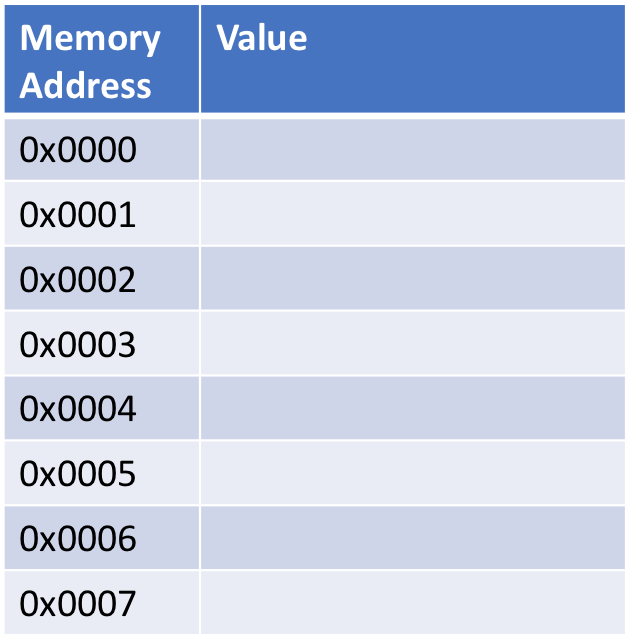

# Notes: Intro to Java

# How Does a Computer Work?

In broad terms, a computer is an extremely complex circuit that is
driven by \"binary inputs\". A user feeds in input as either 0 (no
power) or 1 (power), which when done correctly, cause the computer to
perform specific actions. These combinations of 0s and 1s are often
called binary code or machine language and are the only language a
computer truly understands.\
A computer processes a single machine instruction in one "cycle" - computer speed is measured in Hz or 
cycles per second. Modern
personal computers run at speeds of around $3 GHz$ or $3 \times 10^9$
cycles per second. It's this extraordinary speed that makes computers so
valuable. 

## What is a Programming Language?

A major problem with computers is that machine language is extremely
difficult for a human to read and write. So over the years we have
developed **programming languages** which, for the most part, are
designed to bridge the gap between natural human language and machine
language. A programming language is something that a human can easily
read and write, and that can be efficiently converted into machine
code.\
There are thousands of different programming languages in existence -
most are not in common use. This website
<http://www.99-bottles-of-beer.net/abc.html> has a list of over 500
programming languages with a program that prints the song \"99 bottles
of beer\" written in each language. All of these languages have
different properties and use cases - and there are entire classes and
books on programming language theory. Here we'll just discuss the
basics.

## High Level vs Low Level

A **high level** language is a language that's closer to natural
language than machine code. High level languages are easier to read by
humans, have more layers and safeguards between the programmer and the
processor, and are relatively slow. High level languages are very
popular for developing user level software software - websites and apps,
research and quick prototyping, and for tasks that don't require
exceptionally fast performance.\
A **low level** language is a language that's closer to machine code
than natural language. Low level languages are more difficult for humans
to read and have less layers and safeguards between the programmer and
the processor - this means it's easier for a programmer to break the
processor using a low level language. Low level languages are also
relatively fast compared to high level languages. Low level languages
are popular for designing systems level software - device drivers,
operating systems, embedded systems, etc - and for tasks that require
exceptionally fast performance.

## Compiled vs Interpreted

A **compiled language** is a language that is converted directly to
machine code then run by the processor. This conversion step is handled
by a **compiler** and is initially slow. However, the machine code runs
relatively quickly. Additionally, compiled programs are less portable -
they have to be recompiled for different architectures and more secure
since reconstructing the source code from the binary files is
difficult.\
An **interpreted language** is a language that's converted to machine
code and run line by line during run time. That is, when I run an
interpreted language, the first line is converted to machine code and
run by the **interpreter** then the second line is compiled and run and
so on. These languages don't have a slow compilation step, but the
overall program runtime is slower (since the conversions happened during
runtime). Additionally, interpreted programs are more portable since the
interpreters are built to convert the source code based on architecture,
and they are less secure since the source code is shipped out as part of
the software.

## Java

Java is a multi-purpose programming language developed by Sun
Microsystems (bought by Oracle) in 1995. It is the most used programming
language in the world. Java is considered a relatively high level
language and is a hybrid compiled / interpreted language. Java source
code is compiled into Java byte code which is then run on top of a Java
Virtual Machine (JVM). The JVMs are architecture specific, but the byte
code is not which means Java can be shipped out in its compiled state.
This means that Java source code can run on any platform and is faster
than a standard interpreted language - Java is still slower than pure
compiled languages like C and C++.

## Java Syntax

### The Hello World Program

```Java
public class Hello {

   public static void main(String[] args) {
        System.out.println("Hello World");
   }
}
```
The first line defines a Java **class** named \"Hello\". The entire
class is contained in the first set of curly brackets.\
The second line is the **header** for the **main method**. The main
method is the place where the computer begins running the program. The
entire method is contained within the second set of curly brackets. The
third line is a print command.

### Printing

There are three major ways to print output to the screen in Java.
-   `System.out.println("Hello World");`\
    Prints the argument (in this case the string Hello World, but could
    be an integer, character, float, double, etc) and moves the cursor
    to a new line.
-   `System.out.print("Hello World");`\
    Prints the argument and doesn't move the cursor to a new line.
-   `System.out.printf("%s", "Hello World");`\
    Prints a string containing format commands (the first argument) and
    doesn't move the cursor to a new line. A formatted command has the
    structure: %\[flags\]\[width\]\[.precision\]conversion-character.
    See the below cheat sheet for a quick reference to the different
    printf commands.\
    <http://web.cerritos.edu/jwilson/SitePages/java_language_resources/Java_printf_method_quick_reference.pdf>

### Data Types

Java technically has an infinite number of data types since Java
programmers can create their own data types. However, all Java data
types are build around a set of basic, **primitive** data types.
-   boolean: represents true or false. Example:
    `boolean b1 = true; boolean b2 = false;`.
-   byte: represents a single 8 bit value (any integer between $-2^7$
    and $2^7$)\
    Example: `byte b1 = 8; byte b2 = 127;`.
-   char: a single Unicode character - in non-programming speak, this is
    a data type that holds a single letter or symbol found in text.
    Example: `char c1 = 'a'; char c2 = '1'; char c3 = '\n';`.
-   short: a 16 bit integer value (any integer between $-2^15$ and
    $2^15$). Example: `short s1 = 8; short s2 = 32767; short s3 = -5;`
-   int: a 32 bit integer value (any integer between $-2^31$ and
    $2^31$). Example: `int i1 = 8; int i2 = 2147483647; int i3 = -20;`
-   long: a 64 bit integer value (any integer between $-2^63$ and
    $2^63$). Example: `long l1 = 8; l2 = 2147483647; long l3 = -10;`
-   float: a 32 bit floating point value. Example
    `float f1 = 10.0; float f2 = 100.323423; flaot f3 = -2132.343;`
-   double: a 64 bit floating point value. Example
    `double d1 = 1.0; double d2 = 1123.3432432; d3 = -4234.324;`

Java - and most other programming language - have a more complex data
type used to hold text. These are called **Strings**. Strings are
\"strings' of characters - essentially the representation of text in a
computer program. Strings are an example of a **non-primitive** data
type. A non-primitive data type is a data type that is made up of
primitive (and other non-primitive data types). Non-primitive data types
are more complex than primitives and are named with their first letter
capitalized. We define a string useing quotation marks:
`String s = "Hello world.";`.

### Variables

A variable is a container or storage location for a value. These
variables only exist while the program is running. A variable has three
components, a type, name and value.
```Java
int luckyNumber = 13;
System.out.println("the lucky number is " + luckyNumber);
System.out.println("and twice that is " + 2*luckyNumber);
```

In line 1 we define a variable (luckyNumber) as an integer (int) which
we can call later in the program.\
We can define a constant or final variable as a variable that cannot be
changed throughout the program. This can be useful for mathematical
constants or specific numbers that aren't changeable. For example, if we
want to create a named constant integer set to the value $1$ we say
`final int one = 1;`

### Keyboard Input

Taking in user input is a crucial part of a computer program since we usually want our programs to make computations and decisions based on
user input.
```Java
import java.util.Scanner; 

public class Variable {

   public static void main(String[] args) {
      Scanner keyboard = new Scanner(System.in); 
      System.out.print ("Please enter your lucky number ");
      int luckyNumber = keyboard.nextInt();
      System.out.println ("the lucky number is " + luckyNumber);
      System.out.println ("And twice that is " + 2*luckyNumber);
    }
}
```
Line 1 imports the Scanner class from the java library.\
Line 4 defines a new variable \"keyboard\" which is a variable of type Scanner.\
Line 6 defines a new integer as the next integer entered by the user.
This vari able can be called later on in the program.\
You can think of a Scanner as a pipe that we can use to read input and files from different sources. When we set up a Scanner as we did above, the pipe is connected to the Computer's "standard input" (aka the keyboard) and will read input at that location. 
The Scanner object has a few built in methods that can be used to take
in specific types of input. If we declare
`Scanner keyboard = new Scanner(System.in);`:
-   `keyboard.next();`\
    Returns the next word (String up until the next whitespace or
    newline) entered at the console.
-   `keyboard.nextLine();`\
    Returns the next line (String up until the next newline including
    any other whitespace) entered at the console.
-   `keyboard.nextInt();`\
    Returns the next integer entered at the console.
-   `keyboard.nextDouble();`\
    Returns the next double entered at the console.
-   `keyboard.hasNext();`\
    Returns whether or not there is an unprocessed word entered at the
    console.
-   `keyboard.hasNextLine();`\
    Returns whether or not there is an unprocessed line entered at the
    console.

For more Scanner commands see
<https://docs.oracle.com/javase/7/docs/api/java/util/Scanner.html>.

### Basic Value Manipulation

One of the main purposes of computers is to perform calculations more
quickly than humans. Java has many operations which can be used to
perform arithmetic, manipulate data, etc.

**Arithmetic Operations**

The arithmetic operations in Java are

-   \+ addition
-   \- subtraction
-   \* multiplication
-   / division
-   \% modulus (remainder)

**Integer Division**

When a value or variable is stored a certain ammount of memory is
allocated based on the type. Thus integers, doubles, floats, strings,
etc cannot be simply interchanged. This doesn't present as a problem
when undergoing addition, subtraction, or multiplication since adding,
subtracting, and multiplying two integers will yield an integer. However
when dividing integers we encounter a problem. Dividing two integers can
yield a decimal number which does not \"fit\" in the memory allocated
for the integers. Thus the computer truncates the number at the decimal
point to ensure that the new number will be stored.\
Thus if we have two integers 3 and 7. According to the compiler 7/3 = 2
However if we want to obtain the \"real\" answer we can say
`7/ (double) 3 = 2.33333`

### The Math Library

Java also has a built in Math package for more complicated mathematical
operations. You're not expected to know the entirity of the Math
package, but there are a few methods which you should know off the top
of your head. Note that while I'm writing these functions with a very
specific set of input arguments, there are equivalent functions for
variables of different data types. For example there is a
`Math.abs(int a)`, a `Math.abs(double a)`, a `Math.abs(long a)`, etc all
of which return the absolute value of the argument / parameter (a).
-   `Math.pow(int a, int b);`\
    Returns $a^b$.
-   `Math.sqrt(int a);`\
    Returns $\sqrt(a)$.
-   `Math.log(double a);`\
    Returns $\log_{e}(a)$.
-   `Math.log10(double a);`\
    Returns $\log_{10}(a)$.
-   `Math.max(int a, int b);`\
    Returns the larger of the two parameters.
-   `Math.min(int a, int b);`\
    Returns the smaller of the two parameters.
-   `Math.abs(double a);`\
    Returns the absolute value of the parameter.
-   `Math.floor(double a);`\
    Returns the largest integer less than the parameter. For example if
    `double a = 4.5`, `Math.floor(a)` returns 4.0.
-   `Math.ceil(double a);`\
    Returns the smallest integer greater than the parameter. For example
    if `double a = 4.5`, `Math.ceil(a)` returns 5.0.

A full list of Math methods can be found at
<https://docs.oracle.com/javase/8/docs/api/java/lang/Math.html>.

### String Manipulation

Java maintains a list of String manipulation methods on their website.
If we have a `String myString = "This is my string!";`:
-   `myString.charAt(2);`\
    Returns the character at index 2 (3rd character) in myString.
-   `myString.substring(5);`\
    Returns the string from index 5 till the end.
-   `myString.substring(1, 5);`\
    Returns the string from index 1 (inclusive) to index 5 (exclusive).
-   `myString.toLowerCase();`\
    Converts the string to lower case.
-   `myString.toUpperCase();`\
    Converts the string to upper case.
-   `myString.contains(str);`\
    Returns true if myString contains str, false if not.
-   `myString.indexOf(str);`\
    Returns the index of the first incidence of the string str in
    myString or -1 if str is not in myString. Can also be called on a
    character.
-   `myString.length();`\
    Returns the length of the string.

A full list of String methods can be found at
<http://docs.oracle.com/javase/7/docs/api/java/lang/String.html?is-external=true>.


## Random Numbers

Sometimes we may want to generate a random number as part of our program
(we could be writing a board game that uses a dice, simulating a
biological process, or testing another program). Java has a specific
module designed to handle random number generation.\
To use this module we must import the Random class and declare a new
Random object - keep in mind you only need to declare one random object
even if you want to generate multiple random variables. If we have
`Random gen = new Random();`

-   `gen.nextInt();`\
    Returns a random integer.
-   `gen.nextInt(x);`\
    Returns a random integer between 0 and x (not including x).
-   `gen.nextDouble();`\
    Returns a random double between 0 and 1.
-   `gen.nextBoolean();`\
    Returns a random boolean value (true or false).
-   `gen.nextGaussian();`\
    Returns a random double from the Gaussian (Normal) distribution with
    mean 0 and standard deviation 1.

We can use these methods to generate random integers and floats between
L (inclusive) and H (exclusive).
-   `gen.nextInt(H-L+1) + L`\
    Returns a random integer between L and H (inclusive).
-   `gen.nextDouble()*(H-L) + L`\
    Returns a random double between L and H (inclusive).

The complete list of random number generation methods can be found at
<https://docs.oracle.com/javase/7/docs/api/java/util/Random.html>.

## Example

The following program takes two doubles as inputs (high and low) and
prints two random numbers - the first is a random integer between high
and low (inclusive) and the ssecond a random double between high and low
(inclusive).

```Java
import java.util.Random;
import java.util.Scanner;

public class RandomExample {

    public static void main(String[] args) {
        Scanner kb = new Scanner(System.in);
        Random gen = new Random();
        System.out.print("High: ");
        double high = kb.nextDouble();
        System.out.printf("Low: ");
        double low = kb.nextDouble();
        // note that (int) high casts the double variable "high" to an integer
        int randInt = gen.nextInt((int) high - (int) low + 1) + (int) low;
        double randDouble = gen.nextDouble() * (high-low) + low;
        System.out.printf("A random number between %d and %d is %d\n", (int)low, (int)high, randInt);
        System.out.printf("A random double between %f and %f is %f\n", low, high, randDouble);
    }
    
}
```

##Control Flow

###Boolean Statements

Boolean is one of the primitive data types in Java. A boolean variable
can take on two values, true or false and can be created using
combinations of relational statements and boolean variables chained
together by logical operators.

**Relational Operators**
- < less tha
- \> greater than
- \<= less than or equal to
- >= greater than or equal to
- == check for equality
- != not equal

**Logical Operators**
- && and
- || or
- ! not

A && B is true if A and B both evaluate to true. Otherwise
A && B is false.

A || B is true if either A or B or both A and B are true.
Otherwise A || B is false.

!A is true if A is false. Otherwise !A is false.

```
AND
True  &&  True  = True 
True  &&  False = False 
False &&  True  = False 
False &&  False = False  

OR
True  ||  True  = True 
True  ||  False = True 
False ||  True  = True 
False ||  False = False  

NOT
!True           = False 
!False          = True
```

For example

```Java
bool x = 5 < 10; // true
bool y = 5 > 10; // false
bool z = x && y; // false
bool z = x || y; // true
```

The not (!) operator can be distributed using De Morgan's Laws:
```
!(A && B) = !A || !B 
!(A || B) = !A && !B 
```

### If, Else If, and Else

If/Else if/Else blocks are used to execute specific lines of code based
on a set of conditions. There are several ways to use these blocks.\
If I want to execute a block of code only if a condition is true I would
use an if statement. An if statement is paired with a specific boolean
expression (condition). If that boolean expression evaluates to true,
the code inside the if block is executed. Otherwise, the code is not
executed.

```Java
int val = kb.nextInt();
if (val > 5) {
    // inside the if block
    System.out.println("val was greater than 5");
}
```

If I want to execute a block of code if a condition is true and a
completely different block if the condition is false I would use an if
block paired with an else block. An else block comes after an if (or
else if, see below) and is executed if the if statement's boolean
condition evaluates to false. In the example below, we want to print one
statement if the user entered a value greater than 5 and a completely
different statement otherwise.

```Java
int val = kb.nextInt();
if (val > 5) {
    // inside the if block
    System.out.println("val was greater than 5");
}
else {
    // inside the else block
    System.out.println("val was less than or equal to 5");
}
```

If I want to execute a different block of code based on more than two
possible outcomes (ie one block if condition\_1 is true, another if
condition\_2 is true, another if condition\_3 is true, etc) I would use
an if block paired with else if blocks and optionally a final else
block. A set of else if block comes after an if block. Each individual
else if is paired with a boolean conditions - if none of the conditions
above were true and the else if's condition is true, that block of code
gets executed. If none of the if or else if blocks get executed, the
else block is executed.

```Java
double grade = kb.nextDouble();
if (grade > 90) {
    System.out.println("A");
}
else if (grade > 80) {
    System.out.println("B");
}
else if (grade > 70) {
    System.out.println("C");
}
else if (grade > 60) {
    System.out.println("D");
}
else {
    System.out.println("F");
}
```

### Switch

A switch statements is used when we want to perform a specific action if
a primitive variable or String is equal to a specific value. Instead of
writing:

```Java
if (x == value1) {
    // statements
}
else if (x == value2) {
    // statements
}
else {
    // statements
}
```

We can write:

```Java
switch (x) {
    case value1: 
        // statements
        break;
    case value2: 
        // statements
        break;
    default: 
        // statements
        break;
}
```

Nore that the default case corresponds to the \"else\" block in an if /
else if / else structure. The `break` keyword breaks out of the switch
strucure. If you don't end a case with a `break`, the program will
simply move on through to the next case. This behaviour gives us a bit
more flexibility than if/else if statements when it comes to \"or\"
behaviours. If you want to have an \"or\" type statements with mutliple
variables (ie if x == X or x == Y) we can exclude the break statement
and let the cases merge.

```Java
switch (x) {
    case value1: 
    case value2: 
        // statements
        break;
    default: 
        // statements
        break;
}
```

Is the same as

```Java
if (x == value1 || x == value2) {
    // statements
}
else {
    // statements
}
```

Or say we have three possible actions A, B, and C. If the user enters
'a' we want to perform 'Action A', if the user enters 'b' we want to
perform 'Action B' and then 'Action A', and if the user enters anything
else we want to perform 'C'. Below are examples of how you could do this
with a switch and an if/else if/else structure. Notice how the switch
statement is syntactically cleaner than the if/else if/else (though both
are technically right).

```Java
// switch example
char choice = kb.nextInt().charAt(0);
switch (choice) {
    case 'b':
        // do B
    case 'a':
        // do A 
        break;
    default:
        // do C
}
```

```Java
// if / else if / else example
char choice = kb.nextInt().charAt(0);
if (x == 'a') {
    // do A
}
else if (x == 'b')
    // do A 
    // do B
}
eles {
    // do C
}
```
# File IO

We often want to read data from a file and / or write data to a file. To
read data from a file we use the Scanner and FileReader classes. We
declare the Scanner similarly to how we declare a Scanner to read from
the keyboard
```Java
import java.util.Scanner;
import java.io.FileReader;
impor java.io.IOException;

public class IOExampleInFile {
    
    public static void main(String[] args) throws IOException {
        Scanner inFile = new Scanner(new FileReader("infile.txt"));
        // read from the file using next(), nextLine(), nextDouble(), nextInt(), etc.
        inFile.close(); // not strictly necessary when reading from the file
    }
}
```
In this case `infile.txt` is the name of the file we want to open. We can now treat inFile the same way as we treated the Scanners that were reading input from the keyboard. We can call `infile.next()`, `infile.nextLine()`, `infile.nextInt()`, and `infile.nextDouble()` and expect the same kind of behavior
as if we were reading input from the keyboard.  
There are also a couple of methods that we can use to determine how long to read a file:
- `infile.hasNext()` : returns true if there is a next word in the file
- `infile.hasNextLine()` : returns true if there is a next line in the file
- `infile.hasNextInt()` : returns true if the next element in the file is an int
- `infile.hasNextDouble()` : returns true if the next element in the file is a double

Using these methods I can read from a file line by line, word by word, etc. 

For example to read a file line by line and print each line to the screen:
```Java
Scanner infile = new Scanner(new FileReader("infile.txt"));
while (infile.hasNextLine()) {
    String line = infile.nextLine();
    System.out.println(line);
}
```
The example above reads a file line by line.

To write data to a file we use PrintWriter and
FileWriter objects which are declared as follows. 
```Java
import java.io.PrintWriter:
import java.io.FileWriter;
import java.io.IOException;

public class IOExampleOutFile {
    
    public static void main(String[] arge) throws IOException {
        PrintWriter outFile = new PrintWriter (newFileWriter("output.txt"));
        // write to the file
        outFile.close();
    }
}
```
Writing to a `PrintWriter` is very similar to printing to the screen - in fact `PrintWriter` has the same methods as `System.out` so you can call `outfile.print()`, `outfile.println()`, or `outfile.printf()` the same way you'd call `System.out.print()`, `System.out.println()`, or `System.out.printf()`. When you're done writing to an output file you have to call `close()` on the PrintWriter - otherwise the file may not save. 

For example if I wanted to write a bunch of integers to a file:
```Java 
PrintWriter outFile = new PrintWriter(new FileWriter("output.txt"));
for (int i = 1; i < 2048; i*=2) {
    outFile.printf("%d\n", i);
}
outFile.close();
```

Putting these together - here is an example of copying a file line by line to some output file. 
```Java
import java.util.Scanner;
import java.io.FileReader;
import java.io.IOEXception;
import java.io.PrintWriter;
import java.io.FileWriter;

public class IOExample {

    public static void main(String[] args) throws IOException {
        Scanner inFile = new Scanner(new FileReader("input.txt"));
        PrintWriter outFile = new PrintWriter (newFileWriter("output.txt"));
        // to find all integers in the file
        while (inFile.hasNextLine()) {
            outFile.println(inFile.nextLine());
        }
        /* 
        for the while loop we can also use ioFile.hasNext for strings, inFile.hasNextLine for and entire file, ioFile.hasNextDouble for doubles 
        */
        outFile.close() // closes the output file
    }
}
```
# Loops and Variable Scope

## Loops

One of the major benefits of a computer is its ability to quickly
complete repetitive tasks. Programming languages like Java have built in
structures called loops which we can use to condense repetitive
statements.

### For Loops

For loops are the most straight forward and intuitive type of loop. A
for loop is defined in three stages:
1.  initialization: define a variable (var) to a specific value.
2.  ending condition: define a condition (typically based on the value
    of var) for which you want the loop to continue.
3.  assignment: define how var changes for each iteration of the loop.

This is best seen illustrated by an example.
```
for (int i = 0; i < 10; i++) {
    System.out.print(i + " ");
}
```
In this example, 
1. the variable i is initialized to 0, 
2. the for loop will continue so long as i \< 10, 
3. at the end of each iteration of the loop i will be incrimented by one.\
Every iteration of this loop prints the value of i. So the output will look like 
```
1 2 3 4 5 6 7 8 9
```
For loops can have a variety of variables, conditions, and assignments. For example, this loop uses a multiplactive assignment statement:
```Java
for (int j = 1; j <= 2048; j*=2) {
    System.out.printf("%d ", j);
}
```
Outputs:
```
1 2 4 8 16 32 64 128 256 512 1024 2048
```
We typically use a for loop when we know exactly how many times a loop
should run or we know the exact range over which we need to loop. 

### While Loops

The while loop is the most general type of loop. A while loop keeps
executing the loop body so long as a boolean condition is satisfied.
```Java
Random gen = new Random();
System.out.println("\nWhile loop - continues until di rolls a 3.");
int roll = -1; // simulate rolling a 6 sided di
while (roll != 3) {
    roll = gen.nextInt(6) + 1; 
    System.out.printf("%d ", roll);
}
```
In this example, `gen.nextInt(6) + 1` simulates rolling a 6 sided di. The while loop is set to continue while the di roll is not equal to 3. Since this is a random process (we cannot know when `roll` will equal 3), this behavior can't can't be easily replicated by iterating over some range of values (ie we can't easily adapt a for loop to this situation). \
In general we use a while loop when we don't know exactly how many times
the loop will run.

### Do-While Loops

A do-while loop is almost exactly like a while loop except the loop body
is executed before the condition is checked. This means that the body
will always be executed at least once.
```Java
System.out.println("Welcome to my do-while example");
do {
     System.out.println("Press q to quit")
     String choice = kb.next();
     System.out.println(choice);
} while (!choice.equals("q"));
```
The loop above will continue until the user inputs the string "q". Note that we always want the user to see the "Press q to print" prompt at least once - this is accomplished by the do-while loop. (You may be thinking "I can do that with a while loop too", and you would be right. This syntax lets us write this behavior a more cleanly, but as we'll see below you can accomplish the same thing with a while loop). 
In general we use a while loop when we don't know exactly how many times
the loop will run but we always want the loop to run at least once. 

### Loop Equivalence

For and do-whlie loops are, theoretically, convenient syntax for a
special case of a while loop. That means that any for or do-while loop
can be written as a while loop. However, not every while loop can be
rewritten as a for or do-while loop.
```Java
System.out.println("\nEquivalent for and while loops.");
for (int i = 0; i < 10; i++) {
    System.out.printf("%d ", i);
}
System.out.println();
int count = 0;
while (count < 10) {
    System.out.printf("%d ", count);
    count++;
}
// do-while to while
System.out.println("\nEquivalent do-while and while loops.");
int rollThree = 0;
do {
    rollThree = gen.nextInt(6) + 1;
    System.out.printf("%d ", rollThree);
} while (rollThree != 3);
System.out.println();
int rollFour = 0;
while (rollFour != 3) {
    rollFour = gen.nextInt(6) + 1;
    System.out.printf("%d ", rollFour);
}
```

### Nested Loops

Loops can be nested within each other to create some complex (and very
useful) results.
```Jsva
System.out.println("\nNested for loop.\nPrints a triangle.");
for (int i = 0; i < 10; i++) {
    for (int j = 0; j < i; j++) {
    System.out.print("*");  
    }
    System.out.println();
}
System.out.println("Nested for and while loop.\nContinues until average roll is less than 3.");
double avgRoll = 6;
final int numRolls = 10;
while (avgRoll >= 3) {
    int acumRoll = 0;
    for (int i = 0; i < numRolls; i++) {
        acumRoll += gen.nextInt(6) + 1;
    }
    avgRoll = acumRoll / (float) numRolls;
    System.out.printf("%.2f ", avgRoll);
}    
```

## Scope

When a varble is **declared** in Java it is given a certain **scope**. A
variables scope is the region in which it is visible (or accessible). A
variable is accessible in the block in which it is declared (including
any sub-blocks), but nowhere else.
```Java
public class Scope {

    public static void main(String[] args) {
        int varOne; // varOne is declared in the main method scope
        varOne = 10; // varOne is defined (different from begin declared)
        if varOne > 1 {
            System.out.println(varOne); // varOne is still in scope
            varOne = 20;
            int varTwo = 1;
        }
        System.out.println(varOne); // varOne is still in scope and its value has changed
        System.out.println(varTwo); // throws a compiler error because varTwo is out of scope. 
    }
}
```


# Instantiable Classes

So far we've worked with data types that have been defined for us. However a lot of the time we want to be able to define our own data types - with their own associated variables and methods. This is the basic principle behind __Object Oriented Programming__. Object oriented programming is a programming paradigm centered around user defined data types (aka objects). An object oriented programming language (like Java) allows users to define their own data types and use them in programs. From here on out I'll say object instead of data type. 

We define our own objects by writing an __instantiable class__. An instantiable class is essentially a blueprint for an object - it defines what an object contains, how to create an object, and the methods you can call on the object. 
A basic instantiable class can be broken down into three sections
1. The member variables - The member variables define what data the object stores. 
2. The constuctor(s) - The constructors define how we create a new instance of the object.
3. The methods - These are methods we can call on the object.

__The Problem__

We're going to be using this problem for most of our discussion of OOP. The NBA playoffs are coming up and we want to write a program to keep track of the performance of our favorite basketball teams as they advance through the postseason. We could write some really complicated code to keep track of each team and link their win / loss percentages together, but instead we're going to use object oriented programming.


```Java
public class Team {
    
    public String name;
    public int gamesWon;
    public int gamesLost;
    public double winPercentage;
    
    public Team(String name) {
        this.name = name;
        this.gamesWon = 0;
        this.gamesLost = 0;
        this.winPercentage = 0;
    }
    
    public void updateWinPercentage() {
        if (this.gamesWon + this.gamesLost == 0) {
            this.winPercentage = 0;
        }
        this.winPercentage = 100 * (double)this.gamesWon 
               / (this.gamesWon + this.gamesLost);
    }
    
    public String toString() {
        return String.format("%s: %d won %d lost, %.2f%%",
               this.name, this.gamesWon, this.gamesLost, 
               this.winPercentage);
    }
}
```

This is a very basic class. Note the three parts
1. The member variables are name, gamesWon, and gamesLost. These values are accessible anywhere within the entire class. 
2. The constructor is a method with the same name as the class (in this case Team). It is used to set up the object. It is possible to have more than one constructor. 
3. In this case we only have one method. This method uses the stored gamesWon and gamesLost to get the team's win percentage. 

Also note that the `this` keyword refers to the current instance of the class. When I call `this.gamesLost` inside a class definition I am referring to the `gamesLost` variable inside a specific instance of `Team`. 

You must save an instantiable class in a file with the same name as the class. So the Team class would be in a file called Team.java. 
The easiest way to access the Team class from another program is to save Student.java in the same folder (directory) as the driver (program with the main method). 

Now we can create variables that are "instances" of type Team whose behavior is defined by the blueprint above. 


```Java
Team kings = new Team("Sacramento Kings");
Team lakers = new Team("LA Lakers");
```

Now that we've created some Teams we can access and modify their stored variables and call their methods. 


```Java
System.out.println(kings.toString());
System.out.println(lakers.toString());
// if the kings beat the lakers
kings.gamesWon++;
lakers.gamesLost++;
kings.updateWinPercentage();
lakers.updateWinPercentage();
System.out.println(kings.toString());
System.out.println(lakers.toString());
```

There is a major problem with this construction. Anyone can change any of the variables at any time. This can be advantageous sometimes, but usually it leads to synchronization problems between our variables.


```Java
kings.gamesLost += 10;
System.out.println(kings.toString());

lakers.gamesWon -= 10;
lakers.updateWinPercentage();
System.out.println(lakers.toString());
```

To fix these inconsistancies, we define our variables with the private keyword instead of public. If a member variable or method is private it cannot be seen or accessed outside of the class - the methods inside the class can access private variables and methods, but nothing outside can access a private variable or method. We then write methods to "get" and "set" the member variables - we call these getter and setter methods. 
For our Team class:


```Java
public class Team {
    
    private String name;
    private int gamesWon;
    private int gamesLost;
    private double winPercentage;
    
    public Team(String name) {
        this.name = name;
        this.gamesWon = 0;
        this.gamesLost = 0;
        this.winPercentage = 0;
    }
    
    public String getName() { return this.name; }
    public int getGamesWon() { return this.gamesWon; }
    public int getGamesLost() { return this.gamesLost; }
    public double getWinPercentage() { return this.winPercentage; }
    
    public void wonGame() { 
        this.gamesWon++; 
        this.updateWinPercentage();
    }
    
    public void lostGame() { 
        this.gamesLost++; 
        this.updateWinPercentage();
    }
    
    private void updateWinPercentage() {
        if (this.gamesWon + this.gamesLost == 0) {
            this.winPercentage = 0;
        }
        this.winPercentage = 100 * (double)this.gamesWon 
               / (this.gamesWon + this.gamesLost);
    }
    
    public String toString() {
        return String.format("%s: %d won %d lost, %.2f%%",
               this.name, this.gamesWon, this.gamesLost, 
               this.winPercentage);
    }
}
```

Like member variables, class methods can be public or private. Public methods can be called from an external class and private methods can obly be called from within the class. We use private methods to execute "helper" functions that we don't want the user to explicitly do. For example, we set the `updateWinPercentage` method to private because we want that to be done intenally, without external user input. 


```Java
Team kings = new Team("Sacramento Kings");
Team lakers = new Team("LA Lakers");

System.out.println(kings.toString());
System.out.println(lakers.toString());
// if the kings beat the lakers
kings.wonGame();
lakers.lostGame();
System.out.println(kings.toString());
System.out.println(lakers.toString());

for (int i = 0; i < 10; i++) {
    kings.lostGame();
}
System.out.println(kings.toString());
```

Setting variables and methods to private forces users and other programmers to interact with your class in ways that you have defined. This makes it a lot easier to write error-free code. 

For example, in the above example I can no longer just set a team to lose or win a bunch of games. They can only lose or win one game at a time. 

When programming (in the real world) you should operate under the assumption that the user will try to break your programs - you should write and test your code accordingly. 

### Common Methods

Most classes you write will have some methods in common
1. toString() - this method returns a string representation of the object
2. equals(Object o) - this method compares the object with another object
3. compareTwo(Object o) - this method checks if two objects are equal to each other. 


```Java
public class Team {
    
    private String name;
    private int gamesWon;
    private int gamesLost;
    private double winPercentage;
    
    public Team(String name) {
        this.name = name;
        this.gamesWon = 0;
        this.gamesLost = 0;
        this.winPercentage = 0;
    }
    
    public String getName() { return this.name; }
    public int getGamesWon() { return this.gamesWon; }
    public int getGamesLost() { return this.gamesLost; }
    public double getWinPercentage() { return this.winPercentage; }
    
    public void wonGame() { 
        this.gamesWon++; 
        this.updateWinPercentage();
    }
    
    public void lostGame() { 
        this.gamesLost++; 
        this.updateWinPercentage();
    }
    
    private void updateWinPercentage() {
        if (this.gamesWon + this.gamesLost == 0) {
            this.winPercentage = 0;
        }
        this.winPercentage = 100 * (double)this.gamesWon 
               / (this.gamesWon + this.gamesLost);
    }
    
    public boolean equals(Object o) {
        if (o instanceof Team) {
            Team other = (Team) o;
            return this.gamesWon == other.getGamesWon() 
                   && this.gamesLost == other.getGamesLost()
                   && this.name.equals(other.getName());
        }
        return false;
    }
    
    public int compareTo(Object o) {
        if (o instanceof Team) {
            Team other = (Team) o;
            return (int)(this.winPercentage - other.getWinPercentage());
        }
        return -1;
    }
    
    public String toString() {
        return String.format("%s: %d won %d lost, %.2f%%",
               this.name, this.gamesWon, this.gamesLost, 
               this.winPercentage);
    }
}
```


```Java
Team kings = new Team("Sacramento Kings");
Team lakers = new Team("LA Lakers");
System.out.println("Comparing kings and lakers " + kings.compareTo(lakers));
kings.wonGame();
lakers.lostGame();
System.out.println("Comparing kings and lakers " + kings.compareTo(lakers));
Team otherKings = new Team("Sacramento Kings");
System.out.println("Are two kings equal? " + kings.equals(otherKings));
otherKings.wonGame();
System.out.println("Are two kings equal? " + kings.equals(otherKings));
```

The keyword `instanceof` checks to see if some object is an instance of the given type. So `o instanceof Team` evaluates to true if `o` can be viewed as a `Team` and false if not. 

### Defining Static

In Java, a static member is a member of a class that isn’t associated with an instance of a class. Instead, the member belongs to the class itself. As a result, you can access the static member without first creating a class instance.

Consider the `Math` class. You can use `Math.abs` and `Math.pow` without doing `Math m = new Math();`. `abs` and `pow` are thus `static` members of the `Math` class because they don't depend on a specific instantiation of `Math`. 

Your main method is also always `static` because it is irrespective of any potential instantiation of the class. 


```Java
public class Team {
    
    private String name;
    private int gamesWon;
    private int gamesLost;
    private double winPercentage;
    private static final int numPlayers = 5;
    
    public Team(String name) {
        this.name = name;
        this.gamesWon = 0;
        this.gamesLost = 0;
        this.winPercentage = 0;
    }
    
    public static void playGame(Team won, Team lost) {
        won.wonGame();
        lost.lostGame();
    }
    
    public String getName() { return this.name; }
    public int getGamesWon() { return this.gamesWon; }
    public int getVamesLost() { return this.gamesLost; }
    
    public void wonGame() { 
        this.gamesWon++; 
        this.updateWinPercentage();
    }
    
    public void lostGame() { 
        this.gamesLost++; 
        this.updateWinPercentage();
    }
    
    private void updateWinPercentage() {
        if (this.gamesWon == 0 && this.gamesLost == 0) {
            this.winPercentage = 0;
        }
        this.winPercentage = 100 * (double)this.gamesWon 
               / (this.gamesWon + this.gamesLost);
    }
    
    public boolean equals(Object o) {
        if (o instanceof Team) {
            Team other = (Team) o;
            return this.gamesWon == other.getGamesWon() 
                   && this.gamesLost == other.getGamesLost()
                   && this.name.equals(other.getName());
        }
        return false;
    }
    
    public int compareTo(Object o) {
        if (o instanceof Team) {
            Team other = (Team) o;
            return (int)(this.winPercentage - other.getWinPercentage());
        }
        return -1;
    }
    
    public String toString() {
        return String.format("%s: %d won %d lost, %.2f%%",
               this.name, this.gamesWon, this.gamesLost, 
               this.winPercentage);
    }
}
```


```Java
Team kings = new Team("Sacramento Kings");
Team lakers = new Team("LA Lakers");

System.out.println(kings.toString());
System.out.println(lakers.toString());
// if the kings beat the lakers
Team.playGame(kings, lakers);
System.out.println(kings.toString());
System.out.println(lakers.toString());
```

### Pass by Reference Value

One of the major differences between primitive types and Objects is how they are represented in memory. We can visualize the computer memory as a array where the data at the $i$th index corresponds to memory address $i$:



When we define a primitive, for example `int primitive = 1;`, the variable `primitive` points to (aka references) some memory address $i$ and the data at memory address $i$ is the value of `primitive` (ie 1).


However, when we define an Object, for exmample `SomeClass nonPrimitive = new SomeClass();`, the variable `nonPrimitive` references some memory address $j$ but the data at memory adress $j$ is another memory address $k$. The data at memory address $k$ is the data corresponding to `nonPrimitive`.


This distinction comes into play when we pass variables into methods. Java "passes by reference value". That means that when if I have a variable `x` that references some memory address $A$, when I pass `x` into a method the computer will copy the data at $A$ and save it at a new memory address $B$.

If `x` is primitive, the data at $A$ is the value of `x`. So when we pass `x` into a method, the computer copies the valaue of `x` to $B$ and uses that memory address in when executing the method - effectively we copy `x` into a new variable and use that new variable in the method. The effect of this is that __if I pass a primitive variable into a method, changing the variable inside the method will not effect the variable outside of the method__. 

However, if `x` is not primitive, the data at $A$ is a reference to the data associated with `x`. So when we pass `x` into a method, the reference to the data is copied to $B$ and that memory address is used when executing the method. This effectively means that __if we call any methods on `x` that change `x` inside the method, those changes will effect the variable outside of the method__. However __if, inside the method, we set `x` to a new value, that changes the value of the reference at $B$ rather than the data referenced by $B$ so the value of `x` will not change outside the method__. 


```Java
public class SimpleClass {
    
    private int data;
    
    public SimpleClass(int x) {
        this.data = x;
    }
    
    public int getData() { return this.data; }
    
    public void makeSimpleClass(SimpleClass y) {
        this.data = y.getData();
    }
    
    public String toString() {
        return "SimpleClass: " + this.data;
    }
}
```


```Java
public static void attemptSwap(int x, int y) {
    int temp = x;
    x = y;
    y = temp;
}

int varOne = 10;
int varTwo = 20;
System.out.printf("varOne=%d, varTwo=%d\n", varOne, varTwo);
attemptSwap(varOne, varTwo);
System.out.printf("varOne=%d, varTwo=%d\n", varOne, varTwo);
```

    varOne=10, varTwo=20
    varOne=10, varTwo=20


```Java
public static void attemptSwap(SimpleClass x, SimpleClass y) {
    SimpleClass temp = new SimpleClass(x.getData());
    x.makeSimpleClass(y);
    y.makeSimpleClass(temp);
}

SimpleClass cOne = new SimpleClass(10);
SimpleClass cTwo = new SimpleClass(20);
System.out.printf("cOne=%s, cTwo=%s\n", cOne.toString(), cTwo.toString());
attemptSwap(cOne, cTwo);
System.out.printf("cOne=%s, cTwo=%s\n", cOne.toString(), cTwo.toString());
```

    cOne=SimpleClass: 10, cTwo=SimpleClass: 20
    cOne=SimpleClass: 20, cTwo=SimpleClass: 10


```Java
public static void attemptSwap(SimpleClass x, SimpleClass y) {
    SimpleClass temp = x;
    x = y;
    y = temp;
}

SimpleClass cOne = new SimpleClass(10);
SimpleClass cTwo = new SimpleClass(20);
System.out.printf("cOne=%s, cTwo=%s\n", cOne.toString(), cTwo.toString());
attemptSwap(cOne, cTwo);
System.out.printf("cOne=%s, cTwo=%s\n", cOne.toString(), cTwo.toString());
```

    cOne=SimpleClass: 10, cTwo=SimpleClass: 20
    cOne=SimpleClass: 10, cTwo=SimpleClass: 20


# Arrays

Arrays are the most fundamental data structure in Java (and most mainstream programming languages). An array is, essentially a fixed length list of values of a specific type. 

## Array Basics

### Creating and Printing Arrays

We can create an array in two ways:


```Java
int[] arrOne = new int[10];
```

The code above creates a new, empty array. In this array each element is of type `int` and the array is of size 10. 


```Java
int[] arrTwo = {1, 2, 3, 4, 5};
```

The code above creates a new prefilled array. (this is called the list initializer method).

In Java, arrays are non-primitive data types (objects). Therefore the variable `arrOne` technically is a "reference" which points to the memory location where the array data is being stored. So we can't print an array directly using `System.out.println`. 


```Java
System.out.println(arrOne);
```

    [I@7f416310


Instead we need to use a for loop to access each element individually. 


```Java
/**
 * Prints an array of integers. The same idea can be used to print any
 * array - just change the data type of the array and add a call to 
 * toString if you're dealing with non-primitives. 
 * @param arr the array to print
 */
public static String printIntegerArray(int[] arr) {
    String toPrint = "[";
    for (int i = 0; i < arr.length; i++) {
        toPrint += arr[i] + ", ";
    }
    toPrint = toPrint.substring(0, toPrint.length() - 2) + "]";
    return toPrint;
}

public static String printObjectArray(Object[] arr) {
    String toPrint = "[";
    for (int i = 0; i < arr.length; i++) {
        toPrint += arr[i] + ", ";
    }
    toPrint = toPrint.substring(0, toPrint.length() - 2) + "]";
    return toPrint;
}

```

Observe in the for loops above we called `arr.length` instead of `arr.length()`. That is because the length field in the Array class is a variable, not a method (as it is in the String class).

### Accessing array elements

We can access each element in an array using bracket notation. `arrOne[2]` refers to the 2nd index in `arrOne`. Recall that Java indexes at 0, so the 2nd index is actually the 3rd position. 


```Java
for (int i = 0; i < arrOne.length; i++) {
    arrOne[i] = (int)Math.pow(i, 2);
}

System.out.println(printIntegerArray(arrOne));
```

    [0, 1, 4, 9, 16, 25, 36, 49, 64, 81]


```Java
for (int i = 1; i < arrOne.length; i+=2) {
    arrOne[i] = -1*arrOne[i];
}

System.out.println(printIntegerArray(arrOne));
```

    [0, -1, 4, -9, 16, -25, 36, -49, 64, -81]


#### The For-Each Loop

The for-each loop is a special way to write a for loop to make accessing array elements a bit less wordy. 

Instead of 


```Java
for (int i = 0; i < arrOne.length; i++) {
    System.out.printf("%d ", arrOne[i]);
}
```

    0 -1 4 -9 16 -25 36 -49 64 -81 

I can write


```Java
for (int e : arrOne) {
    System.out.printf("%d ", e);
}
```

    0 -1 4 -9 16 -25 36 -49 64 -81 

The syntax of this loop is 
```Java
for (<data_type> <var_name> : <array>) {
    // do something with var_name
}
```
The loop sets `var_name` to each element in `<array>` (in order) and executes the body of the loop. It's the exact same idea as the traditional for loop above. The one caveat with this type of loop is that you can't use it to change the value of the array elements - you can see, use, and copy, but not change the values. 


```Java
for (int x : arrTwo) {
    x = 10;
}
System.out.println(printIntegerArray(arrTwo));

for (int i = 0; i < arrTwo.length; i++) {
    arrTwo[i] = 10;
}
System.out.println(printIntegerArray(arrTwo));
```

    [1, 2, 3, 4, 5]
    [10, 10, 10, 10, 10]


#### Instantiating Arrays

When we first instantiate an array, the array is filled with "empty values" of the specific type. If the array type is a primitive, every element in the array will be set to 0. If the array type is non-primitive, every element in the array will be set to `Null`. `Null` is a special value which means that a variable has been declared but not defined - you can think of it as 0 for non-primitives. You may see `None` used instead of `Null` in other languages - they mean the same thing. 


```Java
public class Square {

    private double length;
    
    public Square(double len) {
        if (len < 0) {
            this.length = 1;
            return;
        }
        this.length = len;
    }
    
    public double getSideLength() { return this.length; }
    public double getArea() { return Math.pow(this.length, 2); }
    
    public void setSideLength(double len) {
        if (len <= 0) {
            System.out.println("Invalid length");
        }
        this.length = len;
    }
    
    public String toString() {
        return String.format("Square with side length = %.2f", this.length);
    }
}
```


```Java
int[] emptyArray = new int[10];
System.out.println("Empty array of ints (primitive)");
System.out.println(printIntegerArray(emptyArray) + "\n");

System.out.println("Empty array of Circles (non-primitive)");
Square[] emptyArray = new Square[10];
System.out.println(printObjectArray(emptyArray));
```

    Empty array of ints (primitive)
    [0, 0, 0, 0, 0, 0, 0, 0, 0, 0]
    
    Empty array of Circles (non-primitive)
    [null, null, null, null, null, null, null, null, null, null]


### Common Array Errors

#### NullPointerException

A `NullPointerException` occurs when you attempt to do something to a `Null` object. Recall that a `Null` object has not been defined (initialized) so trying to do anything to it makes no sense. You will often see `NullPointerExceptions` when you haven't initialized the elements in your array yet. 


```Java
Square[] squares = new Square[5];
for (int i = 0; i < squares.length; i++) {
    squares[i].setSideLength(2*(i+1));
}
```


    ---------------------------------------------------------------------------

    java.lang.NullPointerException: 

        at .(#114:1)


```Java
Square[] squares = new Square[5];
for (int i = 0; i < squares.length; i++) {
    squares[i] = new Square(1);
    squares[i].setSideLength(2*(i+1));
}
printObjectArray(squares);
```

    [Square with side length = 2.00, Square with side length = 4.00, Square with side length = 6.00, Square with side length = 8.00, Square with side length = 10.00]


The examples above are pretty simple - usually you'll see a `NullPointerException` because you've only filled an array part of the way or you moved elements around or something like that. 

#### ArrayindexOutOfBounds

An `ArrayIndexOutOfBounds` exception is the same idea as a `StringIndexOutOfBoundsException`. Essentially you are trying to access an index that doesn't exist. 


```Java
Square sq = squares[10];
```


    ---------------------------------------------------------------------------

    java.lang.ArrayIndexOutOfBoundsException: 10

        at .(#60:1)


```Java
Square sq = squares[-1];
```


    ---------------------------------------------------------------------------

    java.lang.ArrayIndexOutOfBoundsException: -1

        at .(#60:1)


## N-Dimensional Arrays

The arrays we've talked above have all been one dimensional - if you're a math person you can think of them as vectors (or if you're a non-math person just a list of values). However, arrays can be N-dimensional. Here we'll show 2D arrays, but the syntax can be generalized to N-dimensions. 

We can create a 2D array as follows:


```Java
int[][] twoDArray = new int[5][10];
```

This creates a 2D integer array with 5 rows and 10 columns. 
A 2D array is an "array of arrays". So `twoDArray[1]` refers to the length 10 integer array at index 1 (position 2).

The semantics of using a 2D array are the same as those of a 1D array. 


```Java
for (int i = 0; i < twoDArray.length; i++) {
    for (int j = 0; j < twoDArray[i].length; j++) {
        twoDArray[i][j] = i*j;
    }
}

System.out.println("[");
for (int i = 0; i < twoDArray.length; i++) {
    System.out.println(printIntegerArray(twoDArray[i]));
}
System.out.println("]");
```

    [
    [0, 0, 0, 0, 0, 0, 0, 0, 0, 0]
    [0, 1, 2, 3, 4, 5, 6, 7, 8, 9]
    [0, 2, 4, 6, 8, 10, 12, 14, 16, 18]
    [0, 3, 6, 9, 12, 15, 18, 21, 24, 27]
    [0, 4, 8, 12, 16, 20, 24, 28, 32, 36]
    ]


Given some 2D array `arr` we can use the `length` field to find the number of rows and columns in `arr`. 


```Java
int[][] arr = new int[5][6];
System.out.printf("arr has %d rows\n", arr.length);
System.out.printf("arr has %d columns\n", arr[0].length);
```

    arr has 5 rowsarr has 6 columns


We can also create "jagged" arrays using the list initializer method. A jagged 2D array is a 2D array where the rows have different numbers of columns. 


```Java
int[][] jagged = {
                   {0, 1, 2, 3}, 
                   {4, 5},
                   {6, 7, 8},
                   {9, 10, 11, 12}
                };
```

This is  pretty uncommon operation. 

### Arrays are Objects

Arrays are non-primitive types (Objects) so an array variable technically stores a "reference" to the actual data being stored by the array. See the Instantiable classes notes for more in depth information on this. This means that we can pass an array into a method, alter the composition of the array, and those changes will propagate back to the calling method. 


```Java
public void attempt_swap(int[] arr) {
    int temp = arr[1];
    arr[1] = arr[0];
    arr[0] = temp;
}

int[] a = {1, 2};
System.out.printf("Before swap a[0]=%d, a[1]=%d\n", a[0], a[1]);
attempt_swap(a);
System.out.printf("After swap a[0]=%d, a[1]=%d\n", a[0], a[1]);
```

    Before swap a[0]=1, a[1]=2
    After swap a[0]=2, a[1]=1


However, if we set arr to a `new` array, that change won't propagate to the calling method, because invoking `new` changes the reference that arr points to. 


```Java
public static void changeArray(int[] arr) {
    arr = new int[10];
    arr[0] = 1;
    for (int i = 1; i < arr.length; i++) {
        arr[i] = i*arr[i-1];
    }
    System.out.printf("During changeArray: arr=%s\n", printIntegerArray(arr));
}

int[] b = {1, 2, 3};
System.out.printf("Before changeArray: b=%s\n", printIntegerArray(b));
changeArray(b);
System.out.printf("After changeArray: b=%s\n", printIntegerArray(b));
```

    Before changeArray: b=[1, 2, 3]
    During changeArray: arr=[1, 1, 2, 6, 24, 120, 720, 5040, 40320, 362880]
    After changeArray: b=[1, 2, 3]


# Inheritance and Polymorphism

## Extending Classes (Inheritance)

Creating our own Objects can be very useful - but what if we want to create related Objects? For example, what if we've written a Cake object and now we want to create a BrithdayCake object. The BirthdayCake should be very similar to the Cake but with slight alterations. Java allows us to take advantage of these relationships by "extending" classes. If ClassB "extends" or "inherits from" ClassA, ClassB is said to be a child class of ClassA. ClassB has all of the member variables and methods of ClassA and ClassB can define additional member variables and methods.


```Java
public class Cake {

    private boolean isBaked;
    
    public Cake() {
        this.isBaked = false;
    }

    public boolean isBaked() {
        return this.isBaked;
    }
    
    public void bake() {
        this.isBaked = true;
        System.out.println("The cake is baking");
    }

    public void frost() {
        if (!this.isBaked) {
            System.out.println("You can't frost a raw cake.");
        }
        else {
            System.out.println("The cake now has frosting.");
        }
    }
    
    public String toString() { return "This is a Cake!"; }
}
```

A BirthdayCake should be able to do evrything a Cake can do (a BirthdayCake should also be able to bake and frost), but we should also be able to put candles on a BirthdayCake. We can thus make BirthdayCake a child of Cake and add a new method which adds candles to the BirthdayCake. 


```Java
 public class BirthdayCake extends Cake {

    private int candles;

    public BirthdayCake() {
        super(); // this calls the constructor for Cake
        this.candles = 0;
    }

    public void putCandlesOnCake(int numberOfCandles) {
        this.candles += numberOfCandles;
        System.out.println("Putting " + numberOfCandles + " candles on the birthday cake.");
    }
     
    public String toString() { return "This is a Birthday Cake!"; }
}
```

Now we can create Cake object on which we can call bake and frost and a BirthdayCake object on which we can call `bake`, `frost`, and `putCandlesOnCake`. Note that we cannot call `putCandlesOnCake` on a Cake object since that method is only defined for BirthdayCake. 


```Java
Cake cake = new Cake();
BirthdayCake bCake = new BirthdayCake();

cake.bake();
bCake.bake();

cake.frost();
bCake.frost();

bCake.putCandlesOnCake(1);
```

    The cake is baking
    The cake is baking
    The cake now has frosting.
    The cake now has frosting.
    Putting 1 candles on the birthday cake.


```Java
cake.putCandlesOnCake(); 
```


    |   cake.putCandlesOnCake(); 

    cannot find symbol

      symbol:   method putCandlesOnCake()

    


## Properties of Inheritance

In this example we would say that `Cake` is the base class and `BirthdayCake` is a subclass of `Cake`. 
- A variable of type `BirthdayCake` is also of type `Cake`. So we can create an array `Cake[] cakes;` and add `BirthdayCake` objects to it. Additionally `bCake instanceof Cake` returns `true`.
- A variable of type `BirthdayCake` can be cast to `Cake`. You cannot cast a `Cake` to a `BirthdayCake`. 
- A variable of type `BirthdayCake` cannot use any private variables or methods in `Cake`. 


```Java
System.out.println("birthday cake instance of Cake? " + (bCake instanceof Cake));
System.out.println("cake instance of BirthdayCake? " + (cake instanceof BirthdayCake));
```

    birthday cake instance of Cake? true
    cake instance of BirthdayCake? false


```Java
Cake c = new BirthdayCake();
System.out.println("c instanceof BirthdayCake? " + (c instanceof BirthdayCake));
```

    c instanceof BirthdayCake? true


This cell evaluates to true because the object `c` "knows" it's a `BirthdayCake`. 


```Java
c.putCandlesOnCake(10);
```


    |   c.putCandlesOnCake(10);

    cannot find symbol

      symbol:   method putCandlesOnCake(int)

    


```Java
public static void tenthBirthday(BirthdayCake b) {
    b.putCandlesOnCake(10);
}

tenthBirthday(c);
```


    |   tenthBirthday(c);

    incompatible types: Cake cannot be converted to BirthdayCake

    


```Java
tenthBirthday((BirthdayCake) c);
```

    Putting 10 candles on the birthday cake.


### Method Resolution

In Java there the object AND the compiler "know" the objects type, but sometimes the object and the compiler will disagree.  

```Java
Cake fraudCake = new BirthdayCake();
```

Here `fraudCake` "knows" that it's a BirthdayCake (because its been defined as a BirthdayCake), However, the compiler thinks that `fraudCake` is a Cake (because its been declared as a Cake). 

This leads to some interesting behavior...


```Java
public static String asString(BirthdayCake b) {
    return "This is a Birthday Cake!";
}

public static String asString(Cake c) {
    return "This is a Cake!";
}

Cake cake = new Cake();
Cake bCake = new BirthdayCake();
```


```Java
System.out.println(cake.toString());
System.out.println(bCake.toString());
```

    This is a Cake!
    This is a Birthday Cake!


```Java
System.out.println(asString(cake));
System.out.println(asString(bCake));
```

    This is a Cake!
    This is a Cake!


This behavior is due to Java's __binding__ property. 

As mentioned earlier, the compiler and object may disagree on the object's type

```Java
Cake fraudCake = new BirthdayCake();
```

`fraudCake` knows it's a `BirthdayCake` but the compiler think's `fraudCake` is a cake. 

So the line:

```Java
fraudCake.putCandlesOnCake(10);
```

won't compile because the compiler sees `fraudCake` as a `Cake` which doesn't have a `putCandlesOnCake()` method. 

But the line:

```Java
fraudCake.toString();
```

prints `This is a BirthdayCake` because `fraudCake` knows it's a `BirthdayCake` and calls the `BirthdayCake` version of `toString()` instead of the `Cake` version. This is a decision made at __runtime__. This means if there's an option as to which instance method can be called on a class, that choice is made as the program is running based on the object's knowledge of its type. 

Furthermore, if we have two methods

```Java
public static void doSomething(Cake c) {
    System.out.println("Cake");
}

public static void doSomething(BirthdayCake b) {
    System.out.println("BirthdayCake");
}
```

and we call

```Java
doSomething(fraudCake);
```

the output will be `Cake` (the cake version will be used) because the compiler sees `FraudCake` as a `Cake`. This is a decision made at __compile time__. This means that the method to pass an object into is decided by the compiler (as the program is being compiled). 

##  Overriding Methods

So far our subclasses are essentially copies of their base classes with added features. But sometimes we want our subclass to implement the base classes methods in different ways. We call this __overriding__ the method. \\
For example, suppose we're writing an IceCreamCake class that extends Cake. We need to add ice cream to the cake before we can frost it - so we override the `frost` method. 


```Java
public class IceCreamCake extends Cake {
    
    public IceCreamCake() {
        super();
    }

    @Override
    public void frost() {
        if (!this.isBaked()) {
            System.out.println("You can't frost a raw cake.");
        }
        else {
            System.out.println("Adding ice cream");
            System.out.println("Adding frosting");
        }
    }
}
```


```Java
Cake cake = new Cake();
BirthdayCake bCake = new BirthdayCake();
IceCreamCake iCake = new IceCreamCake();

cake.bake();
bCake.bake();
iCake.bake();

cake.frost();
bCake.frost(); 

bCake.putCandlesOnCake(5);
```

    The cake is baking
    The cake is baking
    The cake is baking
    The cake now has frosting.
    The cake now has frosting.
    Putting 5 candles on the birthday cake.


```Java
iCake.frost(); 
```

    Adding ice cream
    Adding frosting


```Java
cake.putCandlesOnCake(5); 
```


    |   cake.putCandlesOnCake(5); // FAILS because we can't put candles on a generic cake

    cannot find symbol

      symbol:   method putCandlesOnCake(int)

    


```Java
iCake.putCandlesOnCake(5); 
```


    |   iCake.putCandlesOnCake(5); 

    cannot find symbol

      symbol:   method putCandlesOnCake(int)

    


The `@Override` keyword is a flag that tells the compiler that the method below overrides a method of the same name, parameters, and return type in the base class. This is not strictly necessary - you do not need to include the override flag to override a method. However, including the flag allows the compiler to do a simple check to make sure you're doing what you think you're doing - you may have misspelled a method name, set an incorrect parameter type, etc. 

## Implementing Interfaces 

Extending classes is a very powerful tool, but sometimes we want to create classes that accomplish similar tasks in different ways. For this we use interfaces. An interface is essentially a blueprint for a class. It defines the methods that we need for our class to be of a specific type. 

For example, if I was creating a Car, Truck, Motorcycle, and Bicycle class I may create an interface called Vehicle. Car, Truck, Motorcycle, and Bicycle would all impliment vehicle and thus would have some methods in common. However, we can choose how we define the methods for each class. 

If we define our Vehicle interface:


```Java
public interface Shape {

    public double getArea();
    
    public double getPerimeter();
    
    public String toString();
}
```


```Java
public class Square implements Shape {
    
    double sideLen;

    public Square(double len) {
        this.sideLen = len;
    }
    
    public double getArea() {
        return Math.pow(this.sideLen, 2);
    }
    
    public double getPerimeter() {
        return 4 * this.sideLen;
    }
    
    public String toString() {
        return "Square";
    }
    
}
```


```Java
public class Circle implements Shape {
    
    double radius;
    
    public Circle(double radius) {
        this.radius = radius;
    }
    
    public double getArea() {
        return Math.PI * Math.pow(this.radius, 2);
    }
    
    public double getPerimeter() {
        return 2 * Math.PI * this.radius;
    }
    
    public String toString() {
        return "Circle";
    }
}
```

We can see that Car and Bicycle have the same methods, but they're executed differently. 
Some notes:
- We cannot instantiate a pure interface. However, we can instantiate objects that implement an interface as the interface type. So `Shape s = new Shape();` is invalid but `Shape s = new Circle(4);` is valid.
- We can add any class that implements Shape to an array of Shapes. 


```Java
Square s = new Square(4);
Circle c = new Circle(3);
Shape shapeS = new Square(2);
Shape shapeC = new Circle(1);
```


```Java
Shape shapeV = new Shape();
```


    |   Shape shapeV = new Shape();

    Shape is abstract; cannot be instantiated

    


```Java
Shape[] shapes = new Shape[10];
for (int i = 0; i < shapes.length; i++) {
    if (i % 2 == 0) {
        shapes[i] = new Square(i);
    }
    else {
        shapes[i] = new Circle(i);
    }
}
for (Shape s : shapes) {
    System.out.println(s);
    System.out.println(s.getPerimeter());
    System.out.println(s.getArea());
    System.out.println();
}
```

    Square
    0.0
    0.0
    
    Circle
    6.283185307179586
    3.141592653589793
    
    Square
    8.0
    4.0
    
    Circle
    18.84955592153876
    28.274333882308138
    
    Square
    16.0
    16.0
    
    Circle
    31.41592653589793
    78.53981633974483
    
    Square
    24.0
    36.0
    
    Circle
    43.982297150257104
    153.93804002589985
    
    Square
    32.0
    64.0
    
    Circle
    56.548667764616276
    254.46900494077323
    


