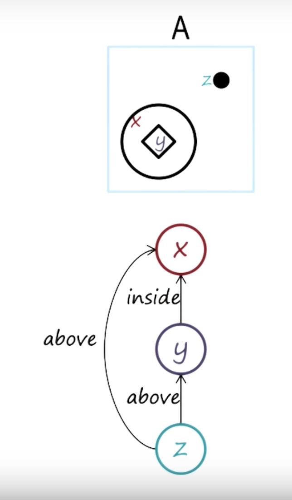
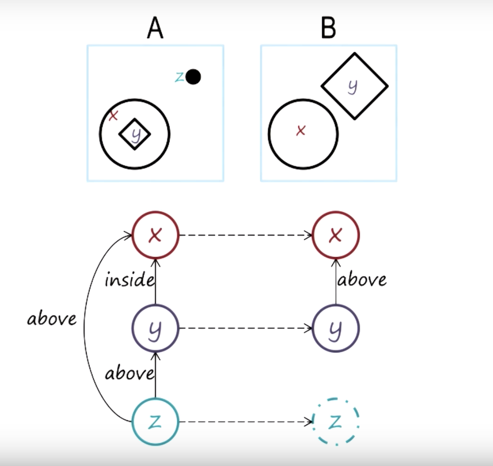

# Knowledge Based Artificial Intelligence Notes

__Knowledge based AI__ (KBAI) is a subschool of artificial intelligence whose agents use systems of reasoning,
learning, and memory to emulate human reactions. A knowledge based AI agent is one that attempts to solve "human"
problems in a "human" way (as opposed to an optimal way). KBAI agents don't necessarily act in the "real world".
KBAI itself has subschools. Here we deal with __cognitive systems__ - systems that exhibit human like intelligence
through processes like reasoning, leaning, and memory.

A KBAI agent has three major components:
- Reaction uses inputs from the world to perform some action or produce some output.
- Deliberation uses reasoning, learning, and memory to make a decision based on some inputs from the world.
- Metacognition uses external inputs to make decisions about the internal deliberation process (eg training).

# Fundamentals of KBAI

## Knowledge Representations and Semantic Networks
A __knowledge representation__ is a means of representing some idea. A knowledge representation has a __lexicon__
which defines the vocabulary of the representation language, a __structure__, and __semantics__ or a specific
vocabulary to be used in the representation. A __semantic network__ is a relatively simple knowledge
representation. A semantic network is essentially a graphical representation of the state of a problem.

For example:





In a semantic network, the lexicon is the nodes, the structure is defined by the directional edges, and the
semantics are the specific labels applied to the links. A good semantic network makes relationships between
entities explicit, exposes natural constraints, brings objects and relationships together, excludes extraneous
detail, and is transparent, concise, fast, and computable.

Notice in the above semantic networks the emphasis is on the relationships between objects as opposed to the
properties of the objects themselves. This is a fundamental pattern of cognitive system representations and leads
to a few issues - namely how do we relate objects between two states.

## Problem solving methods
We've already discussed knowledge representations and how they can be used to represent AI problems. However,
knowledge representations do not actually solve problems - they just allow us to formulate a problem in a well
defined way. We must apply __problem solving methods__ to our knowledge representations to find solutions to
problems.

- Generate and test\
  Generate and test is a very simple but powerful problem solving method.  Given a problem we generate a solution to
  the problem and test the efficacy of the solution in solving the problem. This can be a very powerful method, but
  can also be computationally expensive. If our generator and tester are dumb - ie if the generator produces too
  many possible solutions and the tester doesn't dismiss enough solutions - this method becomes computationally
  expensive.

- Means ends analysis\
  We can formulate a lot of AI problems as a set of states that the AI agent has to navigate before finding a
  solution. For example, consider the problem of moving blocks into a certain configuration - the agent views the
  world in a set of states (defined by the current block configuration) where each move generates a new state. The
  agent's goal then in picking moves is to pick the move that will make reaching the goal easier. To do this, the
  agent uses __means end analysis__ which basically means that the agent has some kind of internal representation of
  the difference between the possible next states and the goal state. The agent will then pick the next state that
  minimizes that difference. However, if means end analysis is applied poorly, it can get caught in loops or not
  find a solution - and when it finds a solution, it may not find the optimal solution.

- Problem reduction\
  __Problem reduction__ is the process of breaking down large problems into smaller subproblems and using the smaller
  results to solve the larger problem at hand.

## Cognitive Systems
A cognitive architecture is most simply characterized by the function:

$$ f:P^* \to A $$

where $P^*$ is a the set of the history of percepts and $A$ is the set of actions. This essentially means that a
cognitive agent uses a history of percepts to come up with some action. However, the architecture that makes up
this function can be extremely complex and has many layers.
1. Hardware / Implementation layer - this is the level of the machinery that is being used to execute the cognitive
   agent (eg a brain or transistor).
2. Algorithm / Symbol layer - this is the level of the lower level algorithms used to accomplish a task (eg A*
   search and semantic networks).
3. Task / Knowledge layer - this is the level of the higher order understanding of the task at play (eg pitching a
   baseball or driving a car).

We can say that the Algorithm layer is an architecture for the Task layer and the Hardware layer is an architecture
for the Algorithm layer. Furthermore we say that the Task layer provides content for the Algorithm layer and the
Algorithm layer provides content for the Hardware layer.

When designing a cognitive architecture we make a few base assumptions. Cognitive agents are:
- goal oriented
- operate in rich, complex environments
- have significant knowledge about the task at hand
- operate using symbols and abstractions
- are flexible and operate as a function of their environment
- learn from their experiences

__SOAR__ is a cognitive architecture used for deliberation and reaction. It is composed of three main memory types
which, in total, for a working memory for the agent. __Procedural memory__ is memory of how to perform specific
tasks. __Semantic memory__ deals with generalizations and creating models of the world. __Episodic memory__ is
memory of specific events.

THe procedural memory in SOAR is made up of a series of `if-then` rules. For example, a baseball playing agent
may have the following rule in it's procedural memory:

> If the goal is to Escape, I perceive fewer than 2 outs, or I perceive a runner on 1st, or I perceive no runner
on second, or I perceive no runners.

> Then suggest the goal is to get the batter out via pitching.

The antecedents (if statements) are made up of specific conditions chained together by AND and OR operators.

Sometimes, the procedural memory will return multiple possible actions - this is called an __impasse__. The SOAR
agent will use its episodic knowledge to decide between the actions. It does this using a learning technique called
__chunking__. In chunking, if the procedural memory is at an impasse, it passes the possible actions and current
features to the episodic memory. The agent searches its episodic memory for any information that may break the
impasse - for example, a similar situation may have occurred previously where one of the possible actions resulted
in a bad outcome. Once the agent has resolved the impasse they add the rule generated from chunking to the
procedural memory.

# Common Sense Reasoning
## Frames
A frame is a knowledge structure which is used to structure our understanding of a particular object, word, state,
etc. For example, we may use a frame to parse a word in a sentence:

> Angela ate lasagna

We can use a frame to understand some of the context and meaning behind this sentence. For example, we may define
a frame for the word "ate".

```
Ate
subject: Angela
object: lasagna
location:
time:
utensils:
object-is-alive: false
object-location: in-subject
subject-is-happy: true
```

As we add more detail to the sentence we can fill in more of our frame

> Angela ate lasagna last night with her dad at Olive Garden

```
Ate
subject: Angela
object: lasagna
location: Olive Garden
time: night
utensils:
object-is-alive: false
object-location: in-subject
subject-is-happy: true
```

We can make this representation more meaningful by linking frames together. For example, I may have frames for
"Person" and "Location" which can be linked to the frame for "ate" for a specific sentence.

```
Ate
subject: Person(Angela)
object: lasagna
location: Restaurant(Olive Garden)
time: night
utensils:
object-is-alive: false
object-location: in-subject
subject-is-happy: true
```

```
Person(Angela)
name: Angela
surname: Smith
```

```
Restaurant(Olive Garden)
name: Olive Garden
location: Atlanta
price: $$
```

There are three cardinal properties of frames
- Frames represent stereotypes
- Frames provide default values
- Exhibit inheritances

Frames are very much linked to the basic concepts of Object Oriented Programming.

Frames are not only used to parse sentences. They can be used to represent pretty much any knowledge representation
including semantic networks, sentences, images, etc. Looking back at Cognitive architectures, frames are
essentially the representations stored in semantic memory that are used to search procedural and episodic memory
for action selection.


## Incremental Concept Learning
Incremental concept learning is a technique for abstracting concepts out of examples. In ICL we want to figure out
if real world objects or examples fit some concept or model of an object. So we essentially want to train our agent
to generate some internal concept of an object based on a series of $(x, y)$ pairs where $x$ is an example and $y$
is its classification (whether or not it is an example of the concept we are trying to learn). The algorithm for
ICL is quite simple and is as follows:

```
Given a data point (x, y):
    if y == True:
        if x fits the current definition of the concept:
            pass
        else:
            generalize the definition of the concept based on x
    else:
        if x fits the current definition of the concept:
            specialize the definition of the concept based on x
        else:
            pass
```

In this course we can view the internal concept as a model semantic network. If an example's semantic network
matches the model, it is considered to fit the concept model. For example, given an example of an arch

```
----
----
|  |
|  |
```

We can view this as a semantic network

```
Brick B supports Brick A
Brick C supports Brick B
Brick D supports Brick B
Brick C to the left of Brick D
```

Note that the variable names assigned (eg Brick A vs B) do not matter. What matters is that each object is an
instance of Brick, and that the relative relationships between bricks holds.

Now if we are given a new example:

```
----
|  |
|  |
```

which is also an arch but does not fit the current model because there is no Brick A. So we need to modify the previous heuristic.

```
Brick B supports Brick A
Brick C supports Brick A
Brick B to the left of Brick C
```

This new model fits both the original case and the new example. This technique is called the __drop link
heuristic__ which says that if we need to generalize in such a way such that the new concept can cover both earlier
examples. This is useful when the structure of the new example and the concept definition are almost exactly the
same except for one link which is present in the current concept definition.

Now consider a new example which is NOT an arch:

```
|  |
|  |


---
```

with the semantic network:

```
Brick B to the left of Brick C
Brick A
Brick B
```

This still fits our current concept model because there are at least three bricks in the system. So we need to
specialize our model to exclude this example. Specifically we use the __require link heuristic__ which says that
if the current concept and a negative example have some things in common - but also have some differences - to
specialize the model we should make the characteristics in the current model that are different from those in the
negative example required. So now our model would be

```
Brick B must support Brick A
Brick C must support Brick A
Brick B to the left of Brick C
```

Now consider the following negative example

```
-----
 ||
 ||
```

with semantic network:

```
Brick B supports Brick A
Brick C supports Brick A
Brick B to the left of Brick C
Brick B touches Brick C
Brick C touches Brick B
```

Again this matches our model but is not an arch - so we must specialize using the __forbid link heuristic__. This
heuristic says that if a negative model differs from the current model we can forbid specific relationships in the
model. Now the model is

```
Brick B must support Brick A
Brick C must support Brick A
Brick B to the left of Brick C
Brick B must not touch Brick C
Brick C must not touch Brick B
```

Now consider the following positive example

```
<=>
| |
| |
```

which has the network:

```
Brick B supports Wedge A
Brick C supports Wedge A
Brick B to the left of Brick C
```

We can generalize our concept model to fit this example using the __enlarge set heuristic__ which allows us to
expand the objects that can fit in a position in the network.

```
Brick B must support Brick or Wedge A
Brick C must support Brick or Wedge A
Brick B to the left of Brick C
Brick B must not touch Brick C
Brick C must not touch Brick B
```

If we are using frames with inheritance we may have the relationship

```
Brick is a Block
Wedge is a Block
...
```
so rather than using __enlarge set__ we can use the __climb tree heuristic__ which allows us to use inheritance to
expand the objects that can fit in a position in the network.

```
Brick B must support Block A
Brick C must support Block A
Brick B to the left of Brick C
Brick B must not touch Brick C
Brick C must not touch Brick B
```

The __close interval heuristic__ is a heuristic that expands the range of values that are possible for a feature
in a model.

## Classification
Classification is the process of mapping features into discrete classes. Classification is quite challenging
because there are a large number of combinations of features which need to be mapped and a, potentially, large
number of classes. In KBAI we can perform classification in a couple of ways: we can use __top down
classification__ which uses a tree based classification structure to perform the classification - this
can be reduced to a decision tree, though in a more abstract sense, the tree is not usually binary. We essentially
traverse the tree top down - with the ending leaf being the predicted class. __Bottom up classification__ combines
features to produce a score at the root node which is used for classification. 

We can say that with classification we are attempting to learn a specific concept - or set of concepts. However,
not all concepts are the same. Rather there are three types of concepts.
- Axiomatic concepts are concepts defined by a formal set of necessary and sufficient conditions. These are often
  real world concepts that can be defined by formal rules. For example, a circle is defined as a set of points
  equidistant from a center point.
- Prototype concepts are base concepts defined by typical properties that can have overridden properties. For
  example we may have a concept of an "ideal chair" which can be modified slightly to fit different chairs.
- Exemplar concepts are concepts defined by implicit abstractions of instances, or exemplars, of a concept. For
  example, it may be easy to give examples of something "beautiful" but difficult to define "beauty".

## Formal Logic
__Formal logic__ is, to some extent, a different type of knowledge representation for an AI agent. An AI agent 
that uses formal logic will store knowledge in the language of formal logic and then perform inferences based on
that knowledge representation. The inferences in a formal logic system are bound by two properties: 
- __soundness__: Only valid conclusions can be proven
- __completeness__: All valid conclusions can be proven

The language of formal logic is build off of __predicates__ which are functions that map an object into a boolean
value. For example `feathers(animal) -> bool` is a predicate that returns `True` if the `animal` has feathers and
otherwise returns `False`. Predicates can create implications using basic `if/else` logic, for example:


```
if feathers(animal):
  then bird(animal)
```

can be written in the language of logic as :

```
feathers(animal) => bird(animal)
```

Here we say that `feathers(animal) == true` implies that `bird(animal) == true`. 

We can also use conjunctions (and) and disjunctions (or) to chain predicates together as well as negations (not).

Note that we can re-write implication statements to be purely boolean statements. For example, `feathers(animal) => bird(animal)` can be re-written to `not feathers(animal) or bird(animal)`.

When making inferences off of logic rules we use two major principles. __Modus Ponens__ is the basic principle that
says that if we know that `p => q`, if we know `p` we can infer that `q` is true. __Modus Tollens__ is the principle
that says that if we know that `p => q`, if we know `not q` we can infer that `p` is false. However, simply trying 
to apply modus ponens and modus tollens to solve all of our logic problems is computationally infeasable. We would 
have to construct large truth tables, traverse multiple paths, etc which is not reasonable in real time. So we 
instead use a __resolution theorem proof__. 

Consider the logic `feathers(animal) => bird(animal)`. We have already seen that we can re-write this as 
`not feathers(animal) or bird(animal)` - this is known as __conjunctive normal form__, a logical statement which 
is a AND of ORs. In a resolution theorem proof, we essentially are doing a proof by contradiction - we assume the 
opposite of what we are trying to proove and attempt to eliminate clauses that generate contradictions.

```
S1: not feathers(animal) or bird(animal)
S2: feathers(animal)
S3: not bird(animal)

S1: not feathers(animal) or [ x bird(animal) ]
S2: feathers(animal)
S3: [ x not bird(animal) ]

S1: [ x not feathers(animal)]  or [ x bird(animal) ]
S2: [ x feathers(animal) ]
S3: [ x not bird(animal) ]

Therefore, the animal must be a bird
```

## Planning
In __planning__ we use algorithms and heuristics to figure out which actions our agent should take to reach a 
specific end state. In this class, we write our states in the language of formal logic (or porpositional logic).
We define actions as a tuple `A: (precondition, postcondition)` where `precondition` is the state before the action
is taken and the `postcondition` is the state after the action is taken. 

One very simple way to go about planning is by using a very basic state space, tree search algorithm. However, this
can be computationally inefficient. Additionally, oftentimes sub-goals within a problem may "clobber" each other - 
that is, in trying to achieve a sub-goal, the agent makes it more difficult to solve the main goal. To solve this
problem we use __partial order planning__. In partial order planning, the agent breaks up its problem into subgoals
which it then treats independently. Then, the agent uses an algorithm to choose to solve one problem over the 
other:

```
for each precondition in the current plan:
  if the precondition for an operator in the current plan is clobbered by a state in another plan:
    promote the current plan's goal over the other plan's goal
```

When the agent is "between plans" it may be in a state that doesn't match the beginning state for another plan. In
this case, the agent must find a path to the beginning of the second plan.

__Hierarchical planning__ is a planning technique where we conglomerat multiple operators into one operator to 
simplify the state space. In hierarchical planning, operators are tuples `A: (precondition, postcondition, methods)`. 


## Understanding
__Understanding__ is the principle of developing frames with a more defined and useful structure. In this calss we
focus on __thematic role frames__ which are frames built on gramer. For example: given the sentence "Amy planted 
the seed" we can develop the frame

```
Thematic role
subject: Amy
object: seed
verb: planted
```

which gives us a semantic understanding of the sentence. 

One of the more difficult problems with understanding is disambiguating a word or concept with multiple meanings.
We can use these thematic role frames to help solve this problem by maintaining expected frames for the word for
each meaning and picking the meaning that makes the most sense. 

## Common Sense Reasoning
__Common sense reasoning__ is the process of coming to decisions or performing actions in a way that "makes sense"
from a logicl or human perspective. 

__Primitive actions__ are "base classes" for actions. For examples "eat", "devour", and "consume" are all examples
of "ingesting" so we can say that all of these examples are part of the primitive action "ingest". There are, 
generally speaking, fourteen, primitive actions:
- move body part
- expel
- propel
- see
- smell
- move posession
- think about
- move object
- ingest
- speak
- hear
- feel
- move concept
- conclude

Each primitive action has an associated frame with states, preconditions, postconditions, etc. Specifically, 
we can write __action frames__ which are similar to thematic role frames to represent stories using primitive
actions. Within an action frame, an agent can also keep track of sub-actions that composed that action in a smaller
action frame. Action frames can also keep track of state changes in a "result" field which would point to a 
specific state change frame. Action frames can also be used to represent stories with multiple actions.

> I said Amy planted the seed

could be represented as

```
|-------------------|      |---------------------------|
| Action frame      |      | Action frame              |
| Agent: I          |      | Agent: Amy                |
| Primitive: Speak  |      | Primitive: move object    |
| Result: ----------|----> | Object: Seed              |
|-------------------|      |---------------------------|
```

__For a more comprehensive discussion of frames and common sense reasoning check out [this lecture](http://courses.csail.mit.edu/6.034f/ai3/ch10.pdf) from MIT.__

## Scripts
__Scripts__ are a knowledge representation used to understand stories and discourses. Specifically, scripts capture
causally coherent events. A script has:
- Entry conditions: the conditions that need to be true to start the script
- Result: the conditions that will be true after the script has taken place
- Props: the objects involved in the execution of the script
- Roles: the agents involved in the execution of the script
- Track: variations or subclasses of the script
- Scenes: specific sequences of events that occur during execution of the script

The scenes are essentially chained action frames using the roles and props and primitive actions in its parameters.
Scripts can also be used to generate expectations and understand when things are not going as they should. 

## Version Spaces
__Version spaces__ is another method of incremental learning. It attempts to overcome the issues in incremental
concept learning - which requires examples to be presented in a good order with the correct background knowledge. 
In version spaces we maintain a "general model" and a "specific model". Given a new example, if it is a positive 
example, we want to generalize the specific model - if it is a negative example, we want to specialize the 
general model. Eventually, we expect the two models to converge which is the solution concept. 

The first presented example should for the basis for the most specific and most general model - so, for example,
if we are presented with 

```
A: True
B: False
```
as a positive example of Foo, we would generate two models for Foo:

```
Specific
A: True
B: False

General
A: any
B: any
```

The general version spaces algorithm is:

```
For each example:
  if the example is positive:
    generalize all specific models to include it
    prune away general models that cannot include it
  if the example is negative:
    specialize all general models to include it
    prune away specific models that cannot include it
  prune away any models subsumed by other models
```


# Analogical Reasoning

## Learning by recording cases
__Learning by recording cases__ is a very simple learning method where we use the most similar examples from memory
to solve a problem. Essentially given new problem A, we search prior problems to find prior problem B which is most
similar to A. Then we use the solution of B as the solution to A. Using this approach is predicated on being able
to measure the similarity between two problems. This can be done in a very simple way if we define each problem
by a set of points (based on the features inherent in the problem) and use the euclidean distance formula to
find the distance between any two points:

$$d = \sqrt{\sum_{i=1}^{k}(b_i - p_i)^2}$$

This similarity metric is called the K-nearest-neighbor technique and can be used to find the similarity between
different objects.

## Case based reasoning
Case based reasoning is a learning method similar to learning by recording cases. In __case based reasoning__, the
agent adapts similar prior problems to attempt to fit the current problem. Case based reasoning has four steps:
1. Retrieves the case in memory that is similar to the current problem
2. Adapts the solution to fit the current problem
3. Evaluates how well the adapted solution fits the current problem
4. Stores the newly adapted problem as a new problem, solution pair.

Case based reasoning only works based on some assumptions. Specifically, it assumes that patterns exist in the
world and the same kinds of problems are often repeated. It also assumes that similar problems have similar
solutions.

We can perform case based adaptation in a few ways. For example, consider the problem of traveling from point
A to point C where the agent only knows how to travel from point A to point B.
- Using a model based approach, the agent can adapt the solution of traveling from point A to B by using a search
  algorithm to find the path from B to C and combining that with the solution to the earlier problem (traveling
  from point A to B) to solve the problem of traveling from point A to C.
- Using a recursive approach, the agent can split the problem into sub problems which each are passed separately
  into the case based reasoning system. The solutions are combined to provide the solution to the overall problem.
  For example, we would split traveling from point A to C into two problems - one traveling from point A to point
  B and one traveling from point B to point C. We then pass both of these problems through the case based reasoning
  system again and combine the solutions to find the overall solution to the problem of traveling from point A to
  C.
- Using a heuristic or rule approach, the agent applies a set of rules to adapt old problems to new problems. For
  example to go from C to A we may use the heuristic that says to reverse a path we need to reverse all of the
  turns in the path. This heuristic works most of the time, but in some real world scenarios the heuristic may not
  be valid.

To evaluate a potential case based solution we often will either attempt to execute the potential solution in the
real world or simulate it in a simulated environment. To store problems in case storage we need to create an
indexing scheme based on the important features of the problem. We can either do this using features of the
problems as indices into a map, by using a decision tree to find similar problems, etc.

## Explanation Based Learning
__Explanation based learning__ is a learning method that uses prior knowledge to learn concepts and characteristics
of objects. In explanation based learning, out prior knowledge is composed of semantic network like models where
relationships also have causality. So a relationship like "glass enables drinking" will also be linked to 
"glass is concave". In explanation based reasoning we essentially chain prior knowledge representations and 
components together to learn different concept definitions. 

## Analogical reasoning
__Analogical reasoning__ is the concept of using an analogy as part of reasoning - ie using similarities in 
situations or systems to solve problems. When using analogical reasoning, we need to be able to determine some
similarity metric between problems. Generally we want to determine how similar two problems are with respect to
relationships, objects, features, and values

Relationships | Objects | Features | Values | Strategy
--------------|---------|----------|--------|------------------------------
Y             | Y       | Y        | Y      | Learning by recording cases
Y             | Y       | Y        | N      | Case based reasoning
Y             | Y       | N        | N      | Case based reasoning
Y             | N       | N        | N      | Analogical reasoning

when we use analogical reasoning we are usually look at "cross-domain" problems. This means that the two problems 
are not really part of the same domain, but they are still related enough that we can draw some conclusions from
the similarity. In general, analogical reasoning allows us to draw conclusions about new problems from familiar 
problems. The analogical reasoning process is made up of retrieval, mapping, transfer, evaluation, and storage.

When considering the similarity of problems we care about simple similarity - eg the similarity of the objects,
features, and values in the problems, and deep similarity - eg the similarity between the relationships and the 
relationships of the relationships in the problems. There are three major types of similarity: 
- semantic similarity is the conceptual similarity between the target problem and source
- pragmatic similarity is the similarity of external factors, such as the end goals
- structural similarity is the similarity of the representational structures

When mapping problems, the agent must use higher order relationships between internal objects to determine the 
correct mapping - otherwise we end up with an M to N mapping of objects which is computationally intractable. 
Once we have the solution of the sample problem, we can use the mapping defined above to transfer the strategy 
to the source problem. The solution must be evaluated either by doing a simulation or by some other means. Once
the solution has been validated, it can be stored in storage as another case. 

## Design
__Constraint propogation__ is a method of inference that assigns values to variables such that some global constraints
are satisfied. Generally, with constraint propogation we hvae some set of constraints which we attempt to fit to some
data - we essentially try to pick solutions which best fit the constraints. 

__Configuration__ is a process that assigns values to variables based on a set of constraints. In the configuration
process the agent reads the constraints, comes up with an abstract idea of what it should build, uses some assumptions
to come up with values for the variables, and refines the design based on the constraints. 

__Diagnosis__ is the process of identifying faults in a system. We can think of diagnosis as mapping from a data space 
to a hypothesis space. There are a few problems with this view - for example, one data point can map to multiple 
hypothesis, multipe hyothesis can explain a single data point, some hypothesis can be mutually exclusive, some data
points can cancel each other out. We can also use __abduction__ to figure out hypothesis - in abduction, given a rule
(eg John hates Bill), if we known an effect, we can abduce a cause. So if the rule is that John htates Bill, and we
observe that John left a party we can abduce that Bill must have arrived. When using abduction or classification to develop a hypothesis, we want to have hypothesisi cover as much of the data as possible, we want to use the smallest number of hypothesis possible, and some hypothesis may be more likely than others. 


## Meta Reasoning
__Learning by correcting mistakes__ is a process where agents can learn from their mistakes to improve their 
performance. Generally speaking, to detect where an error comes from, we want to isolate the features that 
characterize a misidentified example - we call these __fault suspicious features__. The agent must use additional 
examples to determine which of the fault suspicious features are responsible for the error. 