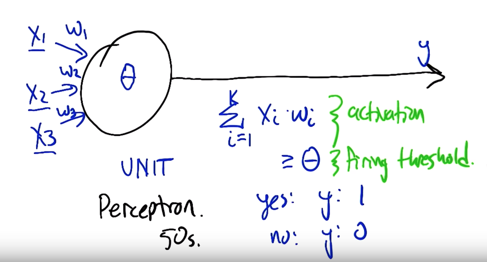
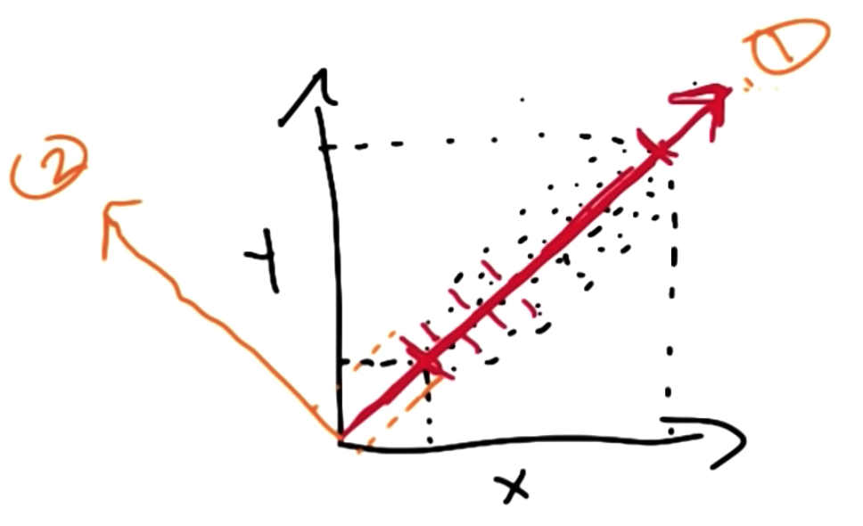

# Machine Learning

# Supervised Learning

**Supervised learning** is a class of machine learning algorithms which uses a set of known examples to
come up with a mechanism to predict something about unknown examples. A supervised learning algorithm is
trained using a pre-labeled training set and uses that knowledge to make predictions about data that wasn't
in the training set.

Basic definitions:
- **Classification** is the process of taking some input $X$ and mapping it to some discrete label - for example
  identifying a disease based on a chest x ray image or MRI.
- **Regression** is the process of mapping some input $X$ to a real number value - for example predicting home
  prices.
- **Instances** are vectors of values that define the input space of a problem.
- **Concept** is an idealized function that maps from the input space to an output.
- **Target concept** is the concept that our algorithm is trying to achieve.
- **Hypothesis class** is all of the functions were are willing to consider as a target concept.
- **Sample** (aka training set) is a set of all inputs paired with a correct output.
- **Candidate** is a concept that might be the target concept
- **Testing set** is a set of inputs paired with a correct output which is not included in the training set.
- **Cross validation** is a method of training a machine learning model which attempts to get the best performing,
  general model. We hold out some of the training set as a stand in for the test data to determine how well our
  algorithm performs on unseen data. The general process is to split the data into K folds. Then we train $K - 1$
  folds and use the extra fold for validation. We can use different combinations of $K - 1$ folds to train
  different versions of the model, tune hyperparameters, etc.

## Decision Trees

A **decision tree** is a very simple type of machine learning algorithm which is used to classify samples.

```
                 O
            /         \
          O            O
        / | \        / | \
      [] []  []     [] [] []
```

Each `O` node is a decision point which splits the samples based on a specific feature. The `[]` nodes represent
classifications based on the samples which those particular feature sets. Consider the tree:

```
                 O
            /         \          f0  left x = 0, right x = 1
          O            O
        / | \        / | \       f1  left x = 0, mid x = 1, right x = 2
     [1] [2] [3]  [4] [5] [6]
```

Then `[1]` would have all samples with features `[0, 0, ...]`, `[4]` would have all samples with features
`[1, 0, ...]`, etc. The number of levels of a decision tree do not need to match the number of features in the
samples - the input `[0, 2, 1, 3, 4]` would be at node `[3]` in the decision tree above. Each of those nodes would
then correspond to a class - so classifying a sample is as simple as finding the matching leaf in the decision tree
and returning the associated class.

### Constructing Decision Trees (ID3 Algorithm)

Decision trees are very useful classification tools, but they need to be constructed carefully because they can be
very space inefficient. A "naive" decision trees for an N-feature boolean problem could take $O(2^{2^N})$ space which is computationally infeasible.

The general algorithm behind constructing a decision tree given a testing set is known as **ID3**. The basic
idea is for a particular set of sample data:
1. Select the *best* attribute.
2. Split the samples by the attribute.
3. Repeat for the sample subsets until the sample subset is "pure" (ie all the samples in the subsets are of the
   same class) or for some predetermined set of iterations.

Or in code:

```Python
def id3(node, samples):
    if is_pure(samples):
        # if all the samples have the same label
        node.label = get_label(samples)
        return node
    elif should_stop(node):
        # if an external stopping criteria is met
        node.label = get_majority_label(samples)
        return node

    # get the most informative attribute based on the samples
    attr = best_attribute(samples)
    node.decision_attr = attr
    for val in possible_values(attr):
        # for each value of the attribute create a new child node
        node.children.append(Node(), get_samples_where(samples, attr=attr, val=val))
    return node
```

Determining the "best" attribute is a bit tricky and there are a few ways to determine it. Generally speaking,
the "best" attribute is defined as the attribute which is the most "informative" or which allows us
to split the samples into "more pure" groups.

Note that this algorithm has a `should_stop` check which terminates the algorithm based on some external condition
and sets the leaf node to the most common label in the samples at that node. This stopping criterian is most
commonly based on a maximum depth parameter on the tree.

**Information gain** is a means of determining the most informative feature and is defined as:

$$gain(S, A) = entropy(S) - \sum_{v \in values(A)}{\frac{|S^{A}_v|}{|S|} entropy(S^{A}_{v})}$$

where **entropy** is a function which defines the randomness of a sample set.

$$entropy(S) = -\sum_{v \in values(S)}{p(v)\log{p(v)}}$$

and $S^{A}_v$ is the set of samples where the feature $A$ has value $v$.

Note here that the expression $p(v)\log{p(v)}$ gets more negative as $p(v) \to 0$ since $\lim_{x \to 0}{\log(x)} =
-\infty$. So a large number of possible values with a small probability of each value would result in a large
overall entropy value (since each item in the sum would be large and negative). But a small set of items where
the probabilities are more consolidated would result in a small entropy value. In other words, low entropy means
the samples are more "pure" whereas high entropy means that the samples are more intermixed.


So $gain(S, A)$ essentially gives us the difference between the current entropy of the system and the expected
entropy after splitting over the value $A$. So the "best" feature is defined as the one where splitting resulted in
the highest information gain (since we want the expected entropy to be low).

ID3 generally has a bias towards generating trees with
- "Good" splits near the root
- Reasonably correct classifications (of the training data)
- Shorter trees (which is a product of the good splits near the root)

If the attributes are continuous we have to do some modifications - there are a lot of different ways to handle
continuous attributes for example defining ranges of values. For discrete valued attributes, an individual attribute
should only appear once in a path to a leaf. For continuous valued attributes, an individual attribute can appear
multiple times on a path to a leaf if the split criteria is different.

It is very easy for decision trees to overfit to training data - in decision trees overfitting happens when we
create too complex of a tree based on the training data. We can avoid this in a few ways.
- Use cross validation to create the trees by generating a bunch of trees on different "folds" of training data and
  selecting the tree that performed best on the "validation set".
- Check the tree against a validation set before every new expansion and stop the tree construction once the
  validation accuracy has hit a specific target.
- Prune the tree after creation.

We can also use decision trees for regression problems though we need to handle the leaves in a different way -
perhaps by using the average of the values at the leaves. We also may need to redefined our sense of purity to
include values that are similar to each other as opposed to strict equality.

## Linear Regression

In classification problems we're trying to group data into distinct buckets based on features. However, in a
regression problem we are more trying to come up with a continuous function which can map the features of a sample
to the output value.

Linear regression, is a method of regression where we try to fit a linear function (in 2 or more dimensions) to
a set of points.


We can actually solve this problem analytically using calculus by defining an **error function** which describes
the error between our ideal function and the sample points, then finding the parameters of the ideal function
which minimizes that error function.

So given $error(W, X, Y)$ we want to find $w' = W$ which minimizes $error$ for a fixed set of samples $X, Y$.
A very common error function is known as the **sum of least squares error function** which is defined as:

$$E(W) = \sum_{i}^{N}{(y_{i} - f(W, x_i))^2}$$

where $f(W, x_i)$ is the function we want to come up with. In linear regression, $f(W, x_i)$ is a linear function
of the form $f(x_i) = W^T x_i$. where
$W$ and $x_i$ are of length $M$ (so $W^T x_i$ is really the dot product between $W$ and $x_i$)

$$E(W) = \sum_{i}^{N}{(y_{i} - W^T x_i)^2}$$
$$\frac{\delta E}{\delta W} = \sum_{i}^{N}{2 x_i^{T} (y_{i} - W^{T} x_i)} = 0$$
$$\sum_{i}^{N}{x_i^{T} y_i} = W \sum_{i}^{N}x_i^{T}  x_i$$

Now this requires some linear algebra knowledge. We can simplify this expression by operating over the entire
matrix at once. Note that if $A$ is $N \times M$ and $B$ is $M \times 1$ then:

$$\sum{a^T b} = A^T B$$

So our equation becomes:

$$X^{T}Y = X^{T}XW$$
$$W = (X^{T}X)^{-1}X^{T}Y$$

which is quite easy for a computer to solve.

Our fit function doesn't necessarily need to be a linear function though. We can choose any kind of function as
the $f(x_i)$ and find the optimal parameters by solving for the set of parameters $W$. This can be generally done
by taking our training data, transforming it into some matrix $X$ - this can just be the data or can be some
function of the data like $x_i = [c_i, x_{i}, x_{i}^2]$ (for one dimensional samples).

## Neural Networks

A **neural network** is a class of machine learning models which attempts to use a system analogous to neurons in
the brain to learn from data.

### Perceptron

Neural networks are built off of a very simple unit called a perceptron. A perceptron is a function that models
a very simple neuron.


A neuron receives input through signals at the "dendrites" - those inputs are weighted and combined together and,
if the aggregate input reaches a certain activation threshold, the neuron fires an action potential which sends
a neurotransmitter to other neurons. Essentially, a neuron is a function which takes the weighted sum of its inputs
and passes that to a unit activation function.



A perceptron follows the idea of a neuron. Given some input $x$, a perceptron with parameters $W$ and threshold
$\theta$ is the function:

$$f(x) =
    \begin{cases}
        1 \ &\text{if}\ \ W^{T} x > \theta\\
        0 &
    \end{cases}
$$

We see that perceptrons are able to create a linear hyperplane. This means that a perceptron can classify some
simple functions

like boolean AND:

```
 |
 |
 o \  x
 |   \
 o----o\-----
```
boolean OR:

```
 |
 |
 x    x
 |\
 o--\-x-----
```

boolean NOT:

```
         |
-----x---|---o------

```

However, it can't classify non-linear functions like boolean XOR:

```
 |
 |
 x    o
 |
 o----x-----
```

To solve these kinds of problems we can use a network of perceptrons:

```
x1----------w1----------
   \                   \
    ====== ( AND )--w3--- ( ) -->
   /                   /
x2----------w2---------

w1 = 1
w2 = 1
w3 = -2
```

### Training perceptrons

The **perceptron rule** for training perceptrons is very simple. We know that we can calculate:

$$\hat{y} = W^T x \geq 0$$

Note here that we have folded the threshold parameter $\theta$ into the weight vector $W$. We do this by appending
a "bias term" of 1 to each sample in $X$ (which then adds a corresponding weight parameter). That parameter is
subtracted over to serve as $\theta$.

Then for every sample $x_i$ we say that:

$$\Delta W_i = \eta (y_i - \hat{y_i})x_i$$

Then we update $W$:

$$W_{new} = W + \Delta W_i$$

If the data is linearly separable - meaning if there exists a line which can split the data, this algorithm will
always find a dividing line. However, if the data is not linearly separable, this algorithm will run forever.

We can also use **gradient descent** to train our perceptrons. In this method we use the sum of least squared
error between the activation value of the perceptron and the expected class:

$$E(x) = \frac{1}{2} \sum{(y_{i} - W^T x_i)^2}$$

We use the activation value instead of the "actual output" of the perceptron because the step function is not
differentiable whereas the activation value is differentiable.

$$\frac{\delta E}{\delta W} = \sum{(y_{i} - W^T x_{i})x_{i}}$$

So then our update rule is

$$\Delta W_{i} = \eta (y_{i} - W^T x_{i})x_{i}$$

The update rules for these two approaches are very similar, but the gradient descent method is more robust against
non-linearly separable data.

### Sigmoid Function

One problem with the gradient rule for training perceptrons is that the actual output of a perceptron is not a
differentiable function since the step function is not differentiable. So we have to use the activation value
instead which is not optimal. To solve this problem can use the **sigmoid** function instead of a step activation
function to model perceptrons.

$$\sigma(x) = \frac{1}{1 + e^{-x}}$$

The sigmoid has the property that $\lim_{x \to -\infty}{\sigma(x)} = 0$ and
$\lim_{x \to \infty}{\sigma(x)} = 1$. Around 0, there is an inflection point where the function quickly changes
from $~0$ to $~1$. This makes the sigmoid function a differentiable alternative to using a unit step function.


Note that:

$$\frac{d \sigma}{dx} = \sigma(x) (1 - \sigma(x))$$

### Multilayer perceptrons

A neural network is a network of perceptrons typically arranged in a uniform multilayer pattern where each layer's
outputs feeds into the next layer's inputs.


The input and output layers are exposed to the "world" and the rest of the layers are known as hidden layers. Each
unit in the neural network is a perceptron who's activation is gated using a non-linear differentiable function -
typically the sigmoid function, RELU, TANU, etc. Thus we can actually represent an entire neural network (even
an immensely complicated one) as a differentiable function and use that derivative to update the weights on each
individual perceptron.

**Backpropogation** is an algorithm which uses the chain rule to more easily compute the derivatives of the units
in the neural network. The general idea behind backpropogation is this:

Consider a perceptron unit $j$ in the neural network. We then define $z_i$ as the inputs from a unit in the
previous layer to $j$, and $w_{j,i}$ as the weight on the link between $i$ and $j$.

Then:

$$a_j = \sum_{i} w_{j,i} z_{i}$$

and

$$z_j = h(a_j)$$

```
        w_j1,i1
( i1 ) ----------
        w_j1,i2   \
( i2 ) ----------- ( j1 ) -------- (k1)
        w_j1,i3  /               /
( i3 )----------   ( j2 ) ------
```

To update an individual weight parameter in the neural network $w_{j,i}$ we need to find
$\frac{\delta E}{\delta w_{j,i}}$ where $E$ is the overall error of the network. From the chain rule we can
say that:

$$\frac{\delta E}{\delta w_{j,i}} = \frac{\delta E}{\delta a_{j}} \frac{\delta a_{j}}{\delta w_{j,i}}$$

Since $a_{j} = \sum_{i}{w_{j,i} z_{i}}$:

$$\frac{\delta a_{j}}{\delta w_{j,i}} = z_{i}$$

And since $z_{j} = h(a_{j})$:

$$\frac{\delta z_{j}}{\delta a_{j}} = h'(a_{j})$$

Let us define

$$\frac{\delta E}{\delta a_{j}} = \delta_{j}$$

Note that the error at node $j$ can decomposed across the nodes $k \in K$ that $j$ sends its outputs too. So we
can use the chain rule again to find that:

$$\delta_{j} = \sum_{k}{\frac{\delta E}{\delta a_{k}} \frac{\delta a_{k}}{\delta a_{j}}}$$

Note that:

$$\frac{\delta E}{\delta a_{k}} = \delta_{k}$$

And:

$$a_{k} = \sum_{j} w_{k,j} z_{j} = \sum_{j} w_{k,j} h(a_{j})$$

So:

$$\frac{\delta a_{k}}{\delta a_{j}} = h'(a_{j}) w_{k,j}$$

And finally:

$$\delta_{j} = h'(a_{j}) \sum_{k}{(w_{k,j} \delta_{k})}$$

And:

$$\frac{\delta E}{\delta w_{j,i}} = z_{j} \delta_{j}$$

$$\frac{\delta E}{\delta w_{j,i}} = z_{j} h'(a_{j}) \sum_{k}{(w_{k,j} \delta_{k})}$$

This may look a bit messy, but it's actually quite elegant when considered recursively. Note that for the
output nodes we can say that $\delta_{out} = \hat{y} - y$. So to make a neural network update we essentially
follow a forward / backward algorithm

1. Get the prediction for the network. In the process keep track of the inputs $z$ for every node.
2. Calculate the error at the output node $\delta_{n} = \hat{y} - y$.
3. For every layer starting from $n-1$ calculate the weight update using $\delta_k$ values from the previous layer.
4. Update the weights using $w_{j,i}' = w_{j, i} + \eta \frac{\delta E}{\delta w_{j,i}}$

### Neural network optimizations

With backpropogation and powerful computers it's very easy to design complicated neural networks that (in theory)
can learn very complicated functions. And while we can do gradient descent and backpropagation to train network,
gradient descent can get stuck in local minima so we can use different optimization techniques like using momentum
terms, calculating higher order derivatives, using randomized optimization algorithms, and adding regularization
parameters to penalize complexity.

## Instance based learning (kNN)

**Instance based learning** algorithms are algorithms that "memorize" the training data and, when presented with
a new sample, use only the training data it's memorized to make an inference about the new sample's output value.

The **K Nearest Neighbors** algorithm is a very simple, but power instance based learning algorithm. This algorithm
takes in the training data and when presented with a test sample, uses the value of the $k$ "nearest" (where
nearness is defined by some similarity function) neighbors to infer the value of the test sample. In classification
problems, the output class is often determined by a majority vote of the $k$ neighbors whereas in regression
problems the output value may be based on the mean or median of the neighbors.

This kNN algorithm is very simple, but a lot of that is because it leaves a lot up to the designer. The designer
chooses the value for $k$, the similarity function used, and the way in which the neighbors vote on the output
class or value for a point.

Note that kNN is a **lazy** learning algorithm. This means that it only does work when it has to. "Training" is a
constant time operation since it just has to memorize a set number of data points, but the real work happens on
query time. This is different from other algorithms like decision trees and neural networks which are **eager**
learners - they frontload the work at training time, but queries take little to no work.

kNN has a very specific preference bias. kNN assumes that locality implies similarity, regression
functions are smooth, and that each feature is equally important. That last point reflects
**the curse of dimensionality**. As the number of features grow, the amount of data we need to generalize properly
grows exponentially.

There is a special case of kNN where $k=n$ (or k is the total number of training examples). That sounds like a
trivial case if we're using an average or majority vote metric for determining the output class, but if we use a
different metric like a weighted average or a weighted regression we can get some pretty interesting decision
boundaries. A **weighted regression** more generally applies some kind of regression function (linear regression,
neural network, decision tree, etc) to the $k$ nearest neighbors and uses that to determine the output for the
query point.

## Ensemble Learning - Bagging and Boosting

Consider the problem of detecting spam email. We can come up with a bunch of loose rules to help
classify if an individual email is spam. For example,
- if the email only contains an image it is likely spam
- if the email contains some "blacklist" of words it is likely spam
- if the email is from someone in your contact list it is likely not spam
- if the email is just a URL it is likely spam

Each of these rules on it's own is pretty weak - we can think of a number of reasonable, real life counterexamples
for any of these rules individually. However, each rule individually is still better than randomly guessing.

**Ensemble learning** is a set of learning algorithms which uses the aggregation of the results of an "ensemble" of
"weak" learning algorithms to come up with an output for a test sample.

The basic algorithm is:
1. Learn over a subset of the data and generate a "rule"
2. repeat step 1 for a set number of iterations
3. Combine the generated rules into a more complex rule

This algorithm is quite straightforward though we need to decide how we pick subsets of the data, what kind of
learner we use to generate a rule, and how we want to combine the rules together. And generally we find that
if we do this right, using ensemble learning with less complex (or weak) learners performs better on validation
and testing sets than a single complex learner.

**Bagging** is an ensemble learning algorithm which randomly samples by taking uniform sized random subsets of the
data (with replacement), trains a weak learner on that subset, and combines the results by taking the mean of the
individual weak learners. This is a very simple algorithm but in practice it can work quite well.

### Boosting

**Boosting** is an ensemble learning algorithm which:
- samples by trying to learn the "hardest" examples in a given iteration
- combines results using the weighted mean.

In boosting we define error as:

$$E = P_{D}(h(x) \neq c(x))$$

Essentially error is defined as the probability that a given sample is incorrect where $D$ is a probability
distribution over the samples.

We also define a **weak learner** as an algorithm where:

$$\forall D \ P_{D}(x) \leq \frac{1}{2} - \epsilon$$

Basically a weak learner is a learner that must have an error rate that is less than 50% for any possible
probability distribution over the samples.

So the boosting algorithm is:

1. Given training set $X$, $Y$ which is a binary classification problem. Note that $y \in Y$ is in the set
   $\{ -1, 1\}$.
2. repeat for iteration $t$ until $T$
   1. construct probability distribution $D_t$. This is the distribution we will use to sample to train the weak
      learner.
   2. find a weak learner classifier $h_t(x)$ by drawing from $D_t$ with small error $P_D(h_t(x_i) = y_i)$
3. Output $H_{final}$.

We need to construct $D_t$ iteratively. $D_1$ is a uniform distribution. Then

$$D_{t + 1}(i) = \frac{D_{t}(i) \exp{(-\alpha_t y_i h_t(x_i))}}{z_t}$$

where

$$\alpha_t = \frac{1}{2}\ln{\frac{1 - \epsilon_t}{\epsilon_t}}$$

and

$$D_1 = \frac{1}{n} \ \text{where} \ n = |X|$$

Note that $h_t(x_i)$ and $y_i$ can either be $1$ or $-1$ so the expression $y_i h_t(x_i)$ is $1$ if the weak
learner was right for $x_i$ and $-1$ if the weak learner was wrong for $x_i$. And $\alpha_t$ is always a positive
number.

So if a weak learner is correct for sample $i$, the probability of selecting that sample in the next
iteration $D_{t+1}(i)$ can either stay the same or decrease. It will stay the same only if all of the other samples
in were correctly classified.

This happens because:

$$z_t = \sum_i{D_{t}(i) \exp{(-\alpha_t y_i h_t(x_i))}}$$

So if all of the samples agree, the $\exp{(-\alpha_t y_i h_t(x_i))}$ term cancels out and the probabilities remain
the same.

If any samples were not correctly classified, then $D_{t + 1}(i)$ will decrease. This makes sense
since the next iteration wants to sample the "hardest" samples and we have already found a learner than can
classify $i$.

If a weak learner is wrong for sample $i$, the probability of selecting that sample in the next iteration
$D_{t+1}(i)$ either stays the same (if all of the samples were incorrectly classified) or increase (if any samples
were correctly classified).

Then:

$$H_{final}(x) = sigm{(\sum_{t}{\alpha_{t} h_{t}(x)})}$$

So we weight each of the weak learners by how much error it has. $\lim_{\epsilon_t \to 0}{alpha_t} = \infty$ and
$\lim_{\epsilon_t \to 1}{alpha_t} = \frac{1}{2}$.

## Support Vector Machines

**Support vector machines** (SVM) are a class of machine learning classification algorithms which attempts to find
the "best" hyperplane to classify linearly separable data.

Consider the data below:
```
|
|         x  x
|   o            x
|  o  o        x
|    o
 -----------------------
```

Since this data is, clearly, linearly separable we could use a perceptron to find a line (or hyperplane in the
n-dimensional case) that classifies the points. However, the perceptron algorithm makes no guarantees about
*which* dividing hyperplane it will select based on some training data.

```
|
|        |x  x
|   o    |       x
|  o  o  |     x
|    o   |
 -----------------------
```

and

```
|
|     \   x  x
|   o   \        x
|  o  o   \    x
|    o      \
 -----------------------
```

are both completely valid hyperplanes to separate the training data. However, intuitively, it's easy to understand
that not all hyperplanes are created equal. A hyperplane which is "too close" to one class of data adds an
overfitting bias to the algorithm since it adds additional constraints based on the training data. So the "best"
hyperplane is the hyperplane that is farthest away from any of the training data.

So the SVM algorithm attempts to find a hyperplane that separates classes of the training data while also
maximizing the distance between the hyperplane and the training data points.


So consider the equation of a hyperplane:

$$y = W^{T}x + b$$

where $y$ is the classification label (either -1 or 1), $W$ are the parameters of the hyperplane, and $x$ is a
feature sample.

Then let us classify the "upper" set of samples with class 1 and the "lower" set of samples with class 0 and
define 3 parallel lines:

```
|    l2  l3
| l1 \    \
| \   \    \   +1
|  \   \    \+1  +1
| -1\   \    \   +1
 ---------------------
```

Where $l_1$ touches the "last" of the -1 samples, $l_3$ touches the "last" of the +1 samples, and l2 is the
optimal line between the classes. Now we can define these three lines as:

$$0 = W^{T}x + b$$
$$1 = W^{T}x + b$$
$$-1 = W^{T}x + b$$

And we want to find the parameters $W$ of the three lines which maximize the distance between them. Let's consider
the points $x_1$ (on $l_1$) and $x_2$ (on $l_3$) where $x_1$ and $x_2$ are on a line perpendicular to $l_1$, $l_2$,
and $l_3$

```
|    l2  l3
| l1 \    \
| \   \    x2
|  x1  \    \
|   \   \    \
 ---------------------
```

$$W^{T}x_1 + b - (W^{T}x_2 + b) = 2$$
$$W^T(x_1 - x_2) = 2$$

Then we can normalize $W$ to bring the vector into a unit sphere.

$$\frac{W^T}{||W||}(x_1 - x_2) = \frac{2}{||W||}$$

Recall that

$$||W|| = \sqrt(\sum_i{w_i^2})$$

Also note that in a hyperplane, $W$ is a vector that is perpendicular to the line defined by the hyperplane. So
the expression above tells us that the distance between $x_1$ and $x_2$ (which is what we're trying to maximize)
is $\frac{2}{||W||}$. This is known as the **margin**.

So a support vector machine attempts to classify the points correctly (minimize the error) while maximizing the
margin. In other words we want to keep:

$$y_i (W^T x_i + b) \geq 1 \ \forall i$$

while minimizing

$$\frac{2}{||W||}$$

Note that maximizing $\frac{2}{||W||}$ is the same as minimizing:

$$\frac{1}{2} ||W||^2$$

This works because $W$ is positive - so taking the reciprocals just turns the maximum point into a minimum point
and squaring just increases the magnitude of the outputs, but doesn't change the location of the extrema.

THrough quadratic programming, this optimization problem transforms into:

$$L(\alpha) = \sum_{i}{\alpha_{i}} - \frac{1}{2} \sum_{i,j}{(\alpha_i \alpha_j y_i y_j x_i^T x_j)}$$

such that

$$\alpha_i \geq 0$$

and

$$\sum_{i}{\alpha_i y_i} = 0$$

This is also know as the **dual form** of the perceptron.

Once we know the $\alpha$ parameters from the equation above we can find $W$:

$$W = \sum_{i}{a_i y_i x_i}$$

(and we can pull out $b$ by adding it as a parameter to $W$)

Note that most of the $\alpha$ parameters in this equation are going to be $0$. Really only the "support vectors" -
defined by the points close to the hyperplane - will have non-zero $\alpha$s.

Also note that $x_1^T x_2$ is the dot product of $x_1$ and $x_2$ which is (to some extent) a measure of similarity
between two vectors. So the $alpha_i \alpha_j y_i y_j x_i^T x_j$ expression is finding which points matter (based
on the $\alpha$s), determining if they are from the same class, then determining how "similar" the points are.

### The Kernel Trick

This SVM method is great for linearly separable data but completely falls apart on non-linearly separable data.
Consider data that looks like:

```
|          x
|      x   o   x
|    x   o  o    x
|   x   o    o   x
|     x   o    x
|        x  x
 -----------------------
```

This data is clearly not linearly separable, but we can see that a circular decision plane could separate this
data. And we can do that by replacing the $x_1^T x_2$ term in the SVM optimization problem with another similarity
function. We can use a higher dimensional function $\Phi(x)$ to project $x_1$ and $x_2$ into a higher dimension,
compute some similarity in that dimension, and use that.

$$w(\alpha) = \sum_{i}{\alpha_{i}} - \frac{1}{2} \sum_{i,j}{(\alpha_i \alpha_j y_i y_j \Phi(x_i)^{T} \Phi(x_j)}$$

More interestingly we don't always need to actually project $x$ into a higher dimension space. Consider

$$\Phi(x) = [x_1^2, x_2^2, \sqrt{2}x_1x_2]$$

Then:

$$\Phi(x_i)^{T} \Phi(x_j) = x_{i,1}^2 x_{j,1}^2 + 2x_{i,1} x_{j,1} x_{i,2 }x_{j,2} + x_{i,1}^2 x_{j,2}^2$$

Which can be factored into:

$$\Phi(x_i)^{T} \Phi(x_j) = (x_{i,1}x_{j,1} + x_{i,2}x_{j,2})^2$$

Which is the same as:

$$\Phi(x_i)^{T} \Phi(x_j) = (x_i^T x_j)^2$$

So we can actually do the whole higher order function without taking the time and space to project the vectors into
a higher dimensional space.

Thus we can replace that term with a **kernel function** $K$ which computes some similarity between $x_i$ and
$x_j$.

$$w(\alpha) = \sum_{i}{\alpha_{i}} - \frac{1}{2} \sum_{i,j}{(\alpha_i \alpha_j y_i y_j K(x_i, x_j)}$$

## Information THeory

**Information theory** is a subfield of mathematics which has very useful applications to computer science.
Basically, information theory provides us with a mathematical framework to determine whether input vectors are
"similar" (mutual information) and whether specific features are informative (entropy).

More generally **entropy** is defined as the amount of information encoded in a specific variable. We can say that

$$H(X) = \sum_{x}{P(x)bits(x)}$$

or that the entropy of some variable $x$ is given by the expected number of bits needed to encode $x$ for all
possible states.

$$bits(s) = \log{\frac{1}{P(s)}}$$

so:

$$H(X) = -\sum_{x}{P(x)\log{P(x)}}$$

Recall that this function has the curve:


so entropy is small if a variable is constrained (is highly likely to be in a small number of states)
and is large if the variable has a (close to) equal likelihood of being in a lot of states.

Often times we want to know how much information is encoded in multiple variables together. So we can either
calculate the entropy of the joint distribution:

$$H(X, Y) = -\sum_{x, y}{P(x, y)\log{P(x, y)}}$$

Or we can calculate the entropy of one variable conditioned on the other:

$$H(Y | X) = \sum_{x, y}{P(y | x)\log{P(y | x}}$$

This can also be seen as:

$$H(Y | X) = -\sum_{x}{P(x)H(Y|x)}$$

$$H(Y | X) = -\sum_{x}{(P(x)\sum_{y}{P(y|x)\log{P(y|x)}})}$$

From bayes rule:

$$P(y|x) = \frac{P(y,x)}{P(x)}$$

xo:

$$H(Y | X) = -\sum_{x}{\sum_{y}{P(y, x)\log{P(y|x)}}}$$

and

$$H(Y | X) = -\sum_{x, y}{P(y, x)\log{\frac{P(y, x)}{P(x)}}}$$


Note that if $x$ and $y$ are independent:
- $H(X, Y) = H(X) + H(Y)$
- $H(Y | X) = H(Y)$

Conditional independence is a very useful metric but doesn't necessarily tell us everything. For example $H(Y|X)$
could be small if $X$ highly constrains $Y$, but it could also be small if $H(Y)$ is small irrespective of $X$. So
to more accurately model the dependence between two variables we introduce **mutual information** which is defined
as:

$$I(X, Y) = H(Y) - H(Y | X)$$

so basically mutual information is a measure of the reduction in randomness of a variable when it is conditioned on
another variable. Note that if $X$ and $Y$ are independent, $I(X, Y) = 0$.

**KL Divergence** is a metric that measures the distance between two probability distributions. It is given as:

$$D(p, q) = \int{p(x)\log{\frac{p(x)}{q(x)}}}$$

Note that if the distributions are the same, the KL divergence is 0.

## Computational Learning Theory

**Computational learning theory** is a sub-field of computer science and machine learning which seeks to define
new learning problems, show why and how certain learning algorithms work, and help us understand why some problems
are fundamentally hard to solve. When thinking about learning algorithms we generally care about:
- probability of successful training: $p = 1 - \delta$
- number of samples to train on: $m$
- complexity of the hypothesis class
- accuracy to which target concept is approximated: $\epsilon$
- manner in which training examples are presented
- manner in which training examples are selected

**Computational complexity** is the amount of computational effort that is needed for a learner to converge.

**Sample complexity** is the number of training iterations needed for a learner to create a successful hypothesis.

**Mistake bounds** are the number of misclassifications a learner can make over an infinite run.

Given a true hypothesis $c \in H$, proposed hypothesis $h \in H$, training set $S \subset X$, and a
consistent hypothesis as one which produces $c(x) = h(x) for x \in S$ we define the **version space** as:

$$V(S) = \{ h \ \text{s.t.} \ h \in H \text{consistent w.r.t.} \ S\}$$

A version space is essentially the set of hypothesis in a hypothesis space which is consistent with the data given.

The **training error** of a hyporhtesis $h$ is the fraction of samples in the training set that is misclassified by
$h$. The **true error** is the fraction of samples that would be misclassified on a sample drawn from probability
distribution $D$. So true error is $error(h) = P_D(c(x) \neq h(x))$.

We also define $C$ as a concept class, $n = |H|$ as the size of a hypothesis class, $D$ as a distribution over
inputs, $0 < \epsilon \leq \frac{1}{2}$ as an error goal, and $0 < \delta \leq \frac{1}{2}$ as a certainty goal.

Then we say a concept class $C$ is **PAC learnable** by learner $L$ using hypothesis class $H$ if and only if
$L$ will, with probability $1 - \delta$, output a hypothesis $h \in H$ such that $error(h) \leq \epsilon$ in
time and samples polynomial in $\frac{1}{\epsilon}$, $\frac{1}{\delta}$, and $n$.

A version space $V$ is **epsilon exhausted** if and only if:

$$\forall h \in V(S) \ error_D (h) \leq \epsilon$$

We can then find that the number of training examples $m$ required to find a consistent hypothesis is given by:

$$m \geq \frac{1}{\epsilon} (\ln{|H|} + \ln{\frac{1}{\delta}})$$

### VC Dimensionality

**VC dimensionality** is a notion of computational learning theory which allows us to know the number of dimensions
that can be considered when classifying a hypothesis class. The VC dimensionality of $H$ is defined as
the largest set of inputs that the hypothesis class can label in all possible ways.

For example the hypothesis class $h(x) = \theta \ \text{s.t.} \ \theta \in R$. Then we can see that it's easy to
label in 1 dimension:

```
           -         |     +
-----------x-------theta----------

    -         |      +
------------theta-----x----------
```

But we can't label all possible 2d combinations `(+, +), (+, -), (-, +), (-, -)` using a single line.

```
          -           |     +
-------x----x-------theta----------

    -         |      +       +
------------theta-----x------x----

    -          |        +
-----x-------theta------x----------
```

This tells us that the VC dimensionality of this hypothesis class is $1$.

This notion of "labeling in all possible ways" is called "shattering".

In general we find the that for a hypothesis class that is represented by a d-dimensional hyperplane, the VC
dimensionality is $d+1$. This is because the VC dimensionality is given by the number of parameters in the
hypothesis class.

But not all hypothesis classes have finite VC dimensions. A hypothesis class which returns convex polygons has an
infinite VC dimension since a convex polygon can have an infinite number of sides and be pretty much any shape and
therefore label any number of points.

We can use VC dimensionality to redefine the minimum amount of data required to learn an infinitely sized
hypothesis class as:

$$m \geq \frac{1}{\epsilon} (8 VC(H) \log_{2}{\frac{13}{\epsilon}}  + 4 \log{\frac{2}{\delta}})$$

Additionally, $H$ is PAC learnable if and only if $VC(H)$ is finite.

## bayesian Learning

**Bayesian learning** is a way of learning the *most probable* hypothesis given the data and domain knowledge. Or we
want to find:

$$\argmax_h{P(h | D)}$$

**Bayes Rule** tells us that

$$P(a, b) = P(a | b) P(b)$$
and

$$P(a, b) = P(b | a) P(a)$$

So

$$P(a | b) = \frac{P(a,b)}{P(b)}$$

and

$$P(a | b) = \frac{P(b | a) P(a)}{P(b)}$$

So:

$$P(h | D) = \frac{P(D | h) P(h)}{P(D)}$$

Now:
- $P(D)$ is the **prior on the data**. So this is our *prior belief* that this data will occur. Usually this term
  is just a normalizing factor.
- $P(D | h)$ is the probability of the training data given the hypothesis. Or more usefully it is the probability
  that the hypothesis is consistent with the input data. This is a binary value since the hypothesis can be
  empirically consistent or inconsistent with the input data.
- $P(h)$ is the **prior on the hypothesis** or our belief this hypothesis will occur.

Now $P(D)$ is going to be constant for all hypothesis so we can kind of ignore it. Then if we assume that all
hypothesis are equally likely we can say that the best hypothesis is given by:

$$\argmax_{h}{P(D|h)}$$

Now recall that we defined a version space as:

$$VS(D) = \{ h \ \text{s.t.} \ h \in H \text{consistent w.r.t.} \ D\}$$

or the set of all hypothesis that are consistent with the data. And note that:

$$P(D) = \sum_{i}{P(D|h_i)P(h_i)}$$

We know that $P(D|h)$ is the probability that a hypothesis correctly classifies the data (1 if $h$ is consistend
with $D$ and 0 otherwise). And we can assume that each hypothesis is equally likely to be picked so

$$P(h) = \frac{1}{|H|}$$

So:

$$P(D) = \sum_{i}{1 \times \frac{1}{|H|}}$$

where $H$ is the hypothesis space. Now we know that there since the version space is the consistent hypothesis then
we can rewrite the equaiotn above as:

$$P(D) = \frac{|VS|}{|H|}$$

Then we know that for any consistent hypothesis

$$P(h | D) = \frac{\frac{1}{|H|}}{\frac{|VS|}{|H|}}$$

$$P(h | D) = \frac{1}{|VS|}$$

### The sum of squares error

The above ideas are great if we have a completely noise free data set. But what if we have some data where each
label has some noise attached:

$$y_i = f(x_i) + \epsilon_i \ \text{where} \ \epsilon_i = N(o, \sigma^2)$$

So the output of each datapoint is given by some hypothesis function with an additional error drawn from the normal
distribution. We know from bayes rule that we can find the best hypothesis by finding:

$$h_best = \argmax_{h}{P(h|D)} = \argmax_{h}{P(D|h)}$$

In the noise-free dataset version, $P(D|h)$ was either 0 or 1 since the hypothesis either perfectly captured the
dataset or not. But now we need to take into account the probability while taking the noise into account. We assume
that each datapoint is independent of the others. Then we can say:

$$P(D|h) = \Pi_{i} P(d_i | h)$$

And $P(d_i | h)$ is the probability that for $d_i = [x_i, y_i]$, $y_i = h(x_i) + \epsilon_i$. Since $\epsilon_i$ is
a normal distribution centered at 0, we need to find $P_{normal}(y_i - h(x_i))$ or the probability that the
difference between the hypothesis output and the actual label could have been drawn from the normal distribution.

$$h_best = \argmax_{h}{\Pi_{i}{ P_{normal}(y_i - h(x_i)}}$$

where

$$P_{normal}(x) = \frac{1}{\sqrt{2\pi \sigma^2}} \exp{(-\frac{x^2}{2\sigma^2})}$$

So

$$P_{normal}(y_i - h(x_i) = \frac{1}{\sqrt{2\pi \sigma^2}} \exp{(-\frac{(y_i - h(x_i))^2}{2\sigma^2})}$$

Then:

$$h_best = \argmax_{h}{\Pi_{i}{ \frac{1}{\sqrt{2\pi \sigma^2}} \exp{(-\frac{(y_i - h(x_i))^2}{2\sigma^2})} }}$$

Since that leading $\frac{1}{\sqrt{2\pi \sigma^2}}$ term doesn't matter for argmax we can cancel it out. And since
the argmax of a function is the same as the argmax of its log we can take the log of this function.

$$h_best = \argmax_{h}{\sum_{i}{ (-\frac{(y_i - h(x_i))^2}{2\sigma^2})} }$$

The $2\sigma^2$ term is also irrelevant for the argmax so we can drop it

$$h_best = \argmax_{h}{\sum_{i}{-(y_i - h(x_i))^2}}$$

which is the same as:

$$h_best = \argmin_{h}{\sum_{i}{(y_i - h(x_i))^2}}$$

which is the same as minimizing the sum of squares error of the data.

## Bayesian Inference

**bayesian inference** is a machine learning and AI technique which uses probabilistic, graphical models to predict
outcomes based on data. bayesian inference is unlike any other machine learning algorithm we've discussed so far
because it requires built in domain knowledge and understanding of the system at play.

Consider the following joint distribution

storm | lightning | P(storm, lightning)
------|-----------|----------------------
T     | T         | 0.25
T     | F         | 0.4
F     | T         | 0.05
F     | F         | 0.3

This is a pretty small distribution that tells us some information. But now for every new attribute we add (if it's
binary) we need to increase the amount of data we're storing exponentially - which is not computationally feasible
for complicated systems. So how do we store complicated joint distributions?

We say that two variables $X$ and $Y$ are **conditionally independent** if:

$$\forall x,y,z \ P(X=x|Y=y,Z=z) = P(X=x|Z=z)$$

Recall that in general:

$$P(X,Y) = P(X|Y)P(Y)$$

if $X$ and $Y$ are independent variables:

$$P(X,Y) = P(X)P(Y)$$

therefore:

$$P(X|Y) = P(X)$$

which is similar to the notion of conditional independence.

We can represented these joint distributions in a **bayesian Network** which is a graphical model of how the
different variables in the distribution interact. In our previous distribution, We know that $S$ and $L$ are
conditionally dependent because

$$P(S=t) = P(S=t|L=t) + P(S=t|L=f) = 0.65$$
$$P(L=t) = P(L=t|S=t) + P(L=t|S=f) = 0.35$$

If $S$ and $L$ were conditionally independent

$$P(S=t,L=t) = P(S=t)P(L=t)$$

but

$$P(S=t)P(L=t) = 0.2275$$

and

$$P(S=t,L=t) = 0.25$$

So this distribution can be represented by a graph like:

```

 (  S  ) --> (  L  )
  P(S)        P(L|S)

 ```

 where the dependence of $L$ on $S$ is noted by the edge from $S$ to $L$.

 Now consider another node $T$ where

storm | lightning  | thunder | P(storm, thunder, lightning)
------|------------|---------|-----------------------------
T     | T          | T       | 0.2
T     | F          | T       | 0.04
F     | T          | T       | 0.04
F     | F          | T       | 0.03
T     | T          | F       | 0.05
T     | F          | F       | 0.36
F     | T          | F       | 0.01
F     | F          | F       | 0.27

Note that to incorporate the new variable, we had to double the amount of information. But also note that

$$P(T=t|L=f, S=t) = \frac{P(T=t, L=f, S=t)}{P(L=f,S=t)} = \frac{0.04}{0.4} = 0.1$$
$$P(T=t|L=f, S=f) = \frac{P(T=t, L=f, S=f)}{P(L=f,S=f)} = \frac{0.03}{0.3} = 0.1$$

And in fact if we enumerate over all of the possibilities for $S$, $L$, and $T$ we find that $P(T|L,S) = $P(T|L)$
or, in other words, $T$ is conditionally independent of $S$ given $L$.

We can represent this in graphical form as

```

 (  S  ) --> (  L  ) -> (  T  )
  P(S)        P(L|S)     P(T|L)

 ```

 Note that for a set of parents $u \in U$ a node $V$ needs to store $P(V=t|U)$. So if $V$ has one parent, it only
 needs to store $P(V=t|U=t)$ and $P(V=t|U=f)$. If $V$ has two parents it needs to store $P(V=t|u_1=t, u_2=t)$,
 $P(V=t|u_1=t, u_2=f)$, $P(V=t|u_1=f, u_2=t)$, and $P(V=t|u_1=f, u_2=f)$. We call the table that each of these
 nodes stores a **conditional probability table**. Then we can calculate the joint distribution by multiplying the
 CPTs together. Note that this kind of thing only works if the bayes nets are directed, acyclic graphs (DAGs).


$$P(A,B,C,D,E) = P(A)P(B)P(C|A,B)P(D|B,C)P(E|C,D)$$

Note that a general joint distribution is of size $O(2^N)$ for $N$ variables. A Bayes net is $O(N * 2^k)$ if each
node has up to $k$ parents. Given a bayes net we can also read off how variables are related
- `(A) -> (B) <- (C)` : A and C are independent (blocking); A and C are
conditionally dependent given B
- `(A) -> (B) -> (C)` : A and C are conditionally independent given B
(blocking); A and C are dependent
- `(A) <- (B) -> (C)` : A and C are conditionally independent given B
(blocking); A and C are dependent

We can also find that the sets $A$ and $B$ of random variables are independent given set $C$ if there
exists no unblocked path from the vertices in $A$ to the vertices in $B$ if the vertices in $C$ are observed.
$A$ and $B$ are said to be D-seperated by $C$. So to determine if any vertices are independent given a set of observed
variables we simply check to see if all paths between the variables are blocked.

**Inference** is the process of finding some useful information the joint distribution from a bayes net.
Usually we want to know the "posterior probability" of some variables or the "most likely explanation".
The **Posterior Probability** of a variable $Q$ in a joint distribution is given by:

$$P(Q | E_1 = e_i, ..., E_k = e_k)$$

The **most Likely Explanation** is the most likely value for a variable $Q$ given some evidence and is given by:

$$\argmax_q P(Q = q | E_1 = e_i, ..., E_k = e_k)$$

The most common, and most brute force, method of inference is **inference by enumeration**. Given:
- Evidence variables $E_1...E_k = e_1...e_k$
- Query variables: $Q$
- Hidden variables: $H_1...H_r$

We want to calculate:

$$P(Q | e_1...e_k) = \frac{P(Q, e_1'...e_k)}{P(e_1,...,e_k)}$$
$$P(Q, e_1,...,e_k) = \sum_{h_1...h_r}{P(Q, h_1,...,h_r, e_1,...,e_k)}$$
$$P(e_1,...e_k) = \sum_{h_1...h_r}{P(e_1,...e_k,h_1,...h_r)}$$

What we are doing here is essentially taking the **margin** (or summing over) all of the "hidden" variables (or
variables that aren't part of the provided query and evidence).

For example, consider the bayesian network above. If we wanted to calculate $P(E=t|B=t,C=f)$ we would treat $B$ and
$C$ as our evidence variables, $A$ and $D$ as our hidden variables, and $E$ as the query variable. Then:

$$P(E=t|B=t,C=f) = \frac{
  \sum_{a}^{A}{\sum_{d}^{D}{P(E=t|C=f,D=d)P(D=d|P(B=t,C=f)P(C=f|A=a,B=t)P(A=a)P(B=b))}}
}
{
  \sum_{e}^{E}{\sum_{a}^{A}{\sum_{d}^{D}{P(E=e|C=f,D=d)P(D=d|P(B=t,C=f)P(C=f|A=a,B=t)P(A=a)P(B=b))}}}
}$$

This is clearly extremely inefficient - in fact, inference in bayes nets is an NP hard problem. However, we can
still use a few tricks to make bayes nets useful in machine learning.

### Naive Bayes

**Naive Bayes** is a relatively simple algorithm which uses a simple bayesian network to make predictions. The
bayes net is of the structure:

```
              ( x_1 )
            / ( x_2 )
( output ) --   ...
            \
              ( x_n )
```

All of the features are conditionally independent of each other.

$$P(output=y | X) = \frac{P(output, X)}{P(X)}$$
$$P(output=y | X) = \frac{P(X|output=y)P(output=y)}{P(X)}$$
$$P(output=y | X) = \frac{\Pi_{i}{P(x_i=v_i|output=y)P(output=y)}}{P(X)}$$

We can train this network by treating each feature in the data as an independent, counting the number of times
it appears with the different output values, using the counts the construct the CPT $P(x_i | output)$, then using
that bayesian network to calculate the probability that a test input has a specific output.

Naive bayes is a very simple algorithm, and despite the fact that the assumption it makes about feature
independence, it actually works very well in practice. This is true because in practice, we use this for
classification and so there is room for error in terms of the actual probabilities - so even if the naive bayes
network doesn't perfectly model the joint distribution, it's close enough to work for classification.

# Unsupervised Learning

**Unsupervised learning** is a completely different type of machine learning which attempts to make some sense of
completely unrelated data. Essentially unsupervised learning is attempting to describe the data you have whereas
supervised learning attempts to find some function to match your already described data.

## Randomized Optimization

**Randomized optimization** (RO) is the process of using randomized algorithms to find the maximum of a fitness
function. This is particularly important if your fitness function cannot be solved analytically (ie if it doesn't
have a derivative or the derivative is difficult to find).

Given an input space $X$ and a fitness function $f(z)$ we want to find $x'$ where

$$x' = \argmax_{x \in X}{(f(x))}$$

This is a relatively simple and intuitive idea across many disciplines. We may need to do this kind of optimization
to tune parameters for chemical or biological processes, find routes, find functional solutions or roots, tune
hyperparameters for machine learning algorithms, tune weights for machine learning algorithms, etc.

### Hill climbing

**Hill climbing** is one of hte simplest RO algorithms.
1. Pick a random point $x \in X$.
2. Select two points within a "neighborhood" around $x$ - $N(x)$.
3. Let $x' = argmax_{z \in N(x)}{(f(z))}$
4. If $f(x') <= f(x)$, terminate. Otherwise set $x = x'$ and repeat from step 2.

This algorithm is very simple but has some clear drawbacks - specifically it is very easy for this algorithm to
get caught in local maxima.

**Random restart hill climbing** is a slight modification of hte standard hill climbing algorithm which attempts to
make hill climbing more robust against local maxima.
1. For i in range(N)
   1. Let x = the result of hill climbing
   2. If x > the best maximum currently found, update the best maximum

This algorithm is more robust against local maxima since we perform hill climbing from multiple places throughout
the input space. While obviously we cannot guarantee that we will hit the global maximum, we can be more certain
that the maximum we find after performing a series of random hill climbings is, at worst, a high local maximum.

### Simulated Annealing

**Simulated annealing** is an RO algorithm which attempts to solve the local maxima problem by allowing the
algorithm to "explore" sub-optimal paths in the hopes of finding a global maximum.

1. For a finite set of iterations
2. Sample a point $x' = N(x)$
3. Jump to the new point $x'$ based on a probability function $P(x', x, T)$
4. Decrease the "temperature" $T$

The probability function is piecewise:
$$P(x', x', T) =
\begin{cases}
    1&\ \text{if } f(x') \geq f(x)\\
    e^{\frac{f(x') - f(x)}{T}}&
\end{cases}
$$

This means that if the newly sampled point $x'$ is better than the old point, we should always jump to it. However,
if $x'$ is worse than the old point we should jump based on $P(x', x, T) = e^{\frac{f(x') - f(x)}{T}}$. This
function has a couple of very interesting properties.
- The numerator means that $P(x', x, T) \to 1$ as $f(x') \to f(x)$. This means that the probability of jumping is
  higher if the new point is "not so bad" (ie not much worse than the old point).
- The denominator means that $P(x', x, T) \to 0$ as $T \to 0$. This means that as we keep iterating (and $T$ keeps
  decreasing), the probability of jumping to bad points decreases. So as $T \to \infty$ simulated annealing acts as
  a random walk, and as $T \to 0$ it behaves like hill climbing. In our algorithm generally want to decrease $T$
  slowly so that we can let the algorithm find the best paths.

Simulated annealing has the interesting property that the probability of the simulatd annealing algorithm ending at
some point $z$ is based on the fitness function:

$$P(ending \ at \ z) = \frac{e^{f(z)}{T}}{Z_T}$$

This is known as the **Boltzman distribution**.

### Genetic Algorithms

**Genetic algorithms** are algorithms that incorporate techniques analogous to biological reproduction and evolution
to perform a local search. Genetic algorithms generally assume a multidimensional input space (for example n-bit
strings, vectors, etc).


1. Define a population $P$ from the input space.
2. Repeat until convergence:
   1. Compute $f(x) \forall x \in P$.
   2. Select the "most fit" samples from the population. This can be done by taking the samples with the best
      fitness scores, using a weight function to select samples etc.
   3. Replace the "less" fit examples by
      - "pairing up" samples from the more fit pool and performing **crossovers**.
      - performing **mutations** on the more fit or crossover samples.

**Crossover** in this context means combining the features of two samples to create two new samples. There are
many different techniques that can be used to do crossover.

Consider the samples `01101100` and `11010111`.

A **one point crossover** takes one point (or position) as a dividing point and swaps halves of the samples. This
kind of crossover assumes a structural locality to the data - it assumes that there is some value to maintaining
some of the original structure.

In our samples above if we picked position 4,

```
0110 | 1100
1101 | 0111

01100111
11011100
```

A **uniform crossover** considers each point in the samples individually and uses a uniform probability
distribution to determine whether to "keep" or "swap" the values at any position. This assumes that there is no
structural locality to the data.

### MIMIC

The randomized algorithms discussed above are great and finding individual points. However, they don't convey any
kind of structure and have unclear probability distributions.

**MIMIC** is an algorithm that attempts to solve these issues with the generic RO algorithms by refining a specific
probability function.

$$P(x) =
\begin{cases}
    \frac{1}{Z_{\theta}}&\ \text{if } f(x) > \theta\\
    0&
\end{cases}
$$

$\theta$ is a parameter that we modulate as part of the MIMIC algorithm. When $\theta = y_{min}$ - the
smallest possible value of $f(x)$, then $P(x)$ is essentially a uniform distribution across all the points in the
input space. When $\theta = y_max$ - the largest possible value of $f(x)$, then $P(x)$ is essentially a
distribution across all the optimal points in the input space. So the goal of MIMIC is to essentially start with a
low value of $\theta$ and refine the probability distribution to find the optimal points. This process helps convey
structure (as opposed to returning a single point) and has a more clear probability distribution than the other RO
algorithms.

1. Repeat until convergence
   1. Generate samples from $P^{\theta_{i}}(x)$
   2. Set $\theta_{i+1}$ based on the most fit samples and retain only those samples
   3. Estimate $P^{\theta_{i+1}}(x)$

THe tricky part here is how we estimate and sample from $P^{\theta}$ (which is an approximation of the $P(x)$
function above). To estimate $P^{\theta}$ we need to take all of the samples we currently have, find the mutual
information between each pair of features in the samples, put
that into a fully connected graph, and find the Maximum Spanning Tree of that graph. THat creates a "dependency
tree" where the probability of a given sample is given by $p(x) = \Pi_{i}^{N} {(p(x_i | \pi(x_i)))}$ where $\Pi$ is
a product and $\pi$ is the parents of a specific feature in the tree.

MIMIC does very well with structure, but it can get stuck in local optima (though it's not common). Additionally,
MIMIC takes much more time per iteration than other algorithms (like Simulated Annealing and Genetic Algorithms).
However, MIMIC gives a lot more information per iteration than other algorithms.

### Clustering

The **clustering** problem is a relatively well defined supervised learning problem. Given a set of objects $X$ and
a means of measuring "distance" between any two points where $D(x, y) = D(y, x)$, then we want to output some
partitions where $P_D(x) = P_D(y)$ if $x$ and $y$ are in the same cluster.

**Single linkage clustering** is a very basic clustering algorithm.
1. Initialize each data point as its own cluster
2. Repeat $N - k$ times
   1. Calculate the inter-cluster distances (the distances between all individual clusters)
   2. Merge the two closest clusters

This will create $k$ clusters. Note that this is an $O(N^3)$ algorithm. Single link clustering is a very naive
algorithm and (depending on how you define distance) can result in some very unexpected clusters.

**K means clustering** is another very popular clustering algorithm.
1. Pick $k$ cluster center points at random
2. Repeat until convergence
   1. For each cluster center, assign the closest points to that cluster
   2. recompute the cluster centers as the mean of the points in the cluster

We can also write this out more mathematically. Let $P(x)$ be the partition or cluster of object $x$,
$C_i$ is the set of all points in cluster $i$, and $c_i$ is the center of all the points in the cluster.

Then K means clustering can be mathematically defined as:

Find the cluster assignments for every point

$$P(x) = \argmin_{i}{||x - c_i||^2}$$

Recalculate the cluster centers:

$$c_i = \frac{\sum_{y \in C_i}{y}}{|C_i|}$$

We can thin of this algorithm as an optimization problem. Our state is the configuration or clusters - this can
be represented as $\{P, c\}$ where $P$ is the partitions and $c$ are the centers, the fitness
function or score is $f(x) = \sum_{x}{||x - c_{P(x)}||^2}$, and the neighborhood is the set of states where we have
recalculated the cluster assignments or we have recalculated the cluster centers - $\{(P', c), (P, c')\}$. Then
this algorithm is very much like hill climbing since we are essentially taking steps towards a better state.
This makes sense because for an individual point, the value for that point $||x - c_{P(x)}||^2}$ only changes if
the cluster has been reassigned - so it can never increase, it can only stay the same or go down.

Since the error here is **monotonically non-increasing**, the algorithm will always converge in finite time (though
it could take a long time). However, the algorithm can get stuck in non-optimal points. We can use random restarts
or try to distribute cluster centers intelligently to mitigate that risk though.

One problem with k means clustering is that some points may not fit well into a single cluster - it may be more
correct for it to be "shared" by multiple clusters. **Soft clustering** is a clustering algorithm that tries to
fix that. Essentially we follow a very similar idea to k-means. We pick $k$ cluster centers, then find the
probability that each of the points was generated by a gaussian distribution with the mean at each of the cluster
centers. We then recompute the centers, by using the expected value of each cluster and repeat until convergence.

Soft clustering is an **expectation maximization** algorithm. $E[Z_{i,j}]$ is the **expectation** that point $i$
is assigned to cluster $j$.

$$E[Z_{i,j}] = \frac{P(X=x_i|\mu=\mu_j)}{\sum_{l}^{k}{P(X=x_l|\mu=\mu_j)}}$$

where

$$P(X=x_i|\mu=\mu_j) = \frac{1}{z} \exp{-0.5 \sigma^2 (x_i - \mu_j)^2}$$

Then given the cluster assignment likelihoods we can recompute the means as:

$$\mu_j = \frac{\sum_{i}{E[Z_{i,j}]}}{\sum_{i}{E[Z_{i,j}]}}$$

EM is very similar to k-means (and in fact it can be modified slightly to pretty much be k-means). The likelihood
function is monotonically non-decreasing, but since there are an infinite number of possible configurations, Em
does not have to converge (though it usually does). However, it will not diverge. It can also get stuck at
non-optimal points. It can also work with any probability distribution (not just gaussians).

THere are a few general properties of clustering algorithms we want to consider:
- **Richness** is the property that for any assignment of objects to clusters there is some distance matrix $D$
  such that $P_D$ supports that clustering.
- **Scale invariance** is the property that scaling distances by a positive value should not change the clustering
  assignments.
- **Consistency** is the property that decreasing the intracluster distances and increasing the intercluster distances should not
  change the cluster assignments.

There is no clustering algorithm that has richness, scale invariance, and consistency. This is called the
**impossibility theorem.

## Feature Selection
**Feature selection** is the process of selecting a subset of features from our input data to train our machine
learning algorithms. There are a few reasons we want to do this. First of all, reducing the number of features we
have to deal with (by selecting the most relevant features) helps us better interpret and understand our data and
results. Secondly, the **curse of dimensionality** says that the amount of data needed to train a machine learning
algorithm grows exponentially with the number of features in the dataset. So reducing the number of features we
have o deal with (ideally) reduces the amount of data needed to train.

However, we basically want to find the "best" subset of features to train our algorithm. This is an NP-Hard problem
since there are $2^N$ possible subsets of $N$ features and there really isn't a good way of finding the best
subset. There are two general ways that we can go about performing feature selection.

**Filtering** is a flow forward process where we first use a search algorithm to come up with a subset of features
and then pass that subset over to the learner. **Wrapping** is a process by which the feature filtering process
is part of the learning algorithm itself - so the learner learns on some subset of features and reports its results
back to the filtering algorithm. The filtering algorithm can then update its selection process based on the results
of the learner. Filtering is generally fast. However, it generally looks at the features in isolation and doesn't consider
interdependencies between features. It also completely ignores the learner. Wrapping does consider feature
dependencies (insofar as the learning algorithm does), but it is extremely slow.

There are a lot of different algorithms we can use for filtering feature selection.
- Train a decision tree and only consider features that are important for the tree - this is tantamount to
  selecting features with high **information gain**.
- Select features with high variance
- Select features with high entropy
- Select features that are not linear combinations of other features

For wrapping feature selection we can essentially perform a search using a Randomized Optimization algorithm where
the fitness function is the accuracy of the learner. We can select a neighborhood in a "forward" way (start from a
set of features and try to add a single feature) or a "backward" way (start with all the features and try to remove
a single feature).

In general in feature selection we can say that a feature $X_i$ is **strongly relevant** if removing it degrades
the Bayes Optimal Classifier. $X_i$ is weakly relevant if it is not strongly relevant and there exists a subset of
features $S$ such that adding $X_i$ to $S$ improves the Bayes Optimal Classifier. Otherwise $X_i$ is irrelevant.
Relevance really tells us if a feature gives us information. However, some features may still provide some value to
specific learners without being relevant. We call these features **useful**.

## Feature transformation

**Feature transformation** is the process of doing transformation on our current set of features to create a newer
(more compact) which retains as much (relevant) information as possible. Here we are focused on linear
transformations so we are trying to find some matrix $P$ such that $P^{T}x = x'$ where $x'$ has $M$
features. So that means that $P$ should be an $NxM$ matrix.

**Principle components analysis** or PCA is an eigenproblem which tries to project the feature space onto a new
feature space with maximum variance. PCA essentially finds a direction which maximizes the variance (the principle
component), then selects other directions which are orthogonal to the principle component.



In PCA we are essentially transforming our data into a new feature space (which is the same size as the original)
but maximizing the variance in a smaller set of dimensions. We can then select the M highest variance dimensions in
the transformed space. PCA has the property that if we go through the process of broadcasting our original feature
space into the M highest variance dimensions after PCA, reconstructing the data has the lowest L2 error of any
possible reconstruction. However, we can see that using this method it is actually possible to drop actually
relevant features that may have low variance if there are other, noisy features with high variance. So PCA needs to
be taken with a grain of salt when used with classification problems.

PCA is a **global algorithm** that means that there is a global constraint over all of the features. Namely that
all the dimensions must be orthogonal. This means that the algorithm tends to pick out "globa" features. For
example, on a set of images PCA would return the "average image" or the brightness, contrast, etc of the images.

Note an **eigenproblem** is a computational problem that can be solved by finding the eigenvalues and/or
eigenvectors of a matrix.

**Independent components analysis** or ICA is a process which tries to map the features into a new feature space
such that the new features are independent of each other. ICA was originally developed to solve the
**blind source seperation** problem. Basically consider a set of N people in a room who are all talking where the
noises are recorded by a set of N microphones. The data detected by the microphone is a linear combination of the
sound from each of the sources - though based on the location of each microphone, the data at each microphone will
be different. If we treat each microphone as a feature, ICA transforms the data in such a way as to make sure that
the mutuaul information between the transformed features is 0 (that is they are independent). Thus it is able to
actually extract the "sources" of the noise as the independent features.

Unlike PCA, ICA doesn't have an orthogonality constraint so it is more of a local algorithm - thus it cane pick out
more distinct local features. For example, on a set of images, ICA tends to pick out edges as the features.

**Random components analysis** (RCA) or **Random projection** generates $M$ random projections and projects the original
data into those dimensions. This works surprisingly well despite the randomness of the algorithm. RCA is also very
fast, cheap, simple, and easy.

**Linear discrimenent analysis** or LDA tries to find a projection that discriminates based on the classification
label.

# Reinforcement Learning

**Reinforcement learning** is a sub-discipline of machine learning similar to supervised learning though with a
different objective. Where supervised learning's goal is to approximate some function given training data $x, y$,
reinforcement learning attempts to find some value $y$ given training data $x, z$ and use that value to make
"decisions" in the world.

## Markov Decision Processes

A **Markov Decision Process** (MDP) is a fundamental framework in reinforcement learning. It consists of:
- $S$: a set of states
- $T(s, a, s')$ = $P(s'|s,a)$: a transition probability matrix
- $A(s)$ and $A$: a set of actions (where $A(s)$ is the set of valid actions at state $s \in S$).
- $R(s)$, $R(s, a)$, $R(s, a, s')$: the reward for a combination of states and actions.

Given these parameters we want to generate a **policy**, $\pi(s) \to a$ which defines the optimal action to take
at any state $s$.

For example, consider a "grid world" where the agent starts at a specific spot and their goal is to make it to
the box marked `GOAL` - if they reach the goal, the agent "wins". However, if they land in the box marked `PIT`,
then the agent loses.

  x   |   0  |   1  |  2   |  3
------|------|------|------|------
  0   |      |      |      | GOAL
  1   |      | xxxx |      | PIT
  2   |      | xxxx |      |
  3   |  P   |      |      |

This world can be viewed as an MDP where
- $S = \{ (0, 0), (0, 1), (0, 2), ... (4, 4) \}$
- $T(s, a, s') = 1$ if $s$ is adjacent to $s'$ else $0$
- $A = \{U, D, L, R \}$
- $R((0, 4)) = 100$, $R((1, 4)) == -100$

Our goal here is to find an optimal policy $\pi^{*}(s) \to a$ which gives us the most efficient path to the goal state.
In this example, this is very easy to eyeball. However, this can get much more difficult if the transition
probabilities are not deterministic. For example, if the world is such that performing an action does "what you'd
expect" (that is transition to the obvious expected state) with a probability of $0.8$, and has a $0.2$ probability
of moving you a square at a right angle of the intended direction. This becomes a lot more difficult to eyeball.

Note that this is a **markov** decision process because:
- The transition model function $T(s, a, s')$ only cares about the current state. It does not care about anything
  that came before.
- The transition model doesn't change.

So generally, to train an MDP we take in a sequence of $(s, a, r)$ pairs and use that to determine $\pi^{*}$.

Based on the constraints above we find that the utility of a sequence of states

$$U(s_0, s_1, ...) = \sum_{t}{\gamma^{t}R(s_t)}$$

where $0 \leq \gamma < 1$.

This is a geometric series so if we have $R_{max} = max(R(s) \for s \in S)$,

$$U(s_0, s_1, ...) \leq \frac{R_{max}}{1 - \gamma}$$

This notion of "discounting" the utility allows us to find a finite reward for a potentially infinite sequence of
states.

Based on all of this we can define the optimal policy $\pi^{*}$ as:

$$\pi^{*} = \argmax_{\pi}{E[\sum_{t}{\gamma^{t}R(s_t)} | \pi]}$$

Then we can redefine the utility of some state $s$ given some policy $\pi$ as:

$$U^{\pi}(s) = E[\sum_{t}{\gamma^{t}R(s_t)} | \pi, s_0 = s]$$

Note that the reward for a state is different from the utility from that state. The reward is the short term,
immediate reward whereas the utility is the long term, delayed reward.

So then we can say that:

$$\pi^{*}(s) = \argmax_{a}{\sum_{s'}{T(s, a, s')U(s')}}$$

where $U(s) = U^{\pi^{*}}(s)$ is the optimal utility of the state.

and

$$U(s) = R(s) + \gamma \max_{a}{\sum_{s'}{T(s, a, s')U(s')}}$$

This is known as the **Bellman equation**. It is clearly a recursive function, so we need to use some computational
tricks to find $\pi^{*}$. Namely, since this equation is non-linear we can't solve it analytically. However we
can use an EM like approach to solve it.

1. Start off with some arbitrary utilities
2. For $t = [1, 2, ...]$
   1. Update the utilities for each state by using the equation:
      $$\hat{U}_{t}(s) = R(s) + \gamma \max_{a}{\sum_{s'}{T(s, a, s')\hat{U}_{t - 1}(s')}}$$
   2. If the utilities have converged, break the loop

This algorithm is known as **value iteration** (note the utility of the state can also be considered the *value* of
the state).

**Policy iteration** is a slight variation of value iteration. Generally we don't actually need to know the actual
values of the states - we just want to converge onto an optimal policy. So we can do something similar.

1. Start out with an arbitrary initial policy $pi_{0}$.
2. For $t = [1, 2, ...]$
   1. Update the policy:

        $$\pi_{t} = \argmax_{a}{T(s, a, s')U_{t-1}(s')}$$

        where $U_t(s) = R(s) + \gamma \sum_{s'}{T(s, \pi_{t}(s), s')U_{t - 1}(s')}$
   1. If the policy has converged, break the loop


## Reinforcement Learning Algorithms

Value iteration and policy iteration are great techniques for solving an MDP where you know the model parameters.
However, in general you don't know parameters like the transition probabilities, rewards by state, etc. You need to
actually run through the environment to learn those parameters. In **reinforcement learning** we are given a series
of observations of actions in an MDP - a sequence of the form $(s, a, r, s')$, and we have to use that to learn a
policy.

There are a lot of different approaches we can take when attempting reinforcement learning.
- **Policy Search** is an approach where we try to directly learn the policy. This is a bit difficult because we
  generally don't have access to the action we should have taken.
- **Value based learning** is an approach where we attempt to learn the value or utility of the states. We can
  then translate that to policy by taking some kind of `argmax`. Note that this value is not necessarily the same
  as the value defined for value / policy iteration.
- **Model based learning** is an approach which attempts to learn the transition and reward functions given the
  sequence of $(s, a, r, s')$ pairs. Converting this into a policy essentially requires using the model we learn to
  perform value or policy iteration.

### Q Learning

**Q Learning** is a very common value based learning algorithm which uses a value function function $Q(s, a)$ to
define the value of a state / action pair.

$$Q(s, a) = R(s) + \gamma \sum_{s'}{T(s, a, s') \max_{a'}{Q(s', a')}}$$

So $Q(s, a)$ is measuring the long term value of taking action $a$ from state $s$. Note that this is different
from the standard utility function $U(s)$ which measured the long term value of being in state $s$.

We can also redefine our original value and policy equations in terms of $Q(s, a)$.

Recall that:

$$U(s) = R(s) + \gamma \max_{a}{\sum_{s'}{T(s, a, s')U(s')}}$$
$$\pi(s) = \argmax_{a}{\sum_{s'}{T(s, a, s')U(s')}}$$

We can also say that:

$$U(s) = \max_{a}{Q(s, a)}$$
$$\pi(s) = \argmax_{a}{Q(s, a)}$$

This makes sense since for some fixed state $s_0$, each $Q(s_0, a)$ gives the value of the state given that you
take action $a$ and behave optimally from there. So the value of the current state $s_0$ is just the Q value
corresponding to the best possible action I can take from $s_0$. Similarly, the policy is that best possible
action.

So clearly we could just use our $Q$ function to solve MDPs via value iteration or policy iteration if we knew the
$T$ and $R$ functions. However, we don't have that data. So Q-learning is attempting to learn these parameters from
the transition data it has been given.


1. Initialize arbitrary $\hat{Q}$
2. For each observation $(s, a, r, s')$
   1. Calculate the update parameter
      $$\hat{q}(s, a) = r + \gamma \max_{a'}{\hat{Q_{prev}}(s', a')}$$
   1. Update
      $$\hat{Q}(s, a) = (1 - \alpha_t)\hat{Q_{prev}}(s, a) + \alpha_t \hat{q}(s, a)$$

Note that the operation

$$V = (1 - \alpha)V_{old} + \alpha v$$

Calculates the **moving average** and converges to the expected value of $V$. So this means that, given enough
samples (potentially an infinite number of samples), our approximate $\hat{Q}(s, a)$ converges to $Q(s, a)$.

Note that we say "for each observation" in the algorithm, but really you are running an agent from state $s$,
choosing some action $a$, and observing the next state $s'$ and reward $r$. So Q learning has a few tunable
parameters which can make a huge amount of difference in what our algorithm learns and if it can converge onto
the right value. We generally care about:
- How do we initialize $Q$?
- How do we decay the learning rate $\alpha_t$
- How do we choose actions?

There are a lot of approaches to tuning these parameters. For example, we could choose random actions or always
choose a single action. However, these strategies are bad because they don't take into account what the algorithm
has learned and so won't return good results. Furthermore, we could just follow the policy we've generated through
previous iterations, but that runs the risk of getting stuck in local optima.

So a generally good one is to use a simulated annealing like approach. So given some state $s$ we choose $a$ by
following the policy we have developed through our current $\hat{Q}$ function with some probability $1 - \epsilon$
otherwise we choose a random action.

This leads to a more specific Q-Learning algorithm:

1. Initialize arbitrary $\hat{Q}$
2. While True
   1. Given state s generate an observation by choosing an action and observing the resulting state and reward:
        $$a =
            \begin{cases}
                 \hat{\pi}(s) \ &\text{if}\ \ rand() < 1 - \epsilon\\
                rand(A) &
            \end{cases}
        $$
        where
        $$\hat{\pi}(s) = \argmax_{a'}{\hat{Q}(s, a')}$$
   2. Calculate the update parameter
        $$\hat{q}(s, a) = r + \gamma \max_{a'}{\hat{Q}_{prev}(s', a')}$$
   3. Update
        $$\hat{Q}(s, a) = (1 - \alpha_t)\hat{Q}_{prev}(s, a) + \alpha_t \hat{q}(s, a)$$

It turns out that if the algorithm is **greedy in the limit and infinite epsilon** (GLIE), that this algorithm in
the limit converges on the correct Q values and optimal policy.

Another interesting approach is to initialize all of the $\hat{Q}$ values at the maximum possible value. This is
called **optimism in the face of uncertainty** and allows the Q learning algorithm to explore paths it hasn't
already tried. Eventually it will learn the correct values as it learns the actual rewards.

## Game Theory

**Game theory** is a mathematical theory that centers around conflict - specifically how to behave optimally in a
specific conflicts.

When we think about games we often think of **zero sum games**. A zero sum game is a mathematical representation
of a situation in which each participant's gain or loss of utility is exactly balanced by the losses or gains of
the utility of the other participants. This means that in a zero sum game if *player 1* earns 1 point, *player 2*
sees that as a loss of 1 point.

We often think of these types of games as game trees.

```
                 root                (MAX) (Agent A)
          /       |         \
        x1        x2         x3      (MIN) (Agent B)
      /   \      /  \       /  \
     x11 x12  x21  x22   x31   x32   (MAX) (Agent A)
   ...        ...       ...
```

the leaf nodes of the tree represent values that Agent A earns if they reach that point in the game tree.
To find an optimal policy from any state then, Agent A can simply find the action that maximizes its reward - it
does at by recursively checking each action assuming that Agent B acts optimally. This algorithm is known as
**minimax**.

```Python
def max_values(state):
  if state is terminal:
  	return terminal(state) # value of terminal state
  v = -inf
  for each successor of state:
  	v = max(v, min_values(successor))
  return v

def min_value(state)
	if state is terminal:
		return terminal(state) # value of terminal state
	v = inf
	for each successor of state:
		v = min(v, max_values(successor))
	return v
```

In a 2 player zero sum game of perfect information there always exists and optimal pure strategy for
each player. This is true for deterministic and non-deterministic games. For non-deterministic games we simply have
to take the expectation of any stochastic nodes in the tree. Furthermore, for these games Minimax yields the same
result as Maximin. This is known as **Von Neuman's theorem**.

However, consider a game of **hidden information**. For example:

1. A picks a card. There is a 50% probability he picks a red card vs a black card. B cannot see the card.
2. If A picked red he can fold or hold. If he folds he earns -20c.
3. If A chooses to hold:
   1. If B chooses to hold:
      1. If A has a red card -> A earns -40c
      2. If A has a black card -> A earns 30c
  1. If B chooses to fold:
     1. A earns 10c

This game is said to have hidden information because, B does not know which state he is in at any given moment.
We can work out a value matrix for this game as:

Actions | B folds | B holds
--------|---------|----------
A folds | -5      | +5
A holds | +10     | -5

Note that for *A folds* we are actually saying that A will only fold on Red - he will always hold if he gets black.
So for the A folds and B folds case we work out the value as:

$$V = -20 * 0.5 + 10 * 0.5$$

and for the A folds and B holds case we work out the value as:

$$V = -20*0.5 + 30*0.5$$

Note however, for this kind of system, minimax is not the same as maximin. So there is no pure strategy to solve
this game. Instead we need to use some **mixed strategy** where we find a probability distribution over the
possible actions.

In simple games like the game above we can do this relatively easily. We define $P$ as the probability of A
holding. Then we find the expected value of the game as

- if B folds:
  $$V = 10p -5(1-p))$$
- If B holds:
  $$V = -5p + 5(1-p)$$

These actually end up defining a set of lines which intersect at the point 0.4.


Now A is trying to maximize its reward and B is trying to minimize its reward. So A will pick 0.4 as its hold
probability because that is the probability that maximizes its reward in the "worst case" - if B picks the lower
strategy. Note that this point can occur at the minimum (0), maximum (1), or intersection point of the lines (if it
exists between 0 and 1).

Now let's consider a non-zero sum game of imperfect information. The **prisoner's dilemma** is a classic problem in
game theory. Two criminals are being interrogated by policeman in separate rooms. Each criminal is told if they
"defect" (or rat out the other) they will go free and the other criminal will serve 9 months time. If both criminals
defect at the same time they both serve 6 months time. If both "cooperate" (or both keep their mouth shut) they
serve 1 month in jail.

Actions     | B cooperate | B defect
------------|-------------|-----------
A cooperate |  -1, -1     | -9, 0
A defect    |   0, -9     | -6, -6

Note the tuples are (A reward, B reward). Note that this is not zero sum because the rewards do not balance each
other out. Interestingly the *correct* choice here is to always defect.

This problem is easy to solve just by looking at it, but most games are more complicated than that. The **Nash
equilibrium** attempts to solve this. Consider a situation with $n$ players with strategies $S_1, S_2, ...S_n$.
A set of strategies $S_1^{*} \in S_1, S_2^{*} \in S_2, ... S_n^{*} \in S_n$ is in Nash equilibrium if

$$\forall_i S_{i}^{*} = \argmax_{S_i}{utility_i(S_1^{*}, ... S_{i}, ... S_n^{*})}$$

That is, each of the strategies maximizes the utility for that agent $i$. This works for pure and mixed strategies.
Another way of saying this is - in a situation where all n agents have chosen their strategies, the strategies are
in Nash Equilibrium if none of the agents have a reason to change their strategy upon seeing the other agent
strategies. When looking at strategies we say that a strategy **strictly dominates** another strategy if it is
"better" than the other strategies no matter what the other agent does.

For example, in the prisoner's dilemma:

Actions     | B cooperate | B defect
------------|-------------|-----------
A cooperate |  -1, -1     | -9, 0
A defect    |   0, -9     | -6, -6

- If *B cooperates*, A should defect because it would save 1 month.
- If *B defects*, A should defect because it would save 3 months.

So for A, defecting strictly dominates cooperating. Since this situation is symetric, the exact same argument can
be made for B.

A few properties of Nash Equilibrium:
- In the n player pure strategy game if the elimination of strictly dominated strategies eliminated all but ooe
combination, that combination is the unique Nash Equilibrium.
- Any nash equilibrium will survive elimination of strictly dominated strategies.
- If n is finite, for all $i$, $S_i$ is finite.
- If we are playing an n-repeating game, the Nash Equilibrium is the n-repeated equilibrium of a single instance of
  the ame. This is only true if the game has a deterministic number of rounds. If the number of rounds is unknown,
  then we can't just use the single game strategy.

### Unbounded repeated games

An unbounded repeated game is a game where we repeat the same game for some unknown number of rounds. For example
we may play prisoners dilemma but at the end of each round terminate the game with a probability $\gamma$. Note
that if $0 \leq \gamma < 1$ the number of rounds is expected to be finite and the expected number of rounds is
$\frac{1}{1 - \gamma}$. In these games we care about the average reward earned over the run.

In a repeated game setting, the possibility for "retaliation" opens the door for cooperation. For example, consider
the prisoners dilemma:

Actions     | B cooperate | B defect
------------|-------------|-----------
A cooperate |  -1, -1     | -9, 0
A defect    |   0, -9     | -6, -6

One, quite simple, strategy to play the prisoners dilemma in an unbounded repeated sequence is the "tit for tat"
strategy. Essentially on the first round, cooperate. On every subsequent round, do what the opponent did in the
previous round.

So if given the opponent strategies of "always cooperate", "always defect", and "tit for tat" we can see that teh
optimal strategies for the player are as follows:

Opponent Strategy | Always Cooperate | Always Defect | Tit for tat
------------------|------------------|---------------|--------------
Always Cooperate  |                  |     x         |
Always Defect     |                  |     x         |
Tit for tat       |     x            |               |     x

Now note that:
- `(always cooperate, always defect)` is not a Nash equilibrium because from the opponents perspective it's better
  to switch to always defect.
- `(always defect, always defect)` is a Nash equilibrium because from both players perspectives that strategy gives
  the optimal utility.
- `(tit for tat, always cooperate)` is not a Nash equilibrium because, from the opponents perspective it's better
  to switch to always defect.
- `(tit for tat, tit for tat)` is a Nash equilibrium because from both players perspectives that strategy gives the
  optimal utility.

So here we have a game with multiple Nash equilibria.

If we plot the possible rewards for the prisoners dilemma in a 2 dimensional plane we can see that they form a
"convex hole". The region inside the convex hole is known as the **feasible region** which is the region of possible
average rewards over some iterations of the game.


A **minmax profile** is a pair of payoffs, one for each player in a game, that represents the payoffs that can be
achieved by a player defending itself from a malicious adversary.

For example consider the following reward matrix

Actions     | B left      | B right
------------|-------------|-----------
A left      |  1, 2       | 0, 0
A right     |  0, 0       | 2, 1

The minimax profile would give us the average payoffs of each player assuming the other player was acting
maliciously. So that would be `(1, 1)`.

The **security level profile** is similar but assumes that the other player is operating using a mixed strategy so
B chooses left with some probability $p$.

$$1p = 2(1-p)$$
$$p = \frac{2}{3}$$

Since the matrix is symmetric, the security level profile is `(2/3, 2/3)`.

The minmax profile is a point in the feasible region - the region above and to the right of that point is the
"acceptable region".

The **folk theorem in Game Theory** says that any feasible payoff profile that strictly dominates the minmax /
security level profile can be realized as a Nash equilibrium payoff profile with sufficiently large discount
factor. This essentially says that if the minmax / security level profile strongly dominates all other actions, an
agent can use it as a "threat". So the agents should behave to mutual benefit but as soon as the opponent harms the
player agent, the player should apply the minmax / security level strategy. This is also known as the
**grim trigger**.

The problem with the grim trigger strategy is that the threat is implausible. We say that a strategy is
**subgame perfect** if for any constructed history, the strategy will choose the best response. Consider
grim vs tit for tat in the prisoners dilemma.

```
Grim        :  C D D D D D ...
Tit for tat :  D C D D D D ...
```

(note that the constructed history does not need to be consistent with the strategy).

We can see that at the second time step, Grim chose to defect which triggered a cascade of defects on both sides.
But it would have been strictly better for Grim to have cooperated at that point. So grim is not subgame perfect.

It turns out the tit for tat vs tit for tat is not subgame perfect either. If

```
A: C D C D C D...
B: D C D C D C...
```

then the average for each agent is around -4.5. But if agent A had instead chosen to cooperate after the first
defect, its average would have worked out to -1.

The **Pavlov** strategy is similar to tit for tat
- If both agents agree (both cooperate or both defect on the previous round) then cooperate
- If the agents disagree (one cooperates and the other defects) then defect

Pavlov v Pavlov is both in Nash equilibrium and subgame perfect. We can see the Nash equilibrium because both
agents will cooperate and have no more optimal action. Subgame perfect because for each possible set of states,
the agents will eventually reach the mutual cooperation state which is the best average we can hope for. So no
matter what, there is no option where we can choose a better action (in the long run) than the Pavlov agent.

```
CC -> CC
CD -> DD -> CC
DC -> DD -> CC
DD -> CC
```

The **computational folk theorem** says that for any 2 player game running for some nondeterministic number of
iterations, we can build a pavlov like machine with a Nash equilibrium and is subgame perfect in polynmial time.
Either:
- we can construct the pavlov like machine
- the game is zero sum in which case we can find the nash equilibrium in polynomial time using linear programming.
- at most one player can improve its strategy (from what is found from linear programming in the zero sum case)
  which gives us a nash equilibrium.

### Stochastic Games

**Stochastic games** provide a way of us to think about multi-agent MDPs. A stochastic game has
- $S$: states
- $A_i$: actions for player i
- $T$: transitions. A transition here is of the form $T(s, (a_1, a_2, ..., a_n), s')$.
- $R_i$: rewards for player i. Rewards are of the form $R_i(s, (a_1, a_2, ..., a_n), s')$.
- $\gamma$: discount factor

Note that the stochastic game model is really a generalization of the MDP. If we ignore all other agents in the
transition and rewards then the agent just becomes part of the environment and this generalizes to an MDP.
Furthermore, if this is a 2 player game and $R_1 = -R_2$ then this becomes a zero sum game. Finally if the $|S| =
1$ then this becomes a repeated game.

So given that this is a more general MDP we can reform the belman equations to try to learn policies (strategies)
for the game.

Lets assume that we're playing a two player zero sum game where $a \in A_1, b \in A_2$. A general bellman equation
using the modified definition would look like:

$$Q_i(s, (a, b)) = R(s, (a, b)) + \gamma \sum_{s'}{T(s, (a, b), s') \max_{a',b'}[Q_i(s', (a', b'))}$$

But this doesn't make a lot of sense because it assumes that all agents are attempting to maximize the value for
agent i. So we actually modify the equation to use minimax to estimate the future state values:

$$Q_i(s, (a, b)) = R(s, (a, b)) + \gamma \sum_{s'}{T(s, (a, b), s') \text{minimax}_{a',b'}[Q_i(s', (a', b'))}$$

We can then use this equation like we would use Q-learning and say for some observation
$(s, <a, b>, (r_1, r_2), s')$ we can update $Q_i$ as:

$$Q_i \gets^{\alpha} r_i + \gamma \text{minimax}_{a',b'}[Q_i(s', (a', b'))$$

This is also known as minimax-Q.

We find that:
- We can do value iteration using these equations
- minimax-Q converges to a unique solution
- the policies for each agent can be computed independently
- the q functions are enough to specify a policy
- the updates are efficient (polynomial time)

In **general sum games** we would actually change the q-function to:

$$Q_i(s, (a, b)) = R(s, (a, b)) + \gamma \sum_{s'}{T(s, (a, b), s') \text{nash}_{a',b'}[Q_i(s', (a', b'))}$$

which gives us a nash-Q algorithm:

$$Q_i \gets^{\alpha} r_i + \gamma \text{nash}_{a',b'}[Q_i(s', (a', b'))$$

However in nash-Q
- Value iteration doesn't work
- nash-Q doesn't converge converge
- there is no unique solution
- the policies cannot be computed independently
- Q functions are not sufficient to specify a policy
- the updates are not efficient (they are in class P-PAD which can be as hard as NP)
