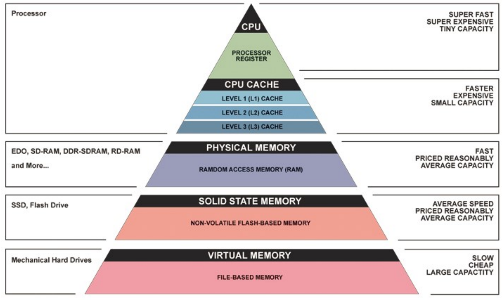
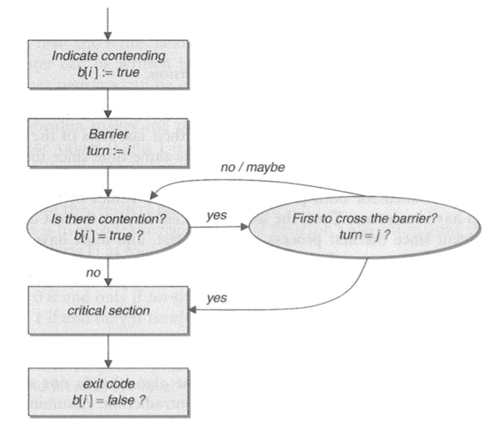
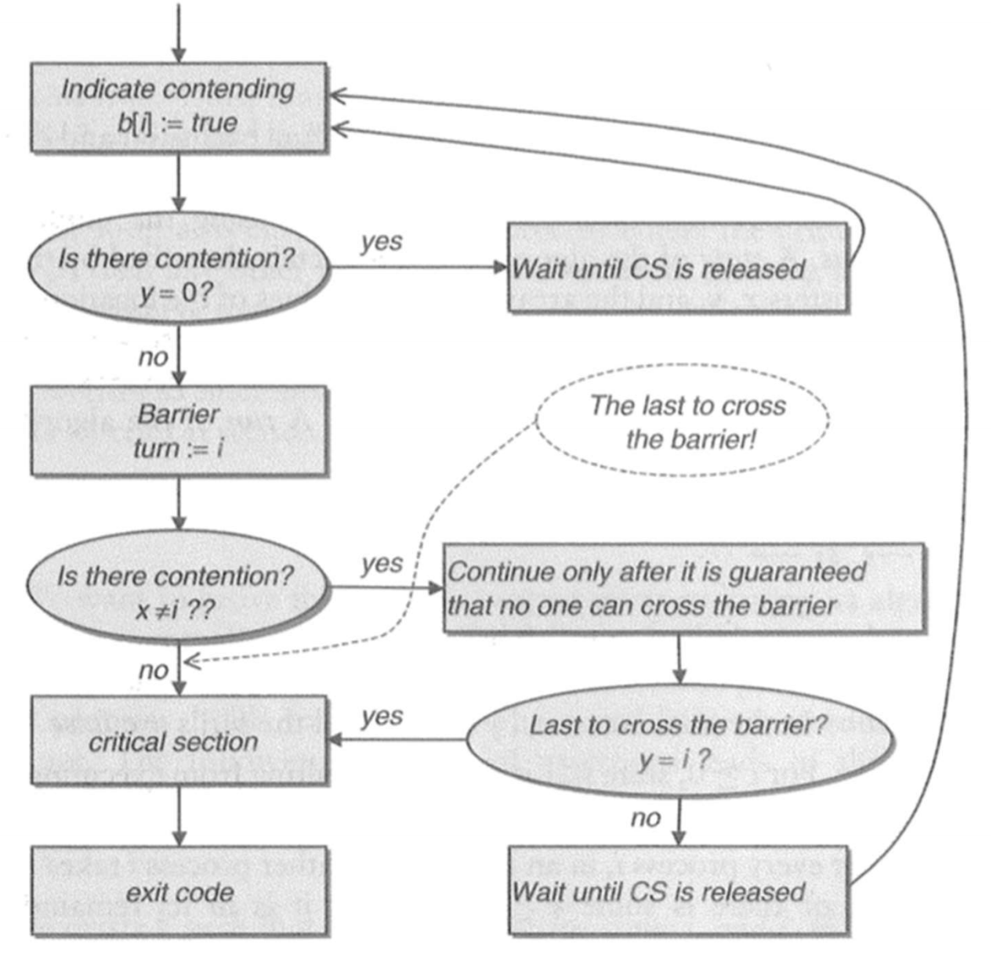
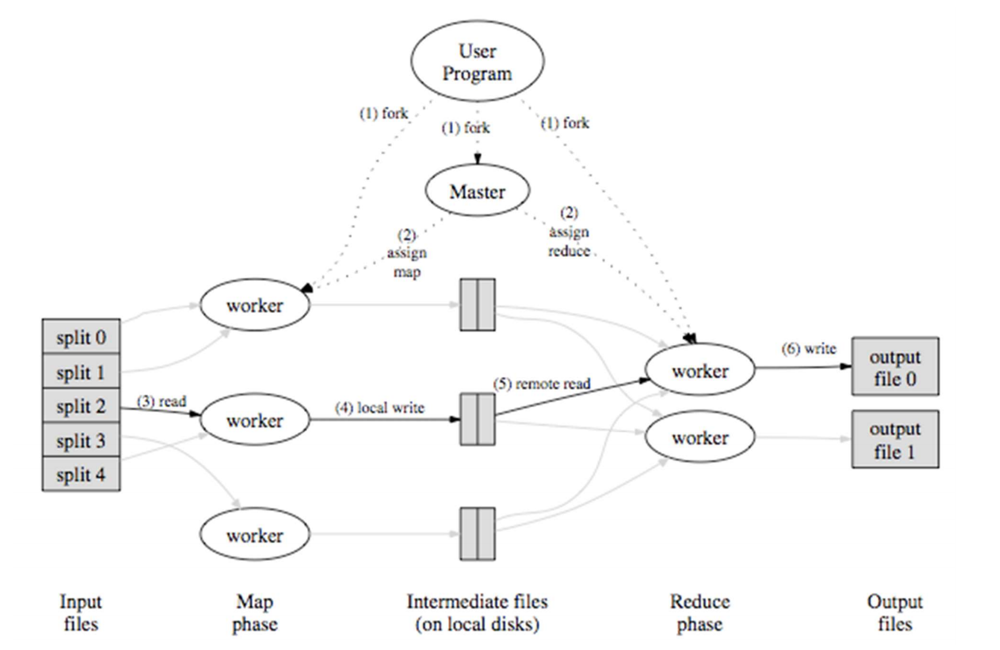
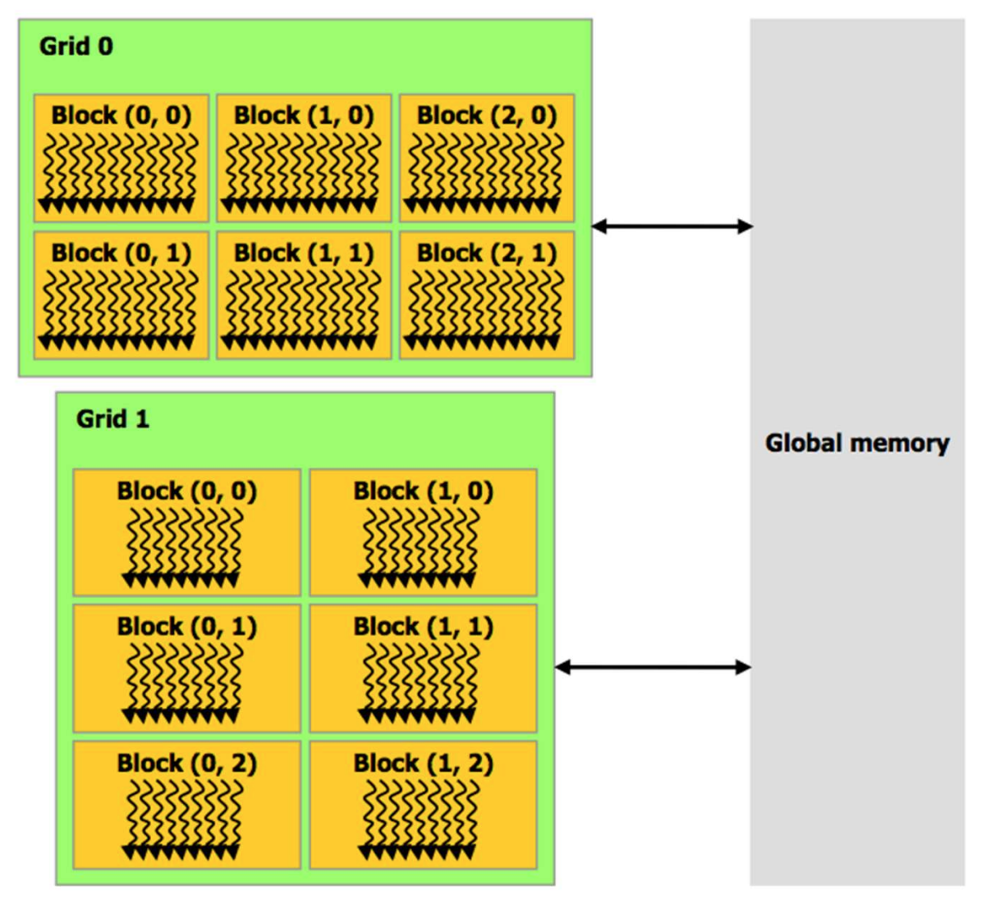
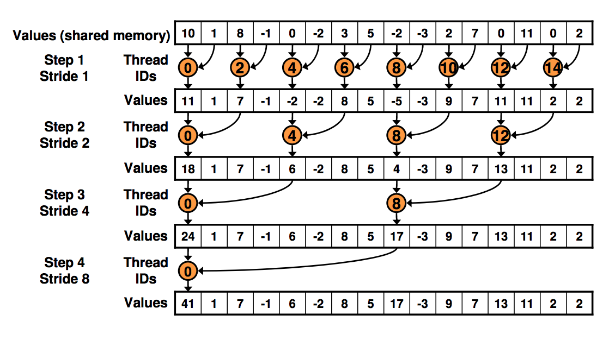
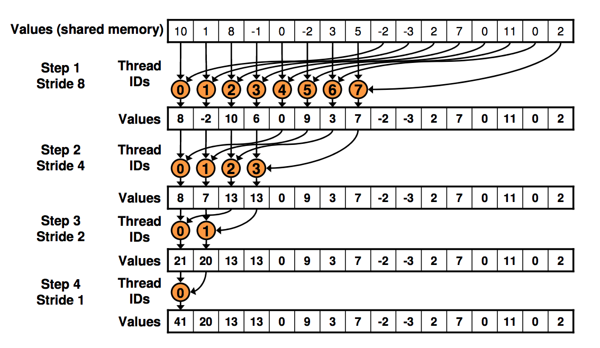

# Laws of Parallel Programming 

## Measuring Parallelism
Parallel programming is an emerging technique in computer science with applications in 
everything from machine learning to graphics processing. As computational tasks get 
more difficult, we need parallel machines to be able to handle the workload and solve
bigger problems. The purpose of this course is to learn about different technologies
and techniques for parallel programming and to talk about how to measure parallelism. 


__Moore's Law__

More's law states that the number of transistors that can be inexpensively placed 
on an integrated circuit doubles approximately every two years. 

This "law" has held for the last fifty years. While Moore's law is technically true it 
doesn't mean our chips are faster. An example of this phenomenon is __Dennard Scaling__ which 
said that as transistors get smaller, their power density stays constant. Therefore performance
per watt increases exponentially. Dennard scaling broke down in 2006 when it was found that 
the power density began to decrease. It is theorized that this change was because, at a small
scale, current leakage from the transistors became a big issue. This led to thermal runaway and
increased energy costs. So while transistors per chip have been increasing exponentially (following 
Moore's Law), clock speed, power, and performance have remained fairly constant. 

Following Moore's law implicitly resulted in parallelism because increasing the number of
transistors increased the number of independent processing unites on the chip. However, 
Software engineering trends are just now catching up to this parallel
architecture. 

__Amdahl's Law and Gustafson's Law__

Amdahl's Law and Gustafson's Law are  metrics by which we can measure 
how parallelism can theoretically improve the runtime of a program. Here we care about
the __speedup__ of a program. Speedup is defined as $S(n) = \frac{T(1)}{T(s)}$ where 
$T(1)$ is the time to execute a task on a single resource and $T(n)$ is the time 
to execute a task on $n$ resources. 

Amdahl's law states that improving a portion $P$ of a computation by 
factor $s$ results in an overall speedup of:
$$S_{latency}(s) = \frac{1}{(1-P) + \frac{P}{s}}$$

This law essentially means that the speedup is limited to the fraction that 
can be improved by speedup. 

- $P$ is the fraction of the code that runs in parallel
- $s$ is the number of resources
- $S_{latency}(s)$ is the observed speedup
- The non-parallel part of the code is said to be "sequential". 

Gustafson's Law states that improving a portion $P$ of a computation by factor $s$
results in an overall speedup of 
$$S_{latency}(s) = (1-P) + sP$$

__Scaling__

Amdahl's Law and Gustafson's law introduce important concepts for how we measure parallelism. 
Specifically we consider how well programs can "scale" as we increase the number of 
resources applied to the problem. 

__Strong scaling__ describes how the solution time varies with the number of processors 
for a fixed total problem size. To design a strong scaling experiment we run a program on a
fixed problem size and vary the number of parallel resources (threads, processes, etc) used to
solve the problem. Strong scaling attempts to answer "how much faster can we solve this 
problem with parallelism?" and is answered by Amdahl's law

__Weak scaling__ describes how the solution time varies with the number of processors for 
a fixed problem size per processor. To design a weak scaling experiment we run a program 
with a fixed number of iterations per thread and vary the number of threads. Weak scaling 
attempts to answer "can we solve bigger problems with more parallelism?" and is answered 
by Gustafson's law. However, weak scaling is becoming less feasible as processor growth is 
outstripping memory growth. Since weak scaling involves solving bigger problems, more memory 
is key. Additionally, weak scaling is difficult to express in algorithms.  

## Factors Against Parallelism
There are three major factors against parallelism. 

1. Startup costs associated with initiating processes. 
	- May overshadow actual processing time. 
	- Involves thread/process creation, data movement, etc. 
2. Interference - slowdown resulting from multiple processes accessing 
shared memory. 
	- Resources: memory, I/O, system bus, sub-processors 
	- Software synchronization: locks, latches, mutex, barriers 
	- Hardware synchronization: cache faults, HW mutexes and locks. 
3. Skew - when breaking a single task into many smaller tasks, not all 
tasks may be of the same size. Therefore not all tasks finish at the same time. 

There are a few other factors that can degrade parallelism. For example: 
I/O, network communication, failed processes, etc. Generally we focus on communication 
between processes as a major chokepoint. 

Parallel computation proceeds in phases - first we compute some local data,
then exchange the data with other processes. Communication is governed by the 
latency (fixed cost to send a message) and the link capacity. Latency dominates for 
small messages and bandwidth dominates large messages. We often want to overlap
communications to reduce wait time between computing phases. 

# Serial to Parallel - Loop Parallelism and OpenMP
The easiest way to write parallel code is to convert some serial code to
parallel execution. The idea behind this process is to write some serial code, 
profile it to find the slowest parts, and use a framework to parallelize (and therefore
increase the speed of) the code. This is not the best way to create parallel programs, 
just the easiest. 

OpenMP is a parallel programming environment for master/slave and/or fork/
join execution model, loop parallelism, and shared memory architectures. It
allows us to write serial programs in C/C++ or fortran, add parallel
directives, and get a parallel program that computes the exact same result.
OpenMP is not fundamentally a serial to parallel environment, but it is 
most often used in that way. 

OpenMP works with a shared memory architecture. A __shared memory architecture__ 
is hardware that provides the abstraction of coherent read/write to common memory 
from multiple resources.

- Coherent - repeatable reads 
- Abstraction that there is a single memory for all processes 
- Data can be shared between process by reading and writing to memory. 
- This abstraction holds even if there are different physical memories. 

To run a a block in parallel using OpenMP we need to include omp.h and call 
the directive `#pragma omp parallel <options>`{.c++}. We can easily parallelize 
for loops using the directive `#pragma omp parallel for <scheduling opeions>`{.c++}. 
The scheduling options define how to schedule the threads (how many iterations 
to run before switching, etc). 

- `<scheduling options> = kind [,chunk size]`.
	- static - divide loop into equal sized chunks 
	- dynamic - build internal work queue and dispatch one block at a time
	- guided - dynamic scheduling with decreasing block size for load balancing. 
	- auto - compiler chooses from above 
	- runtime - runtime configuration chooses from above. 
	- chunk size = number of iterations per thread. 

We usually use OpenMP for "loop parallelism" - ie running a loop in
parallel. This is a pretty easy concept to think about and work with when 
coming from serial programming. However we need to be careful about how our
loops access memory - especially nested loops. 

Loops are relatively simple constructs to parallelize, but we need to take a
few factors into account. Specifically, loop carried dependencies: when one 
iteration of a loop depends on the computations from other iterations. These
issues can be addressed by loop rewriting, removable dependencies, and separable
dependencies. 

There are several loop optimizations which we can use to make our loops run faster.

- Fusion: Merge loops to create larger tasks. This amortizes startup costs. 
- Coalesce: Coalesce loops to get more UEs and thus more parallelism. 
- Unrolling: Decrease the number of iterations in a loop (and do more work in the body). 
This works best for loops that do little work and therefore have a high 
startup costs relative to runtime. 
- Memory Access Pattern: consider how loops iterate over memory and 
optimize to access sequential memory. 2D array is stored in rows - better 
to access the entire row in one loop. 
- Loop tiling: Localizes memory twice (in cache lines and in cache 
registers).

In OpenMP we sometimes need to share a value between
threads while avoiding race conditions. We can do this by marking a block as
critical, but that can be inefficient. We use reduction functions to more
efficiently handle these cases without interference. 

```C++
#pragma omp parallel for shared(max_val)
for (int i = 0; i < 10; i++) {
	#pragma omp critical 
	{
		if (att[i] > max_val) {
			max_val = arr[i];
		}
	}
}
```

we can reduce this code to

```C++
#pragma omp parallel for reduction(max : max_val)
for (int i = 0; i < 10; i++) {
	if (arr[i] > max_val) {
		max_val = arr[i];
	}
}
```

This essentially tells the compiler to use the max function to update max_val.

# System Architectures

## Classifications

Flynn's Taxonomy is a means of characterizing machines by the number of instruction 
streams and data streams. 

- SISD - single instruction, single data 
	- SISD is called the Von Neumann architecture. This implements a universal
	Turing machine and conforms to serial algorithmic analysis. This is how most
	people think of a computer
- SIMD - single instruction, multiple data 
	- SIMD has a single instruction stream that is carried out on multiple data
	streams. Eg one program happening on multiple data sets. 
- MISD - multiple instruction, single data 
	- This doesn't exist 
- MIMD - multiple instruction, multiple data
	- MIMD defines most of the machines we're interested in - multi cores, SMP,
	clusters, etc. 

Flynn's taxonomy is a bit too simplistic to discuss the wide range of parallel
architectures in existence. 

- Shared Memory Systems. 
	- Large class defined by the shared memory architecture model. 
	- Threads exchange data through reads and writes to memory. 
	- Has some synchronization constructs to control sharing. 
- Symmetric Multi-Processor 
	- Shared memory (MIMD) system. All processors can access all memory. 
	- All memory locations can be accessed at equal speeds. This is called 
	symmetric memory access. 
	- SMPs have scaling limits. Increasing the number of processors increases
	competition for memory (fixed memory). 
- Non Uniform Memory Access (NUMA) 
	- Shared Memory (MIMD) system. All processors can access all memory. 
	- Memory access is not symmetric - eg each processor can access different
	memory locations with different speeds based on physical "closeness" to the
	memory. Each processor has a cache to mitigate potential memory access 
	bottlenecks. 
	- Same programming semantics as SMP but more difficult to do efficiently. 
	Must consider memory access and caching. 
- Message passing
	- Each processor / node has its own private memory. 
	- Nodes synchronize actions and exchange data by sending messages to each
	other. 
	- MPI - libraries that allow for collective operations, synchronization, etc.
		- Explicit handling of data distribution and inter process communication. 
	- Map/reduce - divides computation into data parallel and data dependent
	portions. This is a better abstraction of hardware and more restrictive. 
- Hybrid Architectures 
	- A message passing machine has SMP at each of its nodes. 

## Memory Abstractions and Caching
Just as there are different models for processor architecture there are
different architectures for memory and cache architectures. Memory itself 
is an abstraction - it is really a steep hierarchy of caches where different "levels" 
have different performance, capacity, sharing, semantics, etc. 

The cache hierarchy is structured in a pyramid like scheme. The closer locations are smaller
but can be accessed more easily. 

{width=400px}

- L1 - on chip 
	- One per processor
- L2 - on chip. 
	- 10x slower, bigger, cheaper than L1. Shared among coes
- L3 - most modern processors 
- Main Memory 
	- 10x slower, 2000x bigger, 20x cheaper than L2. Shared among multiple
	processors. 
- SSDs
	- 10x slower, 100x bigger, 20x cheaper than memory 
- disk dirves 
	- 10x slower, 5x bigger, 5x cheaper than RAM 

When discussing cache access we typically discuss in units of __cache lines__. The cache line
is the fundamental unit of the cache. Each cache line is a power of 2. Data in the cache can
be __inclusive__ (all data in L1 must be in L2) or __exclusive__ (all data in L1 cannot be in 
L2). A __unified__ memory location is one shared among multiple cores. The number of locations
a cache blocks can go into is called the __associativity__ of the cache. 

Based on this hierarchy, different memory access patterns can result in
drastically different performance for the same computation. In parallel
programming we want to use all the data in a cache line since accessing 
a single cache requires loading the entire line. 

When dealing with memory we describe memory ranges as:

- Aligned - access range starts / ends on cache line boundaries 
- Sequential - a continuous range of bytes 
- Coalesced - uses all associated regions of memory. 

## OS Abstractions

### Processes
WHen discussing parallel programming, a __task__ is a sequence of instructions 
that operate as a group, a __unit of execution__ (UE) is the execution context for a task, 
a __preprocessing element__ (PE) is the hardware element that runs the UE, and a 
__process__ is the operating system's abstraction for a running program. A process
provides the illusion that the program is the only thing running on the system - thus each 
process appears to have exclusive control of hardware and can execute instructions sequenctialy
without interruption. Additionally, processes do not share memory. The process abstraction 
allows for multiple serial programs to run concurrently and in parallel. 

The OS switches between running processes using a __context switch__. Note that a __context__
is the per-process state maintained by the OS - it is required to suspend and resume
processes and includes the program counter, register files, and contents of memory. 

Processes have a memory abstraction called __virtual memory__ which allows processes 
to act as though they have exclusive use of memory. The memory itself contains the
state of a single program (code, data, stack, heap, mapped memory).

We can use processes to create parallel programs using the `fork()` and `exec()` commands.

- `fork()` creates a copy of the running process 
- `exec()` loads a new program into the process. 

A parallel implementation using process would essentially fork multiple 
times and execute the same process on each fork. The OS assigns the 
processes to different cores. 

Multi-process programs have no shared state. Applications that need to share state must
do so explicitly using inter-process communication. These interfaces are generally clunky. 
This means that multiprocess programs have no implicit dependencies which makes parallization
using a message passing architecture like MPI much easier. In general, multiprocess programs
are the simplest parallel programs. 
 
### Threads
A __thread__ is a concurrent execution unit within a process. Unlike a process, threads 
can share memory, the heap, and libraries. Threads also have a more lightweight context 
(thread ID, stack, and registers) than processes. Every process has at least one thread. 

A process can run multiple threads at a time - this is called simultaneous multithreading. 
Additionally, some systems can conduct hyperthreading which is when the processor and OS
advertises two threads per core. In general, threading can greatly increase performance.

- Simultaneous multi threading can improve speedup by 15-30%
- Threading can overlap cache stalls with the execution of other threads 
- Can decrease cycles per instruction for some workloads. 

Java has a standard interface to handle threads. The Runnable interface 
is used to handle the execution and the Thread class handles 
multithreading. There are multiple ways to implement multithreading but the easiest (and
preferable) way is to implement Runnable and wrap it in a thread. When we run a thread we 
should call join() on it to wait for it to finish. 

In Java threading we may need to read / write to shared variables.
Uncontrolled sharing can lead to unpredictable outcomes and race 
conditions. Java introduces some keyword tags to prevent race conditions.
	- `atomic`{.java} - in transactions either all actions happen or none happens. 
	- `synchronize`{.java} - a block that's only accessed by one thread at a time. 
	- `volatile`{.java} - a variable that is guaranteed to have memory synchronized 
	on each access. 

## Synchronization 
__Synchronization__ is the process of preventing multiple UEs from accessing the 
same resources at once - ie preventing race conditions. Synchronization aims to
maintain three major properties:

- Mutual exclusion - the property that only one UE can access a shared 
resource at a time. 
- Deadlock freedom - the property that at least one UE will eventually be
able to access the resource. The UEs won't get stuck waiting on the 
resource forever. 
- Starvation freedom - the property that a UE won't be forever locked out
from using the resource. If a UE wants to use a resource it will 
eventually be able to use the resource. 

When discussing communication between processes we deal with two types of communication:

- Transient communication - a form of communication that requires both parties
to communicate at the same time. Ex: talking on the phone, shouting from a 
distance, etc. 
- Persistent communication - a form of communication that allows both parties 
to communicate at different times. Ex: writing notes, raising flags, etc.

We can characterize concurrency with two properties
- Safety (correctness) - what are the semantic guarantees expressed by a 
locking protocol under concurrent execution. 
- Liveness - how can the execution of one thread by delayed by other threads 

A __lock__ is a "lock" or hold on a resource. There are a few ways a 
parallel program can implement locks. 

- Spinlock - a lock which causes the thread trying to acquire it to wait in a
loop (spin) while checking to see if the lock is available. 
	- Spinlocks are generally used in OS, but not so great for parallel processes. 
	- When the lock is freed, all the other UEs will try to acquire it - 
	performance may vary. 
- Ticket lock - a lock that uses a FIFO ticket system (like the DMV) to 
control which thread can access resources. 
	- There is some queue of threads waiting to access a critical section. 
	- There is a variable queue\_len which keeps track of the number of 
	threads in the queue. 
	- When a thread enters the queue, it sets `thread.ticket = queue_len` 
	and increments queue\_len (`queue_len++`). 
	- When a thread leaves the critical section it returns `dequeue =
	thread.ticket++`. Every other thread checks to see if `thread.ticket =
	dequeue`. If so, that thread can now enter the critical section. 
	- Ticket lock is FIFO, mutually exclusive, and deadlock free. 

A __semaphore__ is a variable used to control access to a shared resource. 
Semaphores are usually implemented in operating systems. These are especially
useful when more than one process can access the resource -

```
# s = semaphore_value
await s > 0;
down(s)
critical section 
up(s)
```

A __barrier__ is a software construct that allows a synchronous algorithm to run
on asynchronous hardware. A barrier is a point in the program execution where all
UEs must wait until all other UEs have reached the barrier. Only when all UEs have 
reached the barrier can the UEs continue. Thus a barrier provides a point of 
synchrony even when the hardware is not guaranteed to be synchronous. 

### Synchronization Algorithms
There have been a few different algorithms that have been developed to control
access to critical sections / resources. 

__Peterson's algorithm__

This is perhaps the simplest of the synchronizations algorithms. 

```
// process 0
b[0] = true 
victim = 0
await (b[1] = false or victim = 1);
critical section 
b[0] = false

// process 1
b[1] = true
victim = 1
await (b[0] = false or victim = 0)
critical section 
b[1] = false
```

{width=200px}

- b[x] indicates process x wants to enter the critical section. 
- Write to victim indicates who got there first
- This algorithm is mutually exclusive, starvation resistant, contention 
free, and has arbitrary wait. It lasso requires atomic registers. 
- This algorithm requires busy waiting - eg the await construct. This is a 
good construct when there are many processes, there's no othe ruseful work 
to do, or wait times are very short. The alternative is to sleep / restart. This is usually implemented by hardware interrupts and has more overhead. 

__Lamport's Algorithm__

This algorithm scales mutual exclusion to n processes

```
start: 
b[i] = true;
x = i
if y != 0
	b[i] = false 
	await y == 0
	goto start
y = i
if x != i
	b[i] = false
	for j = 1 ... n:
		await b[j] = false
	if y != i 
		await y = 0
		goto start
critical section 
y = 0
b[i] = false
```

{width=250px}

- This algorithm has fast MutEx properties. However, starvatio nis 
possible since the wait time is unbounded. 

Peterson and Lamport's algorithms are too simple to be used in practice but
demonstrate fundamental trade-offs in synchronization. Space vs speed vs
fairness. Both of these algorithms require atomic registers which are not available in
distributed memory machines. 

__Bakery Algorithm__

The bakery algorithm is an algorithm meant to improve saftey in the
usage of shared resources among mutual threads using mutual exclusion. 

Lamport envisioned a bakery with a numbering machine at its entrance 
so each customer is given a unique number. Numbers increase by one as 
customers enter the store. A global counter displays the number of the 
customer that is currently being served. All other customers must wait 
in a queue until the baker finishes serving the current customer and 
the next number is displayed. When the customer is done shopping and 
has disposed of his or her number, the clerk increments the number, 
allowing the next customer to be served. That customer must draw 
another number from the numbering machine in order to shop again.
According to the analogy, the "customers" are threads, identified by 
the letter i, obtained from a global variable.

Due to the limitations of computer architecture, some parts of 
Lamport's analogy need slight modification. It is possible that more 
than one thread will get the same number n when they request it; this 
cannot be avoided. Therefore, it is assumed that the thread identifier 
i is also a priority. A lower value of i means a higher priority and 
threads with higher priority will enter the critical section first.

The Bakery algorithm is FIFO and satisfies mutual exclusion but it is not fast. 

## Multiprocessing and Message Passing
Clusters and multi-process programs with no shared state sometimes need to 
communicate with each other. These programs typically work off of the SIMD 
model. MPI is the "assembly language of parallel programming" - it is a message 
passing interface with support for C++ and Fortran. It is used to send and 
receive messages across processes. 

MPI is not particularly difficult to use. The interface allows the programmer
to send data across process in a general way using send and recv calls. 
However, when writing message passing protocols it's important to avoid potential 
deadlocks. 

When designing these programs we can view the message passing system as a dependency graph 
(ie how processes wait to send / receive messages to / from other processes). Deadlocks 
can be seen as cycles in the dependency graph. The easiest way to avoid deadlocks is 
to either synchronize message passing, avoid cyclic message passing, or both. 
We generally synchronize message passing between pairs of processes. We can also create 
barriers explicitly in MPI to synchronize actions but that creates global stalls. 

### IO and Checkpointing

In large scale programs, failures are inevitable. When writing MPI programs we 
often want to write some method for recovering from failure (since otherwise a failure 
would break the program). __Checkpointing__ is a technique to add fault tolerance 
into computing systems. It basically consists of saving a snapshot of the application's 
state, so that it can restart from that point in case of failure. 

Checkpointing requires that we do some I/O - but I/O can take a long time. We find that 
if startup costs are amortized, writing more small files is better than writing fewer large files. 

# Map / Reduce

## Fundamentals of Map Reduce
The Map Reduce framework is a parallel programming model based off of Lisp
(a functional programming language). In Lisp A map takes an input function 
and some values and applies the function to each value. A reduce combines 
all of the elements of a sequence using a binary operator. 

In our applications, map and reduce are functions that work to accomplish a specific
task. A map takes an input pair and produces a set of intermediate key / value pairs. 
The reduce function takes an input key (from the map function) and a set of values 
for that key and merges them into some smaller solution space. 

For example we can count the number of occurrences of a word in a string 
using MapReduce

```Python
def map(key, value):
	for word in value: 
		intermediate_map.add(word, '1')

def reduce(key, values):
	result = 0
	for count in values:
		result += int(count)
	return result 
```

We can parallelize this model by splitting the input data into M "shards" 
each of which can be processed on different, parallel machines. This 
essentially parallelizes the map phase. We can partition the reduce 
function by splitting the intermediate map into R shards and processing 
those on different machines. This process is overseen by a master thread 
which manages the partitioning of tasks. 

{width=400px}

## Applications of Map Reduce

### Hadoop
Hadoop is a map-reduce implementation maintained by Apache. It handles the 
entire streaming logic and requires the programmer to only implement the map-reduce
logic. It has language support in Java and can be implemented as a streaming client
with Python. In addition to the mapper and reducer processes, Hadoop introduces three other 
important components:

- Shuffle: The process of routing mapper outputs to the reducers
- Combiner: An optional reducer-like process that runs on the mapper
nodes. The combiner performs an early reduction on the mapper output
which makes input to the shuffle smaller and reduces data handling. 
Combiners are typically used to pre-compute aggregates (ie word 
counts) or extra (finding max  /min associated with a key).
- Partition: The partition of data associated with a parallel 
execution unit. The output partition is the part of the result
written by each reducing process. Within a given partition the
intermediate key-value pairs are processed in increasing key order.

### Google File System (GFS)
Files are divided into fixed-size chunks of 64 megabytes, similar to 
clusters or sectors in regular file systems, which are only extremely 
rarely overwritten, or shrunk; files are usually appended to or read. 
A GFS cluster consists of multiple nodes. These nodes are divided into 
two types: one Master node and a large number of Chunkservers. 
Each file is divided into fixed-size chunks which are stored in the chunk
servers. Each chunk is assigned a unique 64-bit label by the master node 
at the time of creation, and logical mappings of files to constituent 
chunks are maintained. Each chunk is replicated several times throughout 
the network. 

The Master server does not usually store the actual chunks, but rather 
all the metadata associated with the chunks. All this metadata is kept 
current  by the Master server periodically receiving updates from each 
chunk server.

Permissions for modifications are handled by a system of time-limited,
expiring "leases", where the Master server grants permission to a process 
for a finite period of time during which no other process will be granted 
permission by the Master server to modify the chunk. The modifying 
chunkserver, which is always the primary chunk holder, then propagates the 
changes to the chunkservers with the backup copies. The changes are not 
saved until all chunkservers acknowledge, thus guaranteeing the completion 
and atomicity of the operation.

Programs access the chunks by first querying the Master server for the
locations of the desired chunks. If the chunks are not being operated on, 
the Master replies with the locations, and the program then contacts and 
receives the data from the chunkserver directly.
Unlike most other file systems, GFS is not implemented in the kernel of 
an operating system, but is instead provided as a userspace library.

### Spark - Resilient Distributed Datasets
Spark is a framework run on top of Hadoop that uses resilient distributed datasets
to handle big data problems in the Map Reduce framework. Specifically Spark is used
to efficiently handle iterative map reduce algorithms that need to access data 
multiple times. These types of applications are notoriously inefficient on standard
Map Reduce, but Spark can increase the efficiency by orders of magnitude. 

A __resilient distributed dataset__ (RDD) is a data abstraction used to perform 
in-memory computations on large clusters. Specifically, the RDD abstraction is 
an immutable, distribution of data that can be stored on memory or in a cluster
that can be operated on in parallel with a low level API that provides specific
transformations and actions. 

Spark provides two means of interacting with RDDs.
A transformation is a function that converts an RDD to another RDD (ie 
transforms the RDD). An action returns some value (called a sequence) based on 
the application or user. 

- `RDD.transformation() -> RDD'`
- `RDD.action() -> SEQ`

RDDs are not necessarily stored in storage in their entirety. Rather an RDD
maintains the pipeline of transformations that can be used to reconstruct the
RDD from stable data storage. We can make an RDD persist in memory by calling 
the `persist()` function. For this reason, RDDs are described as "lazily initialized" 
in that they only store the information required to compute them from data stored in memory
instead of being computed directly. This is also seen as a pipeline processing 
as computing the RDD from stored lineage can be seen as processing a pipeline of 
transformations. 

- Transformations include:
	- map(f: T -> U)
	- filter(f: T -> bool)
	- reduceByKey(f: (V, V) -> V)
	- union()
	- join()
	- sort()
	- ...
- Actions include:
	- count()
	- collect()
	- reduce(f: (T, T) -> T)
	- lookup(k : K)
	- save(path : String)

RDDs are stored in a distributed way - the RDD is split and each section (or
partition) is stored on a specific node in the cluster. Spark has two major 
partitioning schemes:

- Range partitioning: partition RDD by key value. Assign specific range of
key values to partition and split RDD by key. Fetching c contiguous items from
a range partitioned RDD takes $O(log N)$ time. 
- Hash partitioning: partition RDD by hash value. For key k with N partitions
assign k to $H(k) \% N$. Fetching c contiguous items from a hash partitioned RDD
takes $O(c)$ time. 
- Hash partitioning is better for load balancing and is the default partitioning
scheme. 

Since RDDs store a lineage of how they were computed from base data, on failure, 
we can identify partitions of the RDD that have failed, and recompute the failed 
partitions in parallel using Spark. This is much more efficient than other memory 
models which require more costly recovery procedures. 

- Checkpoint: save required memory in persistent storage sufficient to 
restart the computation 
- Restart: restart computation from a checkpoint
- Rollback: undo changes made to memory associated with computations that
have failed or did not complete.

Distributed shared memory (DSM) is the standard distributed memory model 
in a cluster. The DSM model allows for memory reads and write to all 
addresses in a global address space whereas RDD "writes" can only be done 
through coarse transformation. This means RDDs are only 
suitable for bulk writes. However, RDDs are more fault tolerant since
if an RDD is corrupted it can be easily recomputed in parallel on different
nodes instead of having to roll back the entire application. Furthermore RDDs
don't need to "checkpoint" their computations since they store their lineage.
Additionally, since RDDs are immutable we can use them to run backups of slow
tasks which is harder to do on a DSM where we'd have to worry about memory 
access. 

### Pig and Hive 
Pig is a platform for analyzing large data sets that consists of a high-level language for expressing data analysis programs, coupled with infrastructure for evaluating these programs. The salient property of Pig programs is that their structure is amenable to substantial parallelization, which in turns enables them to handle very large data sets. The Pig data model consists of atoms (simple values), tuples (sequences of values), bags (multisets with duplicates), and maps. Every Pig program is compiled to several MR programs and run on Hadoop. 

Hive is a Data Warehousing package that is constructed on top of Hadoop for analyzing huge amounts of data. Hive is essentially a SQL like system for MR. 

# GPU Programming
A __Graphics Processing Unit__ (GPU) is a specialized piece of hardware for rendering 3D graphics. GPUs are essentially an extremely parallel processors which is designed to render vertices and pixels in parallel. GPUs are programmable and aren't limited to graphical applications. Recently GPUs have been used in bitcoin mining rigs and machine learning applications. GPUs are designed for math intensive parallel problems so they have more transistors dedicated to ALU (arithmetic logic units) than flow control and data cache. This means that GPUs can be extremely efficient for parallelization but the programs must be more predictable in regards to data access coherency and program flow. 

## CUDA
__Compute Unified Device Architecture__ (CUDA) is a system released by NVIDIA to perform computations on the GPU. It has specification for a computer architecture, a language, and an API. A CUDA device is a highly parallel processor which can execute many hundreds of threads in parallel. (Thread to stream ration > 1). When writing CUDA software we think in terms of threads instead of processes. The startup and context switching costs per thread are very low. 

The CUDA programming model uses a data decomposition approach. The grid is the data domain (1D, 2D, or 3D) and is decomposed into thread blocks. A thread block is decomposed into threads. Thread blocks and threads are given unique identifiers which are used by the kernel to identify which part of a problem to work on. 

{width=300px}

A __thread block__ contains a multiple of 32 threads and may have up to 512 threads. All threads in a thread block time are run on the same multi-processor. This allows threads in a thread block to communicate via shared memory and synchronize. Threads of a block are multiplexed onto a multi-processor as warps. __Warps__ are the fundamental scheduling unit of the processor. They are groups of 32 threads that are dispatched two at a time to 16 processors each. Each warp forms a SIMD group. A __kernel__ is a function that processes a single data element. 

All parts of the processor has read access to constant memory and texture memory and read/write access to global memory. Individual multiprocessors have read/write access to shared memory, and individual threads have private read/write access to local memory and registers. 

### CUDA Language

We program CUDA devices using the CUDA language, which is similar to C/C++. However CUDA cannot use C/C++ runtime library functions. Rather there are device specific functions in CUDA. 

- There is no stack on CUDA. All function calls are inlined and all local variables and function calls are stored in registers. Therefore, there is no recursion or function pointers. 
- Declspecs (declaration specifier / declaration qualifier) are modifiers applied to declarations of variables and functions (`const`{.c}, `extern`{.c}, `static`{.c} are examples in C).  CUDA has custom dualspecs for functions and variables. Note that here "device" refers to the GPU and host refers to the GPU. So a `__global__` function is called from the host and executed on the device. 
	- `__device__` declares s function that is compiled to and executes on the device and can only be called from the device. 
	- `__host__` declares a function that is compiled to and executes on the host and can only be called from the host. 
	- `__global__` declares that a function is compiled to and executes on the device and are callable from the host. Global functions are the main entry point between the host and device. 
- CUDA dualspecs for variables.
	- `__device__` declares that a global variable is stored on the device. The data resides in global mamory. 
	- `__shared__` declares that a global variable is stored on the device. if not declared as volatile, reads from different threads are not visible unless a synchronization barrier is used. The data resides in shared memory. 
	- `__constant__` declares that a global variable is stored on the device. The data resides in constant memory and has lifetime of entire application. 
- We can construct vector types with a function `make_{typename}(...)`. A vector type is a three dimensional tuple of `char`{.c}, `short`{.c}, `int`{.c}, `long`{.c}, `longlong`{.c}, `float`{.c}, or `double`{.c}s. We can access specific dimensions of a vector using `vec.x`, `vec.y`, or `vec.z` for the 0th, 1st, and 2nd dimension respectively. 
	- The `dim3` type (aka the `uint3` type) is a special vector used to declare dimensions for grids and thread blocks. We declare a `dim3` type using the syntax `dim3 var(dim1, [dim2], [dim3])`. 
- CUDA has its own functions to allocate and free memory, `cudaMallocManaged` and `cudaFree`. 
- CUDA has four global built-in variables. These are three dimensional vectors and can only be accessed from the device (ie inside a kernel or device function). 
	- `threadIdx` is the thread ID within a thread block (in the indexed direction). 
	- `blockIdx` is the thread block ID (in the indexed direction). 
	- `blockDim` is the number of threads per thread block (in the indexed direction). 
	- `gridDim` is the number of thread blocks per grid (in the indexed direction). 
- A kernel is a C function defined with the `__global__` dualspec. We can call a kernel using `func<<< numBlocks, threadsPerBlock >>>(args)` syntax. The `numBlocks` and `threadsPerBlock` variables can be integer types or special `dim3` types which define vectors. 
- If threads in a thread block need to access shared memory we can call the `__syncthreads()` function. This function acts as a barrier and forces all threads to wait until every thread in the block has reached the `__syncthreads()` call.  

__Example__

```C++
#include <iostream>
#include <math.h>

// function to add the elements of two arrays
void add(int n, float *x, float *y) {
  for (int i = 0; i < n; i++)
	  y[i] = x[i] + y[i];
}

int main() {
  int N = 1<<20; // 1M elements

  float *x = new float[N];
  float *y = new float[N];

  // initialize x and y arrays on the host
  for (int i = 0; i < N; i++) {
	x[i] = 1.0f;
	y[i] = 2.0f;
  }

  // Run kernel on 1M elements on the CPU
  add(N, x, y);

  // Check for errors (all values should be 3.0f)
  float maxError = 0.0f;
  for (int i = 0; i < N; i++)
	maxError = fmax(maxError, fabs(y[i]-3.0f));
  std::cout << "Max error: " << maxError << std::endl;

  // Free memory
  delete [] x;
  delete [] y;

  return 0;
}
```

We can use CUDA to greatly speed up this process. 

- We need to convert the `add` function into a CUDA kernel by adding the `__global__` dualspec. 

```C++
__global__
void add(int n, float *x, float *y)  { 
	// body 
}
```

- We need to allocate the `x` and `y` arrays on CUDA

This can be done by allocating the arrays as accessible by the host and device. 

```C++
float *x, *y;
cudaMallocManaged(&x, N*sizeof(float));
cudaMallocManaged(&y, N*sizeof(float));

// ... 

cudaFree(x);
cudaFree(y);
```

or by allocating new arrays directly on CUDA

```C++
float *x, *y; 

// initialize x and y

float *x_c, *y_c;

cudaMalloc((void**)&x_c, N*sizeof(float));
cudaMalloc((void**)&y_c, N*sizeof(float));
cudaMemcpy(x_c, x, N*sizeof(float), cudaHostToDevice);
cudaMemcpy(y_c, y, N*sizeof(float), cudaHostToDevice);

// ...

cudaFree(x);
cudaFree(y);
free(x);
free(y);
```

- We need to use `<<<numBlocks, blockSize>>>` syntax to set the number of blocks and threads to run the kernel on.

```C++
int blockSize = 256;
int numBlocks = (N + blockSize - 1) / blockSize;
add<<<numBlocks, blockSize>>>(x, y);
```

- We need to block the CPU code until the calls to the kernel finishes

```C++
cudaDeviceSynchronize();
```

- As written right now, the `add` kernel will do the same computation on each thread / thread block. We need ot modify the kernel to compute a different section per thread. 

```C++
__global__
void add(int n, float *x, float *y) {
	int index = blockIdx.x * blockDim.x + threadIdx.x;
	int stride = blockDim.x * gridDim.x;
	for (int i = index; i < n; i += stride)
		y[i] = x[i] + y[i];
}
```

The program below is a CUDA parallelized version of the program to add two float arrays. 

```C++
#include <iostream>
#include <math.h>

// function to add the elements of two arrays
__global__
void add(int n, float *x, float *y) {
	// pick starting index based on number of previous threads
	int index = blockIdx.x * blockDim.x + threadIdx.x; 
	// stride based on number of threads in grid
    int stride = blockDim.x * gridDim.x;
    for (int i = index; i < n; i += stride) {
    	  y[i] = x[i] + y[i];
    }
}

int main() {
	int N = 1<<20; // 1M elements

	float *x = new float[N];
	float *y = new float[N];

	// initialize x and y arrays on the host
	for (int i = 0; i < N; i++) {
		x[i] = 1.0f;
		y[i] = 2.0f;
	}

	// Run kernel on 1M elements on the CPU
	int blockSize = 256;
	int numBlocks = (N + blockSize - 1) / blockSize;
	add<<<numBlocks, blockSize>>>(N, x, y);

	// wait for the kernel to finish
	cudaDeviceSynchronize();

	// Check for errors (all values should be 3.0f)
	float maxError = 0.0f;
	for (int i = 0; i < N; i++)
	maxError = fmax(maxError, fabs(y[i]-3.0f));
	std::cout << "Max error: " << maxError << std::endl;

	// Free memory
	cudaFree(x);
  	cudaFree(y);

	return 0;
}
```

### Parallel Reduction
__Parallel reduction__ is a means of reducing a problem into smaller problems that can be executed in parallel. This is done using a tree-based approach used within each thread block or for multiple thread blocks. Parallel reduction must be able to use multiple thread blocks to process very large arrays. Each of the thread blocks would reduce a portion of the array. The issue here is figuring out how to communicate partial results between the thread blocks. 

Global synchronization would a trivial way of solving this problem. This process is essentially syncing global memory after every block produces its result. Once all blocks reach the synchronization point, continue recursively. However, CUDA does not have global synchronization because it's expensive to build hardware for GPUs with global synchronization and global synchronization would force us to use less blocks to avoid deadlocks. 
We can get over this by decomposing the computation into multiple kernels. The Kernel launch serves as a global synchronization point. Launching a kernel has negligible hardware and software overhead. 

The goal of parallel reduction is to reach GPU peak performance. Typically we measure this performance in bandwidth - so we want the GPU to reach peak bandwidth. 

Here we'll go over reductions for summing all the elements in an array. 

- Interleaved Addressing

```C
__syncthreads();
for (unsigned int s = 1; s < blockDim.x; s*=2) {
	if (tid % (2*s) == 0) {
		sdata[tid] += sdata[tid + s]
	}
	__synchtreads();
}
```

{width=400px}

This introduces a problem of __thread divergence__. This occurs when threads in a single warp need to do different things (ie they diverge). This can lead to a large loss in performance. We want to avoid conditioning on `tid`. 

- Interleaved Addressing 2

```C
__syncthreads();
for (unsigned int s = 1; s < blockDim.x; s*=2) {
	int index = 2*s*tid;
	if (index < blockDim.x) {
		sdata[index] += sdata[index + s];
	}
	__syncthreads();
}
```

Note that this has much less divergence. However, it suffers from shared memory bank conflicts. 

- Sequential Addressing

```C
__syncthreads();
for (unsigned int s=blockDim.x/2; s>0; s>>=1) {
	if (tid < s) {
		sdata[tid] += sdata[tid + s];
	}
	__syncthreads();
}
```

{width=400px}

This reduction is conflict free but leaves a lot of idle threads which isn't particularly efficient. 

- Other reductions include unrolling the loop, computing the first add when loading the data, and invoking multiple adds / threads. 

# Roofline
The emergence of multicore processors and the diversity of implementations of computing systems has created a need for a more insightful model of computing performance. We define __operational intensity__ as operations per byte of DRAM traffic. This is calculated as $I = \frac{W}{Q}$ where $W$ is the work and $Q$ is the memory traffic. 

The __roofline model__ is an intuitive visual performance model used to provide performance estimates of a given compute kernel or application running on multi-core, many-core, or accelerator processor architectures, by showing inherent hardware limitations, and potential benefit and priority of optimizations. By combining locality, bandwidth, and different parallelization paradigms into a single performance figure, the model can be an effective alternative to assess the quality of attained performance instead of using simple percent-of-peak estimates, as it provides insights on both the implementation and inherent performance limitations.

$$performance = min(peak\_floating\_point\_performance, peak\_memory\_bandwidth * operational\_intensity)$$

The Roofline is defined by the peak performance and the peak memory bandwidth.

- Roofline is an ideal metric. Each process has a roofline and a perfect program would realize the roofline. 
- Every kernel (or program) has a specific operational intensity - well engineered kernels have an operational intensity which puts their attainable gflops per second near the roofline. This is a more nuanced view of Amdahl's law. 
- Some processor optimizations will raise the roofline boundary. Examples include instruction level parallelism (ILP), SIMD (Single instruction multiple data) eg vector instructions, and floating point balance (FP units have multipliers and adders and must use both at the same time. 
- Roofline is limited in that understanding caching is difficult, t does not account for data movement to accelerators, and doesn't account for GPUs.
