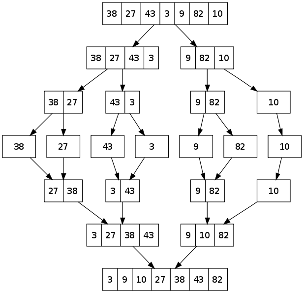

# How Does a Computer Work?

In broad terms, a computer is an extremely complex circuit that is
driven by "binary inputs". A user feeds in input as either 0 (no
power) or 1 (power), which when done correctly, cause the computer to
perform specific actions. These combinations of 0s and 1s are often
called binary code or machine language and are the only language a
computer truly understands.\
A computer processes a single machine instruction in one "cycle" - 
computer speed is measured in Hz or cycles per second. Modern
personal computers run at speeds of around $3 GHz$ or $3 \times 10^9$
cycles per second. It's this extraordinary speed that makes computers so
valuable. 

## What is a Programming Language?

A major problem with computers is that machine language is extremely
difficult for a human to read and write. So over the years we have
developed **programming languages** which, for the most part, are
designed to bridge the gap between natural human language and machine
language. A programming language is something that a human can easily
read and write, and that can be efficiently converted into machine
code.\
There are thousands of different programming languages in existence -
most are not in common use. [This website](http://www.99-bottles-of-beer.net/abc.html)
has a list of over 500 programming languages with a program in each language that prints 
the song "99 bottles of beer". All of these languages have
different properties and use cases - and there are entire classes and
books on programming language theory. Here we'll just discuss the
basics.

## High Level vs Low Level

A **high level** language is a language that's closer to natural
language than machine code. High level languages are easier to read by
humans, have more layers and safeguards between the programmer and the
processor, and are relatively slow. High level languages are very
popular for developing user level software software - websites and apps,
research and quick prototyping, and for tasks that don't require
exceptionally fast performance.\
A **low level** language is a language that's closer to machine code
than natural language. Low level languages are more difficult for humans
to read and have less layers and safeguards between the programmer and
the processor - this means it's easier for a programmer to break the
processor using a low level language. Low level languages are also
relatively fast compared to high level languages. Low level languages
are popular for designing systems level software - device drivers,
operating systems, embedded systems, etc - and for tasks that require
exceptionally fast performance.

{width=500px}

## Compiled vs Interpreted

A **compiled language** is a language that is converted directly to
machine code then run by the processor. This conversion step is handled
by a **compiler** and is initially slow. However, the machine code runs
relatively quickly. Additionally, compiled programs are less portable -
they have to be recompiled for different architectures and more secure
since reconstructing the source code from the binary files is
difficult.\
An **interpreted language** is a language that's converted to machine
code and run line by line during run time. That is, when I run an
interpreted language, the first line is converted to machine code and
run by the **interpreter** then the second line is compiled and run and
so on. These languages don't have a slow compilation step, but the
overall program runtime is slower (since the conversions happened during
runtime). Additionally, interpreted programs are more portable since the
interpreters are built to convert the source code based on architecture,
and they are less secure since the source code is shipped out as part of
the software.

## Pyhton

Python is a general-purpose programming language developed by Guido van Rossum in 1991. Python was designed to be easily learnable / readable and to accomplish tasks in fewer lines of code than other languages like C++ or Java. It is a high level, interpreted language and is significantly slower than other languages but has remained popular with students, researchers, and software developers for whom readability and ease of use outweighs concerns about efficiency. 

Modern Python is available in two versions, 2.7+ and 3.5+ (we call these python2 and python3 respectively). Here we'll be using python3, but all general concepts should work in python2 with some syntax alterations. You may find that some libraries (particularly when we cover scientific computing) don't work in python2. 

# Configuring Your System

The first thing you need to do before programming anything is set up the right programming environment on your computer. As you become more experienced setting up the right environment can make your programming experience a lot easier, but when you're just starting out it's best to go with the most bare-bones environment. \
The first thing you need to do is [download Python](https://www.python.org/downloads/) (if you haven't done so already). Keep in mind that some operating systems have Python pre-installed, but even so it's a good idea to install the latest version. Once you've installed Python there are three major types of environments you can choose for Python programming.

- Text Editor / Terminal \
This is the most bare-bones environment, but also (in my opinion) the best environment for the beginner. Basically you write your code in a text editor (like Notepad, Notepad++, Sublime Text, Vim, Emacs, etc) and use the terminal to execute the code. I've included a brief introduction to using the terminal below. 
- Integrated Development Environment \
An IDE is an all in one programming suite. They come in many different langauges and flavors but their main features are that they have built in tools like syntax hilighting, autocompletion, automation of "boilerplate" code, and a compiler / interpreter. Beginners typically like IDEs, but if used incorrectly they can become something of a crutch. For Python I recommend Spyder or PyCharm. 
- Jupyter Notebook \\
A Jupyter Notebook is a tool used in scientific computing and education which allows for inline output and documentation. Basically it allows you to write code and text together in a "notebook" style. It is very similar to the Text Editor / Terminal option in terms of features, but it can be a bit messy to start up. Note that you need to use the terminal to launch a jupyter notebook though you don't need it for anything else in this environment. 

The text editor / terminal and IDE options are available for all mainstream languages - the Jupyter notebook is limitted to a few languages and is mainly used for Python. 

# Basics of Python Syntax

## The Hello World Program

Hello world is the first thing most people will write in any language. The goal of this program is to print "Hello World!" to the screen. This is very easy to do in Python.

```Python 
print('Hello World!')
```

## Printing

Python has one print function that can be used in different ways depending on what you want to do.
- `print('Hello World!')`{.python} \
Prints the argument (in this case the string "Hello World", but this could be an integer, float, etc) and moves the cursor to the next line.
- `print('Hello', 'World', '!')` \
Prints the arguments with a space seperating each argument.
- `print('%s %s!' % ('Hello', 'World'))` \
Prints a string containing format commands (the first argument) and doesn't move the cursor to a new line. A formatted command has the structure: `\%[flags][width][.precision]`conversion-character. See the below cheat sheet for a quick reference to the different printf commands.

__Examples__

```Python
print('Hello World') # prints the string "Hello World"
print("Hello World") # prints the string "Hello World" (note that single vs double quotes do the same thing)
print('I have ' + str(1) + ' number to print') # prints "I have 1 number to print"
printf('I have %d number to print' % (1)) # prints "I have 1 number to print"
```

## Comments

The point of a programming language is to be easy to read, but sometimes it's hard to keep track of why you used a specific statement or code block. So programming languages have a feature called "comments" which allows us to write english comments in our code. Comments are ignored by the interpreter and are just for human use. In Python, we can create a comment using the \# sign. Anything on a line after a \# is a comment and will be ignored by the interpreter. 

## Data Types

Python technically has an infinite number of data types since Python programmers can create their own data types. But Python has a few built in data types which all other data types are built off of. 
- int : A 32 bit integer value
- float : A 32 bit floating point value
- str : A collection of ascii characters (represents text)
- list : An ordered collection of values (of mixed data types)
- set : An unordered collection of values (of mixed data types)
- dict : An unordered collection of key-value pairs (of mixed data types)

## Variables

A variable is a container or storage location for a value. A variable has two components, a name and a value. 

```Python
num = 13;
print('the lucky number is %d' % (num))
print('and twice that is %d' % (2*num))
```

Variables are very useful for keeping track of data values - especially in longer calculations with user input. Python is known as a __dynamicaly typed__ language. This means that we don't need to explicitly define a variable's type - the interpreter decides the variable type based on the associated value. 

You can check the variable type using the `type`{.python} function. 

```Python
num = 13
dec = 1.0
word = 'hello'
print(type(13)) # outputs int
print(type(dec)) # outputs float
print(type(word)) # outputs str
```

__Example__

```Python
x = 7 # defines an integer
y = 10.23 # defines a float
s = 'Hi' # defines a string
print(2*x)
print(s)
```

## Keyboard Input

Taking in user input is a crucial part of a computer program. We generally want our programs to make computations and decisions based on user input. Python has a very useful "input" function which can be used to input a string entered by the keyboard.

```Python
x_in = input('Some input message: ')
```

The input function is less flexible than techniques in other languages (Java's Scanner, C's scanf, C++'s cin, etc). The input function stores everything before a newline as a String in the variable `x_in`. It's up to the programmer to properly process and store the user input. \
Since the `input`{.python} function stores everything as a string, we may need to convert the input to other data types (usually float or int) before we can use it. This process is called casting.

```Python
x = input('Enter a value: ') # user enters an integer 
x = int(x) # converts the string to an integer. This will crash if the user entered a non-integer.
y = '10.324' # y is a string representation of a float
z = float(y) # now z is the actual float
```

## Basic Value Manipulation
One of the main purposes of computers is to perform calculations more quickly than humans. Python has many operations which can be used to perform arithmetic, manipulate data, etc.
\subsubsection{Arithmetic Operations}
The arithmetic operations in Python are:

- `+` addition 
- `-` subtraction
- `*` multiplication
- `/` division 
- `//` integer division
- `**` exponent
- `%` modulus

Iteger division is a division technique that can be useful for certain algorithms. We would usually expect that $2 / 3 \to 0.66666667$, but sometimes we only want the whole number approximation - ie the integer version of this value. Python has a built in operator (`//`) that can be used for "integer division". 

```Python
2 / 3   # 0.6666667
2 // 3  # 0
10 / 4  # 2.5
10 // 4 # 2
```

## Random Numbers
Sometimes we may want to generate a random number as part of our program (we could be writing a board game that uses a dice, simulating a biological process, or testing another program). Java has a specific module designed to handle random number generation. \
To use this module we must import the random module and declare a new Random object (see the section below on importing modules). If we've called `import random`{.python}. 

- `random.choice(seq)`\
Returns a random element from the sequence seq. 
- `randy.random()`\
Returns a random double between 0 and 1.
- `randy.uniform(a, b)`\\
Returns a random floating point value from the uniform distribution from a to b.

The complete list of random number generation methods can be found [here](https://docs.python.org/3.6/library/random.html).

# Control Flow

## Boolean Statements

Boolean is one of the primitive data types in Java. A boolean variable
can take on two values, true or false and can be created using
combinations of relational statements and boolean variables chained
together by logical operators.\

**Relational Operators**

-   $<$ less than
-   $>$ greater than
-   $<=$ less than or equal to
-   $>=$ greater than or equal to
-   $==$ check for equality
-   $!=$ not equal

**Logical Operators**

- `and`{.python} : logical and
- `or`{.python} : logical or
-  `not`{.python} : logical not

A and B is true if and only if, A and B both evaluate to true. Otherwise
A && B is false.\
A or B is true if and only if, either A or B or both A and B are true.
Otherwise A $||$ B is false.\
not A is true if and only if A is false. Otherwise !A is false.\
These statements can be summarized by the following tables\

**AND**\

  ------- ------- ---------
     A       B     A and B
   false   false    false
   true    false    false
   false   true     false
   true    true     true
  ------- ------- ---------

**OR**\

  ------- ------- --------
     A       B     A or B
   false   false   false
   true    false    true
   false   true     true
   true    true     true
  ------- ------- --------

**NOT**\

  ------- -------
     A     not A
   false   true
   true    false
  ------- -------

For example

```Python
x = 5 < 10; // true
y = 5 > 10; // false
z = x and y; // false
z = x or y; // true
```

## If, Else If, and Else

We can direct Python to execute specific code based on boolean
conditions. This is accomplished using if/elif (else if)/else blocks -
usually abbreviated to if/else blocks. Structuring if/else blocks can be
a bit tricky so it's important to understand how they work. **Note:** In
Python indentation matters. Anything \"inside\" a block must be indented
more than the block header. An if/else block must contain an \"if
block\".

```Python
if boolean_expression:
    # statements inside if block
# statements after if block
```

If the boolean expression evaluates to true, the statements inside the
if block are executed and then the statements after the if block are
executed. If the boolean expression evaluates to false, only the
statements after the if block are executed.\
Sometimes we want to execute a set of statements if an expression is
true and a whole other set of statements if the expression is false. For
example, consider a simple program that assigns grades - a student earns
an S (satisfactory) if their overall score is greater than or equal to
60 and an F if not. In this situation we would use an \"if\" and an
\"else block\". If the boolean condition associated with the if block is
true, the statements inside the if block are executed. If not, the
statements inside the else block are executed.

```Python
# some statements where a variable called grade_points is defined and set
if grade_points >= 60:
    print('S')
else:
    print('F')
```

Note that only one of these blocks will be executed. We can add even
more complexity using \"elif\" blocks. For example if we were assigning
letter grades, we could use several \"elif\" blocks with associated
boolean conditions to assign one of five letter grades (A, B, C, D, F).
Keep in mind that only one set of statements will be executed - the
first block whose statement evaluates to true will be executed.

```Python
if grade_points >= 90:
    print('A')
elif grade_points >= 80:
    print('B')
elif grade_points >= 70:
    print('C')
elif grade_points >= 60:
    print('D')
else:
    print('F')
```

In general an if/else block must contain one if block, may contain any
number of elif blocks, and may contain an else block. The blocks must be
in order (if, elif, else) and the order of the boolean statements does
matter.

# Loops

One of the major benefits of a computer is the computer's ability to
quickly complete repetitive tasks. Programming languages like Python
have built in structures called loops which we can use to condense
repetitive statements. The two types of loops in Python are
-   while loop : The while loop is the most basic kind of loop. It
    repeats so long as a boolean condition is true.

    ```Python
    while boolean_expression:
        # statements
    ```       

    When writing while loops you must make sure that the boolean
    condition will eventualy evaluate to false - ie the boolean needs to
    be recomputed or modified inside the loop. Otherwise, the loop will
    run forever.

-   for loop : A for loop in Python is the same as a for-each loop in
    other languages (like Java or C++). It iterates over the elements in
    an iterable data type (list, string, set, etc) and repeats the
    statements inside the loop using each element in the list.

    ```Python
    for i in some_list:
        # statement
    ```    

    For exmaple:

    ```Python
    some_list = ['a', 'b', 'c', 'd']
    for x in some_list:
        print(x)
    ```
            
    prints 'a' 'b' 'c' 'd'\
    A more traditional for loop iterates over some range of integers.
    This can be accomplished using the range method in Python.

    ```Python
    for i in range(lower_bound, upper_bound, step):
        print(i)
    ```

# Loops

One of the major benefits of a computer is its ability to quickly
complete repetitive tasks. Programming languages like Java have built in
structures called loops which we can use to condense repetitive
statements.

## For Loops

For loops are the most straight forward and intuitive type of loop. A
for loop is defined in three stages:
1.  initialization: define a variable (var) to a specific value.
2.  ending condition: define a condition (typically based on the value
    of var) for which you want the loop to continue.
3.  assignment: define how var changes for each iteration of the loop.

This is best seen illustrated by an example.

```Java
for (int i = 0; i < 10; i++) {
    System.out.print(i + " ");
}
```

In this example, 
1. the variable i is initialized to 0, 
2. the for loop will continue so long as i \< 10, 
3. at the end of each iteration of the loop i will be incrimented by one.\
Every iteration of this loop prints the value of i. So the output will look like 

```
1 2 3 4 5 6 7 8 9
```

For loops can have a variety of variables, conditions, and assignments. For example, this loop uses a multiplicative assignment statement:

```Java
for (int j = 1; j <= 2048; j*=2) {
    System.out.printf("%d ", j);
}
```

Outputs:

```
1 2 4 8 16 32 64 128 256 512 1024 2048
```

We typically use a for loop when we know exactly how many times a loop
should run or we know the exact range over which we need to loop. For example, 
we can use a for loop to check if a two Strings are equal by iterating over
the number of characters in the string. 

```Java
String s1 = kb.nextLine();
String s2 = kb.nextLine();
boolean areEqual = True;
if (s1.length() == s2.length()) {
    int len = s1.length();
    for (int i = 0; i < len; i++) {
        if (s1.charAt(i) != s2.charAt(i)) {
            areEqual = False;
        }
    }
}
else {
    areEqual = False;
}
if (areEqual) {
    System.out.println("The Strings are the same");
}
else {
    System.out.println("The Strings are not the same");
}
```

## While Loops

The while loop is the most general type of loop. A while loop keeps
executing the loop body so long as a boolean condition is True.

```Java
Random gen = new Random();
System.out.println("\nWhile loop - continues until di rolls a 3.");
int roll = -1; // simulate rolling a 6 sided di
while (roll != 3) {
    roll = gen.nextInt(6) + 1; 
    System.out.printf("%d ", roll);
}
```

In this example, `gen.nextInt(6) + 1`{.java} simulates rolling a 6 sided di. The while loop is set to continue while the di roll is not equal to 3. Since this is a random process (we cannot know when `roll` will equal 3), this behavior can't can't be easily replicated by iterating over some range of values (ie we can't easily adapt a for loop to this situation). \
In general we use a while loop when we don't know exactly how many times
the loop will run.

## Do-While Loops

A do-while loop is almost exactly like a while loop except the loop body
is executed before the condition is checked. This means that the body
will always be executed at least once.

```Java
System.out.println("Welcome to my do-while example");
do {
     System.out.println("Press q to quit")
     String choice = kb.next();
     System.out.println(choice);
} while (!choice.equals("q"));
```

The loop above will continue until the user inputs the string "q". Note that we always want the user to see the "Press q to print" prompt at least once - this is accomplished by the do-while loop. (You may be thinking "I can do that with a while loop too", and you would be right. This syntax lets us write this behavior a more cleanly, but as we'll see below you can accomplish the same thing with a while loop). 
In general we use a while loop when we don't know exactly how many times
the loop will run but we always want the loop to run at least once. 

## Loop Equivalence

For and do-whlie loops are convenient syntax for a
special case of a while loop. That means that any for or do-while loop
can be written as a while loop. However, not every while loop can be
rewritten as a for or do-while loop.

```Java
System.out.println("\nEquivalent for and while loops.");
for (int i = 0; i < 10; i++) {
    System.out.printf("%d ", i);
}
System.out.println();
int count = 0;
while (count < 10) {
    System.out.printf("%d ", count);
    count++;
}

// do-while to while
System.out.println("\nEquivalent do-while and while loops.");
int rollThree = 0;
do {
    rollThree = gen.nextInt(6) + 1;
    System.out.printf("%d ", rollThree);
} while (rollThree != 3);
System.out.println();
int rollFour = 0;
while (rollFour != 3) {
    rollFour = gen.nextInt(6) + 1;
    System.out.printf("%d ", rollFour);
}
```

## Nested Loops

Loops can be nested within each other to create some complex and more useful
behaviors.

This example prints a Triangle out of `*` characters:

```Jsva
for (int i = 0; i < 10; i++) {
    for (int j = 0; j < i; j++) {
    System.out.print("*");  
    }
    System.out.println();
}
```

This example rolls a di ten times until the average of the ten rolls is less than
3:

```Java
double avgRoll = 6;
final int numRolls = 10;
while (avgRoll >= 3) {
    int acumRoll = 0;
    for (int i = 0; i < numRolls; i++) {
        acumRoll += gen.nextInt(6) + 1;
    }
    avgRoll = acumRoll / (float) numRolls;
    System.out.printf("%.2f ", avgRoll);
}    
```

# Scope

When a variable is **declared** in Java it is given a certain **scope**. A
variables scope is the region in which it is visible (or accessible). A
variable is accessible in the block in which it is declared (including
any sub-blocks), but nowhere else.

```Java
public class Scope {

    public static void main(String[] args) {
        int varOne; // varOne is declared in the main method scope
        varOne = 10; // varOne is defined (different from begin declared)
        if varOne > 1 {
            System.out.println(varOne); // varOne is still in scope
            varOne = 20;
            int varTwo = 1;
        }
        System.out.println(varOne); // varOne is still in scope and its value has changed
        System.out.println(varTwo); // throws a compiler error because varTwo is out of scope. 
    }
}
```

# File IO

We often want to read data from a file and / or write data to a file. To
read data from a file we use the Scanner and FileReader classes. We
declare the Scanner similarly to how we declare a Scanner to read from
the keyboard.

```Java
import java.util.Scanner;
import java.io.FileReader;
impor java.io.IOException;

public class IOExampleInFile {
    
    public static void main(String[] args) throws IOException {
        Scanner inFile = new Scanner(new FileReader("infile.txt"));
        // read from the file using next(), nextLine(), nextDouble(), nextInt(), etc.
        inFile.close(); // not strictly necessary when reading from the file
    }
}
```

In this case `infile.txt` is the name of the file we want to open. We can now treat inFile the same way as we treated the Scanners that were reading input from the keyboard. We can call `infile.next()`, `infile.nextLine()`, `infile.nextInt()`, and `infile.nextDouble()` and expect the same kind of behavior
as if we were reading input from the keyboard.  
There are also a couple of methods that we can use to determine how long to read a file:
- `infile.hasNext()` : returns true if there is a next word in the file
- `infile.hasNextLine()` : returns true if there is a next line in the file
- `infile.hasNextInt()` : returns true if the next element in the file is an int
- `infile.hasNextDouble()` : returns true if the next element in the file is a double

Using these methods I can read from a file line by line, word by word, etc. 

For example to read a file line by line and print each line to the screen:

```Java
Scanner infile = new Scanner(new FileReader("infile.txt"));
while (infile.hasNextLine()) {
    String line = infile.nextLine();
    System.out.println(line);
}
```

To write data to a file we use PrintWriter and
FileWriter objects which are declared as follows. 
```Java
import java.io.PrintWriter:
import java.io.FileWriter;
import java.io.IOException;

public class IOExampleOutFile {
    
    public static void main(String[] arge) throws IOException {
        PrintWriter outFile = new PrintWriter (newFileWriter("output.txt"));
        // write to the file
        outFile.close();
    }
}
```
Writing to a `PrintWriter` is very similar to printing to the screen - in fact `PrintWriter` has the same methods as `System.out` so you can call `outfile.print()`, `outfile.println()`, or `outfile.printf()` the same way you'd call `System.out.print()`, `System.out.println()`, or `System.out.printf()`. When you're done writing to an output file you have to call `close()` on the PrintWriter - otherwise the file may not save. 

For example if I wanted to write a bunch of integers to a file:
```Java 
PrintWriter outFile = new PrintWriter(new FileWriter("output.txt"));
for (int i = 1; i < 2048; i*=2) {
    outFile.printf("%d\n", i);
}
outFile.close();
```

Putting these together - here is an example of copying a file line by line to some output file. 
```Java
import java.util.Scanner;
import java.io.FileReader;
import java.io.IOEXception;
import java.io.PrintWriter;
import java.io.FileWriter;

public class IOExample {

    public static void main(String[] args) throws IOException {
        Scanner inFile = new Scanner(new FileReader("input.txt"));
        PrintWriter outFile = new PrintWriter (newFileWriter("output.txt"));
        // to find all integers in the file
        while (inFile.hasNextLine()) {
            outFile.println(inFile.nextLine());
        }
        /* 
        for the while loop we can also use ioFile.hasNext for strings, inFile.hasNextLine for and entire file, ioFile.hasNextDouble for doubles 
        */
        outFile.close() // closes the output file
    }
}
```

# Helper Methods

In java a method is a self contained piece of code that performs a
specific task. For example, say we're writing a program that inputs a
time and increment and outputs the ending time. We could write
everything in the main method:

```Java
import java.util.Scanner;

public class TimeAdditionOne {

    public static void main(String[] args) {
        Scanner kb = new Scanner(System.in);
        String time = kb.nextLine();
        String inc = kb.nextLine();
        int timeHrs = Integer.parseInt(time.subString(0, 2));
        int timeMns = Integer.parseInt(time.subString(3));
        int incHrs = Integer.parseInst(inc.subString(0, 2));
        int incMns = Integer.parseInt(inc.subString(3));
        int finalMins = (timeMns + incMns) % 60;
        int overflowHrs = (timeMins + incMins) / 60;
        int finalHrs = (timeHrs + incHrs + overflowHrs) % 24;
        System.out.printf("The final time is %d:%d", finalHrs, finalMins);
    }   
}
```

But this can be a bit hard to read. And if we're writing a program that
uses this kind of calculation a lot - for example, a calendar app or a
stopwatch - copying and pasting this code everywhere can be tedious.
Furthermore, if we wanted to alter this method (say to output time in
12hr format instead of 24hr format), we'd have to change every instance
of this code in the main method.\
Instead, we can write a helper method that performs this calculation and
call that method wherever we want to add a time increment to a current
time.

So our time addition program could be rewritten:

```Java
import java.util.Scanner;

public class TimeAdditionTwo {

    public static void main(String[] args) {
        Scanner kb = new Scanner(System.in);
        String userTime = kb.nextLine();
        String userInc = kb.nextLine();
        String finalTime = computeTimeAddition(userTime, userInc); // method call
        System.out.println(finalTime);
    }

    public static String computeTimeAddition(String time, String inc) {
        int timeHrs = Integer.parseInt(time.subString(0, 2));
        int timeMns = Integer.parseInt(time.subString(3));
        int incHrs = Integer.parseInt(inc.subString(0, 2));
        int incMns = Integer.parseInt(inc.subString(3));
        int finalMins = (timeMns + incMns) % 60;
        int overflowHrs = (timeMins + incMins) / 60;
        int finalHrs = (timeHrs + incHrs + overflowHrs) % 24;
        return String.format("%d:%d", finalHrs, finalMins);
    }
}
```

This is a lot easier to read than the first piece of code. It's a lot 
easier to follow what the main method is trying to accomplish
(especially if we use descriptive method names).
Any methods defined in the **same class** automatically recognize
each other. Notice how in the main method I can just call
`computeTimeAddition`. This is not true when a method is described
in a different class.
We can now reuse `computeTimeAddition` anywhere else in this
program. And if we want to modify the functionality we just need to
modify one code block instead of many.

Any method in Java is defined in the following way:

```
<public / private / protected> <static (optional)> <return type> <method name>(<parameters>) {
    // statements
    return <value>;
}
```

-   `<public / private / protected>` : Defines which external classes
    can see this method. Use public for now.
-   `<static>` : Don't worry about this for a bit. All your methods will
    be static for the next few weeks.
-   `<return type>` : The type (int, double, String, etc) of value this
    method will return to the caller when the method finishes its task.
    If the method doesn't return anything (ie it just prints or reads
    file input or something like that) its return type is `void`.
-   `<method name>` : The name of the method. This should be a
    reasonably descriptive name and should be formatted in camel-case.
-   `<parameters>` : Declarations of variables that this method will
    take as input. Note that these should be reasonably descriptive
    names. The names of the variables don't need to match the names of
    the variables being passed to the method by the caller. If the
    method takes no parameters this can be left blank.

For example:

```Java
public static double findMin(double x, double y, double z) { 
    double minXandY = Math.min(x, y);
    return Math.min(z, minXandY);
}
```

This method:
-   is `public` and `static`.
-   returns a value of type `double` to the caller.
-   is named findMin.
-   takes three doubles as arguments / parameters.

If I want to find the minimum of three doubles in the main method then I
can use:

```Java
import java.util.Scanner;

public class Example {
    
    public static void main(String[] args) {
        Scanner kb = new Scanner(System.in);
        double valOne = kb.nextDouble();
        double valTwo = kb.nextDouble();
        double valThree = kb.nextDouble();
        double min = findMin(valOne, valTwo, valThree);
        System.out.println("The minimum is " + min);
    }

    public static double findMin(double x, double y, double z) { 
        double minXandY = Math.min(x, y);
        return Math.min(z, minXandY);
    }
}
```

Methods don't need to take in parameters:

```Java
public static int rollDi() {
    Random rand = new Random();
    return rand.nextInt(6) + 1;
}
```

And methods don't need to return anything (in this case they return void):

```Java
public static void flipCoin() {
    Random rand = new Random();
    flip = rand.nextInt(2);
    if (flip == 1) {
        System.out.println("Heads!");
    }
    else {
        System.out.println("Tails!");
    }
}
```

When the `return`{.java} keyword is called, the method ends and returns the
value after the `return`{.java}. We can use this in behavior to eliminate some
else statements.

```Java
public static void flipCoin() {
    Random rand = new Random();
    flip = rand.nextInt(2);
    if (flip == 1) {
        System.out.println("Heads!");
        return;
    }
    System.out.println("Tails!");
}
```

These two methods are equivalent, but the second is a bit cleaner and
less verbose.

## Passing primitives to methods

When I pass a primitive or String variable to a method in Java, the
variable itself isn't sent to the method. The value in the variable is
copied into a new variable which has scope of the method. So if I change
a primitive or String variable in an external method it doesn't affect
the value of the corresponding variable in the caller method.

```Java
public static void main(String[] args) {
    int x = 10;
    int inc = 5;
    System.out.printf("x: %d, inc: %d", x, inc\n);
    add(x, inc);
    System.out.printf("x: %d, inc: %d", x, inc\n);
}

public static void add(int x, int inc) {
    x += inc
}
```

In this example, the program should output

```
x: 10, inc: 5
x: 10, inc: 5
```

This is because:
1.  Two variables, x and inc were declared and defined in the main
    method. We will refer to these as x_main and inc_main.
2.  We print the values of x_main and inc_main.
3.  We call `add` on x_main and inc_main.
    1.  The value in x_main is copied and sent to a new place in
        memory. A new variable (also called x) which we will refer to as
        x_add is declared and defined to be equal to the value of
        x_main.
    2.  The value in $inc_{main}$ is copied and sent to a new place in
        memory. A new variable (also called x) which we will refer to as
        inc_add is declared and defined to be equal to the value of
        $inc_{main}$.
    3.  x_add is set equal to x_ + inc_{add}.
4.  We call add on x_main and inc_main.

Observe how even though the main method AND the add method have
variables called x and inc, those variables are not linked. Changing the
x in add does not affect the value of the x in main.

**Note:** There is another layer to this that we will discuss in a later section

## Javadoc Comments

Javadoc comments are special comments that are used to auto-generate
documentation for your code. Every class, method, and \"member
variable\" (ignore that last one for now) must have a javadoc comment -
and they must be formatted in a very specific way. The javadoc comment
for a method takes the form:

```Java
/**
 <First sentence giving a general description of what the method does - this must end with a period ".">
 <Any number of more descriptive sentences>
 @param <name of parameter 1> <description of parameter 1>
 @param <name of parameter 2> <description of parameter 2>
 <... do for all parameters>
 @return <description of what the method returns. Don't do this for void methods>
 */
```

For example, our time addition method from above could have the javadoc
comment:

```Java
/**
 * Adds a time increment to a given 12hr clock time. 
 * @param time the string representing the user entered time
 * @param inc the string representing the increment to be added to time
 * @return A string representing time + inc in 12hr time
 */ 
public static String computeTimeAddition(String time, String inc) {
    int timeHrs = Integer.parseInt(time.subString(0, 2));
    int timeMns = Integer.parseInt(time.subString(3));
    int incHrs = Integer.parseInt(inc.subString(0, 2));
    int incMns = Integer.parseInt(inc.subString(3));
    int finalMins = (timeMns + incMns) % 60;
    int overflowHrs = (timeMins + incMins) / 60;
    int finalHrs = (timeHrs + incHrs + overflowHrs) % 24;
    return String.format("%d:%d", finalHrs, finalMins);
}
```

# Recursive Methods

Recursion is one of the more complicated / confusing topics in Intro Java. And while it may seem kind of unnecessary right now, it is a very useful technique to have under your built. 

In math, a function is __recursive__ if it calls itself during execution. 

For example: the fibonacci sequence 

$$0, 1, 1, 2, 3, 5, 8, 13, 21, 34, ... $$

Can be represented by the equation
$$Fib(0) = 0$$
$$Fib(1) = 1$$
$$Fib(n) = Fib(n-1) + Fib(n-2)\ \forall n \geq 2$$

In English, the nth fibbonacci number is equal to the n-1th fibonacci number plus the n-2th fibonacci number. 

In the past we've computed these functions iteratively


```Java
public static int fibonacci(int n) {
    int a = 0;
    int b = 1;
    for (int i = 1; i <= n; i++) {
        int tmp = b;
        b += a;
        a = tmp;
    }
    return a;
}
int n = 10;
System.out.printf("The %dth fibonacci number is %d", n, fibonacci(n));
```


```
The 10th fibonacci number is 55
```


But Java allows us to write functions that are recursive - ie methods that call themselves. This can make it a lot easier to solve some problems (like fibonacci). 

Most recursive methods are based on the __divide and conquer__ mentality. That is "this problem is too big to easily solve, but if I break it up into smaller pieces (which oare easier to solve), solve those pieces, and combine the results (in some specific way) I can solve the problem).

__All problems that can be solved iteratively (with loops) can be solved with recursion__ and oftentimes the recursive solution looks nicer than the iterative solution. __Not all recursive problems can be easily solved with loops__ - usually we want to go from iterative to recursive, not the other way around. __Recursion vs iteration is often a tradeoff between efficiency and simplicity / clarity__. 


When writing a recursive function we break the problem into two pieces 
1. The base case 
   This is the smallest instance of the problem - the point at which we know or are given the answer to the problem. For example, in the fibonacci sequence we know Fib(0) = 0 and Fib(1) = 1 - so those are our base cases. 
2. The recursive step
   This is how we want to structure our recursive calls. For example, in the fibonacci sequence we know that $Fib(n) = Fib(n-1) + Fib(n-2)$ for all $n \geq 2$. 


```Java
public static int recursiveFibonacci(int n) {
    if (n == 0) {
        return 0;
    }
    else if (n == 1) {
        return 1;
    }
    return recursiveFibonacci(n-1) + recursiveFibonacci(n-2);
}
int n = 10;
System.out.printf("The %dth fibonacci number is %d", n, recursiveFibonacci(n));
```


```    
The 10th fibonacci number is 55
```


### How does this work? 

When I call a function recursively in Java. The function is executed as expected until I reach a recursive method call. At that point, the __current method execution__ is put on hold until the recursive call completes. 


```Java
public static int recursiveFibonacci(int n) {
    System.out.printf("N = %d\n", n);
    if (n == 0) {
        System.out.println("Fib(0) = 0");
        return 0;
    }
    else if (n == 1) {
        System.out.println("Fib(1) = 1");
        return 1;
    }
    else {
        System.out.printf("Fib(%d) = Fib(%d) + Fib(%d)\n", n, n-1, n-2);
        int n_1 = recursiveFibonacci(n-1);
        System.out.printf("N = %d\n", n);
        System.out.printf("Fib(%d) = %d + Fib(%d)\n", n, n_1, n-2);
        int n_2 = recursiveFibonacci(n-2);
        System.out.printf("N = %d\n", n);
        System.out.printf("Fib(%d) = %d + %d\n", n, n_1, n_2);
        return n_1 + n_2;
    }
}

recursiveFibonacci(4);
```


```
N = 4
Fib(4) = Fib(3) + Fib(2)
N = 3
Fib(3) = Fib(2) + Fib(1)
N = 2
Fib(2) = Fib(1) + Fib(0)
N = 1
Fib(1) = 1
N = 2
Fib(2) = 1 + Fib(0)
N = 0
Fib(0) = 0
N = 2
Fib(2) = 1 + 0
N = 3
Fib(3) = 1 + Fib(1)
N = 1
Fib(1) = 1
N = 3
Fib(3) = 1 + 1
N = 4
Fib(4) = 2 + Fib(2)
N = 2
Fib(2) = Fib(1) + Fib(0)
N = 1
Fib(1) = 1
N = 2
Fib(2) = 1 + Fib(0)
N = 0
Fib(0) = 0
N = 2
Fib(2) = 1 + 0
N = 4
Fib(4) = 2 + 1


3
```


#### Recursion as a Tree

{width=50%}

Green "leaves" are the base cases

Blue "nodes" make recursive calls

Blue "edges" recurse "downwards"

Orange "edges" passes values back up the tree

Go down the leftmost arrow first

#### Wasted Work

We can fix these issues using techniques like dynamic programming or storing pre-computed results and passing them through the recursion. You'll learn about these techniques in Data Structures or Algorithms. 

{width=50%}

#### Exponential problem

The recursion will only end when every path down the tree has reached a base case. So the computer will have to expend effort proportional to the number base cases we eventually reach (the number of leaves in the tree). For the fibonacci function we can see that the tree is reminiscent of a binary tree - each node has at least two descendants. So there are approximately $2^{n}$ base cases in the function. 

$$Fib(4) \approx 2^4  = 16 \ effort$$

$$Fib(10) \approx 2^{10} = 1024 \ effort$$

__$$Fib(1000) \approx 2^{1000} = 1.07 \times 10^{31} \ effort$$__

We'll talk about this more in a few weeks. 

Not all recursive methods are exponential work or recompute values as we'll see below - the fibonacci sequence is just a really good example of the power and pitfalls of recursion. 

#### Recursion in the Real World

__Disclaimer:__ in this course most useful recursive problems could be easily solved iteratively. That will not always be true - especially in Data Structures and Algorithms. 

The fibonacci sequence is a cool, but not particularly useful application of recursion. Let's consider a more useful application - reversing a string. 

__Reversing a String__

```Java
public static String reverse(String s) {
    if (s.length() < 2) {
        return s;
    }
    return s.charAt(s.length() - 1) + reverse(s.substring(0, s.length() - 1));
}

String toReverse = "Hello World";
System.out.printf("\"%s\" reversed is \"%s\"", toReverse, reverse(toReverse));
```


```
"Hello World" reversed is "dlroW olleH"
```

{width=150px}

Observe that this tree is linear and doesn't require any recalculation

__Checking if a String is a Palindrome__

```Java
public static boolean recursiveIsPalindrome(String s) {
    if (s.length() < 2) {
        return true;
    }
    return s.charAt(0) == s.charAt(s.length() - 1) 
           && recursiveIsPalindrome(s.substring(1, s.length() - 1));
}

String s1 = "racecar";
String s2 = "hello";
System.out.printf("\"%s\" is a palindrome? " + recursiveIsPalindrome(s1) + "\n", s1);
System.out.printf("\"%s\" is a palindrome? " + recursiveIsPalindrome(s2) + "\n", s2);
```

```
"racecar" is a palindrome? true
"hello" is a palindrome? false
```

{width=150px}

## Guidelines for Recursion

Keep the divide and conquer philosophy in mind.
1. Start with the base case. What is the easiest version of this problem? When do i definitely know I can solve this problem? 
2. What is a good way to divide this problem up?
3. How can I recombine sub-solutions to get the actual solution?

## Common Errors in Recursion

__StackOverflowExceptions__

Remember when you learned about loops we said "your while loops need to terminate at some point otherwise your code will run forever"? Recursion works the same way. If you don't have a base case (or if your function doesn't reach the base case after a reasonable amount of iterations, your computer will run out of "stack memory" (don't worry about what that means) and will throw a __StackOverflowException__. 


```Java
public static int badRecursiveFibonacci(int n) {
    return badRecursiveFibonacci(n-1) + badRecursiveFibonacci(n-2);
}

int n = 10;
badRecursiveFibonacci(n);
```

```
---------------------------------------------------------------------------
java.lang.StackOverflowError: 
    at .badRecursiveFibonacci(#29:2)
    at .badRecursiveFibonacci(#29:2)
    at .badRecursiveFibonacci(#29:2)
    at .badRecursiveFibonacci(#29:2)
    at .badRecursiveFibonacci(#29:2)
```

Obviously the code above is bad. It doesn't make sense based on our understanding of the fibonacci function. But sometimes you may include a base case that is unreachable or not easily reachable. When you're writing recursive functions __always make sure your recursive methods have a reachable base case__.


```Java
/* Calculates the sume of the range 0, n */
public static int sumOfRange(int n) {
    if (n == 0) {
        return 0;
    }
    return n + sumOfRange(n - 1);
}
```


```Java
sumOfRange(-10);
```


```
---------------------------------------------------------------------------
java.lang.StackOverflowError: 
    at .sumOfRange(#33:6)
    at .sumOfRange(#33:6)
    at .sumOfRange(#33:6)
    at .sumOfRange(#33:6)
    at .sumOfRange(#33:6)
```

The proper way to do this would be to set the base case to catch the < 0 case
and write documentation explaining what invalid input will return


```Java
/**
 * Calculates the sum of the range 0, n where n is a posative integer
 * @param n a positive integer
 * @return the sum of all integers between 0 and n inclusive if n is posative.
 * else 0. 
 */
public static int sumOfRange(int n) {
    if (n <= 0) {
        return 0;
    }
    return n + sumOfRange(n - 1);
}
```


```Java
sumOfRange(10);
sumOfRange(-10);
```

```
55
0
```
__Excessive Computation__

As we said above, recursive methods can compute the same results a lot of times if you don't explicitly take steps to prevent that. So sometimes even if you have a base case, if you give a recursive problem a really large input, it will either take a long time to run or throw a StackOverflowException.

```Java
public static int badRecursiveFibonacciTwo(int n) {
    if (n == 0) {
        return 0;
    }
    else if (n == 1) {
        return 1;
    }
    return badRecursiveFibonacciTwo(n-1) + badRecursiveFibonacciTwo(n-2);
}
badRecursiveFibonacciTwo(1000);
```

## Examples

__From decimal to binary__

Given an integer $n$ in base 10, convert $n$ to binary (base 2). 
https://en.wikipedia.org/wiki/Binary_number


```Java
public static String toBinary(int n) {
    if (n < 0) { // error case
        return "";
    }
    else if (n < 2) { // base case
        return "" + n;
    }
    return toBinary(n / 2) + n % 2;
}

toBinary(10);
```

```
"1010"
```


__Convert to arbitrary base__

So far we've only converted to bases lower than 10. But if we're converting to bases > 10 we need more digits to represent digit values > 10. We use the convention that 10 -> 'A', 11 -> 'B', 12 -> 'C'...


```Java
/**
 * Helper method that converts a single decimal digit to base newBase. 
 * @param val the integer digit in base 10. 0 <= val < newBase.
 * @param newBase the base we are converting to. newBase > 2.
 * @return the String newBase representation of val or "-1" if the 
 * input value is invalid.
 */
public static String getDigit(int val, int newBase) {
    if (val < 0 || val > newBase || newBase < 2) {
        return "-1";
    }
    if (val < 10) {
        return "" + val;
    }
    return "" + (char)('A' + (val - 10));
}

public static String toBase(int n, int newBase) {
    if (n <= 0) {
        return "";
    }
    return toBase(n / newBase, newBase) + getDigit(n % newBase, newBase);
}

toBase(15, 16);
toBase(145, 16);
```


```
"F"
"91"
```


__Sum of digits__

Given an positive integer, return the sum of the digits of the integer.


```Java
public static int sumDigits(int n) {
    if (n <= 0) {
        return 0;
    }
    return n % 10 + sumDigits(n / 10);
}

sumDigits(44);
```


```
8
```


__Stair climbing__

You are standing at the base of an n-step staircase. At each step you can either move forward by one step or two steps. How many unique ways can you climb the staircase?


```Java
public static int numSteps(int n) {
    if (n <= 2) {
        return n;
    }
    return numSteps(n - 1) + numSteps(n - 2);
}

numSteps(5);
```


```
8
```


__Stair climbing pt 2__

Given the same situation as above, how many unique ways can you climb the staircase if you can move forward by one, two, or three steps? 


```Java
public static int numSteps(int n) {
    if (n <= 2) {
        return n;
    }
    else if (n == 3) {
        return 4;
    }
    return numSteps(n - 1) + numSteps(n - 2) + numSteps(n-3);
}

numSteps(5);
```


```
13
```


# Instantiable Classes

So far we've worked with data types that have been defined for us. However a lot of the time we want to be able to define our own data types - with their own associated variables and methods. This is the basic principle behind __Object Oriented Programming__. Object oriented programming is a programming paradigm centered around user defined data types (aka objects). An object oriented programming language (like Java) allows users to define their own data types and use them in programs. From here on out I'll say object instead of data type. 

We define our own objects by writing an __instantiable class__. An instantiable class is essentially a blueprint for an object - it defines what an object contains, how to create an object, and the methods you can call on the object. 
A basic instantiable class can be broken down into three sections
1. The member variables - The member variables define what data the object stores. 
2. The constuctor(s) - The constructors define how we create a new instance of the object.
3. The methods - These are methods we can call on the object.

__The Problem__

We're going to be using this problem for most of our discussion of OOP. The NBA playoffs are coming up and we want to write a program to keep track of the performance of our favorite basketball teams as they advance through the postseason. We could write some really complicated code to keep track of each team and link their win / loss percentages together, but instead we're going to use object oriented programming.


```Java
public class Team {
    
    public String name;
    public int gamesWon;
    public int gamesLost;
    public double winPercentage;
    
    public Team(String name) {
        this.name = name;
        this.gamesWon = 0;
        this.gamesLost = 0;
        this.winPercentage = 0;
    }
    
    public void updateWinPercentage() {
        if (this.gamesWon + this.gamesLost == 0) {
            this.winPercentage = 0;
        }
        this.winPercentage = 100 * (double)this.gamesWon 
               / (this.gamesWon + this.gamesLost);
    }
    
    public String toString() {
        return String.format("%s: %d won %d lost, %.2f%%",
               this.name, this.gamesWon, this.gamesLost, 
               this.winPercentage);
    }
}
```

This is a very basic class. Note the three parts
1. The member variables are name, gamesWon, and gamesLost. These values are accessible anywhere within the entire class. 
2. The constructor is a method with the same name as the class (in this case Team). It is used to set up the object. It is possible to have more than one constructor. 
3. In this case we only have one method. This method uses the stored gamesWon and gamesLost to get the team's win percentage. 

Also note that the `this` keyword refers to the current instance of the class. When I call `this.gamesLost` inside a class definition I am referring to the `gamesLost` variable inside a specific instance of `Team`. 

You must save an instantiable class in a file with the same name as the class. So the Team class would be in a file called Team.java. 
The easiest way to access the Team class from another program is to save Student.java in the same folder (directory) as the driver (program with the main method). 

Now we can create variables that are "instances" of type Team whose behavior is defined by the blueprint above. 


```Java
Team kings = new Team("Sacramento Kings");
Team lakers = new Team("LA Lakers");
```

Now that we've created some Teams we can access and modify their stored variables and call their methods. 


```Java
System.out.println(kings.toString());
System.out.println(lakers.toString());
// if the kings beat the lakers
kings.gamesWon++;
lakers.gamesLost++;
kings.updateWinPercentage();
lakers.updateWinPercentage();
System.out.println(kings.toString());
System.out.println(lakers.toString());
```

There is a major problem with this construction. Anyone can change any of the variables at any time. This can be advantageous sometimes, but usually it leads to synchronization problems between our variables.


```Java
kings.gamesLost += 10;
System.out.println(kings.toString());

lakers.gamesWon -= 10;
lakers.updateWinPercentage();
System.out.println(lakers.toString());
```

To fix these inconsistencies, we define our variables with the private keyword instead of public. If a member variable or method is private it cannot be seen or accessed outside of the class - the methods inside the class can access private variables and methods, but nothing outside can access a private variable or method. We then write methods to "get" and "set" the member variables - we call these getter and setter methods. 

For our Team class:


```Java
public class Team {
    
    private String name;
    private int gamesWon;
    private int gamesLost;
    private double winPercentage;
    
    public Team(String name) {
        this.name = name;
        this.gamesWon = 0;
        this.gamesLost = 0;
        this.winPercentage = 0;
    }
    
    public String getName() { return this.name; }
    public int getGamesWon() { return this.gamesWon; }
    public int getGamesLost() { return this.gamesLost; }
    public double getWinPercentage() { return this.winPercentage; }
    
    public void wonGame() { 
        this.gamesWon++; 
        this.updateWinPercentage();
    }
    
    public void lostGame() { 
        this.gamesLost++; 
        this.updateWinPercentage();
    }
    
    private void updateWinPercentage() {
        if (this.gamesWon + this.gamesLost == 0) {
            this.winPercentage = 0;
        }
        this.winPercentage = 100 * (double)this.gamesWon 
               / (this.gamesWon + this.gamesLost);
    }
    
    public String toString() {
        return String.format("%s: %d won %d lost, %.2f%%",
               this.name, this.gamesWon, this.gamesLost, 
               this.winPercentage);
    }
}
```

Like member variables, class methods can be public or private. Public methods can be called from an external class and private methods can obly be called from within the class. We use private methods to execute "helper" functions that we don't want the user to explicitly do. For example, we set the `updateWinPercentage` method to private because we want that to be done intenally, without external user input. 


```Java
Team kings = new Team("Sacramento Kings");
Team lakers = new Team("LA Lakers");

System.out.println(kings.toString());
System.out.println(lakers.toString());
// if the kings beat the lakers
kings.wonGame();
lakers.lostGame();
System.out.println(kings.toString());
System.out.println(lakers.toString());

for (int i = 0; i < 10; i++) {
    kings.lostGame();
}
System.out.println(kings.toString());
```

Setting variables and methods to private forces users and other programmers to interact with your class in ways that you have defined. This makes it a lot easier to write error-free code. 

For example, in the above example I can no longer just set a team to lose or win a bunch of games. They can only lose or win one game at a time. 

When programming (in the real world) you should operate under the assumption that the user will try to break your programs - you should write and test your code accordingly. 

### Common Methods

Most classes you write will have some methods in common
1. toString() - this method returns a string representation of the object
2. equals(Object o) - this method compares the object with another object
3. compareTwo(Object o) - this method checks if two objects are equal to each other. 


```Java
public class Team {
    
    private String name;
    private int gamesWon;
    private int gamesLost;
    private double winPercentage;
    
    public Team(String name) {
        this.name = name;
        this.gamesWon = 0;
        this.gamesLost = 0;
        this.winPercentage = 0;
    }
    
    public String getName() { return this.name; }
    public int getGamesWon() { return this.gamesWon; }
    public int getGamesLost() { return this.gamesLost; }
    public double getWinPercentage() { return this.winPercentage; }
    
    public void wonGame() { 
        this.gamesWon++; 
        this.updateWinPercentage();
    }
    
    public void lostGame() { 
        this.gamesLost++; 
        this.updateWinPercentage();
    }
    
    private void updateWinPercentage() {
        if (this.gamesWon + this.gamesLost == 0) {
            this.winPercentage = 0;
        }
        this.winPercentage = 100 * (double)this.gamesWon 
               / (this.gamesWon + this.gamesLost);
    }
    
    public boolean equals(Object o) {
        if (o instanceof Team) {
            Team other = (Team) o;
            return this.gamesWon == other.getGamesWon() 
                   && this.gamesLost == other.getGamesLost()
                   && this.name.equals(other.getName());
        }
        return false;
    }
    
    public int compareTo(Object o) {
        if (o instanceof Team) {
            Team other = (Team) o;
            return (int)(this.winPercentage - other.getWinPercentage());
        }
        return -1;
    }
    
    public String toString() {
        return String.format("%s: %d won %d lost, %.2f%%",
               this.name, this.gamesWon, this.gamesLost, 
               this.winPercentage);
    }
}
```


```Java
Team kings = new Team("Sacramento Kings");
Team lakers = new Team("LA Lakers");
System.out.println("Comparing kings and lakers " + kings.compareTo(lakers));
kings.wonGame();
lakers.lostGame();
System.out.println("Comparing kings and lakers " + kings.compareTo(lakers));
Team otherKings = new Team("Sacramento Kings");
System.out.println("Are two kings equal? " + kings.equals(otherKings));
otherKings.wonGame();
System.out.println("Are two kings equal? " + kings.equals(otherKings));
```

The keyword `instanceof` checks to see if some object is an instance of the given type. So `o instanceof Team` evaluates to true if `o` can be viewed as a `Team` and false if not. 

### Defining Static

In Java, a static member is a member of a class that isnt associated with an instance of a class. Instead, the member belongs to the class itself. As a result, you can access the static member without first creating a class instance.

Consider the `Math` class. You can use `Math.abs` and `Math.pow` without doing `Math m = new Math();`. `abs` and `pow` are thus `static` members of the `Math` class because they don't depend on a specific instantiation of `Math`. 

Your main method is also always `static` because it is irrespective of any potential instantiation of the class. 


```Java
public class Team {
    
    private String name;
    private int gamesWon;
    private int gamesLost;
    private double winPercentage;
    private static final int numPlayers = 5;
    
    public Team(String name) {
        this.name = name;
        this.gamesWon = 0;
        this.gamesLost = 0;
        this.winPercentage = 0;
    }
    
    public static void playGame(Team won, Team lost) {
        won.wonGame();
        lost.lostGame();
    }
    
    public String getName() { return this.name; }
    public int getGamesWon() { return this.gamesWon; }
    public int getVamesLost() { return this.gamesLost; }
    
    public void wonGame() { 
        this.gamesWon++; 
        this.updateWinPercentage();
    }
    
    public void lostGame() { 
        this.gamesLost++; 
        this.updateWinPercentage();
    }
    
    private void updateWinPercentage() {
        if (this.gamesWon == 0 && this.gamesLost == 0) {
            this.winPercentage = 0;
        }
        this.winPercentage = 100 * (double)this.gamesWon 
               / (this.gamesWon + this.gamesLost);
    }
    
    public boolean equals(Object o) {
        if (o instanceof Team) {
            Team other = (Team) o;
            return this.gamesWon == other.getGamesWon() 
                   && this.gamesLost == other.getGamesLost()
                   && this.name.equals(other.getName());
        }
        return false;
    }
    
    public int compareTo(Object o) {
        if (o instanceof Team) {
            Team other = (Team) o;
            return (int)(this.winPercentage - other.getWinPercentage());
        }
        return -1;
    }
    
    public String toString() {
        return String.format("%s: %d won %d lost, %.2f%%",
               this.name, this.gamesWon, this.gamesLost, 
               this.winPercentage);
    }
}
```


```Java
Team kings = new Team("Sacramento Kings");
Team lakers = new Team("LA Lakers");

System.out.println(kings.toString());
System.out.println(lakers.toString());
// if the kings beat the lakers
Team.playGame(kings, lakers);
System.out.println(kings.toString());
System.out.println(lakers.toString());
```

### Pass by Reference Value

One of the major differences between primitive types and Objects is how they are represented in memory. We can visualize the computer memory as a array where the data at the $i$th index corresponds to memory address $i$:

{width=150px}

When we define a primitive, for example `int primitive = 1;`, the variable `primitive` points to (aka references) some memory address $i$ and the data at memory address $i$ is the value of `primitive` (ie 1).

{width=200px}

However, when we define an Object, for example `SomeClass nonPrimitive = new SomeClass();`, the variable `nonPrimitive` references some memory address $j$ but the data at memory adress $j$ is another memory address $k$. The data at memory address $k$ is the data corresponding to `nonPrimitive`.

{width=200px}

This distinction comes into play when we pass variables into methods. Java "passes by reference value". That means that when if I have a variable `x` that references some memory address $A$, when I pass `x` into a method the computer will copy the data at $A$ and save it at a new memory address $B$.

If `x` is primitive, the data at $A$ is the value of `x`. So when we pass `x` into a method, the computer copies the value of `x` to $B$ and uses that memory address in when executing the method - effectively we copy `x` into a new variable and use that new variable in the method. The effect of this is that __if I pass a primitive variable into a method, changing the variable inside the method will not effect the variable outside of the method__. 

However, if `x` is not primitive, the data at $A$ is a reference to the data associated with `x`. So when we pass `x` into a method, the reference to the data is copied to $B$ and that memory address is used when executing the method. This effectively means that __if we call any methods on `x` that change `x` inside the method, those changes will effect the variable outside of the method__. However __if, inside the method, we set `x` to a new value, that changes the value of the reference at $B$ rather than the data referenced by $B$ so the value of `x` will not change outside the method__. 


```Java
public class SimpleClass {
    
    private int data;
    
    public SimpleClass(int x) {
        this.data = x;
    }
    
    public int getData() { return this.data; }
    
    public void makeSimpleClass(SimpleClass y) {
        this.data = y.getData();
    }
    
    public String toString() {
        return "SimpleClass: " + this.data;
    }
}
```


```Java
public static void attemptSwap(int x, int y) {
    int temp = x;
    x = y;
    y = temp;
}

int varOne = 10;
int varTwo = 20;
System.out.printf("varOne=%d, varTwo=%d\n", varOne, varTwo);
attemptSwap(varOne, varTwo);
System.out.printf("varOne=%d, varTwo=%d\n", varOne, varTwo);
```

    varOne=10, varTwo=20
    varOne=10, varTwo=20


```Java
public static void attemptSwap(SimpleClass x, SimpleClass y) {
    SimpleClass temp = new SimpleClass(x.getData());
    x.makeSimpleClass(y);
    y.makeSimpleClass(temp);
}

SimpleClass cOne = new SimpleClass(10);
SimpleClass cTwo = new SimpleClass(20);
System.out.printf("cOne=%s, cTwo=%s\n", cOne.toString(), cTwo.toString());
attemptSwap(cOne, cTwo);
System.out.printf("cOne=%s, cTwo=%s\n", cOne.toString(), cTwo.toString());
```

    cOne=SimpleClass: 10, cTwo=SimpleClass: 20
    cOne=SimpleClass: 20, cTwo=SimpleClass: 10


```Java
public static void attemptSwap(SimpleClass x, SimpleClass y) {
    SimpleClass temp = x;
    x = y;
    y = temp;
}

SimpleClass cOne = new SimpleClass(10);
SimpleClass cTwo = new SimpleClass(20);
System.out.printf("cOne=%s, cTwo=%s\n", cOne.toString(), cTwo.toString());
attemptSwap(cOne, cTwo);
System.out.printf("cOne=%s, cTwo=%s\n", cOne.toString(), cTwo.toString());
```

    cOne=SimpleClass: 10, cTwo=SimpleClass: 20
    cOne=SimpleClass: 10, cTwo=SimpleClass: 20


# Arrays

Arrays are the most fundamental data structure in Java (and most mainstream programming languages). An array is, essentially a fixed length list of values of a specific type. 

## Array Basics

### Creating and Printing Arrays

We can create an array in two ways:


```Java
int[] arrOne = new int[10];
```

The code above creates a new, empty array. In this array each element is of type `int` and the array is of size 10. 


```Java
int[] arrTwo = {1, 2, 3, 4, 5};
```

The code above creates a new prefilled array. (this is called the list initializer method).

In Java, arrays are non-primitive data types (objects). Therefore the variable `arrOne` technically is a "reference" which points to the memory location where the array data is being stored. So we can't print an array directly using `System.out.println`. 


```Java
System.out.println(arrOne);
```

    [I@7f416310


Instead we need to use a for loop to access each element individually. 


```Java
/**
 * Prints an array of integers. The same idea can be used to print any
 * array - just change the data type of the array and add a call to 
 * toString if you're dealing with non-primitives. 
 * @param arr the array to print
 */
public static String printIntegerArray(int[] arr) {
    String toPrint = "[";
    for (int i = 0; i < arr.length; i++) {
        toPrint += arr[i] + ", ";
    }
    toPrint = toPrint.substring(0, toPrint.length() - 2) + "]";
    return toPrint;
}

public static String printObjectArray(Object[] arr) {
    String toPrint = "[";
    for (int i = 0; i < arr.length; i++) {
        toPrint += arr[i] + ", ";
    }
    toPrint = toPrint.substring(0, toPrint.length() - 2) + "]";
    return toPrint;
}

```

Observe in the for loops above we called `arr.length` instead of `arr.length()`. That is because the length field in the Array class is a variable, not a method (as it is in the String class).

### Accessing array elements

We can access each element in an array using bracket notation. `arrOne[2]` refers to the 2nd index in `arrOne`. Recall that Java indexes at 0, so the 2nd index is actually the 3rd position. 


```Java
for (int i = 0; i < arrOne.length; i++) {
    arrOne[i] = (int)Math.pow(i, 2);
}

System.out.println(printIntegerArray(arrOne));
```

    [0, 1, 4, 9, 16, 25, 36, 49, 64, 81]


```Java
for (int i = 1; i < arrOne.length; i+=2) {
    arrOne[i] = -1*arrOne[i];
}

System.out.println(printIntegerArray(arrOne));
```

    [0, -1, 4, -9, 16, -25, 36, -49, 64, -81]


#### The For-Each Loop

The for-each loop is a special way to write a for loop to make accessing array elements a bit less wordy. 

Instead of 


```Java
for (int i = 0; i < arrOne.length; i++) {
    System.out.printf("%d ", arrOne[i]);
}
```

    0 -1 4 -9 16 -25 36 -49 64 -81 

I can write


```Java
for (int e : arrOne) {
    System.out.printf("%d ", e);
}
```

    0 -1 4 -9 16 -25 36 -49 64 -81 

The syntax of this loop is 
```Java
for (<data_type> <var_name> : <array>) {
    // do something with var_name
}
```
The loop sets `var_name` to each element in `<array>` (in order) and executes the body of the loop. It's the exact same idea as the traditional for loop above. The one caveat with this type of loop is that you can't use it to change the value of the array elements - you can see, use, and copy, but not change the values. 


```Java
for (int x : arrTwo) {
    x = 10;
}
System.out.println(printIntegerArray(arrTwo));

for (int i = 0; i < arrTwo.length; i++) {
    arrTwo[i] = 10;
}
System.out.println(printIntegerArray(arrTwo));
```

    [1, 2, 3, 4, 5]
    [10, 10, 10, 10, 10]


#### Instantiating Arrays

When we first instantiate an array, the array is filled with "empty values" of the specific type. If the array type is a primitive, every element in the array will be set to 0. If the array type is non-primitive, every element in the array will be set to `Null`. `Null` is a special value which means that a variable has been declared but not defined - you can think of it as 0 for non-primitives. You may see `None` used instead of `Null` in other languages - they mean the same thing. 


```Java
public class Square {

    private double length;
    
    public Square(double len) {
        if (len < 0) {
            this.length = 1;
            return;
        }
        this.length = len;
    }
    
    public double getSideLength() { return this.length; }
    public double getArea() { return Math.pow(this.length, 2); }
    
    public void setSideLength(double len) {
        if (len <= 0) {
            System.out.println("Invalid length");
        }
        this.length = len;
    }
    
    public String toString() {
        return String.format("Square with side length = %.2f", this.length);
    }
}
```


```Java
int[] emptyArray = new int[10];
System.out.println("Empty array of ints (primitive)");
System.out.println(printIntegerArray(emptyArray) + "\n");

System.out.println("Empty array of Circles (non-primitive)");
Square[] emptyArray = new Square[10];
System.out.println(printObjectArray(emptyArray));
```

    Empty array of ints (primitive)
    [0, 0, 0, 0, 0, 0, 0, 0, 0, 0]
    
    Empty array of Circles (non-primitive)
    [null, null, null, null, null, null, null, null, null, null]


### Common Array Errors

#### NullPointerException

A `NullPointerException` occurs when you attempt to do something to a `Null` object. Recall that a `Null` object has not been defined (initialized) so trying to do anything to it makes no sense. You will often see `NullPointerExceptions` when you haven't initialized the elements in your array yet. 


```Java
Square[] squares = new Square[5];
for (int i = 0; i < squares.length; i++) {
    squares[i].setSideLength(2*(i+1));
}
```


    ---------------------------------------------------------------------------

    java.lang.NullPointerException: 

        at .(#114:1)


```Java
Square[] squares = new Square[5];
for (int i = 0; i < squares.length; i++) {
    squares[i] = new Square(1);
    squares[i].setSideLength(2*(i+1));
}
printObjectArray(squares);
```

    [Square with side length = 2.00, Square with side length = 4.00, Square with side length = 6.00, Square with side length = 8.00, Square with side length = 10.00]


The examples above are pretty simple - usually you'll see a `NullPointerException` because you've only filled an array part of the way or you moved elements around or something like that. 

#### ArrayindexOutOfBounds

An `ArrayIndexOutOfBounds` exception is the same idea as a `StringIndexOutOfBoundsException`. Essentially you are trying to access an index that doesn't exist. 


```Java
Square sq = squares[10];
```


    ---------------------------------------------------------------------------

    java.lang.ArrayIndexOutOfBoundsException: 10

        at .(#60:1)


```Java
Square sq = squares[-1];
```


    ---------------------------------------------------------------------------

    java.lang.ArrayIndexOutOfBoundsException: -1

        at .(#60:1)


## N-Dimensional Arrays

The arrays we've talked above have all been one dimensional - if you're a math person you can think of them as vectors (or if you're a non-math person just a list of values). However, arrays can be N-dimensional. Here we'll show 2D arrays, but the syntax can be generalized to N-dimensions. 

We can create a 2D array as follows:


```Java
int[][] twoDArray = new int[5][10];
```

This creates a 2D integer array with 5 rows and 10 columns. 
A 2D array is an "array of arrays". So `twoDArray[1]` refers to the length 10 integer array at index 1 (position 2).

The semantics of using a 2D array are the same as those of a 1D array. 


```Java
for (int i = 0; i < twoDArray.length; i++) {
    for (int j = 0; j < twoDArray[i].length; j++) {
        twoDArray[i][j] = i*j;
    }
}

System.out.println("[");
for (int i = 0; i < twoDArray.length; i++) {
    System.out.println(printIntegerArray(twoDArray[i]));
}
System.out.println("]");
```

    [
    [0, 0, 0, 0, 0, 0, 0, 0, 0, 0]
    [0, 1, 2, 3, 4, 5, 6, 7, 8, 9]
    [0, 2, 4, 6, 8, 10, 12, 14, 16, 18]
    [0, 3, 6, 9, 12, 15, 18, 21, 24, 27]
    [0, 4, 8, 12, 16, 20, 24, 28, 32, 36]
    ]


Given some 2D array `arr` we can use the `length` field to find the number of rows and columns in `arr`. 


```Java
int[][] arr = new int[5][6];
System.out.printf("arr has %d rows\n", arr.length);
System.out.printf("arr has %d columns\n", arr[0].length);
```

    arr has 5 rowsarr has 6 columns


We can also create "jagged" arrays using the list initializer method. A jagged 2D array is a 2D array where the rows have different numbers of columns. 


```Java
int[][] jagged = {
                   {0, 1, 2, 3}, 
                   {4, 5},
                   {6, 7, 8},
                   {9, 10, 11, 12}
                };
```

This is  pretty uncommon operation. 

### Arrays are Objects

Arrays are non-primitive types (Objects) so an array variable technically stores a "reference" to the actual data being stored by the array. See the Instantiable classes notes for more in depth information on this. This means that we can pass an array into a method, alter the composition of the array, and those changes will propagate back to the calling method. 


```Java
public void attempt_swap(int[] arr) {
    int temp = arr[1];
    arr[1] = arr[0];
    arr[0] = temp;
}

int[] a = {1, 2};
System.out.printf("Before swap a[0]=%d, a[1]=%d\n", a[0], a[1]);
attempt_swap(a);
System.out.printf("After swap a[0]=%d, a[1]=%d\n", a[0], a[1]);
```

    Before swap a[0]=1, a[1]=2
    After swap a[0]=2, a[1]=1


However, if we set arr to a `new` array, that change won't propagate to the calling method, because invoking `new` changes the reference that arr points to. 


```Java
public static void changeArray(int[] arr) {
    arr = new int[10];
    arr[0] = 1;
    for (int i = 1; i < arr.length; i++) {
        arr[i] = i*arr[i-1];
    }
    System.out.printf("During changeArray: arr=%s\n", printIntegerArray(arr));
}

int[] b = {1, 2, 3};
System.out.printf("Before changeArray: b=%s\n", printIntegerArray(b));
changeArray(b);
System.out.printf("After changeArray: b=%s\n", printIntegerArray(b));
```

    Before changeArray: b=[1, 2, 3]
    During changeArray: arr=[1, 1, 2, 6, 24, 120, 720, 5040, 40320, 362880]
    After changeArray: b=[1, 2, 3]


# Inheritance and Polymorphism

## Extending Classes (Inheritance)

Creating our own Objects can be very useful - but what if we want to create related Objects? For example, what if we've written a Cake object and now we want to create a BrithdayCake object. The BirthdayCake should be very similar to the Cake but with slight alterations. Java allows us to take advantage of these relationships by "extending" classes. If ClassB "extends" or "inherits from" ClassA, ClassB is said to be a child class of ClassA. ClassB has all of the member variables and methods of ClassA and ClassB can define additional member variables and methods.


```Java
public class Cake {

    private boolean isBaked;
    
    public Cake() {
        this.isBaked = false;
    }

    public boolean isBaked() {
        return this.isBaked;
    }
    
    public void bake() {
        this.isBaked = true;
        System.out.println("The cake is baking");
    }

    public void frost() {
        if (!this.isBaked) {
            System.out.println("You can't frost a raw cake.");
        }
        else {
            System.out.println("The cake now has frosting.");
        }
    }
    
    public String toString() { return "This is a Cake!"; }
}
```

A BirthdayCake should be able to do evrything a Cake can do (a BirthdayCake should also be able to bake and frost), but we should also be able to put candles on a BirthdayCake. We can thus make BirthdayCake a child of Cake and add a new method which adds candles to the BirthdayCake. 


```Java
 public class BirthdayCake extends Cake {

    private int candles;

    public BirthdayCake() {
        super(); // this calls the constructor for Cake
        this.candles = 0;
    }

    public void putCandlesOnCake(int numberOfCandles) {
        this.candles += numberOfCandles;
        System.out.println("Putting " + numberOfCandles + " candles on the birthday cake.");
    }
     
    public String toString() { return "This is a Birthday Cake!"; }
}
```

Now we can create Cake object on which we can call bake and frost and a BirthdayCake object on which we can call `bake`, `frost`, and `putCandlesOnCake`. Note that we cannot call `putCandlesOnCake` on a Cake object since that method is only defined for BirthdayCake. 


```Java
Cake cake = new Cake();
BirthdayCake bCake = new BirthdayCake();

cake.bake();
bCake.bake();

cake.frost();
bCake.frost();

bCake.putCandlesOnCake(1);
```

    The cake is baking
    The cake is baking
    The cake now has frosting.
    The cake now has frosting.
    Putting 1 candles on the birthday cake.


```Java
cake.putCandlesOnCake(); 
```


    |   cake.putCandlesOnCake(); 

    cannot find symbol

      symbol:   method putCandlesOnCake()

    


## Properties of Inheritance

In this example we would say that `Cake` is the base class and `BirthdayCake` is a subclass of `Cake`. 
- A variable of type `BirthdayCake` is also of type `Cake`. So we can create an array `Cake[] cakes;` and add `BirthdayCake` objects to it. Additionally `bCake instanceof Cake` returns `true`.
- A variable of type `BirthdayCake` can be cast to `Cake`. You cannot cast a `Cake` to a `BirthdayCake`. 
- A variable of type `BirthdayCake` cannot use any private variables or methods in `Cake`. 


```Java
System.out.println("birthday cake instance of Cake? " + (bCake instanceof Cake));
System.out.println("cake instance of BirthdayCake? " + (cake instanceof BirthdayCake));
```

    birthday cake instance of Cake? true
    cake instance of BirthdayCake? false


```Java
Cake c = new BirthdayCake();
System.out.println("c instanceof BirthdayCake? " + (c instanceof BirthdayCake));
```

    c instanceof BirthdayCake? true


This cell evaluates to true because the object `c` "knows" it's a `BirthdayCake`. 


```Java
c.putCandlesOnCake(10);
```


    |   c.putCandlesOnCake(10);

    cannot find symbol

      symbol:   method putCandlesOnCake(int)

    


```Java
public static void tenthBirthday(BirthdayCake b) {
    b.putCandlesOnCake(10);
}

tenthBirthday(c);
```


    |   tenthBirthday(c);

    incompatible types: Cake cannot be converted to BirthdayCake

    


```Java
tenthBirthday((BirthdayCake) c);
```

    Putting 10 candles on the birthday cake.


### Method Resolution

In Java there the object AND the compiler "know" the objects type, but sometimes the object and the compiler will disagree.  

```Java
Cake fraudCake = new BirthdayCake();
```

Here `fraudCake` "knows" that it's a BirthdayCake (because its been defined as a BirthdayCake), However, the compiler thinks that `fraudCake` is a Cake (because its been declared as a Cake). 

This leads to some interesting behavior...


```Java
public static String asString(BirthdayCake b) {
    return "This is a Birthday Cake!";
}

public static String asString(Cake c) {
    return "This is a Cake!";
}

Cake cake = new Cake();
Cake bCake = new BirthdayCake();
```


```Java
System.out.println(cake.toString());
System.out.println(bCake.toString());
```

    This is a Cake!
    This is a Birthday Cake!


```Java
System.out.println(asString(cake));
System.out.println(asString(bCake));
```

    This is a Cake!
    This is a Cake!


This behavior is due to Java's __binding__ property. 

As mentioned earlier, the compiler and object may disagree on the object's type

```Java
Cake fraudCake = new BirthdayCake();
```

`fraudCake` knows it's a `BirthdayCake` but the compiler think's `fraudCake` is a cake. 

So the line:

```Java
fraudCake.putCandlesOnCake(10);
```

won't compile because the compiler sees `fraudCake` as a `Cake` which doesn't have a `putCandlesOnCake()` method. 

But the line:

```Java
fraudCake.toString();
```

prints `This is a BirthdayCake` because `fraudCake` knows it's a `BirthdayCake` and calls the `BirthdayCake` version of `toString()` instead of the `Cake` version. This is a decision made at __runtime__. This means if there's an option as to which instance method can be called on a class, that choice is made as the program is running based on the object's knowledge of its type. 

Furthermore, if we have two methods

```Java
public static void doSomething(Cake c) {
    System.out.println("Cake");
}

public static void doSomething(BirthdayCake b) {
    System.out.println("BirthdayCake");
}
```

and we call

```Java
doSomething(fraudCake);
```

the output will be `Cake` (the cake version will be used) because the compiler sees `FraudCake` as a `Cake`. This is a decision made at __compile time__. This means that the method to pass an object into is decided by the compiler (as the program is being compiled). 

##  Overriding Methods

So far our subclasses are essentially copies of their base classes with added features. But sometimes we want our subclass to implement the base classes methods in different ways. We call this __overriding__ the method. \\
For example, suppose we're writing an IceCreamCake class that extends Cake. We need to add ice cream to the cake before we can frost it - so we override the `frost` method. 


```Java
public class IceCreamCake extends Cake {
    
    public IceCreamCake() {
        super();
    }

    @Override
    public void frost() {
        if (!this.isBaked()) {
            System.out.println("You can't frost a raw cake.");
        }
        else {
            System.out.println("Adding ice cream");
            System.out.println("Adding frosting");
        }
    }
}
```


```Java
Cake cake = new Cake();
BirthdayCake bCake = new BirthdayCake();
IceCreamCake iCake = new IceCreamCake();

cake.bake();
bCake.bake();
iCake.bake();

cake.frost();
bCake.frost(); 

bCake.putCandlesOnCake(5);
```

    The cake is baking
    The cake is baking
    The cake is baking
    The cake now has frosting.
    The cake now has frosting.
    Putting 5 candles on the birthday cake.


```Java
iCake.frost(); 
```

    Adding ice cream
    Adding frosting


```Java
cake.putCandlesOnCake(5); 
```


    |   cake.putCandlesOnCake(5); // FAILS because we can't put candles on a generic cake

    cannot find symbol

      symbol:   method putCandlesOnCake(int)

    


```Java
iCake.putCandlesOnCake(5); 
```


    |   iCake.putCandlesOnCake(5); 

    cannot find symbol

      symbol:   method putCandlesOnCake(int)

    


The `@Override` keyword is a flag that tells the compiler that the method below overrides a method of the same name, parameters, and return type in the base class. This is not strictly necessary - you do not need to include the override flag to override a method. However, including the flag allows the compiler to do a simple check to make sure you're doing what you think you're doing - you may have misspelled a method name, set an incorrect parameter type, etc. 

## Implementing Interfaces 

Extending classes is a very powerful tool, but sometimes we want to create classes that accomplish similar tasks in different ways. For this we use interfaces. An interface is essentially a blueprint for a class. It defines the methods that we need for our class to be of a specific type. 

For example, if I was creating a Car, Truck, Motorcycle, and Bicycle class I may create an interface called Vehicle. Car, Truck, Motorcycle, and Bicycle would all impliment vehicle and thus would have some methods in common. However, we can choose how we define the methods for each class. 

If we define our Vehicle interface:


```Java
public interface Shape {

    public double getArea();
    
    public double getPerimeter();
    
    public String toString();
}
```


```Java
public class Square implements Shape {
    
    double sideLen;

    public Square(double len) {
        this.sideLen = len;
    }
    
    public double getArea() {
        return Math.pow(this.sideLen, 2);
    }
    
    public double getPerimeter() {
        return 4 * this.sideLen;
    }
    
    public String toString() {
        return "Square";
    }
    
}
```


```Java
public class Circle implements Shape {
    
    double radius;
    
    public Circle(double radius) {
        this.radius = radius;
    }
    
    public double getArea() {
        return Math.PI * Math.pow(this.radius, 2);
    }
    
    public double getPerimeter() {
        return 2 * Math.PI * this.radius;
    }
    
    public String toString() {
        return "Circle";
    }
}
```

We can see that Car and Bicycle have the same methods, but they're executed differently. 
Some notes:
- We cannot instantiate a pure interface. However, we can instantiate objects that implement an interface as the interface type. So `Shape s = new Shape();` is invalid but `Shape s = new Circle(4);` is valid.
- We can add any class that implements Shape to an array of Shapes. 


```Java
Square s = new Square(4);
Circle c = new Circle(3);
Shape shapeS = new Square(2);
Shape shapeC = new Circle(1);
```


```Java
Shape shapeV = new Shape();
```


    |   Shape shapeV = new Shape();

    Shape is abstract; cannot be instantiated

    


```Java
Shape[] shapes = new Shape[10];
for (int i = 0; i < shapes.length; i++) {
    if (i % 2 == 0) {
        shapes[i] = new Square(i);
    }
    else {
        shapes[i] = new Circle(i);
    }
}
for (Shape s : shapes) {
    System.out.println(s);
    System.out.println(s.getPerimeter());
    System.out.println(s.getArea());
    System.out.println();
}
```

    Square
    0.0
    0.0
    
    Circle
    6.283185307179586
    3.141592653589793
    
    Square
    8.0
    4.0
    
    Circle
    18.84955592153876
    28.274333882308138
    
    Square
    16.0
    16.0
    
    Circle
    31.41592653589793
    78.53981633974483
    
    Square
    24.0
    36.0
    
    Circle
    43.982297150257104
    153.93804002589985
    
    Square
    32.0
    64.0
    
    Circle
    56.548667764616276
    254.46900494077323

# Algorithmic Complexity and the Sorting Problem

## Algorithmic Complexity

An __algorithm__ is a self contained set of instructions that accomplishes a task - essentially a method. One of the main problems in Computer Science is determining the  efficiency of an algorithm. If we can develop efficient algorithms to solve common problems, we can greatly speed up common tasks in computing. This could have drastic consequences everything from software development and encryption to theoretical computer science. In fact - if you've heard of the P vs NP problem - the whole point of the P vs NP problem is to try to find fast algorithms for problems that we only know how to solve in a slow way. A solution to this problem has wide spreading implications, especially in cryptography / information security and a successful proof is worth at least $\$1,000,000$. 

Algorithm analysis is pretty complicated and there are whole classes on the subject - here we'll cover the basics. In algorithm analysis we want to know, given the worst possible input, approximately how long does the algorithm take as a function of the input size. Another way to say this is: "how does the running time of the algorithm grow with the size of the input?".
Consider this algorithm for calculating the sum of an array of integers. 

```Java
public static int sum(int[] arr) {
    int sum = 0;
    for (int i = 0; i < arr.length; i++) {
        sum += arr[i];
    }
    return sum;
}
```

The first line takes $1$ step. The for loop iterates $N$ times where $N$ is the length of the array. Iterating takes $1$ step per iteration and the addition takes $1$ step. Returning also takes $1$ step. So we can say that this algorithm takes approximately $2N + 2$ steps. 

Being able to count the exact number of steps of an algorithm is great, but this calculation is tedious (and sometimes impossible) for more complicated algorithms. So generally we don't care about the exact number of steps, but rather the general form of the __fastest growing term__ in the function representing the number of steps of the algorithm. For example, in the sum algorithm, the function is $g(N) = 2N + 2$. The fastest growing term is $2N$ which increases linearly as $N$ increases. We can concisely say that this algorithm is $O(N)$. This means that the algorithm's growth is upper bounded by a linear function. 

This notation is also called Big-O notation. __$f(N) \in O(g(n))$ if there exists some constant $c$ such that $f(N) \leq cg(N) \forall N \geq N_0$ where $N_0$ is small. We would then say that $f(N)$ is $O(g(N))$__. If the number of steps taken by an algorithm is of the form $f(N)$ then we say that the algorithm's __time complexity__ is $O(g(N))$.

{width=150px}

In our sum example, $f(N) = 2N + 2 \leq 3 * (g(N) = N) \forall \ N > 2$. So $f(N)$ is $O(N)$.\\\\
When examining algorithms we care about which algorithms have the fastest time complexity. So it's helpful to know the relative efficiency of the common time complexities

- $O(1)$ : Also called constant time - Fastest possible time complexity
- $O(log_2(N))$ : Also called log time
- $O(N)$ : Also called linear time
- $O(N log_2(N))$
- $O(N^2)$ : Also called quadratic time
- $O(2^N)$ : Also called exponential time - This is the beginning of the "slow algorithms"
- $O(N!)$

{width=150px}

### P vs NP

The P vs NP problem is one of the more famous math problems. You may have heard about it in TV shows or movies. You actually know enough about algorithmic complexity now to understand what the problem is about. 

> The P versus NP problem is a major unsolved problem in computer science. It asks whether every problem 
  whose solution can be quickly verified (technically, verified in polynomial time) can also be solved 
  quickly (again, in polynomial time). \
  Wikipedia

Broken down: There exists a set of problems that we already know how to solve using an algorithm whose time complexity is a polynomial function - this set of problems is called $P$. There also exists a set of problems that we know how to verify using an algorithm whose complexity is a polynomial function - this set of problems is called $NP$. By verify I mean that, given a proposed solution to the problem I can determine if that solution is correct. If you think about it, any problem that is in $P$ is also in $NP$ since if I can solve a problem quickly I should be able to verify a solution by just solving the problem again. The P vs NP problem asks if we can go the other way - that is, if I have a problem that I can verify quickly, can I also solve it quickly. 

This problem remains unsolved. A valid solution is worth at least $1 million and has several applications in computer science. 

## Sorting Algorithms

The sorting problem is very simple to understand. Given a list of values, return a permutation of that list that is sorted. In this case we'll use ascending order, but you can use descending too. 

There are several solutions to this problem with varying time complexities. Here we will consider a few common sorting algorithms.

***Note that all of these algorithms are written in Python (as opposed to Java) for simplicity. It would be a good exercise for you to implement them in Java yourself.***

I have included some print statements so you can keep track of what the algorithms are doing. 

### Insertion Sort
Insertion sort is a simple sorting algorithm that builds the final sorted array (or list) one item at a time. Insertion sort assumes that the front of the array is already sorted - it then selects the first unsorted element and inserts it in its proper position in the sorted section.

{width=200px}

```python
def insertion_sort(arr):
    n = len(arr)
    for i in range(0, n):
        print arr
        j = i
        while j > 0 and arr[j-1] > arr[j]:
            # swap arr[j] and arr[j-1]
            temp = arr[j]
            arr[j] = arr[j-1]
            arr[j-1] = temp
            j = j - 1
        i = i + 1
    return arr

insertion_sort([19, 37, 94, 61, 83, 83, 91, 47, 26, 68])
```

    [19, 37, 94, 61, 83, 83, 91, 47, 26, 68]
    [19, 37, 94, 61, 83, 83, 91, 47, 26, 68]
    [19, 37, 94, 61, 83, 83, 91, 47, 26, 68]
    [19, 37, 94, 61, 83, 83, 91, 47, 26, 68]
    [19, 37, 61, 94, 83, 83, 91, 47, 26, 68]
    [19, 37, 61, 83, 94, 83, 91, 47, 26, 68]
    [19, 37, 61, 83, 83, 94, 91, 47, 26, 68]
    [19, 37, 61, 83, 83, 91, 94, 47, 26, 68]
    [19, 37, 47, 61, 83, 83, 91, 94, 26, 68]
    [19, 26, 37, 47, 61, 83, 83, 91, 94, 68]


    [19, 26, 37, 47, 61, 68, 83, 83, 91, 94]


The worst case for this algorithm is that the list is initially in reverse order. If we trace through the pseudocode in the worst case we see that insertion sort is $O(N^2)$ where $N = len(A)$. 

### Selection Sort

Selection sort is very similar to selection sort. It assumes the front of the array is already sorted - it then selects the first unsorted element and swaps it with the smallest element in the unsorted part of the array.

{width=200px}


```python
def selection_sort(arr):
    for j in range(len(arr)):
        smallest = j
        print arr
        for i in range(j + 1, len(arr)):
            if arr[i] < arr[smallest]:
                smallest = i
        temp = arr[j]
        arr[j] = arr[smallest]
        arr[smallest] = temp
    return arr

selection_sort([19, 37, 94, 61, 83, 83, 91, 47, 26, 68])
```

    [19, 37, 94, 61, 83, 83, 91, 47, 26, 68]
    [19, 37, 94, 61, 83, 83, 91, 47, 26, 68]
    [19, 26, 94, 61, 83, 83, 91, 47, 37, 68]
    [19, 26, 37, 61, 83, 83, 91, 47, 94, 68]
    [19, 26, 37, 47, 83, 83, 91, 61, 94, 68]
    [19, 26, 37, 47, 61, 83, 91, 83, 94, 68]
    [19, 26, 37, 47, 61, 68, 91, 83, 94, 83]
    [19, 26, 37, 47, 61, 68, 83, 91, 94, 83]
    [19, 26, 37, 47, 61, 68, 83, 83, 94, 91]
    [19, 26, 37, 47, 61, 68, 83, 83, 91, 94]


    [19, 26, 37, 47, 61, 68, 83, 83, 91, 94]


The worst case for this algorithm is that the list is initially in reverse order. If we trace through the pseudocode in the worst case we see that insertion sort is $O(N^2)$ where $N = len(A)$. 

### Bubble Sort

Bubble sort is a sorting algorithm that takes a slightly different approach than insertion and selection sort. It repeatedly steps through the list to be sorted, compares each pair of adjacent items and swaps them if they are in the wrong order. The pass through the list is repeated until no swaps are needed, which indicates that the list is sorted.

{width=200px}


```python
def bubble_sort(arr):
    n = len(arr)
    swapped = True
    while swapped:
        swapped = False
        print arr
        for i in range(1, len(arr)):
            if arr[i-1] > arr[i]:
                temp = arr[i-1]
                arr[i-1] = arr[i]
                arr[i] = temp
                swapped = True
    return arr

bubble_sort([19, 37, 94, 61, 83, 83, 91, 47, 26, 68])
```

    [19, 37, 94, 61, 83, 83, 91, 47, 26, 68]
    [19, 37, 61, 83, 83, 91, 47, 26, 68, 94]
    [19, 37, 61, 83, 83, 47, 26, 68, 91, 94]
    [19, 37, 61, 83, 47, 26, 68, 83, 91, 94]
    [19, 37, 61, 47, 26, 68, 83, 83, 91, 94]
    [19, 37, 47, 26, 61, 68, 83, 83, 91, 94]
    [19, 37, 26, 47, 61, 68, 83, 83, 91, 94]
    [19, 26, 37, 47, 61, 68, 83, 83, 91, 94]


    [19, 26, 37, 47, 61, 68, 83, 83, 91, 94]


The worst case for this algorithm is that the list is initially in reverse order. If we trace through the pseudocode in the worst case we see that insertion sort is $O(N^2)$ where $N = len(A)$. 

### Merge Sort

So far our sorting algorithms have been sorting in the most naive way - that is, we're sorting in a conceptually easy, but inefficient way. But since sorting is a pretty important procedure, we want to be able to sort faster than $O(N^2)$. 

Merge Sort is a sorting algorithm that takes advantage of recursion to efficiently sort an array. Merge sort splits the array in half and recursively sorts each unsorted half of the array. The base case is when the array is of length 1 where the array itself is returned. 

{width=200px}


```python
def merge(arr_a, arr_b):
    '''
     Merges two sorted arrays into one large sort
    '''
    N = max(len(arr_a), len(arr_b))
    ret = list()
    a, b = 0, 0
    while a < len(arr_a) and b < len(arr_b):
        if arr_a[a] <= arr_b[b]:
            ret.append(arr_a[a])
            a+=1
        else:
            ret.append(arr_b[b])
            b+=1
    while a < len(arr_a):
        ret.append(arr_a[a])
        a+=1
    while b < len(arr_b):
        ret.append(arr_b[b])
        b+=1
    return ret

def merge_sort(arr):
    if len(arr) == 1:
        return arr
    mid = len(arr) // 2
    print arr[:mid], arr[mid:]
    left = merge_sort(arr[:mid])
    right = merge_sort(arr[mid:])
    print left, right
    return merge(left, right)

merge_sort([19, 37, 94, 61, 83, 83, 91, 47, 26, 68])
```

    [19, 37, 94, 61, 83] [83, 91, 47, 26, 68]
    [19, 37] [94, 61, 83]
    [19] [37]
    [19] [37]
    [94] [61, 83]
    [61] [83]
    [61] [83]
    [94] [61, 83]
    [19, 37] [61, 83, 94]
    [83, 91] [47, 26, 68]
    [83] [91]
    [83] [91]
    [47] [26, 68]
    [26] [68]
    [26] [68]
    [47] [26, 68]
    [83, 91] [26, 47, 68]
    [19, 37, 61, 83, 94] [26, 47, 68, 83, 91]


    [19, 26, 37, 47, 61, 68, 83, 83, 91, 94]


In an algorithms class you prove that the time complexity of merge sort is $O(N log_2(N))$. This is significantly better than the previous algorithms which are $O(N^2)$. We can also reason this out ourselves. By inspecting the pseudocode for merge we see that it is $O(N)$. Then each level of merge sort splits the array in half (divides N by 2) and calls merge. There are $log_2(N)$ levels of merge sort since it takes that many divisions to get an array of length $1$ and each level calls an $O(N)$ operations. Therefore the time complexity is $O(N log_2(N))$. 

### Advanced Sorting Algorithms

It can be proven that the fastest general purpose sorting algorithm is $O(N log_2(N))$. However, if we know some basic properties of the data (ie if we can assume that they're small integers) we can reduce the time complexity even further. We don't go over these algorithms in this class, but if you're interested some more advanced sorting algorithms include:
- Quicksort : A more complicated general purpose sorting algorithm. Used as an alternative to merge sort because it requires less extra space. 
- Counting Sort : A sorting algorithm that can efficiently sort arrays of relatively small integers. 
- Radix Sort : A sorting algorithm that can efficiently sort data with mixed types (ie sorting alphanumeric sequences). 

## Searching Algorithms

Sorting algorithms are important because searching through a sorted list is easier than searching 
through an unsorted array. We can search any array using the Linear Search algorithm:

```Java
public static boolean find(int[] arr, int val) {
    for (int i = 0; i < arr.length; i++) {
        if (arr[i] == val) {
            return i;
        }
    }
    return -1;
}
```

Since this algorithm uses a single for loop, we can easily see that this is an $O(N)$ algorithm. However, if the array is very big searching one element at a time can be tedious. Imagine searching a database of hones in New York for a specific house using this method - that would take a long time even for a computer. If the array was sorted we could be a bit smarter about this:

```Java
public static boolean findSorted(int[] arr, int val) {
    for (int i = 0; i < arr.length; i++) {
        if (arr[i] == val) {
            return i;
        }
        else if (arr[i] > val) {
            return -1;
        }
    }
    return -1;
}
```

In the above method we assume the array is sorted in ascending order. So as soon as we see a value in `arr` that's bigger than `val`, we can exit the method. This method is better than the more naive approach above since it allows us to stop early if we know we're not going to find the element in the array. However, if we're searching for big values, this algorithm will still take a long time. In fact, this algorithm is still considered to be $O(N)$ because in the worst case, this algorithm will still run through the entire for loop. This algorithm is called Linear Sorted Search. 

However, we can use sorting to greatly improve the efficiency of searching arrays. The basic algorithm is as follows:
1. Input `arr` and `val`
2. Select some arbitrary index `i` in `arr`
3. If `arr` is empty: return -1
4. Else if `arr[i] == val`: return i
5. Else if `arr[i] < val`: we know that val has to be in the section above `i`. So recursively search the array above index `i`. 
6. Else (if `arr[i] > val`): we know that val has to be in the section below `i`. So recursively search the array below index `i`. 

This algorithm is called binary search. 

```Java
public static int binarySearch(int[] arr, int val) {
    return binarySearchHelper(arr, val, 0, arr.length)
}

public static int binarySearchHelper(int[] arr, int val, int low, int high) {
    if (low >= high) {
        return -1;
    }
    int mid = (high + low) / 2;
    if (arr[mid] == val) {
        return mid;
    }
    else if (arr[mid] < val) {
        return binarySearchHelper(mid + 1, high);
    }
    return binarySearchHelper(low, mid);
}
```

This algorithm has a much better efficiency than Linear Search. Consider searching the array `[2, 4, 6, 8, 10, 12, 14, 16]` for `1`. This algorithm would search

```
binarySearchHelper(arr, 1, low = 0, high = 8)
mid = 4 -> arr[4] = 8
1 < 8 -> binarySearchHelper(arr, 1, low = 0, high = 4)
mid = 1 -> arr[1] = 4
1 < 4 -> binarySearchHelper(arr, 1, low = 0, high = 1)
mid = 0 -> arr[0] = 2
1 < 2 -> binarySearchHelper(arr, 1, low  = 0, high = 0)
low == high -> return -1;
```

We can see that for an array of length 8, this algorithm took exactly 3 steps. You could prove (and you probably will prove this in an Algorithms class) that this algorithm has a time complexity of $O(log_2(N))$. This is much more efficient than the Linear Search algorithms above. 

# Exceptions

We've learned a lot about programming principles, but so far we've assumed that our users are smart - ie users will always enter the correct input. This is not a reasonable assumption. When writing programs in the real world we need to be able to handle user error - or at least indicate that an error has occurred. In Java we represent errors using __exceptions__. An exception is an object that represents some kind of error.


## Exception Handling
An exception is __thrown__ when an error occurs. For example, when you try to call a method on a Null object a `NullPointerException` is thrown. 

We can throw exceptions within our programs buy "throwing" an object of type Throwable. 


```Java
throw new NullPointerException();
```


    ---------------------------------------------------------------------------

    java.lang.NullPointerException: 

        at .(#53:1)


If left to it's own devices, a Java program will quit when an exception is thrown. However, usually we don't want that to happen - we don't want our entire program to catch because the user entered bad input or because we forgot to account for nulls in or array. Thankfully, Java provides control flow structures that allow us to "catch" exceptions at runtime and recover from them without quitting the program. 

We handle exceptions using try/catch/finally blocks. 
- A try block encases the code that may cause an exception. 
- A catch block must be associated with a try block and is triggered when an exception of the indicated type is thrown. A catch block encases the code that should be run if an exception is thrown (usually this would correct the error or print a detailed output). There may be multiple catch blocks for one try block - ie if you run the risk of throwing multiple exceptions that must be handled differently. 
- A finally block is optional and encases code that must be executed whether or not an exception was thrown in the try catch block. 

```Java
try {
    // some code that may throw an exception
}
catch(/* some specific exception */) {
    // code to handle the exception
}
catch(/* some other exception */) {
    
}
// ... as many catch blocks as required
finally { // optional 
    // code to execute whether or not exception occurs 
}
```

The argument to the catch block should be of the form `<exception type> var name`. When an exception of the correct type is thrown, the object representing the exception is set to the variable defined in the catch block argument and can be used inside the catch block for debugging. 


```Java
String[] arr = new String[10];
try {
    String s = arr[0].substring(1);
} catch(NullPointerException e) {
    System.out.println("We've caught the NullPointerException");
}
```

    We've caught the NullPointerException


All Exceptions extends the Throwable class - the Throwable class impliments a few methods that make debugging easier: 
- getMessage() : returns the error message from the Throwable. 
- printStackTrace() : prints the trace of where the error occurred. 
- toString() : returns a short description of the Throwable. 


```Java
String[] arr = new String[10];
try {
    String s = arr[0].substring(1);
} catch(NullPointerException e) {
    System.out.println("We've caught the NullPointerException");
    System.out.println("Message:");
    System.out.println(e.getMessage());
    System.out.println("StackTrace:");
    e.printStackTrace();
    System.out.println(e);
}
```

    We've caught the NullPointerException
    Message:
    null
    StackTrace:


    java.lang.NullPointerException
        at REPL.$JShell$17.do_it$($JShell$17.java:17)
        at java.base/jdk.internal.reflect.NativeMethodAccessorImpl.invoke0(Native Method)
        at java.base/jdk.internal.reflect.NativeMethodAccessorImpl.invoke(NativeMethodAccessorImpl.java:62)
        at java.base/jdk.internal.reflect.DelegatingMethodAccessorImpl.invoke(DelegatingMethodAccessorImpl.java:43)
        at java.base/java.lang.reflect.Method.invoke(Method.java:564)
        at jdk.jshell/jdk.jshell.execution.DirectExecutionControl.invoke(DirectExecutionControl.java:209)
        at jdk.jshell/jdk.jshell.execution.RemoteExecutionControl.invoke(RemoteExecutionControl.java:116)
        at jdk.jshell/jdk.jshell.execution.DirectExecutionControl.invoke(DirectExecutionControl.java:119)
        at jdk.jshell/jdk.jshell.execution.ExecutionControlForwarder.processCommand(ExecutionControlForwarder.java:134)
        at jdk.jshell/jdk.jshell.execution.ExecutionControlForwarder.commandLoop(ExecutionControlForwarder.java:225)
        at jdk.jshell/jdk.jshell.execution.Util.forwardExecutionControl(Util.java:76)
        at jdk.jshell/jdk.jshell.execution.Util.forwardExecutionControlAndIO(Util.java:137)
        at jdk.jshell/jdk.jshell.execution.RemoteExecutionControl.main(RemoteExecutionControl.java:70)


    java.lang.NullPointerException


We can have multiple consecutive catch blocks to catch different types of exceptions. When an exception is thrown, the catch blocks are queried in order to determine which one will be run - the first matching catch block will be executed. 


```Java
import java.util.Scanner;

String arr[] = {"Last", "week", "of", "classes", null};
Scanner kb = new Scanner("1 2 3 4 hello");
try {
    for (int i = 0; i < arr.length; i++) {
        String s = arr[i].substring(1);
        int j = kb.nextInt();
    }
}
catch (NullPointerException e) {
    System.out.println(e);
}
catch (InputMismatchException e) {
    System.out.println(e);
}
catch (Exception e) {
    System.out.println(e);
}
```

    java.lang.NullPointerException


```Java
import java.util.Scanner;

String arr[] = {"Last", "week", "of", "classes", null};
Scanner kb = new Scanner("1 2 3 4 hello");
try {
    for (int i = 0; i < arr.length; i++) {
        int j = kb.nextInt();
        String s = arr[i].substring(1);
    }
}
catch (NullPointerException e) {
    System.out.println(e);
}
catch (InputMismatchException e) {
    System.out.println(e);
}
catch (Exception e) {
    System.out.println(e);
}
```

    java.util.InputMismatchException


Exceptions are just objects and have the same inheritance properties - so exceptions can extend other exceptions. For example, the `NullPointerException` extends the `RuntimeException`. So we have to be careful about how we structure our catch blocks. You want your caught exceptions to decrease in order of specificity so that we can properly respond to the right exception. 


```Java
String[] arr = new String[10];
try {
    String s = arr[0].substring(1);
} 
catch(RuntimeException e) {
    System.out.println("IDK what happened but it ain't good :(");
}
catch(NullPointerException e) {
    System.out.println("You didn't fill the array!");
}
```


    |   catch(NullPointerException e) {

    |       System.out.println("You didn't fill the array!");

    |   }

    exception java.lang.NullPointerException has already been caught

    


The finally block is run after a try / catch sequence (whether or not the catch block was executed). The point of a finally block is to clean up any problems that may have come up when handling exceptions.


```Java
String[] arr = new String[10];
try {
    String s = arr[0].substring(1);
} 
catch(NullPointerException e) {
    System.out.println("You didn't fill the array!");
}
finally {
    System.out.println("Executed after the catch: Here we'll clean stuff up");
}

System.out.println();

arr[0] = "Hello";
try {
    String s = arr[0].substring(1);
} 
catch(NullPointerException e) {
    System.out.println("You didn't fill the array!");
}
finally {
    System.out.println("Executed even though catch wasn't executed: Here we'll clean stuff up");
}
```

    You didn't fill the array!
    Executed after the catch: Here we'll clean stuff up
    
    Executed even though catch wasn't executed: Here we'll clean stuff up


## Types of Exceptions

Exception come in two flavors:
- Checked exceptions
- Unchecked exceptions 

### Checked Exceptions
Checked exceptions are exceptions that the compiler knows about before hand. Some functions have behaviors that are easy to predict and likely to throw an exceptions. The compiler forces us to either explicitly handle these exceptions or acknowledge that, even though the xception may occur, we're not going to handle it. 

An example of a checked exception is the `FileNotFoundException`. This exception occurs when we're trying to open a file that doesn't exist - this is a predictable outcome and we must explicitly catch it or acknowledge its existence and pass the responsibility of handling the exception to the calling method. 


```Java
import java.util.Scanner;
import java.io.FileReader;

public void openFile() {
    FileReader fr = new FileReader("in.txt");
}

openFile();
```


    |       FileReader fr = new FileReader("in.txt");

    unreported exception java.io.FileNotFoundException; must be caught or declared to be thrown

    


__Explicitly catching the exception__


```Java
import java.util.Scanner;
import java.io.FileReader;
import java.io.FileNotFoundException;

public static void openFile() {
    try {
        FileReader fr = new FileReader("in.txt");
    }
    catch (FileNotFoundException e) {
        System.out.println(e);
    }
}

openFile();
```

    java.io.FileNotFoundException: in.txt (No such file or directory)


__Acknowledging the exception__


```Java
import java.util.Scanner;
import java.io.FileReader;
import java.io.FileNotFoundException;

public static void openFile() throws FileNotFoundException { 
    FileReader fr = new FileReader("in.txt");
}

public void main() {
    try {
        openFile();
    }
    catch(FileNotFoundException e) {
        System.out.println("Caught in main");
        System.out.println(e);
    }
}

main();
```

    Caught in main
    java.io.FileNotFoundException: in.txt (No such file or directory)


```Java
import java.util.Scanner;
import java.io.FileReader;
import java.io.FileNotFoundException;

public static void openFile() throws FileNotFoundException { 
    FileReader fr = new FileReader("in.txt");
}

public void main() throws FileNotFoundException {
    openFile();
}

main();
```

    ---------------------------------------------------------------------------
    java.io.FileNotFoundException: in.txt (No such file or directory)
        at java.base/java.io.FileInputStream.open0(Native Method)
        at java.base/java.io.FileInputStream.open(FileInputStream.java:196)
        at java.base/java.io.FileInputStream.<init>(FileInputStream.java:139)
        at java.base/java.io.FileInputStream.<init>(FileInputStream.java:94)
        at java.base/java.io.FileReader.<init>(FileReader.java:58)
        at .openFile(#46:1)
        at .main(#50:1)
        at .(#52:1)


### Unchecked Exceptions

Unchecked exceptions are errors that are impossible to predict at compile time. These exceptions don't need to be explicitly caught, but it's important to recognize when they may pop up and how to handle them because they can wreak havoc on your programs. 

`ArrayIndexOutOfBoundsException`, `NullPointerExceptions`, and `inputMismatchExceptions` are examples of unchecked exceptions. 

## Custom Exceptions

Java has a wide range of built in exceptions that you can use in your programs. But sometimes you'll want to write your own exceptions to fit errors unique to your program. Writing custom exceptions is just as easy as extending a class - literally all you have to do is write a class that extends an Exception (or a subclass or Exception).


```Java
public class MyCustomException extends Exception {
    
    int code;
    
    public MyCustomException(int statusCode) {
        this.code = statusCode;
    }
    
    @Override
    public String toString() {
        return "MyCustomException " + "error code = " + code;
    }
}
```


```Java
try {
    throw new MyCustomException(10);
}
catch (MyCustomException e) {
    System.out.print(e);
}
```

    MyCustomException error code = 10

# Where to go from here
At the end of the year I tend to get questions like "where can I go from here?", 
"what courses should I take after this?", or "what projects should I work on
after this class?". I've compiled a list of resources for y'all to use to learn
more about Computer Science and / or programming. 

__Degree Programs at Hopkins__

- BS / BA in Computer Science: [CS Major Requirements](https://www.cs.jhu.edu/undergraduate-studies/academics/ugrad-advising-manual/))
- Minor in Computer Science: [CS Minor Requirements](https://www.cs.jhu.edu/undergraduate-studies/academics/cs-minor/)
- BS / BA in Computer Engineering: [CE Major Requirements](https://engineering.jhu.edu/ece/undergraduate-studies/degree-options/)
- Minor in Robotics: [Robotics Minor Requirements](https://lcsr.jhu.edu/robotics-minor/)
- Minor in Computer Integrated Surgery: [CIS Minor Requirements](https://lcsr.jhu.edu/computer-integrated-surgery-minor/)
- Minor in Computational Medicine: [Comp Medicine Minor Requirements](https://icm.jhu.edu/academics/undergraduate-programs/undergraduate-minor/)

__Courses at Hopkins__

- CS 120 : Intermediate Programming\
This course is a programming class in C and C++ that goes more in depth into the 
fundamentals of procedural and Object Oriented programming. You will cover more
advanced programming concepts like pointers, virtual classes / methods, 
multiple inheritance, and liked lists. 
- CS 220 : Data Structures\
So far you've used arrays to store and manage data - however that's not always the 
best way to deal with data. CS 220 teaches you about efficient techniques for 
storing data pragmatically. This is one of the classes you must have under your 
belt if you want to go into software engineering. 
- CS 271 : Automata and Computation Theory\
This course is a basic computer science theory class that teaches you about the 
mathematical / idealized conception of a computer. It is a proof based class
and has Discrete Mathematics as a pre-requisite. 
- CS 250 : User Interfaces and Mobile Applications\
This is a design based class centered around android application programming 
(if you're an iPhone user they'll give you an android tablet to play with). 
In class, you'll learn about the fundamentals of android application development 
and you'll work in a team to build your own application from scratch.\
Previous course projects have included: a campus wide carpool organization app, 
a mobile game of assassins, a roommate chores app, and a service app where users
can broadcasts jobs for others to complete. 

__Note__: Most upper level CS classes at Hopkins require CS 120 and CS 220
as prerequisites.

__Languages__

- Java\
You've already learned a lot about the Java programming language. However, there's
still a lot you can learn about the Java and the cool applications of the 
language.\
[Learn advanced Java here!](https://www.udemy.com/advanced-java-programming/)
- Python\
Python is one of the most popular languages in use today. It is used by software
developers and scientists, among others to quickly build higher level applications.
Python has a wealth of 3rd party libraries that can be easily integrated into 
your programs and used for everything from network programming and communicating
with hardware over USB to building a web server, machine learning, game development, 
and UI design. \
Python is slower than other languages like Java, C, and C++, but it's designed to 
be easy to read and write. Python's readability and flexibility makes it very 
popular with newer companies, researchers, educators, and hobbyists alike.\
[Learn Python here!](https://docs.python.org/3/tutorial/)
- Javascript\
Javascript is the most popular language for frontend web UI/UX development. Javascript
is a very polarizing language (some developers love it and others hate it), but if you
want to go into software engineering you should definitely know the basics of Javascript.\
[Learn Javascript here!](https://watchandcode.com/p/practical-javascript)
- C / C++\
C (and the object oriented version, C++) transformed computer science. 
They were the first mainstream "high level" languages and a lot of more modern 
languages (like Java and C#) are built based on the syntax of C and C++. These languages
are faster than most other high level languages and provide a lot of lower level 
constructs like pointers and dynamic memory allocation which make them very 
useful for lower level applications like device firmwares and network applications. 
Older companies like Bloomberg LP wrote a lot of their base code in C++ so knowing
these two languages is still important if you're looking at the software industry. \
[Learn C++ here!](https://www.edx.org/learn/c)

__Applications__

- Full Stack Web Development\
Web Development (webdev) is a pretty hot field right now. A "full stack" web developer
is a developer who can build a web application from the ground up - they can manage the 
front end user interface and the back end data storage and algorithms that power the 
application. A full stack developer needs to know some frontend languages and frameworks
like HTML/CSS and a Javascript framework (JQuerry, AngularJS...) as well as backend server
programming languages like Python, Java, or C/C++. There are a lot of courses out there
that will teach you the requisite tools to build your own web applications:
    - [CodeAcademy Web Development](https://www.codecademy.com/catalog/subject/web-development)
    - [Udacity Web Development](https://in.udacity.com/course/web-development--cs253)
- Mobile Application Development\
Like webdev, mobile app development is a pretty in-demand field. A good mobile app developer 
needs to understand the specific system they're working with (Android vs iOS) and needs 
to work with a wide range of technologies to build successful applications:
    - [Udacity Android Development](https://www.udacity.com/course/new-android-fundamentals--ud851)
    - [Udacity Advanced Android Development](https://www.udacity.com/course/advanced-android-app-development--ud855)
    - [Udacity iOS Development](https://www.udacity.com/course/intro-to-ios-app-development-with-swift--ud585)
    - [Udacity Advanced iOS Development](https://www.udacity.com/course/how-to-make-an-ios-app--ud607)
- Machine Learning and Artificial Intelligence\
Artificial intelligence is a very popular application of computer science that is used to power 
everything from social networking apps to disease diagnosis tools. Skilled AI and ML engineers
are hard to come by and are highly sought after by universities and tech companies. \
Understanding ML and AI on a deep level requires a very solid background in probability, 
statistics, and multivariable calculus. 
    - [Udacity Intro Machine Learning](https://www.udacity.com/course/intro-to-machine-learning--ud120)
    - [CodeAcademy Data Science](https://www.codecademy.com/catalog/subject/data-science)
    - [Coursera Deep Learning](https://www.coursera.org/specializations/deep-learning?utm_source=gg&utm_medium=sem&campaignid=904733485&adgroupid=54215108588&device=c&keyword=andrew%20ng&matchtype=p&network=g&devicemodel=&adpostion=1t1&creativeid=231631799405&hide_mobile_promo&gclid=CjwKCAjww6XXBRByEiwAM-ZUIHuLxWohXn-QTzytBwdK5xd55byr7Uei34sNrzmJ4GllOAnpxiEMOhoCJyAQAvD_BwE#courses)
    - [UC Berkeley AI Course](http://ai.berkeley.edu/home.html)


# Review Problems 

## Part 1 - Basic Syntax, Printing, Keyboard IO, Control Flow and Loops, File IO, Helper Methods
1. What is printed? Where is the cursor?
    1. `System.out.print("Hello");`{.java}
    2. `System.out.println(1 + 2 + "abc");`{.java}
    3. `System.out.println("abc" + 1 + 2);`{.java}
    4. `System.out.println("abc" + " def\n")`{.java}
    5. `System.out.printf("%d - %d - %s\n", 1, 2, "abc");`{.java}
    6. `System.out.printf("%.2f 03.1f", .1, 9.816);`{.java}
2.  What is the value of z after the following code executes?
    1. `int z = (20 + 30) * 10 / 3;`{.java}
    2. `int x = 5; int y = 10; int z = ++x * y--;`{.java}
3.  Evaluate the following boolean expressions
    1. `true && (('a' > 'Z') || (10 < -15 + 8)) && !true || !(false || !!true) 
       && false`{.java}
    2. `(Math.pow(2, 3) > Math.pow(3, 2)) || (10 / 3 > 1000)`{.java}
    3. `(10 == 10) && (new String("foo") == new String("foo"))`{.java}
4. Write a Java program that generates a random integer n in the inclusive 
range $-10...30$ and perform the following conditional actions:
    - If n is odd, print `Weird`
    - If n is even and in the inclusive range of 2 to 5, print `Not Weird`
    - If n is even and in the inclusive range of 6 to 20, print `Weird`
    - If n is even and greater than 20, print `Not Weird`
5.  Write a Java program to detect key presses. If the user pressed number
    keys( from 0 to 9), the program will print the number that is pressed,
    otherwise, program will print `Not allowed`.
6.  Implement division with resolution .1 without using the $/$ operator.
7.  In the decimal number system) an n-digit integer can be written as
    $10^{n-1} * val_{n-1} + 10^{n-2} * val_{n-2} +  + 10^{1} * val_{1} +
    10^{0} * val_{0}$ (note that we index digits starting at 0) where $0 \leq 
    val_{x} < 10$. So, the number
    $1234 = 10^3 * 1 + 10^2 * 2 + 10^1 * 3 + 10^0 * 4$. The binary number 
    system uses 2 instead of 10 as a base and the value of each digit is 
    either 0 or 1 (ie less than 2). Convert an integer from decimal to a
    string representing its equivalent in binary.\
    Examples:

    ```Java
    // 10 = 1 * 10^1 + 0 * 10^0 
    // 10 -> "1010" = 1 * 2^3 + 0 * 2^2 + 1 * 2^1 + 0 * 2^0
    System.out.println( convertToBinary(10) );
    // "1010"
    System.out.println( convertToBinary(2) );
    // "10"
    System.out.println( convertToBinary(346) );
    // "101011010"
    ```

8.  A random walk is a particular kind of probabilistic simulation that models
    certain statistical systems such as Brownian motion of molecules.  You
    can think of a one-dimensional random walk in terms of coin flipping.  If
    you flip a coin as heads $x \geq .5$ you take a step forward.  If you 
    flip a coin as tails $x < .5$ you take a step back.  Write a program that
    takes as input the number of steps for a random walk, and the number of
    times to simulate it "nsim".  Calculate the average distance (in steps)
    from the origin.
9.  Write a method called "compressString" which compresses a string such that
    any consecutive repeated characters are replaced with one of the
    character and the number of times the character is repeated. This is
    also known as "Run length encoding". \
    Examples:

    ```Java
    System.out.println( compressString("aaabbc") );
    // "a3b2c"
    System.out.println( compressString("abc") );
    // "abc"
    System.out.println( compressString("aaqakkaccc") );
    // a2qak2a2c3
    ```

10. Given an input file bmi.txt where each line is of the form 
    
    ```
    <Sex> <Height> <Weight> 
    ```

    Where `<Sex>` is a string (Male or Female) and `<Height>` and
    `<Weight>` are doubles. Print to the average BMI of each sex to the
    screen. 
    $$BMI = \frac{Weight * 703}{Height^2}$$

11. Given the same file (bmi.txt) output one line per person of the form 

    ```
    <Sex> <BMI> <Z-score> 
    ```

    Note that: 
    $$Zscore_{i} = \frac{(x_{i} - \mu)}{\sigma}$$
    $$\sigma = \sqrt{ \frac{ \sum_{i=0}^{N}{ (x_{i} - \mu)^2 } } { N-1 } }$$
    $$\mu = \frac{\sum_{i=0}^{N}{x_{i}}}{N}$$

    Calculating the z-score may require reading the file more than once. In a 
    few weeks you'll learn about arrays which will make this process more
    efficient. 

## Part 2 - Helper Methods, Recursion, Arrays, Instantiable Classes

1. Write a Java class named Mirror which contains a main method that collects a line of
input from the user and then determines and outputs the longest sequence of
characters at the start of the line which is a mirror image of the sequence of characters
at the very end of the line. The mirror image sequences of characters are permitted to
overlap.
2. Write a method `int[] getTime()`{.java} that prompts the user to enter the time in hours and
then minutes separately, then returns and int array of length two, which holds the
number of hours in the 0th index and minutes in the first index.
3. Suppose you are standing at the base of a staircase and are heading to the top. A small
stride will move up one stair, and a large stride advances two. You want to count the
number of ways to climb the entire staircase based on different combinations of large
and small strides. For example, a staircase of three steps can be climbed in three
different ways: three small strides, one small stride followed by one large stride, or one
large followed by one small.
4. Write a Java class called Stairs which contains a static void method named
waysToClimb that takes only an integer value representing a number of stairs
and using recursion prints to the screen each unique way to climb a staircase
of that height, taking strides of one or two stairs at a time. The use of loops is not
Allowed.\
For example, `Stairs.waysToClimb(3)`{.java} will produce

    ```
    [1, 1, 1]
    [1, 2]
    [2, 1]
    ```

5. Consider the following incredibly simple methods:

    ```Java
    /* Increment the given integer by one */
    public static int inc(int a) {
    return a + 1;
    }
    /* Decrement the given integer by one */
    public static int dec(int a) {
    return a - 1;
    }
    ```

Using these methods as helpers, implement the following methods recursively
without any mathematical operators (+,-,/,%,++,--, etc.).\
Comparison operators are allowed.

    ```Java
    /* Compute a + b */
    public static int add(int a, int b);
    /* Compute a * b */
    public static int mul(int a, int b);
    /* Compute a ^ b */
    public static int pow(int a, int b
    ```

6. Write a method to check if an array of positive integers is sorted (recursively).
7. Create a class from the following skeleton, and implement the methods:

    ```Java
    public class Time {
        public final int hours;
        public final int minutes;

        /* Construct a new time object. Throw an exception
        * if hours or minutes are not within a valid range:
        * (0-23 for hours, 0-59 for minutes)
        * @param hours The number of hours
        * @param minutes The number of minutes
        */
        public Time(int hours, int minutes);

        /* Make a string in `hhmm` format (military time)
        public String toMilitaryString();

        /* Make a string in `hh:mm (AM/PM)` format
        public String toString();

        /* Creates a new time which is the sum
        * of this and the increment time.
        * @param increment The time to add
        * @return A new time, which is this + increment.
        */
        public Time add(Time increment);

        /* Create a new time which represents how much
        * time remains until a deadline starting at the current time.
        * @param deadline The target time
        * @return The duration of time between this time and the deadline
        */
        public Time until(Time deadline);

        /* Compare two Times.
        * @param other The time to compare to this time
        * @return An integer representing the relationship:
        * -1 if this < other
        * 0 if this == other
        * 1 if this > other
        */
        public int compareTo(Time other);
    ```

8. Write a class Dog to represent a dog. You will need to include the following
specifications: name, age, and breed. The constructor for the class Dog should take in a
String parameters for the name and breed. It should also set the age to 0. Write a void
method called aged that increments age.
9. The class Movie is started below. An instance of class Movie represents a film. This
class has the following three class variables:
    - title , which is a String representing the title of the movie
    - studio , which is a String representing the studio that made the movie?
    - rating , which is a String representing the rating of the movie (i.e.PG, PG 13, R, etc)

    ```Java
    public class Movie {

    private String title;
    private String studio;

    private String rating;
        // your code goes here
    }
    ```

    - Write a constructor for the class Movie , which takes a String representing the
    title of the movie, a String representing the studio, and a String representing the
    rating as its arguments, and sets the respective class variables to these values.
    - Write a second constructor for the class Movie , which takes a String
    representing the title of the movie and a String representing the studio as its
    arguments, and sets the respective instance variables to these values, but sets the
    instance variable rating to "PG".
    - Write a code segment that creates an instance of the class Movie with the title
    Black Panther, the studio Marvel Studios, and the rating PG 13. This segment
    might appear in a main method, for example .
    - Write a Movie class instance method getPG , which takes an array of base type
    Movie as its argument, and modifies the array so that at the end of the method, only
    those movies in the input array with a rating of "PG" remain. You may assume the input
    array is full of Movie instances. The returned array need not be full, so the method will
    return to the calling method an int representing the number of movies remaining in
    the array.
10. Write java methods `double[] addVectors(double[] a, double[] b)`{.java} , `double[]
subtractVectors(double[] a, double[] b)`{.java} , and `double dotProduct(double[] a,
double[] b)`{.java} to compute the pairwise sum, difference, and dot product of two arrays a
and b.
    - Given arrays a and b, the pairwise sum of a and b is an array c such 
    that $c[i] = a[i] + b[i]$. 
    - Given arrays a and b, the pairwise difference of a and b is an array 
    c such that $c[i] = a[i] - b[i]$.
    - Given arrays a and b, the dot product of a and b is a double c such that 
    $c = \sum_{i=1}^{n}{a[i]* b[i]}$. 
11. Two vectors are linearly dependent if one is a scalar multiple of the other. That is,
vectors V and w are linearly dependent if there exists a scalar c such that v = cw . Write a
method boolean areDependent(int[] v, int[] w) that determines if v and w are
linearly dependent.
12. Conways Game of Life is a cellular automaton game devised by the British
Mathematician John Horton Conway. The original game is a zero player game. The
evolution of it depends entirely on its input. Game of life takes place on a 2D grid. Each
cell in the grid will be in one of the two possible states, ALIVE (1) or DEAD (0). The birth
or death of the cells is based on the following rules.
- A cell switches from DEAD to ALIVE if its surrounded exactly by 3 living cells.
- A cell remains alive if its surrounded by 2 or 3 living cells.
- A cell switches from being ALIVE to DEAD if its surrounded by more than 3 living cells
because of overpopulation.
- A cell switches from being ALIVE to DEAD if its surrounded by less than 2 cells because
of under population.
Assume that the array wraps around so that each cell is surrounded by 8 cells, 4 on its
sides and 4 on its corners. For example, ie in a 4x4 grid the neighbors of cell 0, 0 are (3,
3), (3, 0), (3, 1), (0, 3), (0, 1), (1, 3), (1, 0), and (1, 1).
Write a function `boolean[][] conwaysGame(boolean[][] grid, int numIters);`{.java}
that returns the state of the grid after numIters iterations of Conways Game of Life.
13. Suppose a company represents their employees offices as a String[][], where each
String represents who occupies a certain cubicle (and empty string means an empty
cubicle). This company wants to rearrange their office to fit a new building. Write a
static method
`String[][] reshape(String[][] offices, int rows, int cols)`{.java}
which reorganizes the values into a new array with type `String[rows][cols]`{.java}
representing the position of each employee in the new building. To save space,
employees should be placed as closely in the new building as possible, so empty
cubicles should be skipped over when moving to the new office. If the new office is
too small, the remaining employees can be forgotten (laid off). If the new office is
too big, any extra cubicles should have the empty string.\
EXAMPLE 1:
```
reshape(
    { 
        {A, B, , C, D },
        {E, , , F, G, H},
        {, , I, J },
        {K} 
    }, 
    5, 3)
OUT >>
{ 
    { A, B, C },
    { D, E, F },
    { G, H, I },
    { J, K,  },
    { , ,  } 
}
```
EXAMPLE 2:
```
reshape(
    { 
        {A, B, , C, D },
        {E, , , F, G, H},
        {, , I, J },
        {K} 
    }, 
    2, 4)
OUT >> 
{ 
    { A, B, C, D},
    { E, F, G, H} 
}
```
14. A rectangular grid is column-magic if each column of grid has the same sum. Write a
method boolean `isColumnMagid(int[][] grid)`{.java} that returns true if grid is column-magic
and false otherwise.

## Part 3 - Sorting / Searching, Inheritance / Polymorphism, and Exceptions

15. The Parrot class represents a parrot with an age in years and the ability to learn sounds which it can repeat back when asked to speak. The declaration of the Parrot class is shown below.

```Java
public class Parrot {

    /** Constructs a new Parrot object */
    public Parrot(String name) { 
    /* implementation not shown */
    }

    /** @return the age of the parrot in years */
    public int getAge() { 
    /* implementation not shown */ 
    }

    /** Adds sound to the list of sounds the parrot can make
    *  @param sound the sound to add */
    public void train(String sound) { 
    /* implementation not shown */ 
    }

    /** @return a random sound that the parrot can make */
    public String speak() { 
    /* implementation not shown */ 
    }

    // There may be instance variables, constructors, and methods that are not shown.
}
```

A pirate parrot is a type of parrot. A pirate parrot knows how to make the sound Polly want a cracker immediately upon birth. A pirate parrot can also steal souls whose age becomes part of the pirate parrots age. A pirate parrot is represented by the PirateParrot class, which you will write.

Assume that the following code segment appears in a class other than PirateParrot. The code segment shows an example of using the PirateParrot class.

```Java
PirateParrot polly = new PirateParrot("Polly");

System.out.println(polly.getAge()); // prints 0
/* code to increase Polly's age by 5 years */
System.out.println(polly.getAge()); // prints 5

polly.stealSoul(5);
polly.stealSoul(10);
System.out.println(polly.getAge()); // prints 20

polly.train("Walk the plank");
polly.train("Off with his head");

// Polly retires from his life as a pirate to a cushy life as a pet

Parrot myPetPolly = polly;
System.out.println(myPetPolly.getAge()); // prints 20
myPetPolly.train("Time for bed");
System.out.println(myPetPolly.speak());
/* prints one of the following, chosen at random:
 * Polly want a cracker
 * Walk the plank
 * Off with his head
 * Time for bed
 */
```

Write the PirateParrot class. Your code must produce the indicated results when invoked by the code given above.

16. What will be the output of the following program?
```Java
class A { }
 
class B extends A { }
 
class C extends B { }
 
public class MainClass {

    static void overloadedMethod(A a) {
        System.out.println("ONE");
    }
     
    static void overloadedMethod(B b) {
        System.out.println("TWO");
    }
     
    static void overloadedMethod(Object obj) {
        System.out.println("THREE");
    }
     
    public static void main(String[] args) {
        C c = new C();
        overloadedMethod(c);
    }
}
```

17. Write a program to keep track of the inventory of a vehicle dealership. The dealership can have Cars, Trucks, Motorcycles, and Sports Cars in its Inventory. Use the following interface and UML diagram to design your class. Cars, Trucks, Motorcycles, and Sports Cars should have a constructor that takes in the brand, cost, and status (for lease or for sale) of the vehicle. You have some freedom as to how to define these classes, but use object oriented principles in your design. \\The Inventory should maintain a list of Vehicles and should be able to add, remove, list, and printed a list filtered by type of vehicle, status (lease or for sale), or cost. 

```Java
public interface Vehicle {

    public int getNumPassengers();

    public double getCost();

    public String toString();
}
```

{width=500px}

18. Implement the following methods:
    - `insertionSort(int[] arr)`{.java}
    - `selectionSort(int[] arr)`{.java}
    - `bubbleSort(int[] arr)`{.java}
    - `mergeSort(int[] arr)`{.java} 
19. What is the algorithmic complexity ($O(...)$) for:
    - Searching a 1D array for a specific value? 
    - Searching a 1D sorted array for a specific value?
    - Multiplying two Y by Y square matrices. 
19. Modify the following code to handle incorrect input at the Scanners. The user should be repeatedly prompted to enter input until they enter the correct type of input. 

```Java
import java.util.Scanner;

public class Problem19 {

    public static void main(String[] args) {
        Scanner kb = new Scanner(System.in);
        int inputInt = kb.nextInt();
    }
}
```

20. You are writing a `Rectangle` class with a `pubilc void setSideLengths(int h, int w)`{.java} method. Write a custom exception called `InvalidSideLengthsException` that is a subclass of `IllegalArgumentException` (see [documentation](https://docs.oracle.com/javase/7/docs/api/java/lang/IllegalArgumentException.html)). The `InvalidSideLengthException` is thrown when the user attempts to set a side length to a non-positive ($\leq 0$) value. 

```Java
/**
 * Constructor for the invalid side length exception. 
 * @param invalidVal the value of the invalid side length
 * @param side 'h' if the side was the "height" of the rectangle and 'c' if the side was the "width"
 */
public InvalidSideLengthException(int invalidVal, char side);

/**
 * Returns a message of the form.
 * "You entered a value of <val> for the <side-type> of a rectangle."
 */
 public void message();

```